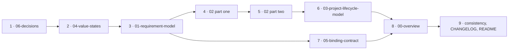

# `spec/` first draft — Implementation Plan

> **For agentic workers:** REQUIRED SUB-SKILL: Use superpowers:subagent-driven-development (recommended) or
> superpowers:executing-plans to implement this plan task-by-task. Steps use checkbox (`- [ ]`) syntax for
> tracking.

**Goal:** Write the seven documents of `spec/`, bringing the ProjectML metamodel to the complete draft that
phase 1 asks for.

**Architecture:** `spec/` carries one document per member of the metamodel collection, plus an overview, a
binding contract and a decision record — K31. The documents are *numbered* in adoption order, so a reader
taking only the core can stop after the first. They are *written* in dependency order, which is different,
and the difference is the main thing this plan encodes.

**Tech Stack:** Markdown, and Mermaid for diagrams. Nothing else. There is no build, no test runner and no
validator, and none may be added — see Global Constraints.

## Progress

**Complete.** All nine tasks are done, each reviewed on both verdicts, followed by a whole-branch review and
its fix pass. `spec/` carries seven documents and about 1,140 lines.

| Task | Document | Commits |
|---|---|---|
| 1 | `spec/06-decisions.md` | `e8954eb`, `dd6e056` |
| 2 | `spec/04-value-states.md` | `c0c2309` |
| 3 | `spec/01-requirement-model.md` | `681e8f4` |
| 4 | `spec/02-requirement-analysis-model.md`, sections 1–4 | `41d2ed4`, `4433147` |
| 5 | `spec/02-requirement-analysis-model.md`, sections 5–9 | `a430079`, `24f2ce2` |
| 6 | `spec/03-project-lifecycle-model.md` | `16e17c5` |
| 7 | `spec/05-binding-contract.md` | `0571950` |
| 8 | `spec/00-overview.md` | `68cf6f3`, `6f57149` |
| 9 | Consistency pass, CHANGELOG, README | `0bd5015` |
| — | Whole-branch review fix pass | `f48378c` |

**Two decisions were taken while writing, both recorded in `spec/06-decisions.md`.**

- **K33** — a requirement in the product model names neither the definition it came from nor its kind. K19's
  independent adoptability forbids it; K13's recoverability condition only permits it, so exclusion wins.
- **K34** — the projection carries every requirement, in force or not. The deciding argument is at the seam:
  a requirement that retired between baselines but vanished at the projection would not change state there,
  it would disappear, leaving the edge pointing at it dangling with nothing recording that a choice was
  made — the failure K5 exists to prevent, reintroduced at the seam.

**Two errors in this plan, found during execution and recorded rather than corrected in place**, because
the tasks had already run against the text as written:

1. Task 3, Step 2 asks for a D48 citation on the edge between requirements. D48 is about the refinement edge
   in the analysis model, not derivation in the product. Task 9 dropped the citation.
2. Task 4, Step 3 says the answers edge is used by section 7 of the analysis model. Findings are section 9.
   The authoritative layout is 5 `RequirementDef`, 6 the two tests, 7 kinds as specialisations, 8 the
   derivation and the projection, 9 `Decision` and findings.

**The whole-branch review found one Critical defect**, fixed in `f48378c`: the link from a requirement to
the `RequirementDef` it was produced under was never defined, though three documents relied on it. K33's
published argument fails without it, and it is the last link in the chain the metamodel exists for.

**Four questions the review raised went to the repository's owner, and all four are now settled.** The most
consequential answer reversed a decision this plan had shipped.

**K34 was wrong, and K35 reverses it** (`1f26488`). The projection carries only the requirements in force;
being no longer in force is a property of the requirement analysis model, not of the product. K34's seam
argument had conflated the live projection with a baseline: K21 binds a design language to a **named
baseline**, and a baseline is frozen, so it stays internally consistent forever and no edge into one ever
dangles. What that argument called *vanishing* is the intended signal — a design rebasing onto a later
baseline finds the requirement absent, and that absence is what says to rework what was built on it.
Traceability holds on two legs the owner named: the analysis model always contains everything, retired
requirements included, and every element the projection carries resolves back to its origin there. That
second leg is now a stated condition on the projection rather than an assumption.

Three consequences worth keeping. **K12 stands exactly as written** — no narrow reading, no status row, and
the fourth question dissolved rather than being answered. **The founding record's section 2 changed sides**:
under K34 it had to be set aside as overridable procedure narrative, and under K35 it simply agrees.
`spec/01-requirement-model.md` also got smaller, which strengthens the independent adoptability the second
question was about.

**K36 settles what the two tests are** (`ff137e1`). They are not a conjunction. The seam test governs
admissibility; the record test measures whether an admitted attribute is load-bearing. The argument is that
a presence rule is always available — *this attribute is present* fails on an absence without reading
content — so the record test read as an admissibility gate is either vacuous or turns on which rules
somebody got round to writing. *When it applies* stays in the core on the seam test alone and does not pass
the record test, because its absence is deliberately a gap rather than a claim. The rules the record test
does back are now stated in `spec/02-requirement-analysis-model.md`, and the 2026-09-02 design record
carries a superseded note where it claimed the two tests agree everywhere (`74ff92a`).

**The value-state model is a prerequisite every member carries**, not a member reached fourth in the
adoption order — which is what K19 already meant by saying it crosscuts (`ff137e1`).

**The seam's under-specification is recorded as OQ12, not fixed** (`ff137e1`), at the owner's direction: the
edge's cardinality, the check over it that the binding contract cites by name, and whether the edge pins a
baseline. It is to be answered by a brainstorm **before** the SysML binding is written rather than during
it, because that binding is the test of K2 and should not be testing K2 and filling holes at once.

## Global Constraints

Every task's requirements implicitly include this section. Values are copied verbatim from `CLAUDE.md` and
from the design record.

- **Nothing executable ships, and no notation ships. Prose and diagrams only.** This includes check
  scripts: the verification commands in this plan are run ad hoc and are never committed.
- **English is the only language in this repository**, in every file and every commit message.
- **The metamodel holds no filled definitions.** It defines the `RequirementDef` type; it declares no
  requirement kinds and no templates.
- **The test, when unsure:** *could this sentence be true of a project modelled in YAML, in SysML v2 textual
  notation, and in a spreadsheet, without change?* If yes, it is metamodel. If it assumes one of them, it is
  implementation and does not belong here.
- **Do not describe the metamodel in terms of files.** Say what an element is in the model, not which file
  or header key carries it.
- **"Attribute", not "field."**
- **Where a diagram and the prose beside it disagree, the prose wins.** Every diagram has prose beside it
  saying the same thing.
- **Adopt, don't invent.** Where a term exists in ISO/IEC/IEEE 29148, ISO/IEC/IEEE 42010, SysML v2 or W3C
  PROV, use that term and record the source on the entry that defines it. Only coin a term when no standard
  has one, and say so where it is coined.
- **An unexercised construct is an unproven one, so it waits.** A construct nothing will ever exercise is
  one to leave out.
- **Commit after every task. Never push.**
- **Decisions are cited, not re-argued.** `K1`–`K18` live in
  [`docs/2026-08-26-kernel-brainstorm.md`](../../2026-08-26-kernel-brainstorm.md); `K19`–`K32` and `OQ9`–`OQ11`
  in [`docs/superpowers/specs/2026-09-02-spec-structure-and-oq2-design.md`](../specs/2026-09-02-spec-structure-and-oq2-design.md);
  `D` numbers resolve through [`docs/eventml-decisions.md`](../../eventml-decisions.md). A `D` number always
  means EventML; a `K` number always means ProjectML.
- **EventML is read-only.** Read it, quote it, cite it — do not edit it, do not commit to it, do not open
  branches in it.

### Why this plan has no tests, and what replaces them

There is no validator and there are no examples, because examples are written in a notation and this
repository has none. Writing a test runner would violate the first global constraint. Three things replace
tests, and every task runs all three:

1. **Mechanical checks.** Grep commands over `spec/`, given verbatim in each task. They catch notation
   leaking in, the forbidden word, non-English text, unbalanced diagram fences and domain vocabulary.
2. **The substitution test.** Every normative sentence is read three times — once imagining the project
   modelled in YAML, once in SysML v2 textual notation, once in a spreadsheet. A sentence that changes
   meaning under any of the three is implementation and is rewritten or removed.
3. **The citation check.** Every claim traceable to a decision cites its `K` or `D` number; every adopted
   term names its standard.

### Writing order

Numbered order is adoption order. Writing order is dependency order, and it is not the same.



`06` is written first because every other document cites `K` numbers and needs somewhere normative to cite.
`04` is next because nothing depends on it and `01` depends on it. `00` is written last, despite its number,
because it is the map and a map is drawn after the ground is surveyed.

### File structure

| File | Responsibility |
|---|---|
| `spec/00-overview.md` | The collection, the three levels, the boundary and its test, the diagram conventions. The entry point, and the document that keeps the repository from drifting into an implementation |
| `spec/01-requirement-model.md` | The product: `Requirement`, the edges between requirements, being no longer in force, the baseline |
| `spec/02-requirement-analysis-model.md` | The working model: `Source`, `Need`, `RequirementDef`, `Decision`, findings, the derivation and the projection |
| `spec/03-project-lifecycle-model.md` | What a rule-set may state |
| `spec/04-value-states.md` | The five states and their reach across the collection |
| `spec/05-binding-contract.md` | The seam and K4's four declarations |
| `spec/06-decisions.md` | The normative decision record, continuing the K series |

---

### Task 1: The decision record

**Files:**
- Create: `spec/06-decisions.md`

**Interfaces:**
- Consumes: `K19`–`K32` and `OQ9`–`OQ11` from the design record; `K1`–`K18` from the founding record.
- Produces: the normative home for every `K` number. Every later task cites this document and appends to it
  in its own commit.

- [ ] **Step 1: Write the file's opening — what it is and how to read it**

Four short paragraphs, in this order:

1. This is the normative decision record. The design records under `docs/superpowers/specs/` carry the
   reasoning; this file carries the decisions in force.
2. The `K` series is continuous. `K1`–`K18` were taken in the founding record and are not restated here;
   this document begins at `K19`. Link both.
3. A `D` number always means EventML and a `K` number always means ProjectML. `D` numbers resolve through
   `docs/eventml-decisions.md`. Link it.
4. **The convention that binds later tasks:** a decision taken while writing a document in `spec/` is added
   to this file in the same commit as that document. This file is never left behind.

- [ ] **Step 2: Write the decisions table, K19–K32**

One row per decision: number, statement, and **one line** of reason — not the full rationale, which stays in
the design record. Take the statements verbatim from
`docs/superpowers/specs/2026-09-02-spec-structure-and-oq2-design.md` sections 1–5.

Group them under four headings, matching the design record's own sections:

- *The collection* — K19, K20, K21, K22, K23
- *Constraints over the model* — K24
- *What a `RequirementDef` is* — K25, K26, K27, K28, K29, K30
- *This repository's own shape* — K31, K32

- [ ] **Step 3: Write the open questions table**

`OQ9`, `OQ10`, `OQ11` with their question and when they are expected to be answerable. Then a short table
giving the status of the founding record's questions after this work: OQ1 not answered but shaped, **OQ2
answered**, OQ3 untouched and next, **OQ4 answered**, OQ5–OQ8 unchanged.

- [ ] **Step 4: Run the standard checks**

```bash
cd "C:/Users/szant/OneDrive/Dokumentumok/GitHub/ProjectML" && echo "-- non-mermaid fenced blocks --" && grep -n '```[a-z]' spec/*.md | grep -v mermaid; echo "-- forbidden word --" && grep -rniE '\bfields?\b' spec/; echo "-- non-English characters --" && grep -rn '[őűŐŰ]' spec/; echo "-- domain vocabulary, review each hit --" && grep -rniE '\b(audio|lighting|rigging|truss|microphone|loudspeaker|rider|performer|dimmer)\b' spec/; echo "-- fence counts, each must be even --" && for f in spec/*.md; do echo "$f $(grep -c '^```' "$f")"; done
```

Expected: the first three sections print nothing. The domain-vocabulary section may print a line only where
the document names a word in order to say it does *not* belong here; any other hit is a leak and is
rewritten. Every fence count is even.

- [ ] **Step 5: Run the substitution test and the citation check**

Read every normative sentence three times — the project modelled in YAML, in SysML v2 textual notation, in a
spreadsheet. Rewrite any sentence whose meaning changes. Then confirm every decision statement carries its
`K` number and every adopted term names its standard.

- [ ] **Step 6: Commit**

```bash
cd "C:/Users/szant/OneDrive/Dokumentumok/GitHub/ProjectML" && git add spec/06-decisions.md && git commit -m "Open spec/ with the normative decision record

Continues the K series from the founding record: K19-K32 in force, OQ9-OQ11
open, and the status of the founding record's own questions after the design
record that produced these. Reasoning stays in the design record; this file
carries the decisions.

Co-Authored-By: Claude Opus 5 <noreply@anthropic.com>"
```

---

### Task 2: Value states

**Files:**
- Create: `spec/04-value-states.md`
- Modify: `spec/06-decisions.md` — append any decision this task takes

**Interfaces:**
- Consumes: nothing. This document depends on no other.
- Produces: the five state names — *stated*, *derived*, *assumed*, *unknown*, *conflicting* — and the term
  **value state**. Tasks 3, 4, 5 and 7 use them.

- [ ] **Step 1: Write section 1 — incompleteness is data**

Two paragraphs. A value records what is known about it, not only what it is. Incompleteness is the normal
condition of the material a project starts from, and it is modelled rather than corrected before modelling
begins. Cite `K1`, which puts the value-state model in the kernel.

- [ ] **Step 2: Write section 2 — the five states**

A table: state, meaning, and what the state requires.

| State | Meaning | Requires |
|---|---|---|
| stated | Somebody said it | The source it came from |
| derived | It follows from a rule or another value | The reasoning |
| assumed | It was supplied to keep moving | The reasoning |
| unknown | Missing, and known to be missing | Nothing |
| conflicting | Two sources disagree | The competing values, each with its source |

Then, separately: a value may be marked as one to ask about, independently of its state. Write this in
prose. **Do not name a key or an attribute spelling** — that is notation.

- [ ] **Step 3: Write section 3 — assumed against derived**

One paragraph, and it is the section that does the most work. An assumption is a choice made in the absence
of information; it may be wrong, and somebody may need to confirm it. A derived value follows necessarily
from something already in the model; confirming it with a stakeholder is pointless, and what would change it
is a change to its input. Conflating the two produces question lists full of things nobody can usefully
answer.

- [ ] **Step 4: Write section 4 — reach**

A value state applies to any value in any member of the collection: a value carried by a need, a parameter
of a requirement, a value in a design language's own elements beyond the seam. It is a property of values,
not of any one member. Cite `D27`, and the founding record's section 5 finding that this is what forces the
collection's two-piece structure behind `OQ1`.

- [ ] **Step 5: Write section 5 — what is deliberately not here**

Two items, each one paragraph.

1. **Progressive wrapping is notation and is not here.** How a notation distinguishes a plain value from one
   carrying a state — whether by a bare scalar against an object, or otherwise — belongs to an
   implementation. Cite `K15` and the founding record's section 7: *the value states are portable where
   progressive wrapping is notation and is not.*
2. **The metamodel enumerates no value domains.** A value has a domain; which domains exist is declared by an
   implementation. Same move as `K30` makes for requirement kinds.

- [ ] **Step 6: Run the standard checks**

```bash
cd "C:/Users/szant/OneDrive/Dokumentumok/GitHub/ProjectML" && echo "-- non-mermaid fenced blocks --" && grep -n '```[a-z]' spec/*.md | grep -v mermaid; echo "-- forbidden word --" && grep -rniE '\bfields?\b' spec/; echo "-- non-English characters --" && grep -rn '[őűŐŰ]' spec/; echo "-- domain vocabulary, review each hit --" && grep -rniE '\b(audio|lighting|rigging|truss|microphone|loudspeaker|rider|performer|dimmer)\b' spec/; echo "-- fence counts, each must be even --" && for f in spec/*.md; do echo "$f $(grep -c '^```' "$f")"; done
```

- [ ] **Step 7: Run the substitution test and the citation check**

The five state names must survive all three substitutions unchanged. If a sentence about a state only makes
sense given a particular way of writing values down, it is notation and is rewritten.

- [ ] **Step 8: Commit**

```bash
cd "C:/Users/szant/OneDrive/Dokumentumok/GitHub/ProjectML" && git add spec/ && git commit -m "State what a value records, and how far that reaches

The five value states, the distinction between assumed and derived that does
most of the work, and the reach that makes this the one member of the
collection which attaches to every value or to none.

Progressive wrapping stays out: it is how a notation writes a state down, and
notation belongs to an implementation. So does the list of value domains.

Co-Authored-By: Claude Opus 5 <noreply@anthropic.com>"
```

---

### Task 3: The requirement model

**Files:**
- Create: `spec/01-requirement-model.md`
- Modify: `spec/06-decisions.md` — append the decision named in Step 3

**Interfaces:**
- Consumes: the five value states from Task 2.
- Produces: `Requirement`, the derivation edge between requirements, the property of being no longer in
  force, and `baseline`. Tasks 5 and 7 use all four.

- [ ] **Step 1: Write section 1 — what this model is**

The product. It is reached by projection from the requirement analysis model, and it is what a design
language binds to. State plainly that it can be adopted on its own: a reader who wants a requirements
register with traceability between requirements, and nothing else, can stop at the end of this document.
Cite `K19`, `K20`.

- [ ] **Step 2: Write section 2 — `Requirement`**

An attribute table: identity, the requirement's text, and the values it carries. Values carry states —
cross-reference `04-value-states.md`. Then the edge between requirements: one requirement may be derived
from another. Cite `K1`, `D48`, `D49`.

Also state the invariant `K9` rests on: every requirement names its origin, and carrying none is an
incomplete record rather than a root. Note that in this model the refinement half of that origin has been
projected away, and say where it lives — `02-requirement-analysis-model.md`.

- [ ] **Step 3: Take one decision, and record it**

**The question:** does a `Requirement` in the product model name the definition it came from, and its kind?

**The criteria, both of which must be satisfied:**
- `K13`'s condition on the projection — everything in force is present, nothing in force was dropped, and
  everything dropped stays in the working model.
- `K19`'s independent adoptability — this document must stand alone, and `RequirementDef` is defined in
  `02`, which a reader adopting only the core has not read.

Take the decision, write it into the document, and append it to `spec/06-decisions.md` as `K33` in this
task's commit.

- [ ] **Step 4: Write section 3 — no longer in force**

A requirement is never deleted; it carries the property of being no longer in force. Give the reason rather
than only the rule: the checks are pairwise, so deleting an element silences exactly the check that fired on
it, and deletion becomes a way to make a report clean with nothing recording that a choice was made. Cite
`K5`.

- [ ] **Step 5: Write section 4 — the baseline**

Four paragraphs.

1. What it is: a named, dated instance of this model. Adopted from ISO/IEC/IEEE 29148 — record the source.
   Cite `K12`.
2. Why it has identity and the projection does not: a design language binds to a baseline, never to the live
   projection, because a recomputed view has no identity across runs and the identifiers a binding depends
   on must be stable. Cite `K21`, and `K10`'s parallel argument.
3. Its condition: losslessness and recoverability. Cite `K13`.
4. What it is not: a model that must pass the analysis model's checks. It has no need layer, so
   need-coverage rules cannot apply to it, and running them on it is a category error. Cite `K13`.

Add the founding record's consequence: a baseline names the implementation package and version it was cut
under, because a check result is only meaningful against the rule-set that produced it.

- [ ] **Step 6: Write section 5 — the syntactic constraints of this model**

Only constraints referring to elements this document defines. Cite `K24` for why they sit here rather than in
a checks document of their own.

- [ ] **Step 7: Run the standard checks**

```bash
cd "C:/Users/szant/OneDrive/Dokumentumok/GitHub/ProjectML" && echo "-- non-mermaid fenced blocks --" && grep -n '```[a-z]' spec/*.md | grep -v mermaid; echo "-- forbidden word --" && grep -rniE '\bfields?\b' spec/; echo "-- non-English characters --" && grep -rn '[őűŐŰ]' spec/; echo "-- domain vocabulary, review each hit --" && grep -rniE '\b(audio|lighting|rigging|truss|microphone|loudspeaker|rider|performer|dimmer)\b' spec/; echo "-- fence counts, each must be even --" && for f in spec/*.md; do echo "$f $(grep -c '^```' "$f")"; done
```

- [ ] **Step 8: Run the substitution test and the citation check**

- [ ] **Step 9: Commit**

```bash
cd "C:/Users/szant/OneDrive/Dokumentumok/GitHub/ProjectML" && git add spec/ && git commit -m "Define the product: the requirement model and its baseline

The member of the collection a design language actually binds to. A requirement,
the derivation edge between requirements, the property of being no longer in
force rather than deleted, and the baseline as a named dated instance with the
identity the live projection does not have.

K33 settles whether a requirement in the product names the definition it came
from, against K13's recoverability condition and K19's adoptability.

Co-Authored-By: Claude Opus 5 <noreply@anthropic.com>"
```

---

### Task 4: The evidence chain

**Files:**
- Create: `spec/02-requirement-analysis-model.md` — sections 1 to 4 only
- Modify: `spec/06-decisions.md` — append any decision this task takes

**Interfaces:**
- Consumes: the value states from Task 2.
- Produces: `Source`, the `answers` edge, `Need`. Task 5 continues this same document and uses all three.

- [ ] **Step 1: Write section 1 — what this model is**

The working model, in which a requirement system is built. Name its members in advance so a reader knows
what is coming: `Source`, `Need`, `RequirementDef`, `Requirement`, `Decision`, and findings. State that it
projects to the requirement model, and that the projection is defined in section 8 of this document. Cite
`K19`, `K20`.

State `K11` here, because it governs everything below it: **the requirement model changes only through
sources.** Every outcome of a review — a meeting, a call, the team's own decision — enters as a source.

- [ ] **Step 2: Write section 2 — `Source`**

An attribute table: identity, the text itself, who it came from, what kind of material it is, and its date.

Then three rules, each with its reason:

1. **A source is material of record.** It is quoted whole and never edited. Cite `D45`.
2. **A source is never decomposed.** Keeping the raw material raw avoids a classification taxonomy over it.
   Cite `D25`.
3. **The kind and origin attributes are open.** The founding record's section 5 records that EventML's
   enumerations carry domain leaks — one kind and two origins are event-specific — so the metamodel names
   the attributes and leaves their vocabularies to an implementation. Same move as `K30`.

- [ ] **Step 3: Write section 3 — the edge between sources**

One edge: a later source answers an earlier one. Four properties, each cited:

- it sits on the later source and names the earlier — `D35`
- it points backward in time — `D38`
- it changes no value; both statements were made, and which prevailed belongs to a decision — `D37`
- one edge relates exactly one source to exactly one source; a source may carry any number — `D29`

Add the founding record's section 5 finding: this edge is the natural closing edge for a review finding,
which makes closure evidence rather than a tick somebody applied. Note that section 7 uses it.

- [ ] **Step 4: Write section 4 — `Need`**

An attribute table: identity, the passage of the source it anchors into, and an optional value.

Three rules:

1. **A need anchors into exactly one passage of exactly one source**, and a need with no anchor fails a
   syntactic check — there is nothing to ask about, and something to fix. Cite `D34`, `D26`.
2. **A need carries no lifecycle state.** It belongs to its source, a source is material of record, and a
   quotation cannot cease to be true. Cite `K6`.
3. **A need's value is optional**, and carries a value state like any other. Cite `D27`.

Record the term's source: *stakeholder need* is ISO/IEC/IEEE 29148's. Cite `D23`.

Passage anchoring adopts the W3C Web Annotation Data Model — cite `D26`, and note why no requirements
standard serves here: this is the stage before the model, which SysML places outside itself.

- [ ] **Step 5: Run the standard checks**

```bash
cd "C:/Users/szant/OneDrive/Dokumentumok/GitHub/ProjectML" && echo "-- non-mermaid fenced blocks --" && grep -n '```[a-z]' spec/*.md | grep -v mermaid; echo "-- forbidden word --" && grep -rniE '\bfields?\b' spec/; echo "-- non-English characters --" && grep -rn '[őűŐŰ]' spec/; echo "-- domain vocabulary, review each hit --" && grep -rniE '\b(audio|lighting|rigging|truss|microphone|loudspeaker|rider|performer|dimmer)\b' spec/; echo "-- fence counts, each must be even --" && for f in spec/*.md; do echo "$f $(grep -c '^```' "$f")"; done
```

The domain-vocabulary check matters most in this task: the source kind and origin attributes are exactly
where EventML's vocabulary leaked, and naming an example kind here would carry the leak across.

- [ ] **Step 6: Run the substitution test and the citation check**

- [ ] **Step 7: Commit**

```bash
cd "C:/Users/szant/OneDrive/Dokumentumok/GitHub/ProjectML" && git add spec/ && git commit -m "Open the analysis model with the evidence chain

Source as material of record, quoted whole and never decomposed; the answers
edge between sources, which is also what closes a finding; and Need as an
anchored passage carrying no lifecycle state of its own.

The kind and origin vocabularies are left to an implementation. That is where
EventML's domain leaked, and the metamodel names the attributes without filling
them.

Co-Authored-By: Claude Opus 5 <noreply@anthropic.com>"
```

---

### Task 5: Definitions, derivation, decisions, findings, projection

**Files:**
- Modify: `spec/02-requirement-analysis-model.md` — add sections 5 to 9
- Modify: `spec/06-decisions.md` — append any decision this task takes

**Interfaces:**
- Consumes: `Source`, `Need` from Task 4; `Requirement`, `baseline` from Task 3; the value states from
  Task 2.
- Produces: `RequirementDef`, `Decision`, the finding, and the projection. Tasks 6 and 7 use them.

- [ ] **Step 1: Write section 5 — `RequirementDef`**

State first that it is **abstract**: a definition exists only as a specialisation. Cite `K30`.

Then the attribute table — the core the metamodel interprets or can fail on:

| Attribute | What it is |
|---|---|
| identity | The definition's identifier |
| name | Human-readable |
| text | The template the requirement's wording is produced from, with places for its parameters |
| when it applies | One sentence stating when this definition comes into play. Prose, not an evaluable expression — cite `D20`. Its absence means applicability has not been written down, which is a gap, not a claim that it applies unconditionally |
| parameters | Each declares a value domain. Which domains exist is an implementation's business — cite `K30`'s parallel and `04-value-states.md` |
| what to ask | For each parameter, how a non-expert is asked for what is missing |
| how it would be verified | The method. Prose |

For the last row, give the reason it sits on the definition rather than on the requirement: the method is
generic to the kind, and the definition-and-usage split puts a generic property on the definition. Note that
ISO/IEC/IEEE 29148 makes verifiability a property of the requirement, and that the two do not conflict — a
requirement inherits its definition's method. Cite `K29`.

- [ ] **Step 2: Write section 6 — what is not on a `RequirementDef`, and the two tests**

State both tests in full, because they are the reusable part:

> **The seam test.** An attribute belongs to the metamodel if the metamodel can interpret it without
> resolving a reference to an element it does not define. Prose that names a design language's things is
> content, and content belongs to an implementation; a typed reference to a design language's element would
> be a second seam.
>
> **The record test.** An attribute belongs to the metamodel if a *stated* metamodel rule can fail on it,
> including on its absence, without reading its content.

Cite `K25`, `K26`. Then apply them to the one attribute that fails: a rule attached to a definition and
naming a design language's element kinds fails both, on the same structural fact. The metamodel therefore
does not name the concept at all; an implementation may introduce one, which `K16` permits. Cite `K28`.

Record the finding that belongs to phase 2: SysML makes a requirement a specialised constraint whose formal
statement is evaluated over its own subject, and the subject is bound through the satisfy edge — which
routes a constraint through the one seam rather than opening a second. That is what the seam test predicts a
design language must do.

- [ ] **Step 3: Write section 7 — kinds are specialisations**

A requirement kind is a specialisation of `RequirementDef`, not an attribute on it. Give the three reasons:
it matches SysML v2's own recommended mechanism for requirement hierarchies; it does not fix the number of
classification axes, which a single attribute would; and it is the same relation `K16` already describes one
level up. Cite `K30`, and `D51`–`D55` through `docs/eventml-decisions.md` as the prior art it revises.

State what an implementation must do: declare its kinds. State what the metamodel does not do: name any.

Note `OQ9` as open — what a subtype may add, narrow or override is not defined, and waits for something to
exercise it.

Include one Mermaid class diagram showing `RequirementDef` as abstract with two unnamed specialisations, and
prose beside it saying the same thing. Use the diagram language's own abstraction and generalisation
conventions; coin nothing. Cite `K32`.

- [ ] **Step 4: Write section 8 — the derivation, and the projection**

**The derivation**, as the founding record's procedure states it: a need's subject selects the definition,
and the definition's rules turn the stater's free words into the requirement's bound professional wording.
The kind rides along with the definition; needs are not classified. Cite `K8`.

State that the relation between a need's words and a requirement's wording is a **semantic constraint**: the
metamodel defines what the relation is and what a reviewer must cite, and does not decide it. Cite `K24`,
`K7`.

**The projection** to the requirement model: what it drops — the need layer, the findings, the requirements
no longer in force — and its condition, that everything dropped stays here. Cite `K13`, `K20`, `K21`.

- [ ] **Step 5: Write section 9 — `Decision` and findings**

`Decision` first: an act, taken by a named party on a named date, resolving a choice among genuine
alternatives, with the reasoning that justifies it. Adopted from ISO/IEC/IEEE 42010's Architecture Decision
and Architecture Rationale — record the source. Distinguish it from an assumed value: an assumption is
resolved by learning, a decision by deciding again.

Then findings. State `K10`: the model above the requirement model is a model, not a derived view, because a
finding must keep its identity between reviews. Then the three kinds, and why only one of them can carry a
state:

| Kind | Produced by | Stored? |
|---|---|---|
| A failed check | A script | No — recomputed every run |
| A question | A script | No — recomputed every run |
| A review finding | Judgement | Yes, and it alone can carry a state |

Cite `D50` for the two-column organisation this follows.

Give the two rules that already exist over needs and requirements: a need that no requirement refines is
reported, and a requirement carrying no origin edge at all is a **failed check, not a question**. Cite
`D31`, `K9`, and note through `docs/eventml-decisions.md` that `K9` overturns `D46`.

**Do not invent a disposition for the orphan need.** `OQ3` is open, and it is the next task after this plan.
State the rule and state that what to record when the reading is settled is not yet decided.

- [ ] **Step 6: Run the standard checks**

```bash
cd "C:/Users/szant/OneDrive/Dokumentumok/GitHub/ProjectML" && echo "-- non-mermaid fenced blocks --" && grep -n '```[a-z]' spec/*.md | grep -v mermaid; echo "-- forbidden word --" && grep -rniE '\bfields?\b' spec/; echo "-- non-English characters --" && grep -rn '[őűŐŰ]' spec/; echo "-- domain vocabulary, review each hit --" && grep -rniE '\b(audio|lighting|rigging|truss|microphone|loudspeaker|rider|performer|dimmer)\b' spec/; echo "-- fence counts, each must be even --" && for f in spec/*.md; do echo "$f $(grep -c '^```' "$f")"; done
```

- [ ] **Step 7: Run the substitution test and the citation check**

This is the task where the substitution test earns its place. The definition's attribute table is the exact
material `OQ2` was about, and a sentence that assumes a template is written in one particular way is the
failure mode.

- [ ] **Step 8: Commit**

```bash
cd "C:/Users/szant/OneDrive/Dokumentumok/GitHub/ProjectML" && git add spec/ && git commit -m "Answer OQ2 in the specification, and close the analysis model

RequirementDef as an abstract type whose kinds are specialisations, carrying the
core the metamodel interprets or can fail on. The two tests that decide what
belongs are stated in full, because they are the reusable part; the one
attribute that fails both leaves entirely, and an implementation may introduce
its own.

With it: the derivation from a need's words to a requirement's wording as a
semantic constraint, Decision from ISO 42010, findings as a model rather than a
recomputed view, and the projection to the requirement model.

The orphan need is reported and given no disposition. OQ3 is open and is next.

Co-Authored-By: Claude Opus 5 <noreply@anthropic.com>"
```

---

### Task 6: The Project Lifecycle Model

**Files:**
- Create: `spec/03-project-lifecycle-model.md`
- Modify: `spec/06-decisions.md` — append any decision this task takes

**Interfaces:**
- Consumes: the analysis model from Tasks 4 and 5 — this is what a rule-set governs.
- Produces: the term **rule-set**, and the three kinds of statement one may make. Task 8 refers to both.

- [ ] **Step 1: Write section 1 — what this is, and what it is not**

This is a metamodel for a rule-set. A rule-set is **a model, not a layer**: different teams working in the
same domain load different rule-sets, and they do not thereby stand at different levels. The three levels of
`K16` are untouched. Cite `K22`.

Say plainly why the distinction was hard to see, because a reader will hit the same wall: a rule-set governs
the analysis model's own elements rather than adding to a domain implementation's, so it sits beside a
domain package rather than beneath it.

- [ ] **Step 2: Write section 2 — what a rule-set may state**

Three kinds of statement, and this is the document's substance:

| A rule-set states | The gap it fills |
|---|---|
| Whether an applied default may be silent, or must be owned by somebody | Nothing today says which defaults are a choice somebody must answer for |
| When a gap stops being waited on and becomes a decision | Nothing today says at what point waiting ends |
| How a conflict of a given kind is resolved | Nothing today says who resolves what, or how |

Attribute each to the source it came from: these are the three missing pieces named in EventML's v0.5
record, and the founding record's `OQ6` establishes that all of them are kernel material rather than
AV-specific.

State that they are written per kind rather than per definition, which is why `K30`'s kinds have to exist
before this model is useful.

- [ ] **Step 3: Write section 3 — what the metamodel does not do**

**It states no rules.** It names this model and says what a rule-set may state; the rules themselves belong
to an implementation. The same move `K15` makes for requirement kinds and `K23` makes here.

State what stays out and why: the classification by origin that motivated this model in EventML — who could
answer a missing piece of information — is a finding about one domain, not a metamodel construct. Cite
`K23`, and `D54` through `docs/eventml-decisions.md`.

- [ ] **Step 4: Write section 4 — how this answers OQ4**

Short, and worth stating explicitly because it closes a founding-record question. `OQ4` asked whether the
metamodel names the loop's steps normatively, and offered three options. This is a fourth: the metamodel
neither prescribes the process nor omits it, but provides the means to model one. The concern that made the
third option attractive — that a process is the least portable thing a metamodel could fix — is what makes
this work, because a rule-set differs per organisation by design. Cite `K22`, `K23`.

- [ ] **Step 5: Run the standard checks**

```bash
cd "C:/Users/szant/OneDrive/Dokumentumok/GitHub/ProjectML" && echo "-- non-mermaid fenced blocks --" && grep -n '```[a-z]' spec/*.md | grep -v mermaid; echo "-- forbidden word --" && grep -rniE '\bfields?\b' spec/; echo "-- non-English characters --" && grep -rn '[őűŐŰ]' spec/; echo "-- domain vocabulary, review each hit --" && grep -rniE '\b(audio|lighting|rigging|truss|microphone|loudspeaker|rider|performer|dimmer)\b' spec/; echo "-- fence counts, each must be even --" && for f in spec/*.md; do echo "$f $(grep -c '^```' "$f")"; done
```

- [ ] **Step 6: Run the substitution test and the citation check**

- [ ] **Step 7: Commit**

```bash
cd "C:/Users/szant/OneDrive/Dokumentumok/GitHub/ProjectML" && git add spec/ && git commit -m "Name the Project Lifecycle Model, and answer OQ4 with it

A rule-set is a model built with its own metamodel, not a fourth level: teams in
one domain load different rule-sets without standing at different levels, and
K16's three levels survive intact.

The metamodel says what a rule-set may state - whether a default is silent or
owned, when waiting ends, how a conflict of a kind resolves - and states no
rules itself. That is a fourth option OQ4 did not have, and it neither
prescribes a process nor leaves one out.

Co-Authored-By: Claude Opus 5 <noreply@anthropic.com>"
```

---

### Task 7: The binding contract

**Files:**
- Create: `spec/05-binding-contract.md`
- Modify: `spec/06-decisions.md` — append any decision this task takes

**Interfaces:**
- Consumes: `Requirement` and `baseline` from Task 3; the value states from Task 2.
- Produces: the seam and the four declarations. Task 8 refers to both, and phase 2's SysML binding is
  written against this document alone.

- [ ] **Step 1: Write section 1 — who this document is for**

One paragraph. This is what the owner of a design language reads, and they should need nothing else. Say so,
and say what a binding is not: not an implementation. An implementation carries a notation, a filled set of
definitions and a rule-set; a binding carries the four declarations and none of the three. Cite `K18`.

- [ ] **Step 2: Write section 2 — the seam**

**One seam, one edge.** An element outside the metamodel carries the edge and names a requirement. The edge
is carried by the satisfying element and points upward, not the other way round — record that SysML v2 fixes
the same direction, and that this is the reason the direction is not arbitrary. Cite `K3`.

State where it lands: on a requirement in a **baseline**, not in the live projection, because a binding
depends on stable identifiers and only a baseline has them. Cite `K21`, `K12`.

State the consequence for traceability: from a requirement in a baseline back to the need it refines, the
path runs through the analysis model, which `K13`'s recoverability condition keeps available.

- [ ] **Step 3: Write section 3 — symmetry**

Attachment is symmetric. SysML v2, UML, EventML and a design language not yet written attach on the same
terms, and no design language gets a privileged path. Cite `K2`. State that this is the claim the whole
metamodel exists to make good on, and that phase 2 is where it is tested.

- [ ] **Step 4: Write section 4 — the four declarations**

One subsection each, and each says what the declaration is for, not merely what it is.

1. **Which of its elements may carry the seam edge.** Without it, no check over the seam is computable.
2. **Its own internal refinement chain.** The metamodel does not see below the seam and needs the design
   language to say how its own elements relate.
3. **Its identifier space.** Give the reason from the founding record: two identifier spaces without a map
   lose the stable identifiers everything depends on in a round trip.
4. **How far it takes the value model.** This is the declaration `OQ1` will grow from: a value model
   attaches to every value or to none, so a binding that cannot carry states must say so. Cite `K4`,
   and `04-value-states.md`.

- [ ] **Step 5: Write section 5 — what is open**

Two entries, stated as open rather than answered:

- `OQ10` — whether a second edge kind for verification joins the seam. SysML puts verification as an edge
  from a verification element to a requirement, in the same direction and shape. The first declaration would
  widen by one word to carry it. Nothing exercises it today.
- `OQ11` — whether the metamodel needs a subject. SysML requires every requirement to have one; here the
  seam edge appears to determine it, since SysML's own satisfy binds the subject to the enclosing element.
  If that is not enough, a binding must synthesise one, and that is the shape a false `K2` would take.

Say plainly that both are phase 2's to settle, and that this is why phase 2 is early.

- [ ] **Step 6: Run the standard checks**

```bash
cd "C:/Users/szant/OneDrive/Dokumentumok/GitHub/ProjectML" && echo "-- non-mermaid fenced blocks --" && grep -n '```[a-z]' spec/*.md | grep -v mermaid; echo "-- forbidden word --" && grep -rniE '\bfields?\b' spec/; echo "-- non-English characters --" && grep -rn '[őűŐŰ]' spec/; echo "-- domain vocabulary, review each hit --" && grep -rniE '\b(audio|lighting|rigging|truss|microphone|loudspeaker|rider|performer|dimmer)\b' spec/; echo "-- fence counts, each must be even --" && for f in spec/*.md; do echo "$f $(grep -c '^```' "$f")"; done
```

- [ ] **Step 7: Run the substitution test and the citation check**

Read this document once more as though you owned UML and had never seen EventML. Anything that only makes
sense to somebody who has is a failure of `K2`, in the one document where that failure matters most.

- [ ] **Step 8: Commit**

```bash
cd "C:/Users/szant/OneDrive/Dokumentumok/GitHub/ProjectML" && git add spec/ && git commit -m "State the contract a design language attaches through

One seam, one edge, carried by the satisfying element and landing on a
requirement in a baseline rather than in the live projection, because only a
baseline has the stable identifiers a binding depends on.

The four declarations, each with the reason it exists rather than only its
name. OQ10 and OQ11 are recorded as open and left to phase 2, which is where a
false K2 would first show.

Co-Authored-By: Claude Opus 5 <noreply@anthropic.com>"
```

---

### Task 8: The overview

**Files:**
- Create: `spec/00-overview.md`
- Modify: `spec/06-decisions.md` — append any decision this task takes

**Interfaces:**
- Consumes: every document written in Tasks 1 to 7.
- Produces: the entry point. Nothing consumes it.

- [ ] **Step 1: Write section 1 — what ProjectML is, and what it is not**

Two short sections. What it is: a metamodel for the chain from what somebody said to the requirements it
obliges, the decisions taken along the way, and what is still open.

What it is not, and be precise, because the founding record warns that the obvious phrase overclaims: it
does not do schedule, tasks, dependencies, resources, budget or milestones. It covers the
**evidence-and-decision half** — a decision log, an issue log and a requirements register, with traceability
holding them together. And it does not describe designs; what satisfies a requirement is a design language's
business.

- [ ] **Step 2: Write section 2 — the collection**

State `K19`: this is a collection of connected models, not one model. Give the members, what each is for,
and whether it can be adopted alone.

Include the Mermaid diagram of the collection, with prose beside it saying the same thing. Show the four
members, the projection from the analysis model to the requirement model, the seam arriving from a design
language, and the value states crosscutting.

State the ordering rule: **the numbered order is adoption order.** A reader who wants only the core stops
after `01`. Say that this ordering is what will give `OQ1`'s conformance levels their shape when phase 2
reaches them.

- [ ] **Step 3: Write section 3 — the three levels**

`K16`: metamodel, implementation, project model — and an implementation is itself a metamodel for the
project models built with it. State what an implementation carries: a notation, a filled set of definitions,
and a rule-set. State that a rule-set is a model rather than a fourth level, and point at
`03-project-lifecycle-model.md`. Cite `K22`.

- [ ] **Step 4: Write section 4 — the boundary, and its test**

This is the section the document exists for. State the boundary between metamodel and implementation from
both sides, then give the test verbatim:

> Could this sentence be true of a project modelled in YAML, in SysML v2 textual notation, and in a
> spreadsheet, without change? If yes, it is metamodel. If it assumes one of them, it is implementation.

List what therefore never appears here: a notation, a schema or grammar, a filled definition, a worked
example, anything executable, a domain vocabulary. Cite `K15`.

- [ ] **Step 5: Write section 5 — the diagram conventions**

`K32`. Three claims:

1. A diagram here is a **metalanguage**, and drawing a metamodel is not giving it a notation. Quote
   `CLAUDE.md`: *an abstract-syntax diagram is not notation; it is how a metamodel is drawn.*
2. It is **descriptive only**. Nothing in a diagram is a recommended spelling for an implementation.
3. It **adopts** the abstraction and generalisation conventions the diagram language already carries, and
   coins none. House rule 10 applies to the metalanguage as well.

Add the tie-breaker: where a diagram and the prose beside it disagree, the prose wins.

- [ ] **Step 6: Write section 6 — status**

The metamodel is a **complete draft, not a release.** It is not finished until an implementation has been
built on it and has carried a project end to end, and until the SysML v2 binding exists. Cite `OQ7`, and
name the four phases so a reader knows where they are standing.

- [ ] **Step 7: Run the standard checks**

```bash
cd "C:/Users/szant/OneDrive/Dokumentumok/GitHub/ProjectML" && echo "-- non-mermaid fenced blocks --" && grep -n '```[a-z]' spec/*.md | grep -v mermaid; echo "-- forbidden word --" && grep -rniE '\bfields?\b' spec/; echo "-- non-English characters --" && grep -rn '[őűŐŰ]' spec/; echo "-- domain vocabulary, review each hit --" && grep -rniE '\b(audio|lighting|rigging|truss|microphone|loudspeaker|rider|performer|dimmer)\b' spec/; echo "-- fence counts, each must be even --" && for f in spec/*.md; do echo "$f $(grep -c '^```' "$f")"; done
```

- [ ] **Step 8: Run the substitution test and the citation check**

- [ ] **Step 9: Commit**

```bash
cd "C:/Users/szant/OneDrive/Dokumentumok/GitHub/ProjectML" && git add spec/ && git commit -m "Draw the map: the collection, the levels, and the boundary

Written last because a map is drawn after the ground is surveyed. It carries
the collection and its adoption order, K16's three levels with a rule-set as a
model rather than a fourth, the metamodel/implementation boundary with the test
that decides which side a sentence is on, and the rule that a diagram here is a
metalanguage that adopts its conventions and coins none.

Status is stated where a reader meets it first: a complete draft, not a release,
and not finished until something has been built on it.

Co-Authored-By: Claude Opus 5 <noreply@anthropic.com>"
```

---

### Task 9: Consistency pass, and the repository's own paperwork

**Files:**
- Modify: `spec/*.md` — corrections found by the pass
- Modify: `CHANGELOG.md`
- Modify: `README.md:6-9` — the status block

**Interfaces:**
- Consumes: all seven documents.
- Produces: nothing. This is the closing task.

- [ ] **Step 1: Check that every cited decision exists**

```bash
cd "C:/Users/szant/OneDrive/Dokumentumok/GitHub/ProjectML" && echo "-- K numbers cited in spec/ --" && grep -rhoE '\bK[0-9]+\b' spec/ | sort -u -V && echo "-- K numbers defined in 06-decisions --" && grep -oE '^\| K[0-9]+' spec/06-decisions.md | grep -oE 'K[0-9]+' | sort -u -V
```

Every `K` in the first list is either in the second list or is `K1`–`K18`, which live in the founding
record. Anything else is a citation to a decision that does not exist — fix it.

- [ ] **Step 2: Check that every cited EventML decision is indexed**

```bash
cd "C:/Users/szant/OneDrive/Dokumentumok/GitHub/ProjectML" && echo "-- D numbers cited in spec/ --" && grep -rhoE '\bD[0-9]+\b' spec/ | sort -u -V && echo "-- D numbers in the index --" && grep -oE '^\| D[0-9]+' docs/eventml-decisions.md | grep -oE 'D[0-9]+' | sort -u -V
```

Every `D` cited in `spec/` must appear in the index. If one does not, add it to
`docs/eventml-decisions.md` with its statement and what depends on it — the index's own closing line
provides for exactly this.

- [ ] **Step 3: Check adopted terms name their sources**

```bash
cd "C:/Users/szant/OneDrive/Dokumentumok/GitHub/ProjectML" && grep -rniE '29148|42010|SysML|W3C|PROV' spec/ | cut -c1-150
```

Read the hits. Every term taken from a standard names the standard where the term is defined, not only where
it is used again later.

- [ ] **Step 4: Run the standard checks across the whole of `spec/`**

```bash
cd "C:/Users/szant/OneDrive/Dokumentumok/GitHub/ProjectML" && echo "-- non-mermaid fenced blocks --" && grep -n '```[a-z]' spec/*.md | grep -v mermaid; echo "-- forbidden word --" && grep -rniE '\bfields?\b' spec/; echo "-- non-English characters --" && grep -rn '[őűŐŰ]' spec/; echo "-- domain vocabulary, review each hit --" && grep -rniE '\b(audio|lighting|rigging|truss|microphone|loudspeaker|rider|performer|dimmer)\b' spec/; echo "-- fence counts, each must be even --" && for f in spec/*.md; do echo "$f $(grep -c '^```' "$f")"; done
```

- [ ] **Step 5: Read the seven documents end to end, in numbered order**

Reading in numbered order rather than writing order is the point: it is how a reader will meet them, and it
is the only way to catch a forward reference that a writer in dependency order would not notice. Fix what
you find.

- [ ] **Step 6: Update `CHANGELOG.md`**

Add to the existing `## [Unreleased]` / `### Added` list, keeping the file's stated convention that it
records work rather than releases:

```markdown
- `spec/`, the metamodel's first complete draft: an overview, one document per member of the collection —
  the requirement model, the requirement analysis model, the Project Lifecycle Model and the value states —
  a binding contract, and a decision record continuing the K series. Prose and diagrams; no notation and no
  filled definitions. OQ2 and OQ4 are answered; OQ9, OQ10 and OQ11 are opened.
```

- [ ] **Step 7: Update the status block in `README.md`**

The current block says `spec/` does not exist, which is no longer true. Replace it with a block saying the
metamodel is a complete draft rather than a release, that `spec/` now carries it, and that under
`CLAUDE.md` §6 it cannot reach 1.0 until an implementation has been built on it and the SysML v2 binding
exists. Keep the link to the founding record and add one to `spec/00-overview.md`.

- [ ] **Step 8: Commit**

```bash
cd "C:/Users/szant/OneDrive/Dokumentumok/GitHub/ProjectML" && git add -A && git commit -m "Close the first draft of spec/ and say so in the paperwork

A consistency pass over the seven documents, read in numbered order rather than
the order they were written, because that is how a reader meets them and it is
what catches a forward reference the writer would not see.

Every K cited resolves, every D cited is in the index, and every term taken from
a standard names it where it is defined. CHANGELOG and the README status block
now say what is true: the metamodel is a complete draft, not a release.

Co-Authored-By: Claude Opus 5 <noreply@anthropic.com>"
```

---

## What this plan deliberately leaves out

- **OQ3, the orphan need.** Phase 1 work, and the next task after this plan. Task 5 states the rule that
  reports it and takes care not to invent a disposition, because the founding record's hazard is that a
  disposition costing nothing to write becomes a way to silence the rule.
- **OQ9, OQ10, OQ11.** Opened by the design record and recorded in `spec/06-decisions.md` by Task 1. None is
  exercised by anything today, and the house rule is that an unexercised construct waits.
- **`bindings/`.** Phase 2. The SysML v2 binding is written against `spec/05-binding-contract.md` and is the
  earliest point at which a false `K2` becomes visible.
- **Anything in EventML.** Phases 3 and 4, and EventML is frozen until then.

## Plan self-review

Run before starting Task 1, and again if the design record changes.

1. **Spec coverage.** Every row of `K31`'s document table has a task: `00` → Task 8, `01` → Task 3,
   `02` → Tasks 4 and 5, `03` → Task 6, `04` → Task 2, `05` → Task 7, `06` → Task 1. Every decision
   `K19`–`K32` is written into a document by some task, and `K24`'s syntactic/semantic split is realised by
   the rule in Tasks 3 and 5 that a constraint travels with the model it constrains.
2. **Placeholders.** No task says "add appropriate detail" or defers content to the writer's judgement
   without giving the criteria. The one genuine open decision — Task 3, Step 3 — names the question, both
   criteria that settle it, and where the answer is recorded.
3. **Term consistency.** The names used across tasks are fixed by the design record and must not drift:
   `requirement model`, `requirement analysis model`, `Project Lifecycle Model`, `baseline`, `Source`,
   `Need`, `Requirement`, `RequirementDef`, `Decision`, **value state**, **rule-set**, **the seam**.
