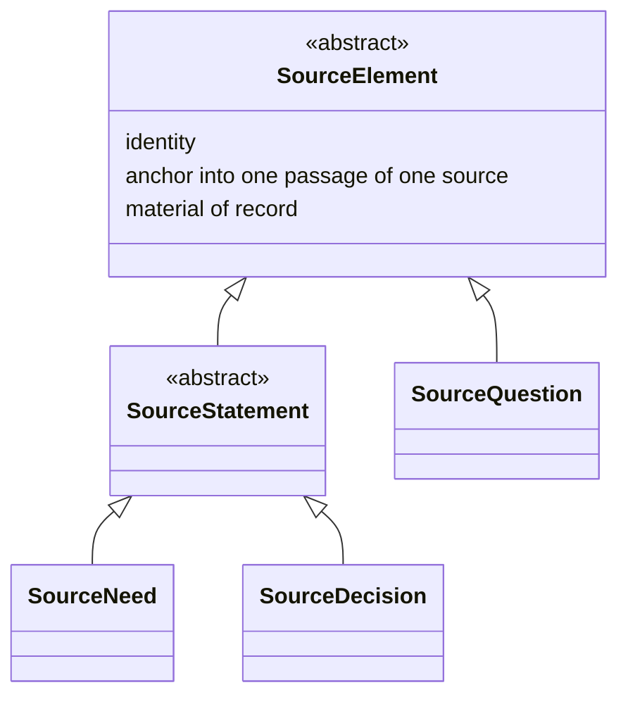

# Integrate the `SourceElement` hierarchy (K43–K65) into `spec/` — Implementation Plan

> **For agentic workers:** REQUIRED SUB-SKILL: Use superpowers:subagent-driven-development (recommended) or
> superpowers:executing-plans to implement this plan task-by-task. Steps use checkbox (`- [ ]`) syntax for
> tracking.

**Goal:** Write K43–K65 — the `SourceElement`/`SourceQuestion`/`SourceStatement`/`SourceNeed`/`SourceDecision`
hierarchy on the source side, and `RequirementDecision`/`RequirementQuestion` on the model side — into `spec/`,
replacing `Need` and `Decision` where they stand today. This is prose and diagrams, not code: a "test" for
each task is a careful re-read for internal consistency, cross-reference correctness, and conformance to this
repository's own house rules (CLAUDE.md), not a runnable suite.

**Architecture:** `spec/02-requirement-analysis-model.md` carries almost all of the change, gaining two new
sections (`SourceElement`/`SourceQuestion`/`SourceStatement`, and `SourceDecision`) and having three existing
ones rewritten (`Need` → `SourceNeed`; the derivation/retirement section; `Decision and findings` →
`RequirementDecision`, `RequirementQuestion`, and findings) and one updated (the syntactic constraints).
`spec/01-requirement-model.md` and `spec/00-overview.md` each need two or three sentences updated to the new
names. `spec/06-decisions.md` gains K57–K65 as normative decisions, closes OQ15, and opens OQ17.

**Tech Stack:** Markdown, Mermaid diagrams (GitHub-rendered), git.

## Global Constraints

- **English only, no exception** (CLAUDE.md §5). Every sentence written in this plan and by it is English.
- **No notation, no filled `RequirementDef`, nothing executable** (CLAUDE.md §1). This plan writes prose and
  one Mermaid diagram; nothing it produces is a schema, a script, or a worked example in a notation.
- **Every decision taken while writing a `spec/` document is added to `spec/06-decisions.md` in the same
  commit as that document** (`spec/06-decisions.md`'s own stated convention). K57–K65 are added to
  `06-decisions.md` in the same task, and same commit, as the `spec/02` sections that carry them.
- **Commit after every task. Never push** (CLAUDE.md §3, house rule 11).
- **Where a diagram and the prose beside it disagree, the prose wins** (CLAUDE.md §5, `00-overview.md` §6).
- **This is not a spec covering an open decision.** Everything this plan writes is already decided, in
  [`docs/superpowers/specs/2026-09-03-source-element-hierarchy-design.md`](../specs/2026-09-03-source-element-hierarchy-design.md)
  (K43–K65, closing OQ15). This plan cites that record's decisions by number rather than re-arguing them;
  where a step needs the reasoning behind a decision, it quotes the design record rather than restating it.
- **What this plan does not do.** OQ17 — the Project Lifecycle Model's fourth rule-set item, `supersedes`,
  and what closes a `RequirementDecision` — is explicitly out of scope. Every place this plan's own new text
  touches that boundary, it says so as an open question, on the same terms `RequirementDef`'s *"when it
  applies"* is already an admitted gap rather than a claim.

---

### Task 1: `spec/02` — rewrite the intro (§1) to name the new elements

**Files:**
- Modify: `spec/02-requirement-analysis-model.md:1-19` (current §1, "What this model is")

**Interfaces:**
- Consumes: nothing from an earlier task.
- Produces: the element list every later task's section headers must match exactly — `Source`,
  `SourceElement`, `SourceQuestion`, `SourceStatement`, `SourceNeed`, `SourceDecision`, `RequirementDef`,
  `Requirement`, `RequirementDecision`, `RequirementQuestion`, findings.

- [ ] **Step 1: Replace the second paragraph of §1**

Replace this text:

```
This is the requirement analysis model, one member of the collection ProjectML metamodels (K19). It is the
**working model**: the model in which a requirement system is actually built, rather than the model handed
to somebody who was not in the room while it was assembled. Six things make it up, and naming all six here
lets a reader see the shape before meeting the parts: `Source`, the material a project starts from; `Need`,
a passage of a source that obliges something, anchored so it can be worked with; `RequirementDef`, the
definition a requirement is produced under; `Requirement`, the bound statement that definition yields;
`Decision`, the record of why one outcome was chosen over another; and the findings a review produces over
all of it. This document defines the first three — `Source`, the edge between sources, and `Need` — in the
sections that follow.
`RequirementDef`, the derivation it governs, `Decision` and the findings follow after.
```

with:

```
This is the requirement analysis model, one member of the collection ProjectML metamodels (K19). It is the
**working model**: the model in which a requirement system is actually built, rather than the model handed
to somebody who was not in the room while it was assembled.

Its elements divide by which language they are in (K43): one side is somebody's words, anchored in a passage
of a source; the other is the model's own bound terms. A `Source` yields `SourceElement`s — `SourceQuestion`,
and `SourceStatement`, itself specialised into `SourceNeed` and `SourceDecision` (K44, K45) — and each has a
counterpart on the model's own side. `SourceNeed` and `SourceDecision` cross inward, by `refine`, into
`Requirement` and `RequirementDecision`; `RequirementQuestion` crosses outward, by `poses`, into
`SourceQuestion` (K47, K48, K58, K59). `RequirementDef` is the definition a `Requirement` is produced under,
and findings are what a review produces over all of it.

This document defines the source side first — `Source`, the edge between sources, and the `SourceElement`
family — then the model side: `RequirementDef`, the derivation it governs, `RequirementDecision`,
`RequirementQuestion`, and findings.
```

- [ ] **Step 2: Re-read the paragraph against the document that follows it**

Confirm every element named in the new paragraph gets a section later in this document (Task 2 through
Task 6 supply them), and that no element this document defines is left unnamed here. There should be
exactly ten named: `Source`, `SourceElement`, `SourceQuestion`, `SourceStatement`, `SourceNeed`,
`SourceDecision`, `RequirementDef`, `Requirement`, `RequirementDecision`, `RequirementQuestion` — plus
findings, which is a category rather than a single type.

- [ ] **Step 3: Commit**

```bash
git add spec/02-requirement-analysis-model.md
git commit -m "Rewrite spec/02 §1 to name the SourceElement family and RequirementDecision/RequirementQuestion

Co-Authored-By: Claude Sonnet 5 <noreply@anthropic.com>"
```

---

### Task 2: `spec/02` — insert `SourceElement`, `SourceQuestion`, and `SourceStatement` as the new §4

**Files:**
- Modify: `spec/02-requirement-analysis-model.md` — insert a new section immediately before the current §4
  (`## 4. \`Need\``), which Task 3 will renumber to §5.

**Interfaces:**
- Consumes: K44, K45, K46 from the design record (identity, anchor, material-of-record on `SourceElement`;
  the `SourceQuestion`/`SourceStatement` split; provenance stopping at the source).
- Produces: `SourceElement`'s three shared attributes, which Task 3 and Task 4 both build on without
  restating; the `SourceQuestion` type, complete (it has no further section of its own — this is all of it).

- [ ] **Step 1: Insert the new §4, before the current `## 4. \`Need\``**

```markdown
## 4. `SourceElement`, `SourceQuestion`, and `SourceStatement`

A source is never read directly by the rest of this model. What a source yields — what a `Source`'s text is
segmented into, one unit at a time — is a `SourceElement`.



The diagram draws what this section and the next state; where the two disagree, the prose wins. The
abstraction and generalisation conventions are the diagram language's own, adopted rather than coined (K32).

### `SourceElement`

`SourceElement` is **abstract**. Every element a source yields is some specialisation of it, and it carries
three things, shared by every specialisation and nothing beyond them.

| Attribute | Carries |
|---|---|
| identity | A stable identifier, distinct from every other `SourceElement`'s |
| anchor | A passage of exactly one source, on the same terms `01-requirement-model.md`'s predecessor
  attribute did — adopting the W3C Web Annotation Data Model |
| material of record | Never edited, and carrying no lifecycle state. Inherited from the source it anchors
  into: a source is quoted whole and never decomposed (§2), so nothing anchored into one can cease to be
  true while the source behind it stays what it was |

**A `SourceElement` segments; it does not interpret.** Nothing a `SourceElement` carries is a reading of
what its passage says — no extracted value, no restated content, nothing beyond the fact that this passage
exists and is anchored. Interpretation happens only on the crossing to the model's own side, governed by
whatever definition's rules apply there (K43, K57). This is a syntactic constraint over every
`SourceElement`: none of them carries an attribute beyond the three above, and a candidate attribute naming a
reading of the passage's content does not belong here, on K43's own axis — it would let something already
interpreted sit on the side of the model that K43 keeps to segmentation alone.

**Provenance stops at the source.** This model does not say what produced a stakeholder's own words, because
it cannot see the procedures behind them. `Source` is the root of this model's traceability not because
nothing precedes it, but because nothing before it is visible to a model built from what a project was told.

**The list of specialisations is not closed.** Two exist today, on the terms the next two subsections state:
`SourceQuestion`, and `SourceStatement`. K42's reasoning, stated for the Project Lifecycle Model, applies
here without change: a closed list would fix one way of reading a source into this model, and a fifth kind
arriving is evidence to account for, not a violation of what stands today.

### `SourceQuestion`

A `SourceQuestion` is a `SourceElement` — nothing more. It carries the three shared attributes and no
others: an unanswered `SourceQuestion` names no state of its own beyond what `SourceElement` already gives
it.

**An unanswered `SourceQuestion` is normal.** It is the ordinary condition of a project with something
outstanding, not a defect. This is the reason `SourceQuestion` sits beside `SourceStatement` rather than
beneath it: were it a `SourceStatement`, every unanswered question would report as a failed check under the
rule the next section states, which would be wrong — a question asserts nothing, so nothing about it can go
unfulfilled the way an unrefined statement can. It opens something instead, and what closes it is the
`answers` edge (§3): a later source `answers` the source the question's passage sits in.

**How `SourceQuestion` subdivides, and whether it names the party expected to answer it, is not settled
here.** Nothing today reads such a subdivision. This is recorded as an open question at the end of this
document.

### `SourceStatement`

`SourceStatement` is **abstract**, a specialisation of `SourceElement` carrying nothing beyond what
`SourceElement` already gives it. It has two specialisations of its own, `SourceNeed` (§5) and
`SourceDecision` (§6).

**A `SourceStatement` that produces nothing is a failed check, not a question.** Unlike `SourceQuestion`'s
silence, a `SourceStatement` asserts something — it is the source-side counterpart of a passage that
obliges an outcome on the model's own side — so one that never crosses over is a record in which something
asserted went unaccounted for. §11 states this rule for `SourceNeed` in full, on terms `SourceDecision`
inherits without needing its own restatement of the same rule, because both are `SourceStatement`s.
```

- [ ] **Step 2: Verify the diagram matches the prose**

Read the Mermaid block back against the prose above and below it: `SourceElement` abstract, three shared
attributes; `SourceQuestion` and `SourceStatement` both direct specialisations; `SourceStatement` abstract;
`SourceNeed` and `SourceDecision` beneath it. Confirm no attribute is drawn on the diagram that is not also
named in prose (the diagram shows only the three shared ones, correctly — `SourceNeed` and `SourceDecision`
carry nothing extra, per Task 3 and Task 4).

- [ ] **Step 3: Commit**

```bash
git add spec/02-requirement-analysis-model.md
git commit -m "Add spec/02 SourceElement, SourceQuestion, and SourceStatement (K44-K46)

Co-Authored-By: Claude Sonnet 5 <noreply@anthropic.com>"
```

---

### Task 3: `spec/02` — rewrite `Need` as `SourceNeed`

**Files:**
- Modify: `spec/02-requirement-analysis-model.md:75-128` (the current `## 4. \`Need\`` section, which
  Task 2's insertion pushes to become `## 5.`)

**Interfaces:**
- Consumes: `SourceElement`'s three shared attributes (Task 2) — `SourceNeed` states only what it adds
  beyond them.
- Produces: `SourceNeed`, complete, for `refine` (Task 5) and derivation (Task 5) to consume; the
  `SourceStatement`-failed-check rule stated in full here, which Task 2's `SourceStatement` prose and
  Task 4's `SourceDecision` both point back to rather than restate.

- [ ] **Step 1: Replace the section header and renumber**

Change `## 4. \`Need\`` to `## 5. \`SourceNeed\``.

- [ ] **Step 2: Replace the section body**

Replace the full body of the current §4 (from *"A need is a passage of a source that **obliges
something**"* through the end of its three numbered rules, ending at *"and it carries no state (§4, K37,
K39)"* — i.e., `spec/02-requirement-analysis-model.md:77-128` in the file as it stands before this task)
with:

```markdown
A `SourceNeed` is a `SourceStatement` (§4) whose passage **obliges something**. That narrowing is the whole
of it, and what follows in this section and in §11 follows from it: a passage of a source that obliges
nothing is not a `SourceNeed` which happened to produce nothing, it is not a `SourceNeed` at all, and
anchoring it as one was a mistake (K37).

**Extraction is already selective, and always was.** Nobody anchors a greeting or a signature as a
`SourceNeed`, and nothing in this model ever asked anybody to. A source permanently contains text no
`SourceNeed` cites, and that text is not a defect in the model. The prior art reached the same conclusion
from the other end and declined to make uncited text a rule, on the ground that a condition which never
clears is not a question (D33); this metamodel goes one step further and states nothing over uncited text at
all, for reasons §12 gives and K41 records. *Not need-bearing* is therefore an existing and ordinary
category, and it needs no record of its own. A passage nobody anchored leaves no element behind for a record
to sit on.

**A passage of a source is either a `SourceNeed`, another `SourceStatement`, a `SourceQuestion`, or it is
uncited.** This model defines no context element — no element for a statement worth keeping that obliges
nothing — and it is not to acquire one, because the case that would motivate one does not survive
examination. A statement about the environment the work happens in, about where it happens or when a place
is available, is a constraint on the environment the system must work within, and a constraint on the
environment obliges something exactly as a statement of what somebody wants does. The prior art already held
this without drawing the conclusion out of it: the record indexed at D51–D55 in
[`docs/eventml-decisions.md`](../docs/eventml-decisions.md) groups its definitions by origin and carries a
class brought in by where the work happens, whose missing information is resolved by measuring rather than
by asking anybody's opinion — a fact to be established, not a remark to be filed. The same record's
comparison with SysML v2 finds SysML's nearest category a poor fit on the same ground: SysML's constrains
the *system's* physical properties where this class describes the *environment* constraining the system.
Both readings treat such a passage as bearing a requirement. Neither treats it as inert.

A `SourceNeed` carries nothing beyond `SourceElement`'s three shared attributes — identity, its anchor, and
being material of record (§4, K57). It does not carry a value: what a `SourceNeed`'s passage expresses,
once interpreted, is a reading of the passage rather than a fact about it, and a reading belongs on the
model's own side, in the `values` a `Requirement` carries once `refine` (§10) has run
(`01-requirement-model.md` §2, K57). This revises how D27 was previously read as applying directly to this
element: the value-state model still governs every value wherever one occurs (`04-value-states.md` §4), but
a `SourceNeed` is not a place a value occurs, because nothing on the source side is a value at all.

The name is adopted rather than coined: *stakeholder need* is ISO/IEC/IEEE 29148's term (D23), carried by
`SourceNeed` on the same terms K47 states for every prefixed element — the prefix marks which side of the
model the element is on, exchanging one qualifier (*stakeholder*) for another that also disambiguates it
from `RequirementDef`'s and `01-requirement-model.md`'s independent use of *statement*-adjacent language.

Two rules govern a `SourceNeed`, beyond what `SourceElement` already governs for every `SourceElement`.

1. **A `SourceNeed` anchors into exactly one passage of exactly one source.** A `SourceNeed` with no anchor
   fails a syntactic check: there is nothing in it to ask a stakeholder about, and nothing for a reviewer to
   weigh — only an omission to fix (D34, D26). This is `SourceElement`'s own anchor requirement, restated
   here because it is the constraint a `SourceNeed`'s own syntactic-constraints entry (§12) cites.
2. **A `SourceNeed` that produces no `Requirement` is a failed check, not a question** (K38, D31, and §4's
   general statement of this rule for every `SourceStatement`). A `SourceNeed` obliges something by
   definition, so one nothing refines is a record in which something obliged is unaccounted for. EventML
   shipped this as a question rule (D31); K38 overturns that, and
   [`docs/eventml-decisions.md`](../docs/eventml-decisions.md) records the overturn.

Passage anchoring adopts the W3C Web Annotation Data Model (D26), stated once for every `SourceElement` in
§4 rather than repeated per specialisation. No requirements standard was adopted for it instead, because
none serves here: a `SourceNeed` anchors into a source before any requirement exists, at a stage SysML v2
places outside itself and has nothing to say about.
```

- [ ] **Step 3: Re-read for a stray reference to the removed `value` attribute**

Search the new section body for the word `value`; the only occurrence should be the sentence explaining
where a `SourceNeed`'s reading now lives (`Requirement.values`), not a claim that `SourceNeed` itself
carries one.

- [ ] **Step 4: Commit**

```bash
git add spec/02-requirement-analysis-model.md
git commit -m "Rewrite spec/02 Need as SourceNeed, dropping its value attribute (K57)

Co-Authored-By: Claude Sonnet 5 <noreply@anthropic.com>"
```

---

### Task 4: `spec/02` — add `SourceDecision`

**Files:**
- Modify: `spec/02-requirement-analysis-model.md` — insert a new section immediately after `SourceNeed`
  (now §5), as the new §6.

**Interfaces:**
- Consumes: `SourceElement`'s three shared attributes (Task 2); `SourceStatement`'s failed-check rule,
  stated in full in Task 3 and inherited here rather than restated.
- Produces: `SourceDecision`, complete, for `refine` (Task 5) and `RequirementDecision` (Task 6) to consume.

- [ ] **Step 1: Insert the new §6**

```markdown
## 6. `SourceDecision`

A `SourceDecision` is a `SourceStatement` (§4) whose passage records a decision as somebody stated it — a
project manager's note that the client decided X, a client's own email settling a choice, a meeting record
of an agreed outcome. Like `SourceNeed`, it carries nothing beyond `SourceElement`'s three shared attributes:
identity, its anchor, and being material of record. What the decision means for the requirement model —
what it retires, and, once the Project Lifecycle Model states the criterion, what it supersedes and what
finding it closes — is not read off the `SourceDecision` itself; it is produced on the model's own side, by
`refine`, as `RequirementDecision` (§10, §11).

The name and its shape are adopted from the same source `SourceNeed`'s is: ISO/IEC/IEEE 42010's *Architecture
Decision*, carried here as the record of a decision **as stated**, prefixed on K47's terms to mark it as
belonging to this side of the model. The interpreted decision — the choice among alternatives, and the
rationale for it — is not this element's to carry; §11 states where that interpretation lands and why.

**A `SourceDecision` that produces no `RequirementDecision` is a failed check, not a question.** This is not
a new rule: `SourceDecision` is a `SourceStatement`, and §4 already states that a `SourceStatement` producing
nothing is a failed check (K38's rule, generalised by K45). Nothing about `SourceDecision` needs its own
version of this rule; it inherits it.

**A `RequirementDecision` never exists without a `SourceDecision` behind it, and this is the sharper,
asymmetric half of the same pair.** Where an unrefined `SourceDecision` is a failed check — a record that
can exist, awaiting resolution — a `RequirementDecision` with no `SourceDecision` origin is not a lesser
version of the same problem; it is excluded outright, as not a well-formed element of this model at all (K61,
K64, and §11 states the rule in full where `RequirementDecision` is defined). What stands for "a decision the
modeller knows must be taken, but has not been" is a `RequirementQuestion` in the raised state (§11), never a
bare `RequirementDecision`.
```

- [ ] **Step 2: Re-read against `SourceNeed` for parallel structure**

Confirm `SourceDecision`'s section states, in the same order `SourceNeed`'s does: what it is, what it does
not carry and why, the name's adoption, and the failed-check rule (here by inheritance rather than
restatement, since `SourceNeed`'s §4-general and §5-specific statements already cover it). Confirm neither
section contradicts the other on what `SourceStatement` itself already guarantees.

- [ ] **Step 3: Commit**

```bash
git add spec/02-requirement-analysis-model.md
git commit -m "Add spec/02 SourceDecision (K44, K61, K64)

Co-Authored-By: Claude Sonnet 5 <noreply@anthropic.com>"
```

---

### Task 5: `spec/02` — update the derivation and retirement section (renumbered §10)

**Files:**
- Modify: `spec/02-requirement-analysis-model.md` — the section titled `## 8. The derivation, retirement,
  and the projection` before this task's renumbering; `## 10.` after it, once Tasks 2 and 4 have inserted
  two new sections ahead of it.

**Interfaces:**
- Consumes: `SourceNeed` (Task 3), `SourceDecision` (Task 4), `refine` as K58 extends it.
- Produces: the corrected retirement mechanism (`RequirementDecision.retires`) that Task 6's
  `RequirementDecision` section and Task 7's syntactic constraints both reference.

- [ ] **Step 1: Renumber the section header**

Change `## 8. The derivation, retirement, and the projection` to `## 10. The derivation, retirement, and the
projection`.

- [ ] **Step 2: Rename every `Need`/`need` reference in the "The derivation" subsection to `SourceNeed`**

In the subsection `### The derivation`, replace:
- *"a need's subject selects the definition"* → *"a `SourceNeed`'s passage selects the definition"*
- *"filled from the need and from whatever else"* → *"filled from the `SourceNeed`'s passage and from
  whatever else"*
- *"A need is selected against by its subject"* → *"A `SourceNeed` is selected against by its passage"*
- *"A need carries no kind for the same reason it carries no lifecycle state"* → *"A `SourceNeed` carries no
  kind for the same reason it carries no lifecycle state"*
- *"names the needs the requirement was assembled from"* → *"names the `SourceNeed`s the requirement was
  assembled from"*
- *"This is the half of a requirement's origin... where `Need` is defined"* → *"...where `SourceNeed` is
  defined"*

Leave the rest of the subsection's argument — the refinement edge being list-valued, a requirement naming
exactly one `RequirementDef`, K33's projection decision — unchanged; none of it turns on the renamed term.

Add one sentence at the end of the subsection's opening paragraph, after the sentence on how a requirement
is derived: *"The same crossing — a passage anchored on the source side, restated on the model's own, under
a definition's rules — is `refine`, and it is not particular to `SourceNeed`: a `SourceDecision` crosses the
same way, into a `RequirementDecision`, on the terms K58 states and this document's §11 uses (K43, K58)."*

- [ ] **Step 3: Rewrite the "No longer in force" subsection's retirement mechanism**

Replace this sentence:

```
Retirement arrives the way everything else here arrives: through a source (K11). Nothing marks a requirement
no longer in force directly. A source enters the model saying so, and the change follows from it.
```

with:

```
Retirement arrives the way everything else here arrives: through a source (K11), and now with a traceable
element behind it rather than a bare phrase. A `RequirementDecision` carries `retires`, an edge to zero or
more `Requirement`s (K62), and a `Requirement`'s becoming no longer in force is that edge taking effect: a
`RequirementDecision`, which never exists without a `SourceDecision` origin (K61), names it.
```

- [ ] **Step 4: Commit**

```bash
git add spec/02-requirement-analysis-model.md
git commit -m "Update spec/02 derivation/retirement section for SourceNeed and RequirementDecision.retires (K58, K62)

Co-Authored-By: Claude Sonnet 5 <noreply@anthropic.com>"
```

---

### Task 6: `spec/02` — rewrite "`Decision` and findings" as `RequirementDecision`, `RequirementQuestion`, and findings

**Files:**
- Modify: `spec/02-requirement-analysis-model.md` — the section titled `## 9. \`Decision\` and findings`
  before this task's renumbering; `## 11.` after it.

**Interfaces:**
- Consumes: `SourceDecision` (Task 4), the retirement rewrite (Task 5).
- Produces: `RequirementDecision` and `RequirementQuestion`, complete, for Task 7's syntactic constraints to
  reference; the findings discussion, carried over with its `Need`/`Decision` references updated.

- [ ] **Step 1: Renumber the section header**

Change `## 9. \`Decision\` and findings` to `## 11. \`RequirementDecision\`, \`RequirementQuestion\`, and
findings`.

- [ ] **Step 2: Replace the `### \`Decision\`` subsection**

Replace the subsection currently headed `### \`Decision\`` — from *"A **decision** is an act..."* through
*"...draws the neighbouring distinction, between assumed and derived, for the same reason."* — with:

```markdown
### `RequirementDecision`

A `RequirementDecision` is what a decision **does** to the requirement model: what it retires, and — once
the Project Lifecycle Model states the criterion for each — what it supersedes and what finding it closes
(K49). It is produced from a `SourceDecision` (§6) by `refine` (K58), on the same terms a `Requirement` is
produced from a `SourceNeed`.

**A `RequirementDecision` never exists without at least one `SourceDecision` origin.** This is not a
question and not a failed check in the sense an unrefined `SourceStatement` is one (§4, K45); a
`RequirementDecision` missing this origin is **not a well-formed element of this model at all**, on the same
footing as a `Requirement` naming no origin (K9, K61). What represents "a decision the modeller knows must
be taken, but has not been" is a `RequirementQuestion` in the raised state, defined below — never a bare
`RequirementDecision`, because `RequirementDecision`'s own definition already presupposes the decision it
records has happened.

A `RequirementDecision` carries five things beyond its origin, adopted from ISO/IEC/IEEE 42010's
*Architecture Decision* and the *Architecture Rationale* that stands behind it, held together in one
element — this pairing, and these five attributes, carry over unchanged from what this model called
`Decision` before this section's revision.

| Attribute | Carries |
|---|---|
| identity | A stable identifier, distinct from every other `RequirementDecision`'s |
| the choice | What was decided, and the genuine alternatives it was chosen among |
| by | The party that took it |
| date | When it was taken |
| rationale | The reasoning that justifies the choice over the alternatives |

The vocabulary of the *by* attribute is open, on exactly the terms §2 sets out for a source's *kind* and
*from*: the metamodel names the attribute and leaves the list of parties to an implementation, because any
list fixed here would carry one domain's parties into every project that adopted the metamodel.

**`RequirementDecision` carries `retires`: an edge to zero or more `Requirement`s.** List-valued, and may be
empty, on the same terms `refine` and the derivation edge are elsewhere in this collection (K62). This is the
edge this model previously lacked entirely — `Decision`, as this document defined it before this revision,
named nothing it resolved, which is the defect this whole restructuring exists to fix. §10 states how
`retires` now carries the weight `01-requirement-model.md` §3's *"no longer in force"* property depends on.

**`RequirementDecision` carries one of two states, open or closed — but this document does not state what
closes one.** Working out the criterion depends on the same territory as `supersedes` and what finding a
`RequirementDecision` closes: none of the three is settled without the Project Lifecycle Model being worked
out further than it is today (K63). This is an admitted gap, on the same terms `RequirementDef`'s *"when it
applies"* is one (§7): a slot this document states without a claim about what fills it.

**A `RequirementDecision` is not an assumed value, and the difference is how each is resolved.** An
assumption is a value supplied in the absence of information; it may be wrong, and what resolves it is
learning — somebody with standing to know confirms or corrects it, and the value changes state. A
`RequirementDecision` is a choice made in the presence of alternatives, and it is not wrong in that sense;
what resolves it differently is deciding again, which under K11 means a new source, and a new
`RequirementDecision` recorded beside the old one rather than an edit to it. Recording a decision as an
assumed value loses the alternatives and the rationale, which are the two things a later reader needs most;
recording an assumption as a decision puts it on a question list where the honest answer is to check the
reasoning rather than to ask anybody. `04-value-states.md` §3 draws the neighbouring distinction, between
assumed and derived, for the same reason.

### `RequirementQuestion`

A `RequirementQuestion` is what the modeller must find out (K49) — the model-side record of a gap the
modeller has identified, before anybody has been asked to close it. It is not itself a `SourceQuestion`: it
crosses outward, by `poses` (K59), into one once the modeller actually puts the question to somebody.

A `RequirementQuestion` carries one of two states.

| State | Meaning |
|---|---|
| raised | Identified; no `SourceQuestion` yet names it |
| posed | A `poses` edge names an actual `SourceQuestion` — the edge's presence is the transition itself, not
  a marker recorded beside it |

**What happens after posing — whether and how the question is answered — carries no state here.** That
discharge is OQ13's own territory, which this document does not attempt to close; `RequirementQuestion`
gives OQ13 the *opening* half of the interval it asks about, and no more.

**Closing a `RequirementQuestion` needs no dedicated edge to `RequirementDecision`.** The connection is
already traceable through machinery this document already has: `RequirementQuestion` --poses-->
`SourceQuestion`, whose source a later source `answers` (§3); if that answering source carries a
`SourceDecision`, it `refine`s into the `RequirementDecision` that answers the question. Nothing new is
needed to follow the chain from one to the other (K61).

**Where a `RequirementQuestion` comes from — what triggers the modeller to raise one, beyond an individual
value's own gap — is not settled by this document.** One case that motivates a class of them: a
`RequirementDef`'s own *what to ask* (§8) already covers a single missing parameter, but a `Requirement`
whose kind implies that other kinds of `Requirement` should also exist is a different, broader gap, and how
that implication is stated is Project Lifecycle Model territory this document does not enter. This is
recorded as an open question at the end of this document.

This metamodel introduces no `Task`, or any output shaped like one, for a `RequirementQuestion` in the
raised state. The state itself is already the complete signal: querying for raised `RequirementQuestion`s
is finding the worklist, on the same terms §11's own findings discussion already reads an unsatisfied
requirement without a dedicated element for it, and `00-overview.md` §1 excludes task-shaped vocabulary from
this metamodel by name (K65).
```

- [ ] **Step 3: Rename `Need`/`need` and `Decision` references in the "Findings" subsection and everywhere else in this section**

In the `### Findings` subsection and the material following it (the two "mirror" rules, the "two honest
resolutions" paragraph, the deletion-safety paragraph, and the "criterion" paragraphs), replace:
- *"needs and requirements"* → *"`SourceNeed`s and `Requirement`s"* (first occurrence in the "Two rules
  already exist" paragraph; later occurrences in the same paragraph can read *"the two"* once the pair is
  named)
- *"A need that no requirement refines"* → *"A `SourceNeed` that no `Requirement` refines"* (each occurrence)
- *"A need extracted in error is deleted"* → *"A `SourceNeed` anchored in error is deleted"*
- *"A source is material of record... and a need is a pointer"* → *"...and a `SourceNeed` is a pointer"*
- *"deleting a need"* / *"Deleting a need"* → *"deleting a `SourceNeed`"* / *"Deleting a `SourceNeed`"*
- *"nor does a deletion here... give a need a state"* → *"...give a `SourceNeed` a state"*
- *"the state of affairs such a record would attest to does not arise... a passage obliging nothing is not a
  need"* → *"...is not a `SourceNeed`"*

Leave the reasoning itself — the two mirrored failed-check rules, the deletion asymmetry between a construct
and a pointer, the dilemma being a review finding — unchanged; only the element names change, and every
citation (K37, K38, K39, K9, D31, D32, D46, D49) stays attached to the same argument it already supports.

- [ ] **Step 4: Re-read the whole section for a stray unrenamed `Need` or `Decision`**

Search the full rewritten section for `\bNeed\b` and `\bDecision\b`; every remaining occurrence should be
`SourceNeed`, `SourceDecision`, `RequirementDecision`, or a citation like `K38`/`D31` that names a decision
by number, not the word alone.

- [ ] **Step 5: Commit**

```bash
git add spec/02-requirement-analysis-model.md
git commit -m "Split spec/02 Decision into RequirementDecision and RequirementQuestion (K49, K59-K63)

Co-Authored-By: Claude Sonnet 5 <noreply@anthropic.com>"
```

---

### Task 7: `spec/02` — update the syntactic constraints (renumbered §12)

**Files:**
- Modify: `spec/02-requirement-analysis-model.md` — the section titled `## 10. The syntactic constraints of
  this model` before this task's renumbering; `## 12.` after it.

**Interfaces:**
- Consumes: every element defined in Tasks 2–6.
- Produces: the complete, current syntactic-constraint list this model's readers depend on (`04-value-states.md`
  and `05-binding-contract.md` do not read this section directly, so nothing outside this file consumes it).

- [ ] **Step 1: Renumber the section header**

Change `## 10. The syntactic constraints of this model` to `## 12. The syntactic constraints of this model`.

- [ ] **Step 2: Replace the "Over `Source`, and the edge between sources" block's cross-reference**

Change *"(§2)"* and *"(§3)"* citations in this block to match Task 1–6's renumbering only if they have
shifted — `Source` is still §2 and the `answers` edge is still §3, so this block needs no change beyond
confirming that.

- [ ] **Step 3: Replace "Over `Need`" with "Over `SourceElement` and `SourceNeed`"**

Replace:

```markdown
**Over `Need`.**

- A need's identity is unique among every need in the model (§4).
- A need anchors into exactly one passage of exactly one source. A need with no anchor is a failed check and
  not a question: there is nothing in it to ask a stakeholder about and nothing for a reviewer to weigh, only
  an omission to fix (§4, D34, D26).
```

with:

```markdown
**Over `SourceElement`, and every specialisation of it.**

- A `SourceElement`'s identity is unique among every `SourceElement` in the model (§4).
- A `SourceElement` anchors into exactly one passage of exactly one source. One with no anchor is a failed
  check and not a question: there is nothing in it to ask a stakeholder about and nothing for a reviewer to
  weigh, only an omission to fix (§4, D34, D26).
- A `SourceElement` carries no attribute beyond identity, anchor, and being material of record. A candidate
  attribute reading the content of the passage fails this constraint regardless of which specialisation
  proposes it (§4, K57).

**Over `SourceStatement`, `SourceNeed`, and `SourceDecision`.**

- A `SourceStatement` that produces no counterpart on the model's own side — no `Requirement` for a
  `SourceNeed`, no `RequirementDecision` for a `SourceDecision` — is a failed check, not a question (§4, §5,
  §6, K38, K45).
```

- [ ] **Step 4: Add a new block, "Over `RequirementDecision` and `RequirementQuestion`", replacing "Over `Decision`"**

Replace:

```markdown
**Over `Decision`.**

- A decision's identity is unique among every decision in the model (§9).
- A decision names the party that took it, the date it was taken, the choice, the alternatives the choice was
  made among, and the rationale. Absence of any of the five is a failed check on the decision. Whether the
  alternatives recorded were genuine ones is a judgement and therefore a semantic matter under K24, outside
  this check.
```

with:

```markdown
**Over `RequirementDecision`.**

- A `RequirementDecision`'s identity is unique among every `RequirementDecision` in the model (§11).
- **A `RequirementDecision` names at least one `SourceDecision` it was produced from. A `RequirementDecision`
  with no such origin is not a well-formed element of this model — this is stronger than a failed check, on
  the same terms K9's rule over `Requirement`'s origin already is (§11, K9, K61).**
- A `RequirementDecision` names the party that took it, the date it was taken, the choice, the alternatives
  the choice was made among, and the rationale. Absence of any of the five is a failed check on the
  `RequirementDecision`. Whether the alternatives recorded were genuine ones is a judgement and therefore a
  semantic matter under K24, outside this check.

**Over `RequirementQuestion`.**

- A `RequirementQuestion`'s identity is unique among every `RequirementQuestion` in the model (§11).
- A `RequirementQuestion` carries exactly one of "raised" or "posed" at any time. A `RequirementQuestion` in
  the posed state names, by its `poses` edge, exactly the `SourceQuestion` that made it so (§11, K60).
```

- [ ] **Step 5: Replace the "Over the derivation, and over being no longer in force" block's `Need` references**

Change:
```
- A need that no requirement refines is a failed check (§9, K38, D31).
```
to:
```
- A `SourceNeed` that no `Requirement` refines is a failed check (§11, K38, D31).
```

Leave every other line in this block unchanged; none of the others names `Need` or `Decision` directly.

- [ ] **Step 6: Add one new line to this block, over `RequirementDecision.retires`**

Add, immediately after the existing "A requirement in this model carries exactly one of..." line:

```
- A `RequirementDecision`'s `retires` edge names only `Requirement`s that were in force at the moment the
  `RequirementDecision` was produced. `retires` may be empty (§10, §11, K62).
```

- [ ] **Step 7: Update the "Over findings" block's cross-references**

Change the section-number citations `(§9, ...)` in this block's two bullets to `(§11, ...)`, since findings
now live in §11 rather than §9. No other change to this block.

- [ ] **Step 8: Re-read the whole section against the elements it covers**

Confirm every element and edge Tasks 2–6 introduced has at least one syntactic constraint here, or an
explicit note (matching the pattern the final paragraph of this section already uses for `RequirementDef`'s
*name*) explaining why it deliberately has none. `SourceQuestion` and `poses` currently have none beyond what
`SourceElement` already states — this is acceptable and matches K45's own reasoning (an unanswered
`SourceQuestion` is normal, so no failed-check rule is stated over it), but note it explicitly in the section
if a reader could otherwise take the absence for an oversight.

- [ ] **Step 9: Commit**

```bash
git add spec/02-requirement-analysis-model.md
git commit -m "Update spec/02 syntactic constraints for the SourceElement family and RequirementDecision (K57-K64)

Co-Authored-By: Claude Sonnet 5 <noreply@anthropic.com>"
```

---

### Task 8: `spec/01-requirement-model.md` — rename `Need` and `Decision`

**Files:**
- Modify: `spec/01-requirement-model.md:12-13` (the "no source, no need, no definition, no decision, no
  finding" sentence, spanning these two lines)
- Modify: `spec/01-requirement-model.md:47-48` (the sentence naming where `Need` is defined)
- Modify: `spec/01-requirement-model.md:75` (K33's list of what is not named on the product `Requirement`)

**Interfaces:**
- Consumes: `SourceNeed` and `RequirementDecision` (Tasks 3, 6) — this task only renames references, adding
  no new content.

- [ ] **Step 1: Update the "stands on its own" sentence**

Replace, in the sentence spanning lines 12–13:

```
stands on its own, without the analysis apparatus that produced it: no source, no need, no definition, no
decision, no finding.
```

with:

```
stands on its own, without the analysis apparatus that produced it: no source, no `SourceElement`, no
definition, no `RequirementDecision`, no finding.
```

`SourceElement` replaces `need` here rather than `SourceNeed`, because the sentence lists everything the
analysis apparatus adds and this document's product model carries none of — `SourceQuestion` and
`SourceDecision` are equally absent from the product model, and `SourceElement` names the whole family in
one word rather than three.

- [ ] **Step 2: Update the sentence naming where `Need` is defined**

Replace, in the sentence spanning lines 47–48:

```
assembled from, has been projected away; it lives in `02-requirement-analysis-model.md`, where `Need` is
defined.
```

with:

```
assembled from, has been projected away; it lives in `02-requirement-analysis-model.md`, where `SourceNeed`
is defined.
```

- [ ] **Step 3: Update K33's list**

Replace, on line 75:

```
and it sits there beside the refinement edge, `Source`, `Need` and `Decision`, none of which are named on
```

with:

```
and it sits there beside the refinement edge, `Source`, `SourceNeed` and `RequirementDecision`, none of which
are named on
```

- [ ] **Step 4: Re-read `spec/01` in full for any other `Need`/`Decision` reference this task's grep missed**

Re-run a case-insensitive search for `need` and `decision` across the file and confirm every remaining
occurrence is either generic English (*"needs rework"*, *"this document's own decision to take"*) or a
citation of a decision by number (`K33`, `spec/06-decisions.md`), not a reference to the model element.

- [ ] **Step 5: Commit**

```bash
git add spec/01-requirement-model.md
git commit -m "Rename Need and Decision to SourceNeed and RequirementDecision in spec/01

Co-Authored-By: Claude Sonnet 5 <noreply@anthropic.com>"
```

---

### Task 9: `spec/00-overview.md` — update the one-sentence element list

**Files:**
- Modify: `spec/00-overview.md:14-19` (the sentence naming `Source`, `Need`, `Requirement`, `Decision` in
  §1's "What it is")

**Interfaces:**
- Consumes: the element list Task 1 establishes for `spec/02`.

- [ ] **Step 1: Replace the sentence**

Replace:

```
ProjectML is a metamodel for the chain from what somebody said to the requirements it obliges: the decisions
taken while assembling that chain, and what is still open at any point along it. It says what a `Source` is,
what a `Need` anchored into one is, what a `Requirement` drawn from a need is, what a `Decision` resolving a
question along the way is, what state an incomplete value can be in wherever a value occurs, and what a
design language attaching underneath all of it must declare in order to do so.
```

with:

```
ProjectML is a metamodel for the chain from what somebody said to the requirements it obliges: the decisions
taken while assembling that chain, and what is still open at any point along it. It says what a `Source` is,
what a `SourceNeed` anchored into one is, what a `Requirement` drawn from one is, what a `RequirementDecision`
resolving a `SourceDecision` is, what a `RequirementQuestion` still to be found out is, what state an
incomplete value can be in wherever a value occurs, and what a design language attaching underneath all of it
must declare in order to do so.
```

- [ ] **Step 2: Commit**

```bash
git add spec/00-overview.md
git commit -m "Update spec/00-overview.md's element list for SourceNeed, RequirementDecision, and RequirementQuestion

Co-Authored-By: Claude Sonnet 5 <noreply@anthropic.com>"
```

---

### Task 10: `spec/06-decisions.md` — add K57–K65, close OQ15, open OQ17

**Files:**
- Modify: `spec/06-decisions.md` — insert new sections after the existing `## Decision K56` section and
  before `## Open questions, OQ9–OQ10`.

**Interfaces:**
- Consumes: K57–K65 and OQ17 exactly as
  [`docs/superpowers/specs/2026-09-03-source-element-hierarchy-design.md`](../specs/2026-09-03-source-element-hierarchy-design.md)
  §§9–14 state them; this task transcribes the decision table rows into the normative record rather than
  re-arguing them.

- [ ] **Step 1: Insert decisions K43–K56, retroactively, ahead of K57**

`spec/06-decisions.md` currently jumps from K42 to K51–K54 (OQ12's closure) to K56 (OQ11's closure); K43–K50
were never added, because they were the first pass of the design record this plan implements. Insert, after
the existing `## Decision K42` section and before `## Decisions K51–K54`:

```markdown
## Decisions K43–K50

Taken in [the design record of 2026-09-03 on the source-element hierarchy](../docs/superpowers/specs/2026-09-03-source-element-hierarchy-design.md)
§§2–5, which carries the full argument for each. Written into `spec/02-requirement-analysis-model.md` and
`spec/01-requirement-model.md` by [the integration plan of 2026-09-03](../docs/superpowers/plans/2026-09-03-source-element-hierarchy-integration-plan.md).

| # | Decision | Reason |
|---|---|---|
| K43 | The requirement analysis model's elements divide by which language they are in, not by *extracted* against *produced*. Information travels inward, from words to bound terms; questions travel outward | This is the distinction the metamodel already had for the `Need`/`Requirement` pair, generalised to everything else a source contains. *Extracted against produced* puts a question on the wrong side: it is produced, and still somebody's words addressed to a person |
| K44 | A source yields `SourceElement`s: abstract, carrying identity, an anchor into one passage of one source, and being material of record. Two specialisations exist and the list is not closed: `SourceQuestion`, and `SourceStatement`, itself specialised into `SourceNeed` and `SourceDecision` | Three properties shared across four types is a type rather than a coincidence. The list is left open on K42's own reasoning: a closed list fixes one way of reading a source, and a fifth kind arriving is evidence to account for |
| K45 | `SourceQuestion` and `SourceStatement` are siblings, not one beneath the other, because their discharge conditions differ in opposite directions: an unrefined `SourceStatement` is a failed check; an unanswered `SourceQuestion` is normal | Putting `SourceQuestion` beneath `SourceStatement` would report every unanswered question as a defect. A question asserts nothing; it opens something |
| K46 | Provenance stops at the source. The metamodel does not model what produced a stakeholder's words | A boundary, not a gap. It also explains why `Source` roots the chain: not because nothing precedes it, but because nothing before it is visible |
| K47 | A prefix names the side an element belongs to. `Source` and `Requirement` carry no prefix, and that absence is the signal that they are the model's two protagonists | The prefix marks which language an element is in, disambiguating a source-side question from a derived question and a recorded decision from what it does. The absence of a prefix on the two protagonists is normative |
| K48 | Implementation is the move between the two sides, in both directions. `SourceNeed`→`Requirement` and `SourceDecision`→`RequirementDecision` run inward; `RequirementQuestion`→`SourceQuestion` runs outward | The reversal follows the actor rule: the modeller's only sanctioned output is a question, so only a question originates on the model side and is realised in somebody's words |
| K49 | `RequirementDecision` and `RequirementQuestion` are elements of the model side. `RequirementDecision` is what a decision does to the requirement model; `RequirementQuestion` is what the modeller must find out | `RequirementDecision` resolves the deferral `spec/` recorded against itself — a decision with no edge to what it resolves. `RequirementQuestion` gives OQ13 its shape without answering it |
| K50 | Who authored a passage is a signal, not a dispatch. What an element is follows from what the passage does, never from who wrote it | The founding record's §5 already reaches this for a source's origin attribute. It disposes of edge cases — an experienced client's next-step question, a project manager asking what the model already holds — without new machinery |

## Decisions K57–K65

Taken in [the design record of 2026-09-03 on the source-element hierarchy](../docs/superpowers/specs/2026-09-03-source-element-hierarchy-design.md)
§§9–13, which carries the full argument for each. Written into `spec/` by
[the integration plan of 2026-09-03](../docs/superpowers/plans/2026-09-03-source-element-hierarchy-integration-plan.md).
K58 and K59 together close OQ15.

| # | Decision | Reason |
|---|---|---|
| K57 | `SourceElement`s carry no attribute beyond K44's three. `SourceNeed` carries no `value`; a need's value, once extracted, is a reading of the passage and belongs on the `Requirement` side, in `values` | `SourceElement`'s claim to carry only identity, anchor, and record-status should be true of every specialisation, not three of four. Nothing today checks `Need.value` through a stated syntactic constraint, so removing it costs no check anything currently runs |
| K58 | `refine` covers both of K48's inward moves: `SourceNeed`→`Requirement`, unchanged, and `SourceDecision`→`RequirementDecision`, newly | Both are the same mechanism under K43's axis. Coining a second name for a mechanically identical relationship would violate house rule 10 |
| K59 | `poses` is a new, coined edge: `RequirementQuestion`→`SourceQuestion`, K48's outward move | Nothing upstream of this metamodel has had to name a model realising itself outward into somebody's words, so nothing exists to adopt |
| K60 | A `RequirementQuestion` carries one of two states: raised (no `SourceQuestion` yet) or posed (a `poses` edge names one). The edge's presence is the transition. Further discharge is not stated here | This gives OQ13 the opening half of the interval it asks about without answering the interval itself, keeping this pass inside K48/K49's commitments and out of OQ13's territory |
| K61 | A `RequirementDecision`'s origin — `refine` from at least one `SourceDecision` — is mandatory. Missing it is not a failed check; the element is not well-formed at all, on K9's terms. An anticipated but not-yet-made decision is a `RequirementQuestion` in the raised state, never a bare `RequirementDecision` | K49's own definition of `RequirementDecision` as *what a decision does* presupposes the decision happened. This also removes the need for any dedicated edge between `RequirementQuestion` and `RequirementDecision`: the connection already traces through `poses` + `answers` + `refine` |
| K62 | `RequirementDecision` carries `retires`, an edge to zero or more `Requirement`s | This is the edge the first pass's own citation of the defect named directly: none of `Decision`'s five attributes named what it resolved |
| K63 | `RequirementDecision` carries an open/closed state; this record does not state what closes one. The criterion is left to the Project Lifecycle Model | What closes a `RequirementDecision` depends on the same unworked territory as `supersedes` and what finding it closes; stating the slot without the criterion matches `RequirementDef`'s own *"when it applies"* |
| K64 | An unrefined `SourceDecision` is a failed check, already covered by K45 and needing no restatement. A `RequirementDecision` without a `SourceDecision` is not a failed check at all — it is excluded by K61 as not well-formed. These are K24's two categories, not two severities of one defect | Confirms rather than revises: `SourceDecision` inherits K45 automatically as a `SourceStatement`; the other half was already K61 |
| K65 | The metamodel introduces no `Task`, or any output shaped like one, for a raised `RequirementQuestion`. The raised state is already the complete signal | Nothing is bought — a `Task` would duplicate what the state already carries, the same objection behind K41's refusal of a coverage report. `00-overview.md` §1 excludes this vocabulary by name |
```

- [ ] **Step 2: Update the "Open questions, OQ9–OQ10" section to add OQ15's closure and OQ17**

`spec/06-decisions.md` does not currently list OQ14–OQ16 at all — they were only ever in the design record.
Add them, and OQ15's closure, and the new OQ17, immediately after the `## Decisions K57–K65` section and
before `## Open question OQ11 — answered`:

```markdown
## Open questions, OQ14, OQ16, OQ17

Raised in [the design record of 2026-09-03 on the source-element hierarchy](../docs/superpowers/specs/2026-09-03-source-element-hierarchy-design.md),
which carries the full argument for each.

| # | Question | When answerable |
|---|---|---|
| OQ14 | Is there a model-side abstract type, as `SourceElement` is for the source side? The owner's judgement is that one will probably be needed and that the side is not yet fully seen | When the model side is understood as well as the source side is |
| OQ16 | How does `SourceQuestion` subdivide, and does it name the party expected to answer? | With OQ13, realistically |
| OQ17 | What does the Project Lifecycle Model's fourth rule-set item look like, and how does a `RequirementQuestion` reference what it fires on? Gathered here alongside `supersedes` and what a `RequirementDecision` closes and what closes one, since none of the three is answerable without `spec/03-project-lifecycle-model.md` being worked out first | A dedicated session on the Project Lifecycle Model |

## Open question OQ15 — answered

**Answered by K58 and K59, and no longer open.** It asked whether implementation is a new edge or the
generalisation of one that exists; the answer is neither alone — the inward half generalises `refine`
(K58), the outward half is the new, coined `poses` (K59), and no umbrella "implementation" edge sits above
both.

Raised in [the design record of 2026-09-03 on the source-element hierarchy](../docs/superpowers/specs/2026-09-03-source-element-hierarchy-design.md)
§6, and recorded here rather than answered there.

| # | Question, as asked | When answerable |
|---|---|---|
| OQ15 | Is implementation a new edge, or the generalisation of one that already exists? The refinement edge already runs from a requirement to the needs it refines, which is the inward half of K48 under another name — and that name is adopted from SysML v2, so it cannot simply be replaced | With OQ14, and for the same reason: it is a question about the model side |
```

- [ ] **Step 3: Re-read the whole file for K-number and OQ-number continuity**

Confirm the K series reads K1–K18 (founding record), K19–K42 (2026-09-02), K43–K50 (new), K51–K54, K56–K65
(new), with no gap and no repeated number. Confirm the OQ series across this file now covers OQ9, OQ10,
OQ11 (answered), OQ12 (answered), OQ13, OQ14, OQ15 (answered), OQ16, OQ17, with none skipped and none
duplicated.

- [ ] **Step 4: Commit**

```bash
git add spec/06-decisions.md
git commit -m "Add K43-K50 and K57-K65 to spec/06-decisions.md; close OQ15; open OQ17

Co-Authored-By: Claude Sonnet 5 <noreply@anthropic.com>"
```

---

### Task 11: Final cross-file consistency pass

**Files:**
- Read only: `spec/00-overview.md`, `spec/01-requirement-model.md`, `spec/02-requirement-analysis-model.md`,
  `spec/03-project-lifecycle-model.md`, `spec/04-value-states.md`, `spec/05-binding-contract.md`,
  `spec/06-decisions.md`

**Interfaces:**
- Consumes: every file Tasks 1–10 touched.
- Produces: nothing new — this task only verifies.

- [ ] **Step 1: Re-run the case-sensitive and case-insensitive searches this plan started from**

```bash
grep -rn '\bNeed\b\|\bDecision\b' spec/*.md
grep -in 'need\|decision' spec/*.md
```

Every remaining hit should be one of: a citation (`K38`, `spec/06-decisions.md`), generic English (*"needs
rework"*, *"this document's own decision"*), or a correctly-renamed reference (`SourceNeed`,
`RequirementDecision`, `RequirementQuestion`, `SourceDecision`, `SourceElement`). None should be a bare
`Need` or `Decision` referring to the old, now-removed element shape.

- [ ] **Step 2: Confirm `spec/03`, `spec/04`, and `spec/05` need no change**

`spec/03-project-lifecycle-model.md` does not name `Need` or `Decision` (confirmed by the plan's own
research before Task 1 was written); it references "the requirement analysis model's own elements"
generically, which now includes the renamed ones without needing to say so. `spec/04-value-states.md` does
not name either element by type. `spec/05-binding-contract.md` and `spec/06-decisions.md`'s existing
K51–K56 sections do not name `Need`, `Decision`, `Source`, or any of their replacements by type (confirmed
during the phase 2 work this session already did). Re-read all three in full to confirm this still holds
after Tasks 1–10.

- [ ] **Step 3: Confirm every section-number cross-reference inside `spec/02` matches the renumbering**

`spec/02` now runs §1 (intro) → §2 (`Source`) → §3 (`answers`) → §4 (`SourceElement`/`SourceQuestion`/
`SourceStatement`) → §5 (`SourceNeed`) → §6 (`SourceDecision`) → §7 (`RequirementDef`) → §8 (the two tests)
→ §9 (requirement kinds) → §10 (derivation/retirement/projection) → §11 (`RequirementDecision`/
`RequirementQuestion`/findings) → §12 (syntactic constraints). Search the file for every `§` reference and
confirm each points at the section that actually carries the content it claims to.

- [ ] **Step 4: Confirm no task left the removed attribute (`Need.value`) or the removed element shape
  (`Decision` without an origin) referenced anywhere as though still current**

Read `spec/01`, `spec/02`, and `spec/00-overview.md` in full, once, start to end, as a single reader would.

- [ ] **Step 5: Commit, only if Steps 1–4 found something to fix**

If nothing needed fixing, this task produces no commit — its deliverable is the confirmation itself. If a
fix was needed, commit it with a message naming what Task and what line it corrects.
