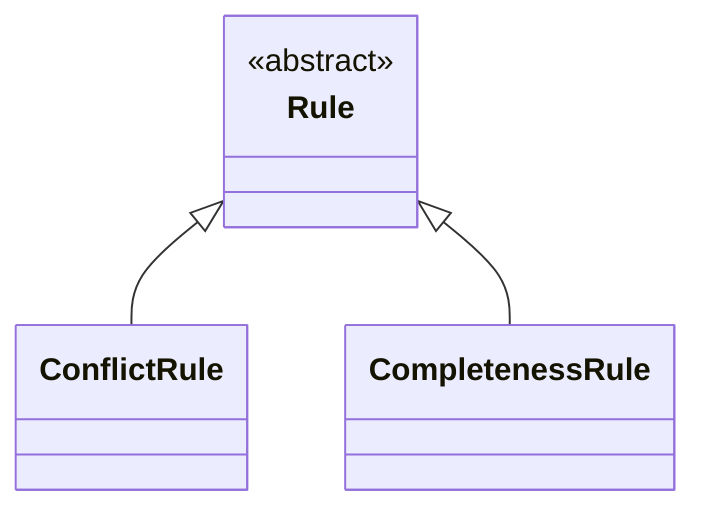
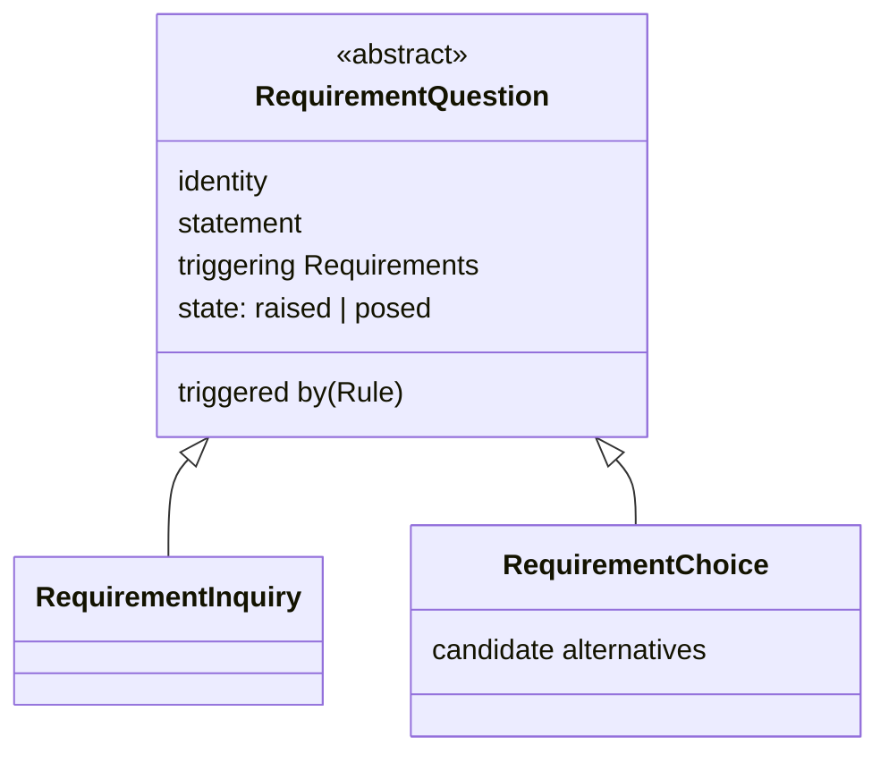

# Integrate the Project Lifecycle Model's rule metamodel and `RequirementQuestion`'s full shape (K66–K81) into `spec/` — Implementation Plan

> **For agentic workers:** REQUIRED SUB-SKILL: Use superpowers:subagent-driven-development (recommended) or
> superpowers:executing-plans to implement this plan task-by-task. Steps use checkbox (`- [ ]`) syntax for
> tracking.

**Goal:** Write K66–K81 into `spec/` — `RequirementDef`'s eighth attribute; the confirmation that
`Requirement` never specialises; the `RuleSet`/`Rule`/`ConflictRule`/`CompletenessRule` metamodel in
`spec/03-project-lifecycle-model.md`; and `RequirementQuestion` becoming abstract with two specialisations,
`RequirementInquiry` and `RequirementChoice` — narrowing OQ17 and opening OQ18–OQ19 in
`spec/06-decisions.md`. This is prose and diagrams, not code: a "test" for each task is a careful re-read for
internal consistency, cross-reference correctness, and conformance to this repository's own house rules
(`CLAUDE.md`), not a runnable suite.

**Architecture:** `spec/03-project-lifecycle-model.md` gains a new section (`RuleSet`, `Rule`, `ConflictRule`,
`CompletenessRule`) between its existing §2 and §3, pushing the last two sections down by one, and its §2
gains a fourth table row. `spec/02-requirement-analysis-model.md` gains an eighth attribute on `RequirementDef`
(§7), a confirming paragraph on `Requirement`'s non-specialisation (§9), a full rewrite of `RequirementQuestion`
into an abstract type with two specialisations (§11), and matching updates to the syntactic constraints (§12).
`spec/06-decisions.md` gains K66–K81, narrows OQ17, and opens OQ18–OQ19. `spec/01-requirement-model.md` is not
touched: OQ19, the only thing this design record raises against it, is explicitly not pursued there.

**Tech Stack:** Markdown, Mermaid diagrams (GitHub-rendered), git.

## Global Constraints

- **English only, no exception** (CLAUDE.md §5). Every sentence written in this plan and by it is English.
- **No notation, no filled `RequirementDef`, nothing executable** (CLAUDE.md §1). This plan writes prose and
  two small Mermaid diagrams; nothing it produces is a schema, a script, or a worked example in a notation.
- **Every decision taken while writing a `spec/` document is added to `spec/06-decisions.md` in the same
  commit as that document** (`spec/06-decisions.md`'s own stated convention). K66–K81 are added to
  `06-decisions.md` in Task 9, in its own commit, once every document that carries one of them has already
  landed — this plan's one deliberate departure from doing it "in the same commit," made because K66–K81 span
  three separate documents and no single earlier commit could carry all of them without the others.
- **Commit after every task. Never push** (CLAUDE.md §3, house rule 11).
- **Where a diagram and the prose beside it disagree, the prose wins** (CLAUDE.md §5, `00-overview.md` §6).
- **This is not a spec covering an open decision.** Everything this plan writes is already decided, in
  [`docs/superpowers/specs/2026-09-04-project-lifecycle-model-design.md`](../specs/2026-09-04-project-lifecycle-model-design.md)
  (K66–K80). This plan cites that record's decisions by number rather than re-arguing them; where a step needs
  the reasoning behind a decision, it quotes the design record rather than restating it in full.
- **Two gaps the design record left, resolved in this plan rather than re-opened as questions to the user:**
  - **`ConflictRule` and `CompletenessRule` are this plan's own naming, not the design record's.** K73 and K74
    name the two worked `Rule` mechanisms only descriptively — "a conflict-detecting `Rule`", "a
    completeness-detecting `Rule`" — and never state a type name. Task 5 introduces `ConflictRule` and
    `CompletenessRule`, taken directly from that descriptive language, and Task 9 records the choice as K81,
    sourced explicitly to this plan rather than to the design record, so a later reader can tell where the
    name came from.
  - **OQ17 is narrowed, not closed.** The design record's own status line says it closes "most of OQ17,"
    not all of it. Checked against the pattern `06-decisions.md` already uses for a fully-closed multi-part
    question (OQ12: three parts, all eventually resolved, one by dissolution) — OQ17 does not fit it. Only
    OQ17's own two-part question (the fourth rule-set item's shape; how a `RequirementQuestion` references
    what it fires on) is answered, by K74 and K78. What was only ever gathered *beside* OQ17 — `supersedes`,
    what finding a `RequirementDecision` closes, what closes one at all — is not touched by this design
    record and stays open. Task 9 therefore does not mark OQ17 "— answered" the way OQ11/OQ12/OQ15 are; it
    narrows OQ17 to the leftover and states plainly what was answered and where.
- **What this plan does not do.** It does not touch `spec/01-requirement-model.md` — OQ19 (whether a baseline
  needs to name which `RuleSet`(s) it was checked against) is the only thing this design record raises against
  that document, and the design record itself does not pursue it, leaving it open. It does not attempt OQ18
  (the two unworked `Rule` mechanisms) or the narrowed OQ17 (`supersedes`, `RequirementDecision`'s closure
  criterion). It does not touch the `RequirementDef`→`RequirementDefinition` or `answers`→`replies` renames,
  which are tracked outside `spec/`, in this session's own memory, as mechanical passes of their own.

---

### Task 1: `spec/02` — `RequirementDef`'s eighth attribute (K66)

**Files:**
- Modify: `spec/02-requirement-analysis-model.md` §7 (`RequirementDef`) and §8 (the two tests), wherever
  either refers to "the seven."

**Interfaces:**
- Consumes: nothing from an earlier task.
- Produces: `RequirementDef`'s complete eight-attribute shape, which Task 8's syntactic-constraints update
  references.

- [ ] **Step 1: Replace the attribute-count sentence and table**

Replace:

```
A definition carries seven things. This is the **core** — what the metamodel can interpret, or can fail on,
without reading anything an implementation supplies (K27).

| Attribute | What it is |
|---|---|
| identity | The definition's identifier |
| name | Human-readable |
| text | The template the requirement's wording is produced from, with places for its parameters |
| when it applies | One sentence stating when this definition comes into play. It is prose, not an evaluable expression (D20). Its absence means applicability has not been written down, which is a gap, not a claim that the definition applies unconditionally |
| parameters | Each parameter declares a value domain. Which domains exist is an implementation's business, exactly as the set of kinds is (K30, and `04-value-states.md` §5) |
| what to ask | For each parameter, how a non-expert is asked for what is missing |
| how it would be verified | The method by which a requirement produced under this definition would be shown to hold. Prose |
```

with:

```
A definition carries eight things. This is the **core** — what the metamodel can interpret, or can fail on,
without reading anything an implementation supplies (K27).

| Attribute | What it is |
|---|---|
| identity | The definition's identifier |
| name | Human-readable |
| text | The template the requirement's wording is produced from, with places for its parameters |
| when it applies | One sentence stating when this definition comes into play. It is prose, not an evaluable expression (D20). Its absence means applicability has not been written down, which is a gap, not a claim that the definition applies unconditionally |
| parameters | Each parameter declares a value domain. Which domains exist is an implementation's business, exactly as the set of kinds is (K30, and `04-value-states.md` §5) |
| what to ask | For each parameter, how a non-expert is asked for what is missing |
| how it would be verified | The method by which a requirement produced under this definition would be shown to hold. Prose |
| wording rule | A well-formedness rule for the wording a requirement produced under this definition must satisfy. Prose, on the same terms *how it would be verified* is prose (K66) |
```

- [ ] **Step 2: Add the explanatory paragraph, after "Why the last row sits on the definition..."**

Insert, immediately after the paragraph ending *"...OQ10 records the edge that would (K29)."* and before
*"**What the metamodel does not say about any of the seven is how it is written down.**"*:

```markdown
**Why a definition also states a wording rule, beside its template.** *text* gives the structural template a
requirement's wording is produced from; it says nothing about the qualities that wording must have once
produced. `03-project-lifecycle-model.md` §1 already states, of a rule-set, that it *"says nothing about...
what a requirement's wording should be"* — which settles where such a rule does **not** belong, without saying
where it does. ISO/IEC/IEEE 29148's own *characteristics of a good requirement* (unambiguous, singular, and so
on) is exactly this second, missing thing, generic to a kind rather than to one requirement, which is what
places it on the definition rather than the instance (K66). The seam test and the record test both admit it
on exactly the argument that seated *how it would be verified* (K29): the rule can be stated without resolving
a reference to an element the metamodel does not define, and a stated rule can fail on its absence.
```

- [ ] **Step 3: Replace every remaining "seven" in §7 and §8 with "eight"**

Five occurrences remain after Step 1's table replacement, all in §7 and §8:

- *"Two of the seven bottom out in the value-state model"* → *"Two of the eight bottom out in the value-state
  model"*
- *"What the metamodel does not say about any of the seven is how it is written down."* → *"...any of the
  eight..."*
- *"Two definitions carrying the same seven things are the same definition"* → *"...the same eight things..."*
- *"not be one of the seven. Two tests decide the question"* → *"...not be one of the eight..."*
- *"How they relate, and what that relation costs one of the seven, is stated"* → *"...costs one of the
  eight..."*
- *"Applied to the seven, they separate."* → *"Applied to the eight, they separate."*

- [ ] **Step 4: Re-read §7 and §8 for a stray "seven"**

Search the file for the word `seven`; no occurrence should remain that refers to `RequirementDef`'s attribute
count. (Other numbers — *"three properties"*, *"four things"* elsewhere in the document — are unrelated and
untouched.)

- [ ] **Step 5: Commit**

```bash
git add spec/02-requirement-analysis-model.md
git commit -m "$(cat <<'EOF'
Add RequirementDef's eighth attribute, a wording rule (K66)

Co-Authored-By: Claude Sonnet 5 <noreply@anthropic.com>
EOF
)"
```

---

### Task 2: `spec/02` §9 — confirm `Requirement` never specialises `RequirementDef` (K67)

**Files:**
- Modify: `spec/02-requirement-analysis-model.md` §9 ("Requirement kinds are specialisations")

**Interfaces:**
- Consumes: nothing from an earlier task.
- Produces: an explicit statement Task 7's `RequirementQuestion` rewrite does not depend on but that later
  readers of the specialisation tree rely on for correctness.

- [ ] **Step 1: Insert a new paragraph before "This revises prior art..."**

Insert, immediately after the paragraph ending *"...describe one relation twice, in two mechanisms that could
then disagree."* and before *"**This revises prior art, and does so by permission.**"*:

```markdown
**`Requirement` itself never specialises, however deep or wide the `RequirementDef` tree grows.** The kind
hierarchy lives entirely on the definition side, and `Requirement` and `RequirementDef` connect only by the
*produced under* relation (§10), never by inheritance: a requirement produced under a leaf kind is a plain
`Requirement` naming which `RequirementDef` it was produced under, not a member of some `Requirement`-subtype
(K67). This is SysML v2's own `def`/`usage` split, checked directly against the primary specification rather
than assumed: its kind hierarchy — `FunctionalRequirementCheck`, `PhysicalRequirementCheck`, and the rest —
specialises `RequirementCheck`, stated as *the base type of all `RequirementDefinition`s*, entirely on the
definition side; `RequirementUsage` stays one uniform type throughout, typed by whichever definition it names,
never itself specialised. This confirms rather than revises what `01-requirement-model.md` §2's K33 already
reads as though true — a `Requirement` naming no kind of its own presupposes it has none to name — stated
explicitly here because the question turned out not to be obvious without it.
```

- [ ] **Step 2: Re-read §9 for consistency**

Confirm the new paragraph does not contradict the section's own three numbered reasons above it (mechanism,
axis count, level-boundary reuse) and sits naturally between them and the "revises prior art" discussion that
follows.

- [ ] **Step 3: Commit**

```bash
git add spec/02-requirement-analysis-model.md
git commit -m "$(cat <<'EOF'
Confirm Requirement never specialises RequirementDef (K67)

Co-Authored-By: Claude Sonnet 5 <noreply@anthropic.com>
EOF
)"
```

---

### Task 3: `spec/03` §1 — correct the rule-set's scope from organisation to project (K70)

**Files:**
- Modify: `spec/03-project-lifecycle-model.md:10` (the opening sentence of §1)

**Interfaces:**
- Consumes: nothing from an earlier task.
- Produces: the corrected scope Task 4's `RuleSet` section builds on without restating.

- [ ] **Step 1: Replace the opening sentence**

Replace:

```
A **rule-set** is a model: what an organisation loads to state its own way of working, built with its own
metamodel rather than being a layer of this one (K22).
```

with:

```
A **rule-set** is a model: what a project loads to state its own way of working, built with its own metamodel
rather than being a layer of this one (K22). How an organisation manages rule-sets across more than one
project — export, import, version comparison between projects — is out of this model's scope; this document's
own scope is one project, the same scope every other member of the collection keeps (K70).
```

- [ ] **Step 2: Confirm the other four "organisation" occurrences in this document need no change**

Read the four remaining occurrences (an adopting organisation's way of working not being fixed into the
metamodel; the same phrase repeated; a process colliding with an adopting organisation's own way of working;
rule-sets differing per organisation by design). Each is about an organisation's process *preference* being
representable, not about one rule-set spanning several projects — K70 corrects only the latter reading, which
is confined to the sentence Step 1 replaces. None of the four needs editing.

- [ ] **Step 3: Commit**

```bash
git add spec/03-project-lifecycle-model.md
git commit -m "$(cat <<'EOF'
Correct spec/03's rule-set scope from organisation to project (K70)

Co-Authored-By: Claude Sonnet 5 <noreply@anthropic.com>
EOF
)"
```

---

### Task 4: `spec/03` — insert `RuleSet` and `Rule` as the new §3

**Files:**
- Modify: `spec/03-project-lifecycle-model.md` — insert a new section between the current §2 and §3;
  renumber the current §3 (`## 3. What the metamodel does not do`) to §4 and the current §4 (`## 4. How this
  answers OQ4`) to §5.

**Interfaces:**
- Consumes: K30's specialisation mechanism (already in `spec/02` §9), K42 (list of rule-set statements not
  closed).
- Produces: `RuleSet` and the abstract `Rule` type, complete, for Task 5's `ConflictRule`/`CompletenessRule`
  to specialise and for Task 7's `RequirementQuestion` rewrite to reference.

- [ ] **Step 1: Renumber the two trailing sections**

Change `## 3. What the metamodel does not do` to `## 4. What the metamodel does not do`, and `## 4. How this
answers OQ4` to `## 5. How this answers OQ4`.

- [ ] **Step 2: Insert the new §3, before the renumbered §4**

```markdown
## 3. `RuleSet` and `Rule`



The diagram draws what this section states; where the two disagree, the prose wins. Two more `Rule`
specialisations are named but not yet shaped — see the end of this section — and are left off the diagram for
the same reason a design record leaves an open question out of a decision table: nothing here defines them
yet.

### `RuleSet`

A **`RuleSet`** belongs to a `RequirementDef` — zero or one per `RequirementDef` — not to a project as a whole
(K68). It gathers the `Rule`s stated over that `RequirementDef` specifically. There is no reification of
"everything a project has loaded" as an element of its own.

This is the natural unit, on two grounds. Section 2 already states that a rule-set's statements are *"stated
per kind, not per definition"* — and a kind is exactly a `RequirementDef` (`02-requirement-analysis-model.md`
§9, K30) — so attaching a `RuleSet` at the `RequirementDef` is following that sentence rather than adding to
it. And it narrows the search a check needs to run: finding every `Rule` that could apply to a `Requirement`
is walking that `Requirement`'s own `RequirementDef` ancestry and reading each node's own `RuleSet`, not
filtering a project-wide collection by a separate reference naming which `RequirementDef` a `Rule` applies to.
A design carrying a `Rule.appliesTo` reference, pointing at an arbitrary `RequirementDef` node, does the same
job at the cost of a second mechanism where the attachment itself already suffices — it is not adopted.

**A `Rule` attached to a `RequirementDef` applies to every specialisation of it, not only to that node**
(K69). This needs no mechanism of its own beyond the specialisation tree K30 already builds: a rule stated at
the root applies everywhere beneath it; a rule stated three levels down applies only beneath that point. A
project's most consequential rules — *"no requirement may contradict an active one,"* below — belong at the
root precisely because they should reach every kind a project declares, without being restated once per leaf
kind.

### `Rule`

`Rule` is **abstract**. Its specialisations divide by **mechanism** — what happens when the rule fires — not
by section 2's four descriptive rows, which remain a description of *subject matter*, closer to an open,
`Source.kind`-shaped label than to a type boundary (K71). The two axes are independent and do not correlate
one-to-one: two different subject-matter rows below share the same mechanism shape — *detect a gap, then
raise a `RequirementQuestion` subtype* — while the other two have no worked-out mechanism at all, and may turn
out to need something structurally different, from each other as much as from these two.

Two mechanisms are worked out here: `ConflictRule` and `CompletenessRule`, below. Two more — a
silent-vs-owned-default rule and a gap-timeout rule, section 2's first and second rows — are not, and this
document does not claim they share this shape merely because they would sit in the same abstract type's
specialisation list; whether either does is recorded as OQ18 in `06-decisions.md` (K72).
```

- [ ] **Step 3: Verify the diagram matches the prose**

Confirm `Rule` is drawn abstract with two named specialisations, `ConflictRule` and `CompletenessRule`, and no
attribute is drawn that the prose does not also state (none is — `RuleSet` and `Rule` are stated entirely in
prose in this task; Task 5 adds the two concrete specialisations' own content).

- [ ] **Step 4: Commit**

```bash
git add spec/03-project-lifecycle-model.md
git commit -m "$(cat <<'EOF'
Add RuleSet and the abstract Rule type to spec/03 (K68, K69, K71, K72)

Co-Authored-By: Claude Sonnet 5 <noreply@anthropic.com>
EOF
)"
```

---

### Task 5: `spec/03` §3 — add `ConflictRule` and `CompletenessRule`

**Files:**
- Modify: `spec/03-project-lifecycle-model.md` — append to the new §3 Task 4 inserted, after the `### Rule`
  subsection.

**Interfaces:**
- Consumes: `Rule` (Task 4); `RequirementChoice`/`RequirementInquiry`, named here but defined in Task 7's
  `spec/02` rewrite — this task references them by name and does not define them, matching how
  `spec/02-requirement-analysis-model.md` already forward-references `RequirementDef` from `spec/01` before
  either document existed in its final form.
- Produces: `ConflictRule` and `CompletenessRule`, complete, naming `RequirementChoice` and
  `RequirementInquiry` respectively — the names Task 7 must use for the two `RequirementQuestion`
  specialisations, so the two tasks agree on terminology without one running after the other.

- [ ] **Step 1: Append `ConflictRule`, `CompletenessRule`, and the matching subsection**

Insert, immediately after the `### Rule` subsection Task 4 added (before the renumbered `## 4. What the
metamodel does not do`):

```markdown
### `ConflictRule`

A `ConflictRule` fires when a new `Requirement` contradicts an existing in-force one, and raises a
`RequirementChoice` (`02-requirement-analysis-model.md` §11) naming the alternatives a reviewer must choose
among (K73). *"No requirement may contradict an active requirement,"* stated once at the `RequirementDef`
root and inherited everywhere by the rule above, is this mechanism's canonical case. This sharpens section 2's
third row — *how a conflict of a given kind is resolved* — which describes only the resolution half;
detection is the other half a `Rule` must also carry, and resolution is exactly what a `RequirementChoice`,
discharged by a `RequirementDecision`, records.

### `CompletenessRule`

A `CompletenessRule` fires when a `RequirementDef` kind is present without an implied companion kind, and
raises a `RequirementInquiry` (`02-requirement-analysis-model.md` §11) (K74). This is the case section 2's
fourth row now states directly: *"which other requirement kinds a given kind implies should also be
present."*

**The check is set-level, not per-instance.** It asks whether at least one `Requirement` of the implied kind
exists anywhere the rule's `RequirementDef` reaches, never whether every triggering `Requirement` has its own
(K75). Consequently, while a given `CompletenessRule`'s gap stays open, a newly triggering `Requirement`
extends the existing open `RequirementInquiry`'s list of triggering requirements rather than raising a second
one: **at most one open `RequirementInquiry` per `Rule` at a time.** Reading the check as a query over current
state, rather than a per-instance obligation, is what keeps a growing model from re-triggering the same rule
combinatorially — once the implied kind exists once, the query returns no gap for every requirement
thereafter, without anything needing to be closed by hand.

### Matching a `Rule`'s condition

**Whether a `Rule`'s free-text condition holds of a free-text `Requirement` is a semantic constraint (K24),
not a syntactic one** (K76). The metamodel does not guarantee this runs exhaustively or automatically; it is
carried out by judgement, human or AI, on the same terms `00-overview.md` §5 and
`02-requirement-analysis-model.md` §11 already hold extraction completeness to (K40, K41). Both a `Rule`'s
condition and a `Requirement`'s wording are prose; nothing decides whether one matches the other without
reading content.
```

- [ ] **Step 2: Re-read against the diagram Task 4 drew**

Confirm `ConflictRule` and `CompletenessRule` are the same two names the Task 4 diagram already shows, and
that neither subsection here contradicts `Rule`'s own "mechanism, not subject matter" framing.

- [ ] **Step 3: Commit**

```bash
git add spec/03-project-lifecycle-model.md
git commit -m "$(cat <<'EOF'
Add ConflictRule and CompletenessRule to spec/03 (K73-K76)

Co-Authored-By: Claude Sonnet 5 <noreply@anthropic.com>
EOF
)"
```

---

### Task 6: `spec/03` §2 — add the rule-set's fourth statement (K74)

**Files:**
- Modify: `spec/03-project-lifecycle-model.md` §2 ("What a rule-set may state")

**Interfaces:**
- Consumes: `CompletenessRule` (Task 5) — this task states the gap `CompletenessRule` fills; Task 5 states the
  mechanism that fills it.
- Produces: the four-row table Task 9's `06-decisions.md` entry for K74 refers back to.

- [ ] **Step 1: Replace the opening paragraph's count**

Replace:

```
A rule-set states three kinds of thing. That count is what the evidence found so far supports, not a
ceiling the metamodel places on it: the list is not closed, and an implementation needing to state a fourth
kind of thing is evidence the metamodel must then account for, not a violation of it.
```

with:

```
A rule-set states four kinds of thing. That count is what the evidence found so far supports, not a ceiling
the metamodel places on it: the list is not closed at four either, and an implementation needing to state a
fifth kind of thing is evidence the metamodel must then account for, not a violation of it.
```

- [ ] **Step 2: Add the fourth table row**

Replace:

```
| A rule-set states | The gap it fills |
|---|---|
| Whether an applied default may be silent, or must be owned by somebody | Nothing today says which defaults are a choice somebody must answer for |
| When a gap stops being waited on and becomes a decision | Nothing today says at what point waiting ends |
| How a conflict of a given kind is resolved | Nothing today says who resolves what, or how |
```

with:

```
| A rule-set states | The gap it fills |
|---|---|
| Whether an applied default may be silent, or must be owned by somebody | Nothing today says which defaults are a choice somebody must answer for |
| When a gap stops being waited on and becomes a decision | Nothing today says at what point waiting ends |
| How a conflict of a given kind is resolved | Nothing today says who resolves what, or how |
| Which other requirement kinds a given kind implies should also be present | Nothing today says whether one requirement's kind, on its own, calls for other kinds to co-exist |
```

- [ ] **Step 3: Add a paragraph distinguishing the fourth row's provenance from the first three's**

Insert, immediately after the paragraph beginning *"These three are not proposed here; they are measured..."*
and ending *"...the three statements above are kernel material for the same reason the rest of that list
was,"* and before *"**They are stated per kind, not per definition.**"* — first, edit that paragraph's own
wording, then add the new one after it.

Replace:

```
These three are not proposed here; they are measured. EventML's v0.5 record counted what its 22 written
requirement definitions already carried — when a definition applies, what it needs, how a missing value is
asked for, how it would be verified — and found exactly these three missing, each sitting at the moment
somebody has to act rather than merely read. The founding record's OQ6 reasons from that same list when it
argues the kernel needs a repository of its own, on the ground that not one item on it is specific to any one
domain: the three statements above are kernel material for the same reason the rest of that list was.
```

with:

```
The first three are not proposed here; they are measured. EventML's v0.5 record counted what its 22 written
requirement definitions already carried — when a definition applies, what it needs, how a missing value is
asked for, how it would be verified — and found exactly these three missing, each sitting at the moment
somebody has to act rather than merely read. The founding record's OQ6 reasons from that same list when it
argues the kernel needs a repository of its own, on the ground that not one item on it is specific to any one
domain: the three statements above are kernel material for the same reason the rest of that list was.

**The fourth was not found the same way, and is kernel material on a different ground.** It was not among
EventML's own v0.5 gaps; it surfaced instead while working out how a `RequirementQuestion` references what
fires on it (`02-requirement-analysis-model.md` §11), and section 3's `CompletenessRule` states its mechanism.
It passes the same test the other three do — nothing about which requirement kinds imply which companions is
specific to any one domain — which is what earns it a place in this table on K42's own terms rather than as an
exception to them.
```

- [ ] **Step 4: Commit**

```bash
git add spec/03-project-lifecycle-model.md
git commit -m "$(cat <<'EOF'
Add the rule-set's fourth statement, kind-implication, to spec/03 §2 (K74)

Co-Authored-By: Claude Sonnet 5 <noreply@anthropic.com>
EOF
)"
```

---

### Task 7: `spec/02` §11 — rewrite `RequirementQuestion` as abstract, with `RequirementInquiry` and `RequirementChoice`

**Files:**
- Modify: `spec/02-requirement-analysis-model.md` §11, the `### \`RequirementQuestion\`` subsection

**Interfaces:**
- Consumes: `ConflictRule`/`CompletenessRule` (Task 5) by name; `poses` (already defined, §4); `discharges`,
  coined in this task.
- Produces: `RequirementQuestion`, `RequirementInquiry`, and `RequirementChoice`, complete, for Task 8's
  syntactic constraints to reference.

- [ ] **Step 1: Replace the entire `### \`RequirementQuestion\`` subsection**

Replace the full subsection — from `### \`RequirementQuestion\`` through the paragraph ending *"...excludes
task-shaped vocabulary from this metamodel by name (K65)."* — with:

```markdown
### `RequirementQuestion`

`RequirementQuestion` is **abstract**. What the modeller must find out (K49) — the model-side record of a gap
the modeller has identified, before anybody has been asked to close it — is common to every specialisation,
and it is abstract because K79 gives it two.



The diagram draws what this subsection states; where the two disagree, the prose wins.

A `RequirementQuestion` carries, beyond its identity, three things shared by every specialisation (K78).

| Attribute | Carries |
|---|---|
| statement | A free, professional-register text statement of the question |
| triggered by | A reference to the `Rule` (`03-project-lifecycle-model.md` §3) that fired and produced it |
| triggering `Requirement`s | Every `Requirement` that triggered it. List-valued, and may grow while the question stays open (`03-project-lifecycle-model.md` §3, K75) |

It also carries one of two states (K60).

| State | Meaning |
|---|---|
| raised | Identified; no `SourceQuestion` yet names it |
| posed | A `poses` edge names an actual `SourceQuestion` — the edge's presence is the transition itself, not
  a marker recorded beside it |

It is not itself a `SourceQuestion`: it crosses outward, by `poses` (K59), into one once the modeller actually
puts the question to somebody. **What happens after posing — whether and how the question is answered —
carries no further state here.** That discharge is OQ13's own territory, which this document does not attempt
to close; `RequirementQuestion` gives OQ13 the *opening* half of the interval it asks about, and no more.

**`RequirementQuestion` specialises into `RequirementInquiry` and `RequirementChoice`, one per mechanism
`03-project-lifecycle-model.md` §3 names** (K79). Both carry `discharges`: an edge to whatever closes them,
optional because it is absent for as long as the question stands open. `RequirementInquiry` discharges to a
`Requirement`; `RequirementChoice` discharges to a `RequirementDecision`.

`discharges` is a coined edge rather than a reuse of `answers`: `answers` is a `Source`↔`Source`, evidentiary
edge — one passage of material responding to another — where `discharges` names, on the model's own side,
what closed a question, a different kind of relationship entirely. Reusing `answers` here would blur exactly
the distinction K47 draws between the two sides of this model. The word itself is not new to this collection:
OQ13 already speaks of *"its discharge"* as the machinery it still asks for, and `discharges` names the
phenomenon the corpus was already calling by this word.

**`RequirementInquiry` carries nothing beyond the shared shape above and its `discharges` edge** (K80). A
completeness gap (`03-project-lifecycle-model.md` §3) names a missing kind, and the shared *triggering
`Requirement`s* list plus the `Rule` itself already identify it in full — nothing further is needed before
discharge.

**`RequirementChoice` additionally carries the candidate alternatives being decided among** (K80). A conflict
needs the options named before anyone can decide among them, and these alternatives deliberately prefigure
what `RequirementDecision`'s own *the choice* attribute (above) will record once discharged — the same
alternatives, read once as open and once as settled.

**Closing a `RequirementInquiry` or `RequirementChoice` needs no dedicated edge to reach a
`RequirementDecision`, and `discharges` does not change that.** The connection was already traceable through
machinery this document has independently of `discharges`: `RequirementQuestion` --poses--> `SourceQuestion`,
whose source a later source `answers` (§3); if that answering source carries a `SourceDecision`, it `refine`s
into the `RequirementDecision` that answers the question (K61). `discharges` sits *beside* that traceable
chain as a direct, optional convenience reference, not in place of it: the chain is what guarantees the
connection always exists and is consistent; `discharges` is what lets a reader, or a checker, find the answer
without walking three hops to get there. Both readings are true at once, deliberately.

**Where a `RequirementQuestion` comes from is now settled for two mechanisms and open for the rest.** A
`RequirementDef`'s own *what to ask* (§7) already covers a single missing parameter. A conflict between a new
`Requirement` and an existing in-force one is `03-project-lifecycle-model.md` §3's `ConflictRule`, raising a
`RequirementChoice`. A `Requirement` whose kind implies that another kind should also exist is that section's
`CompletenessRule`, raising a `RequirementInquiry` — this was OQ17's own original case, now answered. Two
further rule-set statements — whether a silent default must be owned, and when a gap's wait becomes a decision
— do not yet have a worked mechanism, and whether either raises a `RequirementQuestion` the same way, or needs
something structurally different, is recorded as OQ18 in `06-decisions.md`.

**`RequirementQuestion` — both specialisations — belongs to the *review finding* family in the findings table
below, not to the *failed check* or *question* rows** (K77). It is judged by whether a `Rule`'s condition
holds (`03-project-lifecycle-model.md` §3, K76), it is modelled, and it carries state (K60) — the three
properties that table already uses to seat *review finding* apart from the other two. Nothing about
`RequirementQuestion` changes because of this: it is a naming of what it already is, for a reader who reaches
the table below looking for where it fits.

This metamodel introduces no `Task`, or any output shaped like one, for a `RequirementQuestion` in the raised
state. The state itself is already the complete signal: querying for raised `RequirementQuestion`s is finding
the worklist, on the same terms K53 already reads an unsatisfied requirement without a dedicated element for
it (see `05-binding-contract.md` §2), and `00-overview.md` §1 excludes task-shaped vocabulary from this
metamodel by name (K65).
```

- [ ] **Step 2: Verify the diagram matches the prose**

Confirm `RequirementQuestion` is drawn abstract, carrying the four shared items (identity plus the three K78
attributes) and the raised/posed state; confirm `RequirementInquiry` is drawn with nothing extra and
`RequirementChoice` with `candidate alternatives`. Confirm `discharges` is not drawn as an edge on the
diagram — it is stated in prose only, consistent with `poses` and `refine` not appearing on this document's
other diagrams either.

- [ ] **Step 3: Re-read §1's intro paragraph for whether it needs `RequirementInquiry`/`RequirementChoice` named**

`spec/02` §1 currently says *"`RequirementQuestion` crosses outward, by `poses`, into `SourceQuestion`"*
without naming its two specialisations. Leave §1 as it stands: the intro paragraph names the model's element
*families*, not every specialisation within a family — it does not name `SourceNeed`/`SourceDecision`'s own
internal shape either, beyond `SourceStatement`. No edit is needed here.

- [ ] **Step 4: Commit**

```bash
git add spec/02-requirement-analysis-model.md
git commit -m "$(cat <<'EOF'
Split RequirementQuestion into RequirementInquiry and RequirementChoice (K77-K80)

Co-Authored-By: Claude Sonnet 5 <noreply@anthropic.com>
EOF
)"
```

---

### Task 8: `spec/02` §12 — update the syntactic constraints

**Files:**
- Modify: `spec/02-requirement-analysis-model.md` §12 ("The syntactic constraints of this model")

**Interfaces:**
- Consumes: every element Tasks 1, 2, and 7 introduced or changed.
- Produces: the complete, current syntactic-constraint list this model's readers depend on.

- [ ] **Step 1: Add a constraint bullet over `RequirementDef`'s new attribute**

In the **"Over `RequirementDef`."** block, insert a new bullet immediately after the existing *"Every
definition states how a requirement produced under it would be verified..."* bullet:

```markdown
- **Every definition states a well-formedness rule for the wording a requirement produced under it must
  satisfy.** Absence of the statement is a failed check on the definition itself, independent of anything any
  requirement produced under it says. This is ISO/IEC/IEEE 29148's *characteristics of a good requirement*
  held one level up, on the same footing §7 already places *how it would be verified* — it is the stated rule
  K66 rests on.
```

- [ ] **Step 2: Replace the "Over `RequirementQuestion`" block**

Replace:

```markdown
**Over `RequirementQuestion`.**

- A `RequirementQuestion`'s identity is unique among every `RequirementQuestion` in the model (§11).
- A `RequirementQuestion` carries exactly one of "raised" or "posed" at any time. A `RequirementQuestion` in
  the posed state names, by its `poses` edge, exactly the `SourceQuestion` that made it so (§11, K60).
```

with:

```markdown
**Over `RequirementQuestion`, `RequirementInquiry`, and `RequirementChoice`.**

- A `RequirementQuestion`'s identity is unique among every `RequirementQuestion` in the model (§11).
- No element is a `RequirementQuestion` and nothing more: every `RequirementQuestion` in a model is an
  instance of `RequirementInquiry` or `RequirementChoice` (§11, K79).
- A `RequirementQuestion` carries exactly one of "raised" or "posed" at any time. A `RequirementQuestion` in
  the posed state names, by its `poses` edge, exactly the `SourceQuestion` that made it so (§11, K60).
- A `RequirementInquiry`'s `discharges` edge, where present, names a `Requirement`. A `RequirementChoice`'s
  `discharges` edge, where present, names a `RequirementDecision`. Both are optional (§11, K79).
- At most one `RequirementInquiry` per `Rule` is open at a time; a `Requirement` that triggers a
  `CompletenessRule` while one is already open extends its triggering-`Requirement`s list rather than raising
  a second `RequirementInquiry` (§11, `03-project-lifecycle-model.md` §3, K75).
```

- [ ] **Step 3: Re-read the whole section against the elements it covers**

Confirm every element Tasks 1, 2, and 7 introduced has a syntactic constraint here or an explicit note
matching the pattern the section's final paragraph already uses for `RequirementDef`'s *name* — `RuleSet` and
`Rule` deliberately have no constraints stated here, because they are `spec/03`'s own elements, not this
document's, and this section's opening sentence already scopes it to "the elements this document defines."

- [ ] **Step 4: Commit**

```bash
git add spec/02-requirement-analysis-model.md
git commit -m "$(cat <<'EOF'
Update spec/02 syntactic constraints for the wording rule and RequirementQuestion's split (K66, K75, K79)

Co-Authored-By: Claude Sonnet 5 <noreply@anthropic.com>
EOF
)"
```

---

### Task 9: `spec/06-decisions.md` — add K66–K81, narrow OQ17, open OQ18–OQ19

**Files:**
- Modify: `spec/06-decisions.md` — insert a new decisions section after the existing `## Decisions K57–K65`
  section and before `## Decisions K51–K54`; replace the `## Open questions, OQ14, OQ16, OQ17` section.

**Interfaces:**
- Consumes: K66–K80 as the design record of 2026-09-04 states them, and K81 as this plan's own Global
  Constraints section states it; this task transcribes the decisions into the normative record in a condensed
  form, matching the length of this file's existing entries, rather than quoting the design record's full
  argument.

- [ ] **Step 1: Insert the new decisions section**

Insert, immediately after the existing `## Decisions K57–K65` section (ending *"...`00-overview.md` §1
excludes this vocabulary by name."*) and before `## Decisions K51–K54`:

```markdown
## Decisions K66–K81

Taken in [the design record of 2026-09-04](../docs/superpowers/specs/2026-09-04-project-lifecycle-model-design.md)
§§2–13, which carries the full argument for each, except K81, taken in
[the integration plan of 2026-09-04](../docs/superpowers/plans/2026-09-04-project-lifecycle-model-integration-plan.md)
itself. Written into `spec/` by that same plan. K74 and K78 together answer OQ17's own question; the plan
narrows OQ17 to what was only ever gathered beside it, and opens OQ18–OQ19.

| # | Decision | Reason |
|---|---|---|
| K66 | `RequirementDef` carries an eighth attribute: a well-formedness rule for the wording a requirement produced under it must satisfy | The seam test and the record test both pass, on the argument that already seated *how it would be verified* (K29): a well-formedness rule is exactly ISO/IEC/IEEE 29148's *characteristics of a good requirement*, generic to a kind rather than to one requirement |
| K67 | `Requirement` and `RequirementDef` are connected by an association — the *produced under* relation — never by inheritance. `Requirement` stays single and unspecialised regardless of how deep or wide the `RequirementDef` tree grows | Verified against SysML v2's primary specification: its kind hierarchy specialises `RequirementCheck`, "the base type of all `RequirementDefinition`s," entirely on the definition side, while `RequirementUsage` stays one uniform type. Confirms rather than revises what K33 already presupposed |
| K68 | A `RuleSet` belongs to a `RequirementDef` — zero or one per `RequirementDef` — not to a project as a whole | Follows `03-project-lifecycle-model.md` §2's own "stated per kind, not per definition," and narrows the search a check needs to run to walking one `RequirementDef`'s ancestry rather than filtering a project-wide collection |
| K69 | A `Rule` attached to a `RequirementDef` applies to every specialisation of it, not only to that node | A direct reading of the specialisation tree K30 already builds; needs no mechanism of its own |
| K70 | `spec/03` §1's "what an organisation loads" is corrected to name a project, not an organisation across projects | The phrasing survived from an earlier reading with cross-project tooling in mind — export, import, version comparison — which is tooling territory, not metamodel territory, on the same boundary K46 draws for provenance |
| K71 | `Rule` is abstract, and its specialisations divide by mechanism — what happens when the rule fires — not by `spec/03` §2's four descriptive categories, which remain subject-matter labels | The two axes do not correlate one-to-one: two different subject-matter rows share one mechanism shape, while the other two rows have no worked-out mechanism at all |
| K72 | Two mechanisms are worked out — `ConflictRule` and `CompletenessRule`; two more (silent-vs-owned-default, gap-timeout) are not, and stay open as OQ18 | Named directly rather than glossed over: this record does not claim the other two share this shape merely because they would sit in the same abstract type's list |
| K73 | A conflict-detecting `Rule`, when it finds that a new `Requirement` contradicts an existing in-force one, raises a `RequirementChoice` | Sharpens `spec/03` §2's third row, which describes only the resolution half; detection is the other half a `Rule` must also carry |
| K74 | A completeness-detecting `Rule`, when it finds that a `RequirementDef` kind is present without an implied companion kind, raises a `RequirementInquiry` | Closes OQ17's own original case: the rule-set's fourth statement, now given a mechanism rather than only a name |
| K75 | A completeness check is set-level, not per-instance: it asks whether at least one `Requirement` of the implied kind exists anywhere the rule's `RequirementDef` reaches. At most one open `RequirementInquiry` per `Rule` at a time; a new triggering `Requirement` extends it | Resolves a cost concern about a growing model re-triggering the same rule combinatorially, by reading the check as a query over current state rather than a per-instance obligation |
| K76 | Rule-matching — whether a `Rule`'s free-text condition holds of a free-text `Requirement` — is a semantic constraint (K24), not a syntactic one | Both a `Rule`'s condition and a `Requirement`'s wording are prose; nothing decides a match without reading content, on the same terms K40/K41 already hold extraction completeness to |
| K77 | `RequirementQuestion` — both specialisations — belongs to the *review finding* family in `spec/02` §11's three-way table, not to the *failed check* or *question* rows | It is judged, modelled, and carries state — the three properties that table already uses to seat *review finding* apart from the other two. No change to `RequirementQuestion` follows; this is a naming of what it already is |
| K78 | `RequirementQuestion` is abstract, and carries, beyond identity and its raised/posed states: a free professional-register statement of the question; a reference to the `Rule` that triggered it; and a list-valued list of every triggering `Requirement`, which may grow while the question stays open | The earlier concern that a "which rule" reference would open a second seam dissolves once `Rule` is itself metamodel-defined: referencing it is no different from `Requirement` referencing `RequirementDef` |
| K79 | `RequirementQuestion` specialises into `RequirementInquiry` and `RequirementChoice`, one per mechanism K72 names. Both carry `discharges`, optional, to whatever closes them — `RequirementInquiry` to a `Requirement`, `RequirementChoice` to a `RequirementDecision` | `discharges` is coined rather than reusing `answers`: `answers` is a `Source`↔`Source` evidentiary edge, and this is a different kind of relationship, on the model's own side of K43's axis. The word is already live in this collection's vocabulary, in OQ13's "its discharge" |
| K80 | `RequirementInquiry` carries nothing beyond the shared shape and `discharges`. `RequirementChoice` additionally carries the candidate alternatives being decided among | A completeness gap names a missing kind, which the shared shape already identifies in full. A conflict needs its options named before anyone can decide among them, and these alternatives prefigure `RequirementDecision.the choice` once discharged |
| K81 | `ConflictRule` and `CompletenessRule` name K73 and K74's two worked `Rule` mechanisms | Neither name is stated in the design record, which refers to them only descriptively. No standard names a rule-firing mechanism of this shape, so house rule 10's coining clause applies; each name is taken directly from the descriptive phrase that already identifies it, on the same grounds K59 coined `poses` from K48's own description. Recorded here rather than in the design record because it is this plan's own naming decision, not one the design record itself took |
```

- [ ] **Step 2: Replace the "Open questions, OQ14, OQ16, OQ17" section**

Replace:

```markdown
## Open questions, OQ14, OQ16, OQ17

Raised in [the design record of 2026-09-03 on the source-element hierarchy](../docs/superpowers/specs/2026-09-03-source-element-hierarchy-design.md),
which carries the full argument for each.

| # | Question | When answerable |
|---|---|---|
| OQ14 | Is there a model-side abstract type, as `SourceElement` is for the source side? The owner's judgement is that one will probably be needed and that the side is not yet fully seen | When the model side is understood as well as the source side is |
| OQ16 | How does `SourceQuestion` subdivide, and does it name the party expected to answer? | With OQ13, realistically |
| OQ17 | What does the Project Lifecycle Model's fourth rule-set item look like, and how does a `RequirementQuestion` reference what it fires on? Gathered here alongside `supersedes` and what a `RequirementDecision` closes and what closes one, since none of the three is answerable without `spec/03-project-lifecycle-model.md` being worked out first | A dedicated session on the Project Lifecycle Model |
```

with:

```markdown
## Open questions, OQ14 and OQ16

Raised in [the design record of 2026-09-03 on the source-element hierarchy](../docs/superpowers/specs/2026-09-03-source-element-hierarchy-design.md),
which carries the full argument for each. OQ17, raised in the same record, is narrowed below rather than
listed here, once [the design record of 2026-09-04](../docs/superpowers/specs/2026-09-04-project-lifecycle-model-design.md)
answered its own two-part question.

| # | Question | When answerable |
|---|---|---|
| OQ14 | Is there a model-side abstract type, as `SourceElement` is for the source side? The owner's judgement is that one will probably be needed and that the side is not yet fully seen | When the model side is understood as well as the source side is |
| OQ16 | How does `SourceQuestion` subdivide, and does it name the party expected to answer? | With OQ13, realistically |

## Open question OQ17 — narrowed

**Its own two-part question is answered, and is not what stays open.** What the Project Lifecycle Model's
fourth rule-set item looks like is `CompletenessRule` (K74); how a `RequirementQuestion` references what it
fires on is the *triggered by* and *triggering `Requirement`s* attributes K78 gives every
`RequirementQuestion`. Both are settled in
[the design record of 2026-09-04](../docs/superpowers/specs/2026-09-04-project-lifecycle-model-design.md) and
written into `spec/` by
[the integration plan of 2026-09-04](../docs/superpowers/plans/2026-09-04-project-lifecycle-model-integration-plan.md).

**What was only ever gathered beside OQ17, never part of its own question, is what remains open:
`supersedes`, what finding a `RequirementDecision` closes, and what closes a `RequirementDecision` itself.**
None of the three was answerable without `spec/03-project-lifecycle-model.md` being worked out further than
the 2026-09-04 record takes it, and none of the three is answered by that record either — K63 already records
the closure criterion as deferred, and nothing here revisits it. This is not the same shape as OQ12's third
part, which dissolved on a false premise: nothing here rests on a mistaken assumption, the territory is simply
still unworked, which is why this question is narrowed rather than marked answered.

Raised in [the design record of 2026-09-03 on the source-element hierarchy](../docs/superpowers/specs/2026-09-03-source-element-hierarchy-design.md)
§14, and narrowed here rather than there.

| # | Question, as asked | When answerable |
|---|---|---|
| OQ17 | What does `supersedes` mean; what finding does a `RequirementDecision` close; and what closes a `RequirementDecision`? Originally gathered alongside the fourth rule-set item and the `RequirementQuestion` reference mechanism, both answered above, because none of the three was answerable without `spec/03-project-lifecycle-model.md` being worked out first | A further session on the Project Lifecycle Model, once `supersedes` itself is worked out |

## Open questions OQ18–OQ19

Raised in [the design record of 2026-09-04](../docs/superpowers/specs/2026-09-04-project-lifecycle-model-design.md),
which carries the full argument for each.

| # | Question | When answerable |
|---|---|---|
| OQ18 | What mechanism do a silent-vs-owned-default `Rule` and a gap-timeout `Rule` actually carry? K72 names the gap directly rather than guessing at it. Both may share `RequirementChoice`/`RequirementInquiry`'s "detect, then raise" shape, or may need something structurally different — a direct value-state edit for the first, an escalation of something already raised for the second | When one of the two is actually exercised, the same discipline that settled the other two |
| OQ19 | Does a baseline need to name which `RuleSet`(s), and which version of each, it was checked against — separately from the implementation package and version `01-requirement-model.md` §4 already names? K68 makes a `RuleSet` per-`RequirementDef` rather than a single project-wide version, which may mean this question is really *N* small questions — one per `RequirementDef` a baseline's requirements touch — rather than one | Needs `01-requirement-model.md` §4 read again with K68–K70 in view |
```

- [ ] **Step 3: Re-read the whole file for K-number and OQ-number continuity**

Confirm the K series reads K1–K18 (founding record), K19–K42, K43–K50, K51–K54, K56–K65, K66–K81, with no gap
and no repeated number (the file's existing non-monotonic ordering — K43–K50 and K57–K65 both appear before
K51–K54 — is pre-existing and this task does not fix it; K66–K81 follows the same convention, placed beside
the design record it came from rather than in strict numeric order). Confirm the OQ series now covers OQ9,
OQ10, OQ11 (answered), OQ12 (answered), OQ13, OQ14, OQ15 (answered), OQ16, OQ17 (narrowed), OQ18, OQ19, with
none skipped and none duplicated.

- [ ] **Step 4: Commit**

```bash
git add spec/06-decisions.md
git commit -m "$(cat <<'EOF'
Add K66-K81 to spec/06-decisions.md; narrow OQ17; open OQ18-OQ19

Co-Authored-By: Claude Sonnet 5 <noreply@anthropic.com>
EOF
)"
```

---

### Task 10: Final cross-file consistency pass

**Files:**
- Read only: `spec/00-overview.md`, `spec/01-requirement-model.md`, `spec/02-requirement-analysis-model.md`,
  `spec/03-project-lifecycle-model.md`, `spec/04-value-states.md`, `spec/05-binding-contract.md`,
  `spec/06-decisions.md`

**Interfaces:**
- Consumes: every file Tasks 1–9 touched.
- Produces: nothing new — this task only verifies.

- [ ] **Step 1: Confirm every section-number cross-reference inside `spec/03` matches the renumbering**

`spec/03` now runs §1 (what this is/not) → §2 (what a rule-set may state) → §3 (`RuleSet`/`Rule`/
`ConflictRule`/`CompletenessRule`) → §4 (what the metamodel does not do) → §5 (how this answers OQ4). Search
the file for every `§` reference — inside `spec/03` and in every other document that cites
`03-project-lifecycle-model.md` by section number — and confirm each points at the section that actually
carries the content it claims to. (Task 4's own research found exactly one such external citation,
`06-decisions.md`'s K42 entry citing `03-project-lifecycle-model.md` §2, which is unaffected by the
renumbering; re-confirm this still holds.)

- [ ] **Step 2: Confirm `spec/02`'s renumbering did not shift**

`spec/02`'s own section numbers (§1 through §12) are unchanged by this plan — every edit in Tasks 1, 2, 7, and
8 modifies content inside an existing section rather than inserting a new one. Confirm no `§` cross-reference
inside `spec/02`, or citing it from another document, now points at the wrong section.

- [ ] **Step 3: Confirm `spec/00-overview.md`, `spec/01-requirement-model.md`, `spec/04-value-states.md`, and
  `spec/05-binding-contract.md` need no change**

None of the four names `RequirementDef`'s attribute count, `RuleSet`, `Rule`, or `RequirementQuestion`'s
internal shape (confirmed during this plan's own research, reading each file in full before writing this
plan). Re-read all four in full to confirm this still holds after Tasks 1–9 — in particular, confirm
`spec/01-requirement-model.md` needed no edit, per this plan's own Global Constraints.

- [ ] **Step 4: Search for stray references to the old, un-split `RequirementQuestion` shape**

```bash
grep -n "RequirementQuestion" spec/*.md
```

Every hit should now be consistent with `RequirementQuestion` being abstract: a reference to the type itself
(states shared by both specialisations, the `poses` edge, the abstract type's own identity constraint), or a
reference to `RequirementInquiry` or `RequirementChoice` specifically. None should describe `RequirementQuestion`
as carrying `discharges` directly without noting it belongs to both specialisations, and none should describe
it as carrying only the raised/posed states without the three K78 attributes.

- [ ] **Step 5: Read `spec/02` and `spec/03` in full, once, start to end, as a single reader would**

Confirm the two new sections (`spec/02`'s rewritten `RequirementQuestion`, `spec/03`'s new §3) read naturally
in place, that no paragraph anywhere still says "not settled here" about something Tasks 1–9 just settled
(the `RequirementQuestion`-origin paragraph in particular, which this plan's Task 7 rewrote precisely because
the old wording was stale the moment `CompletenessRule` existed), and that every Mermaid diagram this plan
added or left in place still matches the prose beside it.

- [ ] **Step 6: Commit, only if Steps 1–5 found something to fix**

If nothing needed fixing, this task produces no commit — its deliverable is the confirmation itself. If a fix
was needed, commit it with a message naming what Task and what line it corrects.
