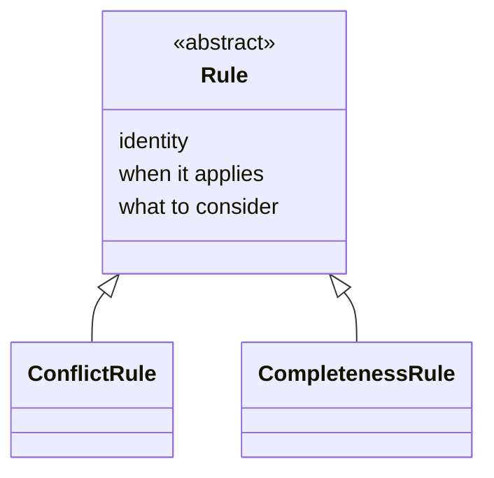
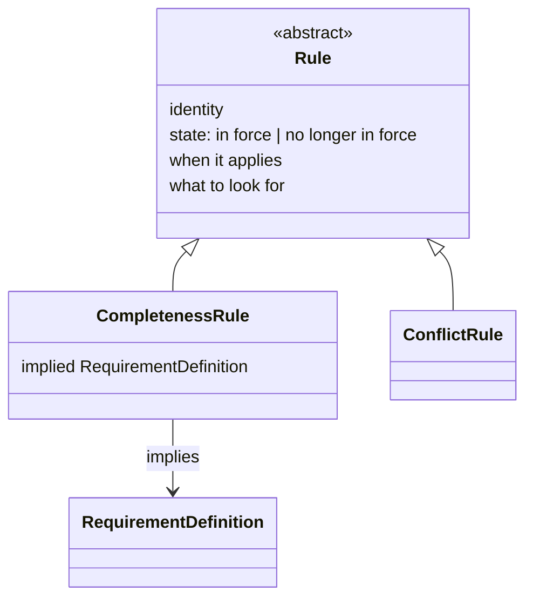
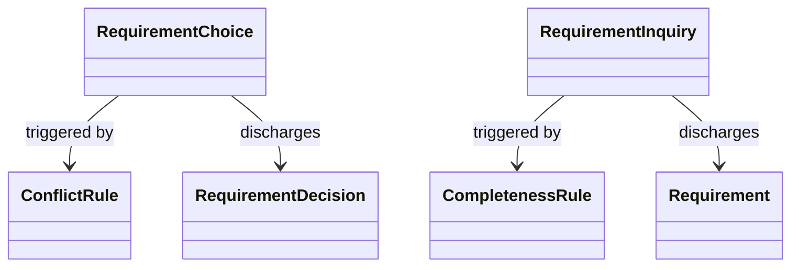
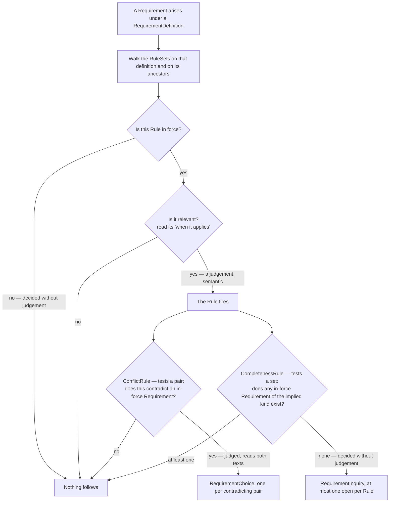

# Integrate the `Rule` specialisations (K90–K98) into `spec/` — Implementation Plan

> **For agentic workers:** REQUIRED SUB-SKILL: Use superpowers:subagent-driven-development (recommended) or
> superpowers:executing-plans to implement this plan task-by-task. Steps use checkbox (`- [ ]`) syntax for
> tracking.

**Goal:** Write K90–K98 into `spec/` — the range axis that fixes what a `Rule` specialisation is, the
corrected common shape with its in-force state, `ConflictRule`'s emptiness and the removal of the universal
contradiction check, `CompletenessRule`'s typed implication, three diagrams, and a syntactic-constraints
section `spec/03` does not yet have — narrowing OQ18 and OQ22 and opening OQ24–OQ26. This is prose and
diagrams, not code: a "test" for each task is a careful re-read for internal consistency, cross-reference
correctness, and conformance to `CLAUDE.md`, not a runnable suite.

**Architecture:** `spec/03-project-lifecycle-model.md` carries almost all of the change — §3's `RuleSet`,
`Rule`, `ConflictRule`, `CompletenessRule` and *Walking a `RuleSet`* subsections are each rewritten in part,
its class diagram is replaced and two more are added, and the document gains a new final section stating its
syntactic constraints. `spec/02-requirement-analysis-model.md` §11 has one paragraph rewritten.
`spec/06-decisions.md` gains K90–K100, narrows OQ18 and OQ22, and opens OQ24–OQ26. `CHANGELOG.md` records the
release note.

**Tech Stack:** Markdown, Mermaid diagrams (GitHub-rendered), git.

## Global Constraints

- **English only, no exception** (CLAUDE.md §5). Every sentence written by this plan is English.
- **No notation, no filled `RequirementDefinition`, nothing executable** (CLAUDE.md §1). K93 introduces a
  typed reference to a `RequirementDefinition`; no task may name a requirement kind, give an example
  definition, or write out what such a reference looks like (K15, K23). The metamodel says only that the
  reference exists.
- **The worked examples in the design record are illustrations inside prose, not filled definitions.** The
  catering conflict and the technician implication appear as sentences explaining a mechanism, exactly as
  *"no requirement may contradict an active one"* does today. No task may promote either into a table row, a
  named kind, or anything a reader could mistake for a declaration.
- **Where a diagram and the prose beside it disagree, the prose wins** (CLAUDE.md §5). Task 5 writes the two
  class diagrams and Task 6 the flowchart; each must be checked against the prose written by the tasks before
  it. An earlier plan in this repository shipped a diagram contradicting its own prose, and the reviewer
  caught it — do not repeat that.
- **"Attribute", not "field"** (CLAUDE.md §5).
- **Everything this plan writes is already decided**, in
  [`docs/superpowers/specs/2026-09-07-rule-specialisations-design.md`](../specs/2026-09-07-rule-specialisations-design.md)
  (K90–K98), except two structural questions that record's §9 explicitly delegates here, taken as K99 and
  K100 on the precedent K81 sets. This plan cites decisions by number rather than re-arguing them.
- **Four earlier decisions are revised, and each revision is stated openly rather than applied silently**:
  K90 supersedes K71's account of the specialisation axis; K91 renames K84's third attribute; K92 corrects
  K75's scope phrase but not its verdict; K98 replaces K73's canonical case and K69's illustration without
  changing either mechanism. The original rows in `spec/06-decisions.md` stay as taken — a decision record
  keeps its history, on the same terms K34 is kept beside K35 — and Task 9 adds the note pointing at the
  revisions.
- **Commit after every task. Never push** (CLAUDE.md §3, house rule 11).
- **What this plan does not do.** It does not enter OQ13, OQ21, or the remainder of OQ22. It gives neither
  OQ18 mechanism a shape in `spec/`: the silent-vs-owned-default and gap-timeout rules stay unwritten, and no
  task may add a third or fourth `Rule` specialisation. It changes nothing in `spec/04-value-states.md`, whose
  gap OQ25 names deliberately without filling.

---

### Task 1: `spec/03` §3 — the `Rule`'s common shape (K91, K97)

**Files:**
- Modify: `spec/03-project-lifecycle-model.md` — the `### \`Rule\`` subsection's attribute table and the two
  paragraphs after it

**Interfaces:**
- Consumes: nothing from an earlier task.
- Produces: the four-attribute shape and the name *what to look for*, which Tasks 2, 4, 5, 7 and 9 all use.

- [ ] **Step 1: Replace the attribute table's introduction and the table**

Replace:

```
`Rule` is **abstract**, and carries three things.

| Attribute | Carries |
|---|---|
| identity | Local to the `RequirementDefinition` that owns it; the full identifier is the composition of the two (K85) |
| when it applies | One sentence stating when this rule is relevant. Prose, not an evaluable expression, on the same terms `02-requirement-analysis-model.md` §7's own *when it applies* is prose (D20) |
| what to consider | The subject this rule raises: what has to be dealt with, never what the answer should be (K83, K84) |
```

with:

```
`Rule` is **abstract**, and carries four things, read by the walk below in this order.

| Attribute | Carries |
|---|---|
| identity | Local to the `RequirementDefinition` that owns it; the full identifier is the composition of the two (K85) |
| state | One of "in force" or "no longer in force". Read mechanically, before anything is judged (K97) |
| when it applies | One sentence stating when this rule is relevant. Prose, not an evaluable expression, on the same terms `02-requirement-analysis-model.md` §7's own *when it applies* is prose (D20) |
| what to look for | What this rule seeks in the model: what has to be found, never what the answer should be (K83, K91) |
```

- [ ] **Step 2: Replace the paragraph explaining the two prose attributes**

Replace:

```
**The two prose fields are split so that the judgement below reads one of them rather than the whole rule.**
Neither form is coined: a `RequirementDefinition` already carries a *when it applies* on exactly these terms,
and a *what to ask* that raises a missing parameter where *what to consider* raises a missing subject, one
level up. House rule 10 is met by adopting this collection's own established forms rather than inventing a
third.
```

with:

```
**The two prose attributes are split so that the judgement below reads one of them rather than the whole
rule.** Neither form is coined: a `RequirementDefinition` already carries a *when it applies* on exactly
these terms, and a *what to ask* one level up. House rule 10 is met by adopting this collection's own
established forms rather than inventing a third.

**The second is named for what it seeks, not for what it raises** (K91). Where a rule looks for something
**absent**, what it is looking for and what somebody must then deal with are one sentence — which is why an
earlier reading described this attribute as the subject a rule raises. Where a rule looks for a **present**
clash, the two come apart: the rule states what counts as a contradiction, while the subject anybody deals
with is the particular pair found, which is instance-side and sits on the `RequirementChoice` the firing
raises. The subject-reading is a special case of the seeking-reading, so the attribute common to every rule
is named for the general one.
```

- [ ] **Step 3: Add the in-force paragraphs after the identity paragraph**

After the paragraph beginning `**The identity is local because the attachment already is.**`, insert:

```
**A `Rule` is never deleted; it is taken out of force** (K97). It carries one of "in force" or "no longer in
force", on exactly the terms `01-requirement-model.md` §3 and `02-requirement-analysis-model.md` §10 already
hold a requirement to (K5) — the vocabulary is that one rather than a synonym coined beside it. The reason is
`02-requirement-analysis-model.md` §11's own: every `RequirementQuestion` names the `Rule` that produced it,
without exception, and one naming none is not a well-formed element at all (K87). A deletable `Rule`
withdraws the target of that reference, taking back the strongest thing this collection says about a
question's cause — that it is not merely guaranteed to exist but named.

**Taking a rule out of force is the project manager's act, never the modeller's.** This is the mirror of what
this subsection already states in the other direction: adopting a rule commits the project to checking it,
and what commits the project is the project manager's to do. The modeller does not *skip* a rule that is no
longer in force — it never reaches them, filtered out by the same walk that selects which `RuleSet`s reach a
requirement at all.

**A state is not provenance, and K88 below is untouched.** What caused a rule to be adopted or retracted
stays outside this model and enters, like every commitment, as a source (K11). The *fact* is recorded here
because the walk cannot run without reading it and because K87 needs the rule to persist; the *cause* stays
where K88 puts it.

**A rule leaving force does not close the questions it raised.** Retraction is not an answer, and an open
question stands until something closes it the ordinary way. Where the answer is that the project needs
nothing in the subject, that is a full answer and appears as a `Requirement` like any other (K83) — a path
resting on premises `06-decisions.md` records as OQ26.
```

- [ ] **Step 4: Re-read the whole `Rule` subsection**

Confirm three things: no sentence still calls the third attribute *what to consider*; the attribute table's
row order matches the order the four are described in; and nothing in the subsection now claims a `Rule`
carries three things.

- [ ] **Step 5: Commit**

```bash
git add spec/03-project-lifecycle-model.md
git commit -m "$(cat <<'EOF'
Give Rule its in-force state and rename its third attribute (K91, K97)

Co-Authored-By: Claude Opus 5 <noreply@anthropic.com>
EOF
)"
```

---

### Task 2: `spec/03` §3 — the range axis, and attachment against range (K90, K92)

**Files:**
- Modify: `spec/03-project-lifecycle-model.md` — the two paragraphs at the end of the `### \`Rule\``
  subsection, beginning `` `Rule`'s specialisations divide by **mechanism** ``

**Interfaces:**
- Consumes: Task 1's four-attribute shape and the name *what to look for*.
- Produces: the pair/set axis every later task's prose depends on, and the attachment-against-range statement
  Task 4 relies on.

- [ ] **Step 1: Replace both paragraphs**

Replace:

```
`Rule`'s specialisations divide by **mechanism** — what happens when the rule fires — not by section 2's four
descriptive rows, which remain a description of *subject matter*, closer to an open, `Source.kind`-shaped label
than to a type boundary (K71). The two axes are independent and do not correlate one-to-one: two different
subject-matter rows below share the same mechanism shape — *detect a gap, then raise a `RequirementQuestion`
subtype* — while the other two have no worked-out mechanism at all, and may turn out to need something
structurally different, from each other as much as from these two.

Two mechanisms are worked out here: `ConflictRule` and `CompletenessRule`, below. Two more — a
silent-vs-owned-default rule and a gap-timeout rule, section 2's first and second rows — are not, and this
document does not claim they share this shape merely because they would sit in the same abstract type's
specialisation list; whether either does is recorded as OQ18 in `06-decisions.md` (K72).
```

with:

```
**A `Rule` specialisation is fixed by what its firing test ranges over, and every other difference between
specialisations follows from it** (K90). `ConflictRule` tests a **pair** — the requirement that arose against
one already in force. `CompletenessRule` tests a **set** — the requirements the implied kind would have to
appear among. Section 2's four descriptive rows are not this axis and never were: they remain a description
of *subject matter*, closer to an open, `Source.kind`-shaped label than to a type boundary (K71), and they
predict a mechanism in neither direction.

Each consequence below is derived rather than stipulated. A pairwise test has both elements present when it
fires, so there is something to choose between: it yields alternatives, hence a `RequirementChoice`; each
pair is its own case, hence as many open questions as there are pairs; and deciding whether one requirement
contradicts another reads both texts, hence a judgement. A set-level test finds something **absent**, so
there is nothing to choose between: it yields a gap, hence a `RequirementInquiry` carrying nothing beyond the
shared shape; the gap is one property of the whole set, hence at most one open at a time; and deciding
whether any requirement of a kind exists reads no text at all, hence no judgement.

**One sentence accounts for what each specialisation carries, and for the inversion between the two sides.**
On the question side, `RequirementChoice` carries something extra and `RequirementInquiry` carries nothing
(`02-requirement-analysis-model.md` §11, K80); on the rule side this reverses. The reason is that **an
absence must be named in advance, where a presence can be read at firing time**: a pairwise rule needs to
carry nothing, because at firing both elements stand in the model, while a set-level rule must name its
target in advance, because the target is not there to be read.

**A `Rule`'s attachment determines what *triggers* it, not what its test ranges over** (K92). The inheritance
above says which requirements bring a rule into play; the test then ranges over the project model. The two
cannot be the same thing: a rule stated on one `RequirementDefinition` may look for requirements produced
under another, anywhere in the specialisation tree, and searching only the owner's own subtree would find
nothing in any project. This corrects the reach the `CompletenessRule` subsection below once stated for its
own check (K75), not that check's set-level verdict.

Two specialisations are worked out here: `ConflictRule` and `CompletenessRule`, below. Two more — a
silent-vs-owned-default rule and a gap-timeout rule, section 2's first and second rows — are not. Placed on
this axis, each ranges over something neither of the worked two does — a single value, and an open question
together with elapsed time — and each is held by a prerequisite the collection does not yet meet; both are
recorded as OQ18 in `06-decisions.md` (K72, K90).
```

- [ ] **Step 2: Check the forward references**

The replacement refers to `RequirementChoice` and `RequirementInquiry` before the subsections that describe
each firing. That matches how the subsection already read. Confirm that no sentence in the replacement
asserts something the `ConflictRule` or `CompletenessRule` subsections have not yet been rewritten to say —
Tasks 3 and 4 do that, and a reviewer reading only up to here should find forward references, not
contradictions.

- [ ] **Step 3: Commit**

```bash
git add spec/03-project-lifecycle-model.md
git commit -m "$(cat <<'EOF'
State the range axis that fixes a Rule specialisation, and separate attachment from range (K90, K92)

Co-Authored-By: Claude Opus 5 <noreply@anthropic.com>
EOF
)"
```

---

### Task 3: `spec/03` §3 — `ConflictRule`, and the removal of the universal check (K96, K98)

**Files:**
- Modify: `spec/03-project-lifecycle-model.md` — the `### \`ConflictRule\`` subsection, and the last sentence
  of the `### \`RuleSet\`` subsection's inheritance paragraph

**Interfaces:**
- Consumes: Task 2's axis and its absence/presence sentence.
- Produces: the catering canonical case and the technician illustration, both of which Task 9's K98 entry
  records.

- [ ] **Step 1: Replace the `RuleSet` subsection's illustration**

In the paragraph beginning `**A \`Rule\` attached to a \`RequirementDefinition\` applies to every
specialisation of it**`, replace the final sentence:

```
A project's most consequential rules — *"no requirement may contradict an active one,"* below — belong at the
root precisely because they should reach every kind a project declares, without being restated once per leaf
kind.
```

with:

```
A rule that should reach every kind beneath some point belongs at that point rather than being restated once
per leaf kind: a project holding that every technical requirement implies a requirement for somebody to
operate what it describes states that once, high in the tree, and every technical kind inherits it.
```

- [ ] **Step 2: Replace the `ConflictRule` subsection entirely**

Replace:

```
A `ConflictRule` fires when a new `Requirement` contradicts an existing in-force one, and raises a
`RequirementChoice` (`02-requirement-analysis-model.md` §11) naming the alternatives a reviewer must choose
among (K73). *"No requirement may contradict an active requirement,"* stated once at the `RequirementDefinition`
root and inherited everywhere by the rule above, is this mechanism's canonical case. This sharpens section 2's
third row — *how a conflict of a given kind is resolved* — which describes only the resolution half;
detection is the other half a `Rule` must also carry, and resolution is exactly what a `RequirementChoice`,
discharged by a `RequirementDecision`, records.
```

with:

```
A `ConflictRule` fires when a `Requirement` that has arisen contradicts one already in force, and raises a
`RequirementChoice` (`02-requirement-analysis-model.md` §11) naming the alternatives a reviewer must choose
among (K73). Its canonical case is a conflict **between two kinds**, on terms somebody had to state because
nothing in the model could find them: a requirement for catering whose headcount falls short of a requirement
stating how many people are expected. Neither requirement is wrong on its own, no parameter they share is in
dispute, and the relation between the two kinds is exactly what the rule carries. This sharpens section 2's
third row — *how a conflict of a given kind is resolved* — which describes only the resolution half;
detection is the other half a `Rule` must also carry, and resolution is exactly what a `RequirementChoice`,
discharged by a `RequirementDecision`, records.

**A `ConflictRule` carries nothing beyond the shape every `Rule` has** (K96). This asks to be justified rather
than merely stated, because both specialisations relate two requirement kinds and only the other one names
its partner in a typed reference. The difference is the one the axis above draws: a `ConflictRule`'s partner
is **present** when the rule fires, and the judgement reads it anyway, so naming that partner in the prose of
*what to look for* is sufficient. Narrowing mechanically what must be examined before the judgement runs is a
guard, and belongs to the question `06-decisions.md` records as OQ21 rather than to this type.

**There is no universal contradiction rule, and this model states none** (K98). A rule holding that no
requirement may contradict an in-force one — stated once at the root and inherited everywhere — reads as this
mechanism's most obvious case and is not a `Rule` at all. Every one of the four attributes above degenerates
on it: *when it applies* is "always"; *what to look for* restates the type's own name; its state could never
be anything but in force; and its identity exists only so that a question has something to name. Four vacuous
attributes is not a badly written rule but the mark of something that is not one, because a rule-set states
how **this project** works, and this is true of every project and carries no content.

**What such a rule would have covered is already covered, three ways.** Where two sources disagree about the
same thing, the value-state model carries it and needs no rule: `04-value-states.md` §2's **conflicting**
state holds the competing values, each with its source. Where two different kinds are incompatible on terms
somebody had to state, that is a `ConflictRule` — the case above. Whatever neither covers requires judgement
and follows no procedure, which makes it a review, the third of the checking modes
`02-requirement-analysis-model.md` §11 names. **No fourth checking mode is needed**, and introducing one here
would add a construct nothing exercises.
```

- [ ] **Step 3: Re-read section 2's third row and section 4**

Neither changes. Confirm that section 2's third row — *"How a conflict of a given kind is resolved"* — still
reads correctly with the universal case gone (it does: it was always about conflicts of a given kind, which
is the cross-kind case), and that section 4's list of what a rule-set states does not name the removed rule.

- [ ] **Step 4: Commit**

```bash
git add spec/03-project-lifecycle-model.md
git commit -m "$(cat <<'EOF'
Shape ConflictRule and remove the universal contradiction check (K96, K98)

Its four attributes all degenerate. What it covered divides among the
conflicting value state, a cross-kind ConflictRule, and review.

Co-Authored-By: Claude Opus 5 <noreply@anthropic.com>
EOF
)"
```

---

### Task 4: `spec/03` §3 — `CompletenessRule` (K93, K94, K95)

**Files:**
- Modify: `spec/03-project-lifecycle-model.md` — the `### \`CompletenessRule\`` subsection

**Interfaces:**
- Consumes: Task 2's axis, its absence/presence sentence, and its attachment-against-range statement.
- Produces: the implied-`RequirementDefinition` reference that Task 5's diagram draws and Task 7's constraint
  fails on.

- [ ] **Step 1: Replace the subsection's first two paragraphs**

Replace:

```
A `CompletenessRule` fires when a `RequirementDefinition` kind is present without an implied companion kind, and
raises a `RequirementInquiry` (`02-requirement-analysis-model.md` §11) (K74). This is the case section 2's
fourth row now states directly: *"which other requirement kinds a given kind implies should also be
present."*

**The check is set-level, not per-instance.** It asks whether at least one `Requirement` of the implied kind
exists anywhere the rule's `RequirementDefinition` reaches, never whether every triggering `Requirement` has its own
(K75).
```

with:

```
A `CompletenessRule` fires when a `RequirementDefinition` kind is present without an implied companion kind, and
raises a `RequirementInquiry` (`02-requirement-analysis-model.md` §11) (K74). This is the case section 2's
fourth row now states directly: *"which other requirement kinds a given kind implies should also be
present."*

**A `CompletenessRule` names the kind it implies, by a reference to a `RequirementDefinition`, beside the
prose of *what to look for*** (K93). This is the one place a `Rule` carries a typed reference, and it is
necessary rather than merely permitted: the implied kind is **absent** when the rule fires, so nothing about
it can be read from the model, and a rule that had not named it in advance could not run its own test. It
opens no second seam, `RequirementDefinition` being an element this metamodel defines
(`02-requirement-analysis-model.md` §7) rather than one a design language supplies — which is the whole
difference between this reference and the candidate §8 of that document rejects. What the metamodel states is
that the reference exists; **which** definition any rule names is a project's business, on the same terms as
everything else a rule-set holds.

**Exactly one implied `RequirementDefinition` per `CompletenessRule`** (K94). A kind implying several
companions is several rules, not one rule naming several kinds. The reason is machinery already in place
rather than tidiness: at most one `RequirementInquiry` per rule is open at a time, and `discharges` names
exactly one `Requirement` (`02-requirement-analysis-model.md` §11, §12). A rule naming five implied kinds,
three of them missing, would open one inquiry covering three gaps, which no single `Requirement` could
discharge and nothing could therefore close. Separate rules also give the behaviour anybody would want: where
one implied kind is present and another is not, one question opens rather than several.

**The check is set-level, not per-instance.** It asks whether at least one **in-force** `Requirement`
produced under the implied `RequirementDefinition`, **or under any specialisation of it**, exists **in the
project model** — never whether every triggering `Requirement` has its own (K75, K95). All three
qualifications carry weight. *In force*, because a retired requirement stays in the model
(`02-requirement-analysis-model.md` §10, K5) and does not fill a gap. *Or any specialisation*, because the
definition tree is a kind hierarchy, so a more specific kind satisfies a more general implication. *In the
project model*, which is the separation stated above: the owner's subtree is where a rule is triggered, never
where its target is found.
```

- [ ] **Step 2: Add the two limit paragraphs at the end of the subsection**

After the paragraph ending `without anything needing to be closed by hand.`, append:

```
**What the set-level reading cannot express, said where a reader will need it.** One in-force requirement of
the implied kind anywhere satisfies the rule for every triggering requirement, and this model has no way to
say that each of them needs its own. That is deliberate, taken against a growing model re-triggering the same
rule combinatorially. Where per-instance behaviour is actually wanted, it is obtained by refining the implied
kind rather than by changing the check: a rule stated further down the tree implies a more specific companion
kind, and the set-level question then asks the narrower thing.

**The same move marks the limit on what a rule may imply at all.** A rule may imply a more specific kind
wherever an implementation declares one; it may never state what a requirement of the implied kind should
say. **An implied kind, yes; an implied parameter value, never.** That line is what keeps a rule-set from
becoming a second definition layer, and it is the same one the `Rule` subsection above draws in saying a rule
never states what the resulting requirement should say (K83).
```

- [ ] **Step 3: Confirm the reach phrase is gone**

Search the subsection for the phrase `anywhere the rule's` — Step 1 removes its only occurrence, and K92 in
Task 2 is what makes the removal correct. If it survives anywhere in the file, the file contradicts itself.

- [ ] **Step 4: Commit**

```bash
git add spec/03-project-lifecycle-model.md
git commit -m "$(cat <<'EOF'
Shape CompletenessRule: one typed implied definition, and the query in full (K93, K94, K95)

Co-Authored-By: Claude Opus 5 <noreply@anthropic.com>
EOF
)"
```

---

### Task 5: `spec/03` §3 — the two class diagrams

**Files:**
- Modify: `spec/03-project-lifecycle-model.md` — §3's opening Mermaid diagram and the paragraph beneath it;
  the end of the `### \`CompletenessRule\`` subsection

**Interfaces:**
- Consumes: Tasks 1–4's prose, which both diagrams must match exactly.
- Produces: nothing later tasks read.

- [ ] **Step 1: Replace §3's opening diagram and the paragraph under it**

Replace:

````


The diagram draws what this section states; where the two disagree, the prose wins. Two more `Rule`
specialisations are named but not yet shaped — see the `Rule` subsection below — and are left off the diagram for
the same reason a design record leaves an open question out of a decision table: nothing here defines them
yet.
````

with:

````


The diagram draws what this section states; where the two disagree, the prose wins. `ConflictRule` carries
nothing of its own, which is a decision rather than an omission and is argued in its own subsection below.
Two further `Rule` specialisations are named but not shaped — see the `Rule` subsection — and are left off the
diagram for the same reason a design record leaves an open question out of a decision table: nothing here
defines them yet.
````

- [ ] **Step 2: Add the second diagram at the end of the `CompletenessRule` subsection**

After the two paragraphs Task 4 appended, add:

````
### What each firing produces



The diagram draws what this section and `02-requirement-analysis-model.md` §11 state between them; where a
diagram and the prose disagree, the prose wins. **The edge directions are the point.** There is no *raises*
edge in this model: a `RequirementQuestion` carries *triggered by* toward its `Rule`, so nothing leads from a
rule down to the questions it produced. They are found by querying, exactly as the requirements produced under
a definition are.
````

- [ ] **Step 3: Check both diagrams against the prose**

For the first: four attributes on `Rule` in the order Task 1's table gives them, `ConflictRule` empty,
`CompletenessRule` carrying exactly one thing. For the second: every edge named in it is named in prose
somewhere, and no edge appears that the prose does not state.

- [ ] **Step 4: Commit**

```bash
git add spec/03-project-lifecycle-model.md
git commit -m "$(cat <<'EOF'
Redraw the Rule class diagram and add one for what each firing produces

Co-Authored-By: Claude Opus 5 <noreply@anthropic.com>
EOF
)"
```

---

### Task 6: `spec/03` §3 — walking a `RuleSet`, and its diagram

**Files:**
- Modify: `spec/03-project-lifecycle-model.md` — the `### Walking a \`RuleSet\`` subsection

**Interfaces:**
- Consumes: Tasks 1–4's prose; the flowchart must match all of it.
- Produces: nothing later tasks read.

- [ ] **Step 1: Insert the mechanical gate into the opening paragraph**

Replace:

```
When a new requirement arises in a subject, the `RuleSet`s that reach it are walked, and a reader — human or
AI — judges which entries are relevant by reading each rule's *when it applies*.
```

with:

```
When a new requirement arises in a subject, the `RuleSet`s that reach it are walked. A rule no longer in
force is passed over without anything being read (K97); of the rest, a reader — human or AI — judges which
are relevant by reading each rule's *when it applies*.
```

- [ ] **Step 2: Add the two-step statement and the diagram at the end of the subsection**

After the paragraph beginning `**Which \`RuleSet\`s reach a requirement needs no new concept.**`, append:

````
**Two steps happen here, and only the first is common to every rule.** Judging relevance reads *when it
applies* and is the same act whatever the rule is. What follows when a rule is found relevant — the firing —
differs by specialisation, and is not uniformly a judgement: a `ConflictRule`'s test reads two requirements'
texts and cannot be decided without doing so, where a `CompletenessRule`'s asks whether a requirement of some
kind exists and reads no text at all. The semantic classification above holds because of the first step,
which every walk runs; it does not follow that everything after it is judged.



The diagram draws what this section states; where the two disagree, the prose wins. **It draws this model's
own mechanism and not a project's way of working**: who walks a `RuleSet`, when, how often, and how that sits
beside a review are deliberately unstated here, and section 5 says why. Nothing in it promises the walk runs
exhaustively or automatically — the paragraph above already refuses that guarantee, and the diagram is read
under it.
````

- [ ] **Step 3: Check the diagram against the prose it sits under**

Three things: the two decision diamonds after firing match the tests Tasks 3 and 4 wrote; `Nothing follows`
is reachable from exactly three places, which is what the prose above accounts for; and no node introduces a
step no sentence states.

- [ ] **Step 4: Commit**

```bash
git add spec/03-project-lifecycle-model.md
git commit -m "$(cat <<'EOF'
State the relation between judging relevance and firing, and draw the walk

Co-Authored-By: Claude Opus 5 <noreply@anthropic.com>
EOF
)"
```

---

### Task 7: `spec/03` — a syntactic-constraints section (K99)

**Files:**
- Modify: `spec/03-project-lifecycle-model.md` — append a new section 6 at the end of the file

**Interfaces:**
- Consumes: Tasks 1–4's prose, which every constraint cites.
- Produces: the section Task 9's K99 entry records.

**Why here and why last.** `spec/01` §5 and `spec/02` §12 each state their document's syntactic constraints
in one place, and each is that document's final section. `spec/03` has never had one because it defined no
elements carrying constraints; K93, K94 and K97 give it several. Following the two siblings — a section of
the same shape, placed last — costs no renumbering, since nothing in the repository cites `spec/03` §4 or §5.
Recorded as K99, this plan's own structural decision on the precedent K81 sets, the design record having left
it here deliberately.

- [ ] **Step 1: Append the section**

At the end of the file, add:

```
## 6. The syntactic constraints of this model

K24 divides constraints over the collection in two: a syntactic constraint refers only to elements the
metamodel defines and is decidable without judgement, where a semantic one judges content and is a matter for
review. This section states the syntactic constraints over the elements this document defines, in the shape
`01-requirement-model.md` §5 and `02-requirement-analysis-model.md` §12 use for their own. Each was argued in
section 3 beside the element it refers to, and is given here in one line so that the set is visible at once.
None of them reads the content of anything.

**Over `RuleSet`.**

- Exactly one `RuleSet` belongs to each `RequirementDefinition`. It may be empty, and an empty one is not a
  defect (§3, K82).

**Over `Rule`, and every specialisation of it.**

- A `Rule`'s identity is unique among the `Rule`s of the `RuleSet` that owns it. Its full identifier is the
  composition of that identity with its owner's, and how that composition is written down is an
  implementation's business (§3, K85).
- No element is a `Rule` and nothing more: every `Rule` in a model is an instance of `ConflictRule` or
  `CompletenessRule` (§3, K90).
- A `Rule` carries exactly one of "in force" or "no longer in force" at any time — never both, and never
  neither. This mirrors the constraint `02-requirement-analysis-model.md` §12 states over a requirement, and
  for the same reason: neither element is ever deleted (§3, K5, K97).
- A `Rule` states what to look for. A `Rule` without one seeks nothing and cannot fire, so its absence is a
  failed check on the `Rule` itself (§3, K84, K91).

**Over `CompletenessRule`.**

- A `CompletenessRule` names exactly one implied `RequirementDefinition`. Naming none, or naming more than
  one, is a failed check: with none the rule cannot run its own test, and with more than one the
  `RequirementInquiry` it raises could not be discharged (§3, K93, K94).

**One rule over these elements reports rather than fails.** **A `Rule` that does not say when it applies is
reported as a question, not a failed check.** This is exactly the position
`02-requirement-analysis-model.md` §12 takes over a `RequirementDefinition`'s own *when it applies*, held for
the same reason (K36): an unwritten applicability is a gap rather than a claim that the rule is always
relevant, and the honest report is that nobody has written it down. It is the only rule in this document that
reports rather than fails, and the contrast with the constraint over *what to look for* is the point — a rule
seeking nothing is a defective record, where a rule whose relevance nobody stated is an incomplete one.

**What is not stated here, and why the omission is deliberate.** No constraint requires a `ConflictRule` to
carry anything of its own, because it carries nothing (§3, K96) — and no constraint is written over a `Rule`'s
provenance, because it has none to check (§3, K88).
```

- [ ] **Step 2: Check every citation**

Each parenthesis names §3 and at least one K number. Confirm each K number is one the file's section 3 now
actually states, and that no constraint here says something section 3 does not.

- [ ] **Step 3: Commit**

```bash
git add spec/03-project-lifecycle-model.md
git commit -m "$(cat <<'EOF'
Give spec/03 a syntactic-constraints section, matching spec/01 and spec/02 (K99)

Co-Authored-By: Claude Opus 5 <noreply@anthropic.com>
EOF
)"
```

---

### Task 8: `spec/02` §11 — the two worked mechanisms, and OQ18

**Files:**
- Modify: `spec/02-requirement-analysis-model.md` — the paragraph beginning `**Two mechanisms are worked out,
  and the rest are open.**` in §11

**Interfaces:**
- Consumes: Tasks 3 and 4's rewritten subsections.
- Produces: nothing later tasks read.

- [ ] **Step 1: Replace the paragraph**

Replace:

```
**Two mechanisms are worked out, and the rest are open.** A conflict between a new `Requirement` and an
existing in-force one is `03-project-lifecycle-model.md` §3's `ConflictRule`, raising a `RequirementChoice`.
A `Requirement` whose kind implies that another kind should also exist is that section's `CompletenessRule`,
raising a `RequirementInquiry` — this was OQ17's own original case, now answered. Two further rule-set
statements — whether a silent default must be owned, and when a gap's wait becomes a decision — do not yet
have a worked mechanism, and whether either raises a `RequirementQuestion` the same way, or needs something
structurally different, is recorded as OQ18 in `06-decisions.md`.
```

with:

```
**Two mechanisms are worked out, and the rest are open.** A `Requirement` incompatible with one already in
force, on terms a project had to state because the two are of different kinds, is
`03-project-lifecycle-model.md` §3's `ConflictRule`, raising a `RequirementChoice`; where instead two sources
disagree about the same thing, no rule is involved at all and `04-value-states.md` §2's **conflicting** state
carries it. A `Requirement` whose kind implies that another kind should also exist is that section's
`CompletenessRule`, raising a `RequirementInquiry` — this was OQ17's own original case, now answered. Two
further rule-set statements — whether a silent default must be owned, and when a gap's wait becomes a
decision — do not yet have a worked mechanism; neither shares this "detect, then raise" shape, and each is
held by a prerequisite named in `06-decisions.md` under OQ18.
```

- [ ] **Step 2: Check the rest of §11 and §12**

Two things stay as they are and must be confirmed, not changed. §12's constraint scoping *at most one open
`RequirementInquiry`* to a `CompletenessRule` is already correct and is what K90 derives. §11's statement
that a `RequirementDefinition`'s *what to ask* is not a second origin is unaffected, and Task 9's OQ25
depends on it still standing.

- [ ] **Step 3: Commit**

```bash
git add spec/02-requirement-analysis-model.md
git commit -m "$(cat <<'EOF'
Correct spec/02 §11's account of the conflict mechanism and of OQ18

Co-Authored-By: Claude Opus 5 <noreply@anthropic.com>
EOF
)"
```

---

### Task 9: `spec/06` — K90–K100, OQ18 and OQ22 narrowed, OQ24–OQ26 opened

**Files:**
- Modify: `spec/06-decisions.md` — a new decisions section after the `## Decisions K82–K89` block; the OQ18
  row in `## Open questions OQ18–OQ19`; the OQ22 row in `## Open questions OQ21–OQ23`; a new open-questions
  section at the end of the open-question sequence

**Interfaces:**
- Consumes: every earlier task.
- Produces: the record every earlier task's prose cites by number.

- [ ] **Step 1: Add the decisions section**

After the `## Decisions K82–K89` block and its closing note, insert this heading and paragraph:

```
## Decisions K90–K100

These come from
[`docs/superpowers/specs/2026-09-07-rule-specialisations-design.md`](../docs/superpowers/specs/2026-09-07-rule-specialisations-design.md),
which gives the `Rule` specialisations the shape the record before it deliberately left them without, and
from the plan that wrote them into `spec/`. They were reached by asking where `ConflictRule` and
`CompletenessRule` had come from at all — a question the corpus answered badly, the two having been measured
and exampled rather than derived.
```

then a table with one row per decision:

| # | Decision | Reason |
|---|---|---|
| K90 | A `Rule` specialisation is fixed by what its firing test ranges over — `ConflictRule` a pair, `CompletenessRule` a set — and every other difference follows from it. This supersedes K71's account of the axis | K71 divided the specialisations "by mechanism" while the same paragraph said both share one mechanism shape, which cannot both hold. The range makes each difference derivable rather than stipulated: what is chosen among, how many questions may stand open, and whether the firing is a judgement at all |
| K91 | `Rule`'s third attribute is *what to look for*, renaming K84's *what to consider* | K84's description — the subject a rule raises — is exact where the thing sought is an absence, because there the two readings are one sentence, and false where it is a present clash. The subject-reading is the special case, so the common attribute is named for the general one |
| K92 | A `Rule`'s attachment determines what triggers it, not what its test ranges over. This corrects K75's reach phrase, not its set-level verdict | A rule may look for requirements produced under a definition nowhere in its owner's subtree, so a test confined to that subtree would find nothing in any project and the rule would fire always |
| K93 | A `CompletenessRule` names the kind it implies by a typed reference to a `RequirementDefinition` | Necessary rather than merely admissible: the implied kind is absent when the rule fires, so nothing about it can be read and it must be named in advance. The seam test passes, `RequirementDefinition` being metamodel-defined, which is the whole difference from the candidate K28 rejects; the record test passes and is load-bearing |
| K94 | Exactly one implied `RequirementDefinition` per `CompletenessRule` | Forced by K75 and by `discharges` naming exactly one `Requirement`: a rule naming several implied kinds, more than one missing, would open a single inquiry no single requirement could discharge |
| K95 | The completeness query asks whether at least one in-force `Requirement` produced under the implied definition, or any specialisation of it, exists in the project model | Each qualification carries weight: a retired requirement does not fill a gap (K5); a more specific kind satisfies a more general implication (K30); and the range is the model, not the owner's subtree (K92) |
| K96 | A `ConflictRule` carries nothing beyond the common shape | Its partner is present when it fires and the judgement reads it anyway, so prose suffices. A typed reference here would narrow mechanically what reaches judgement, which is OQ21's guard and belongs there |
| K97 | A `Rule` is never deleted; it carries one of in force or no longer in force, and taking one out of force is the project manager's act | A deletable `Rule` withdraws the target of K87's mandatory *triggered by*, taking back the claim that a question's cause is named. The vocabulary is K5's rather than a synonym beside it. K88 is untouched: a state is not provenance, and the cause of a retraction still enters as a source under K11 |
| K98 | The universal check — no requirement may contradict an in-force one — is not a `Rule`, and this model states none. What it covered divides among the conflicting value state, a cross-kind `ConflictRule`, and review. K73's canonical case and K69's illustration are replaced; neither mechanism changes | All four of a `Rule`'s attributes degenerate on it, which marks something that is not a rule rather than a badly written one. Its first destination is decisive on its own: it duplicated, one level up, a mechanism `04-value-states.md` already had. No fourth checking mode is needed, K89 having already named the one that fits |
| K99 | `spec/03-project-lifecycle-model.md` gains a syntactic-constraints section as its final section, in the shape `01-requirement-model.md` §5 and `02-requirement-analysis-model.md` §12 use | K93, K94 and K97 give the document constraints it never had. Following the two siblings costs no renumbering, nothing in the repository citing that document's §4 or §5. This is the plan's own structural decision, which the design record left to it deliberately, recorded here on the precedent K81 sets |
| K100 | OQ22 is narrowed to one remaining part. K90 answers whether one firing yields one question or several — one per pair for a `ConflictRule`, at most one for a `CompletenessRule` — and answers whether K75's at-most-one is general or specific to `CompletenessRule`, by deriving it from the set-level range. What stays open is whether *what to look for* supplies a template for the question's wording | Both answered parts fall out of K90 rather than being decided separately, which is why they are recorded as a narrowing here rather than as decisions of their own. Also this plan's own, on K81's precedent |

Follow the table with this closing note:

```
Together they narrow OQ18 and OQ22 and open OQ24–OQ26. Four earlier decisions are revised: K90 supersedes
K71's account of the specialisation axis; K91 renames K84's third attribute; K92 corrects K75's statement of
what its check ranges over, leaving its set-level verdict intact; and K98 replaces K73's canonical case and
K69's illustration without changing either mechanism. The superseded rows stay above as they were taken, on
the same terms K34 is kept beside K35.
```

- [ ] **Step 2: Replace the OQ18 row**

Replace the existing OQ18 row's question and timing cells with:

| OQ18 | What mechanism do a silent-vs-owned-default `Rule` and a gap-timeout `Rule` carry? Narrowed rather than answered: placed on K90's axis, neither ranges over a pair or a set, and neither shares the "detect, then raise a `RequirementQuestion`" shape. The first ranges over a single value, and its shape is derivable — fire on a value in the assumed state, mark it as one to ask about, raise no `RequirementQuestion`, since `02-requirement-analysis-model.md` §11 already routes a single parameter through the definition's own machinery — but it would rest on a construct with no stated cause, which is OQ25. The second ranges over an open question and elapsed time, and needs two things this collection lacks: a date on a `RequirementQuestion`, and an edge by which an escalation names what it escalated. Both are OQ13's | The first with OQ25, which is close and small. The second with OQ13, realistically phase 4 |

- [ ] **Step 3: Replace the OQ22 row**

Replace the existing OQ22 row's question and timing cells with:

| OQ22 | How does a fired rule become a posed question? Narrowed by K100: what remains is whether *what to look for* supplies a template for the question's wording, or the modeller writes it freely. The other two parts are answered — K90 gives one question per contradicting pair and at most one per `CompletenessRule`, the latter specific to that specialisation rather than general, and `03-project-lifecycle-model.md` §3 now states the relation between judging relevance and firing that this question was partly about | Unforced. What remains is a question about wording, which nothing exercises until an implementation writes questions for real |

- [ ] **Step 4: Add the new open-questions section**

At the end of the open-question sequence — after the OQ21–OQ23 block, and before
`## Status of the founding record's open questions` — add:

```
## Open questions OQ24–OQ26

All three were opened by the `Rule` specialisation work rather than by anything it settled. Each is recorded
where it was found rather than pursued, and the full argument for each is in
[`docs/superpowers/specs/2026-09-07-rule-specialisations-design.md`](../docs/superpowers/specs/2026-09-07-rule-specialisations-design.md).
```

followed by a table with these three rows:

| # | Question | When |
|---|---|---|
| OQ24 | When do two disagreeing sources produce one `Requirement` carrying a conflicting value, and when two `Requirement`s? K98's first destination assumes the former — `04-value-states.md` §2's **conflicting** state holding both competing values with their sources — and the model permits it without requiring it: `refine` is list-valued precisely so one requirement may be assembled from several statements (`02-requirement-analysis-model.md` §10), but nothing forbids two in-force requirements of the same kind carrying incompatible values. That would be a refinement error, and no stated rule catches it. It cannot become a syntactic constraint, because deciding whether two requirements are about the same thing is a judgement | Raised deliberately rather than settled inside K98, being a question about the derivation rather than about rules. It is the residue K98's third destination — review — would otherwise absorb silently |
| OQ25 | What produces `04-value-states.md` §2's marking of a value as one to ask about? The marking occurs once in the whole of `spec/` and nothing states its origin, which the rule that every event record its cause makes a defect however sensible it reads. Two origins are available — a modeller's judgement, and a `Rule` — and whether the marking is modelled or recomputed cannot be settled until it is known which applies when. That document permits stated, derived and conflicting values to be marked as well as assumed ones, so the question is not confined to defaults | Before OQ18's first half, which it blocks. Small, and close |
| OQ26 | Does K83's negative-answer path hold? K83 says a subject a rule raises may be answered negatively, and that the answer appears as a `Requirement` like any other, which the `RequirementInquiry` then `discharges` to. This rests on two premises the corpus never states: that "this project needs nothing here" obliges something, as K37 requires of every `SourceNeed`; and that some declared `RequirementDefinition` covers a negative statement, as K8 requires of every requirement. The second has a plausible answer — the implied kind's own definition — and the first may be false in a way that matters: a decision to need nothing reads more naturally as a `SourceDecision` refining into a `RequirementDecision`, and K79 fixes `RequirementInquiry`'s `discharges` on a `Requirement`, which would not admit it | Used by K97's statement that a retracted rule leaves its open questions to close the ordinary way, but never worked, so it is recorded rather than settled |

- [ ] **Step 5: Check the numbering**

Confirm K90–K100 are each used exactly once, that no earlier K number was reused, and that OQ24–OQ26 are each
used exactly once. Confirm the `## Status of the founding record's open questions` section, which stays last
in the file, is still last.

- [ ] **Step 6: Commit**

```bash
git add spec/06-decisions.md
git commit -m "$(cat <<'EOF'
Add K90-K100 to spec/06-decisions.md; narrow OQ18 and OQ22; open OQ24-OQ26

Co-Authored-By: Claude Opus 5 <noreply@anthropic.com>
EOF
)"
```

---

### Task 10: `CHANGELOG.md` — the release note

**Files:**
- Modify: `CHANGELOG.md` — append one entry to the same list the `Rule` shape entry sits in

**Interfaces:**
- Consumes: every earlier task.
- Produces: nothing.

- [ ] **Step 1: Append the entry**

Append, as the last item of the list the `Rule` shape entry sits in:

```
- The `Rule` specialisations given their own shape, and the axis that decides how many there are: a
  specialisation is fixed by what its firing test ranges over — `ConflictRule` a pair of requirements,
  `CompletenessRule` the set a kind would appear among — from which every other difference between them
  follows. `Rule` gains a fourth attribute, a state of in force or no longer in force, since a deletable rule
  would withdraw the target of the reference every `RequirementQuestion` must carry; its third attribute is
  renamed *what to look for*, the earlier name having generalised from one of the two cases. `ConflictRule`
  carries nothing of its own, and the universal check against contradicting an in-force requirement is
  removed as not being a rule at all — what it covered divides among the conflicting value state, a
  cross-kind `ConflictRule`, and review. `CompletenessRule` names exactly one implied `RequirementDefinition`
  by a typed reference, and its query is stated in full. Three diagrams are added or replaced, and
  `03-project-lifecycle-model.md` gains a syntactic-constraints section in the shape its two siblings use.
  K90–K100 record the decisions; OQ18 and OQ22 are narrowed, and OQ24–OQ26 opened. Findings are in
  [`docs/superpowers/specs/2026-09-07-rule-specialisations-design.md`](docs/superpowers/specs/2026-09-07-rule-specialisations-design.md).
```

- [ ] **Step 2: Check the entry against the file's own conventions**

The entries above it are prose paragraphs, not bullet fragments, and each names its design record by link.
Match that. Do not restate a K number's reasoning; the entry says what changed, not why.

- [ ] **Step 3: Commit**

```bash
git add CHANGELOG.md
git commit -m "$(cat <<'EOF'
Record the Rule specialisation integration in CHANGELOG

Co-Authored-By: Claude Opus 5 <noreply@anthropic.com>
EOF
)"
```

---

## Final check, after Task 10

Not a task and not committed on its own — a read-through before the branch is handed back.

- [ ] `spec/03` reads as one document: section 3's subsections do not contradict each other, and section 6's
  constraints all correspond to something section 3 states.
- [ ] The phrase *what to consider* survives nowhere in `spec/` except K84's own row in `spec/06`, which keeps
  its original wording as a decision taken.
- [ ] No sentence anywhere in `spec/` still asserts a universal rule against contradicting an in-force
  requirement.
- [ ] Every K number cited in `spec/02` and `spec/03` exists in `spec/06`.
- [ ] Three Mermaid diagrams render, and each agrees with the prose beside it.
