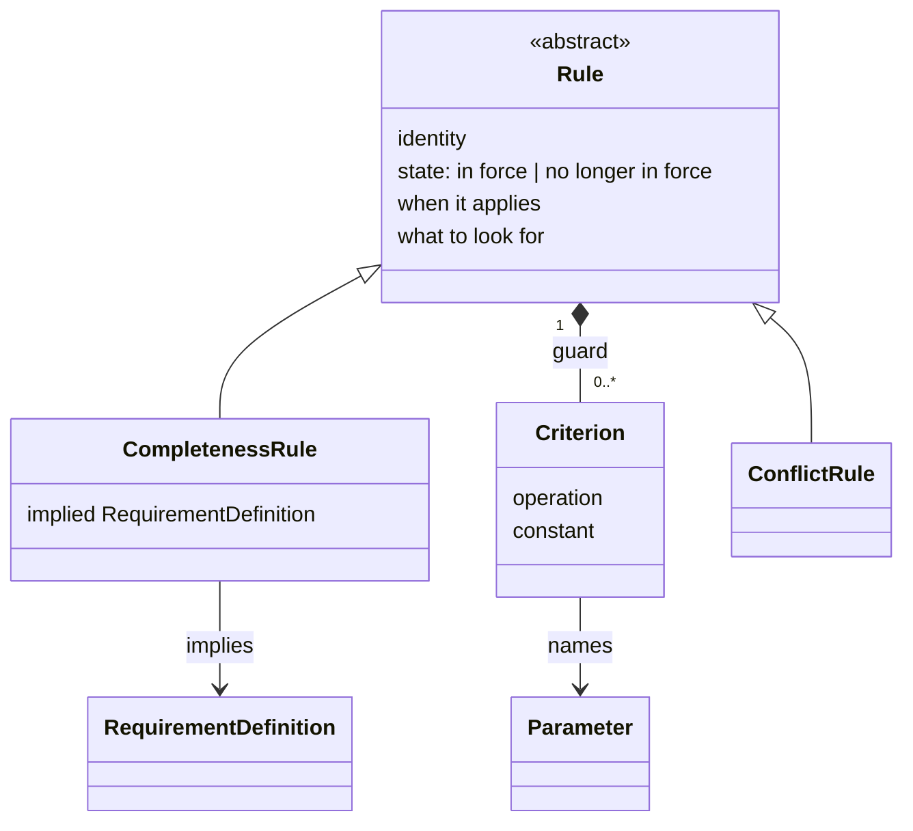

# Integrate value domain comparability and the guard (K101–K108) into `spec/` — Implementation Plan

> **For agentic workers:** REQUIRED SUB-SKILL: Use superpowers:subagent-driven-development (recommended) or
> superpowers:executing-plans to implement this plan task-by-task. Steps use checkbox (`- [ ]`) syntax for
> tracking.

**Goal:** Write K101–K108 into `spec/` — a value domain's comparability level in place of OQ27, the guard a
`Rule` may carry and its place in the walk in place of OQ21, and a parameter's local identity and additive
inheritance, narrowing OQ9 — and open OQ29. This is prose and diagrams, not code: a "test" for each task is a
careful re-read for internal consistency, cross-reference correctness, and conformance to `CLAUDE.md`, not a
runnable suite.

**Architecture:** `spec/04-value-states.md` §5 gains K101. `spec/02-requirement-analysis-model.md` gains K106
in §7, K107 and K108 in §9, and one constraint in §12. `spec/03-project-lifecycle-model.md` carries most of the
change: the guard in `Rule`'s shape and the §3 class diagram, the guard's step in *Walking a `RuleSet`* and its
flowchart, a pointer from `ConflictRule`, and two constraints in §6. `spec/06-decisions.md` records the
decisions and the questions; `CHANGELOG.md` the release note.

**Tech Stack:** Markdown, Mermaid diagrams (GitHub-rendered), git.

## Global Constraints

- **Prerequisite: Tasks 7–10 of
  [the integration plan of 2026-09-07](2026-09-07-rule-specialisations-integration-plan.md) are done.** At the
  time of writing they are not: its Tasks 1–6 are committed, and `spec/03` §6, the `## Decisions K90–K100`
  section of `spec/06`, OQ24–OQ26, and that plan's `CHANGELOG.md` entry do not exist yet. Task 5 below writes
  into `spec/03` §6 and Task 6 places its sections after K90–K100 and after OQ24–OQ26, so this plan does not
  start until they exist. Check before Task 1:
  `grep -n "^## 6. The syntactic constraints" spec/03-project-lifecycle-model.md` and
  `grep -n "^## Decisions K90–K100" spec/06-decisions.md` must each print one line.
- **English only, no exception** (CLAUDE.md §5). Every sentence written by this plan is English.
- **No notation, no filled `RequirementDefinition`, nothing executable** (CLAUDE.md §1). No task may show how
  a guard, a criterion, a constant or a comparability level is written down, name an operation by a symbol
  rather than a word, or give an example domain, parameter or rule as a declaration. *Only outdoors* and
  *only above 2 m* may appear as illustrations inside a sentence, exactly as the catering conflict does today.
- **Where a diagram and the prose beside it disagree, the prose wins** (CLAUDE.md §5). Task 3 changes a class
  diagram and Task 4 a flowchart; each is checked against the prose the same task writes.
- **"Attribute", not "field"** (CLAUDE.md §5). **Do not describe the metamodel in terms of files.**
- **Everything this plan writes is already decided**, in
  [`docs/superpowers/specs/2026-09-28-value-domain-comparability-and-guard-design.md`](../specs/2026-09-28-value-domain-comparability-and-guard-design.md)
  (K101–K108, OQ29). This plan cites decisions by number rather than re-arguing them.
- **One placement differs from the design record, and it is this plan's own structural decision.** The record's
  §9 puts all three new constraints in `spec/02` §12. Two of them constrain a `Rule`'s guard, an element
  `spec/03` defines, so Task 5 states them in `spec/03` §6, beside the other constraints over `Rule`, on the
  ground K99 placed those there; only the constraint over parameters goes to `spec/02` §12. No K number is
  needed: nothing is decided, only placed.
- **Earlier decisions are added to, not revised.** K102 adds a fifth attribute to the shape K84, K91 and K97
  give a `Rule`; K105 adds a step to the walk K86 and K97 describe; K107 and K108 answer part of OQ9. The rows
  of those decisions in `spec/06` stay as taken.
- **Line wrapping.** The files wrap prose at 110 characters. Where a step replaces a sentence that spans lines,
  match the sentence across the line break, and rewrap the replaced paragraph to the same width.
- **Commit after every task. Never push** (CLAUDE.md §3, house rule 11). End every commit message with
  `Co-Authored-By: Claude Opus 5.5 <noreply@anthropic.com>`.
- **What this plan does not do.** It does not answer OQ29, and states no re-run of the walk. It does not touch
  OQ9's remainder: no override of a parameter, no template inheritance, nothing about the other seven
  attributes. It does not touch OQ28. It changes nothing in `bindings/`.

---

### Task 1: `spec/04` §5 — a domain declares comparability, not a unit (K101)

**Files:**
- Modify: `spec/04-value-states.md` — the paragraph beginning `**What a domain constrains is a different
  question, and it is open.**` in §5

**Interfaces:**
- Consumes: nothing.
- Produces: the three level names Tasks 3 and 5 use verbatim — **not comparable**, **comparable for
  equality**, **ordered**.

- [ ] **Step 1: Replace the paragraph**

Replace the whole paragraph, from `**What a domain constrains is a different question, and it is open.**` to
`...declared two domains for the same measure in different units.`, with:

```
**A domain fixes no unit; it declares how its values compare** (K101). Leaving the *set* of domains to an
implementation left open whether a domain also fixes a unit, and what makes two values comparable. Neither
section 2's **conflicting** state nor `03-project-lifecycle-model.md`'s `ConflictRule` needs an algorithm to
answer that: a `ConflictRule`'s test reads both requirements' texts and is a judgement (K90), and the
conflicting state records that two sources disagree without saying what establishes it. The first construct
that compares values without judgement is a `Rule`'s guard, and a guard compares one parameter's value with a
constant written against that same parameter — never values of two domains. What a domain declares is
therefore what a guard needs: one of three levels of comparability, **not comparable**, **comparable for
equality**, or **ordered**, the last including the second. How an implementation achieves the level it
declares — a fixed unit, a dimension with its conversions, an enumeration, anything else — is its own
business, exactly as the set of domains is. Two domains for one measure in different units are, under this,
two ordered domains, each in its own unit, and no guard ever converts between them.
```

- [ ] **Step 2: Check the paragraph against the file**

Confirm that the paragraph before it, `**The metamodel enumerates no value domains.**`, still reads as the
setup this one continues, and that nothing else in `spec/04` still calls the question open:
`grep -n "OQ27\|is open" spec/04-value-states.md` — expected: no line mentioning OQ27.

- [ ] **Step 3: Commit**

```bash
git add spec/04-value-states.md
git commit -m "$(cat <<'EOF'
State that a value domain declares comparability, not a unit (K101)

Co-Authored-By: Claude Opus 5.5 <noreply@anthropic.com>
EOF
)"
```

---

### Task 2: `spec/02` §7 and §9 — a parameter's identity, and what a descendant has of them (K106, K107, K108)

**Files:**
- Modify: `spec/02-requirement-analysis-model.md` — the *parameters* row of §7's attribute table; a new
  paragraph after the one ending `...written per parameter rather than per definition.`; the paragraph
  beginning `**What specialisation means is open.**` at the end of §9

**Interfaces:**
- Consumes: nothing.
- Produces: the statement Tasks 3 and 5 cite as `02-requirement-analysis-model.md` §9, K107.

- [ ] **Step 1: Extend the *parameters* row**

In §7's table, the row reads:

```
| parameters | Each parameter declares a value domain. Which domains exist is an implementation's business, exactly as the set of kinds is (K30, and `04-value-states.md` §5) |
```

Replace it with:

```
| parameters | Each parameter declares a value domain, and carries an identity local to the definition declaring it (K106). Which domains exist is an implementation's business, exactly as the set of kinds is (K30, and `04-value-states.md` §5) |
```

- [ ] **Step 2: Add the identity paragraph**

After the paragraph that ends `...which is why *what to ask* sits beside *parameters* and is written per
parameter rather than per definition.`, insert:

```
**A parameter's identity is local to the definition declaring it** (K106). A `Rule`'s guard names a parameter
(`03-project-lifecycle-model.md` §3), and *what to ask* is already written per parameter, so a parameter has
to be nameable. It exists only on the definition that declares it, so an identity unique beneath that
definition is enough — the precedent K85 sets for a `Rule`'s identity. How the identity is written down is not
fixed here.
```

- [ ] **Step 3: Replace the OQ9 paragraph at the end of §9**

Replace the paragraph from `**What specialisation means is open.**` to `...it does not define its
semantics.` with:

```
**What specialisation means is open, except for parameters.** A specialisation has every parameter its
ancestors declare, in addition to its own (K107), and declares no parameter carrying the identity of one an
ancestor declares (K108). Both are decided because a `Rule` stated on a definition reaches every
specialisation of it (`03-project-lifecycle-model.md` §3, K69), and a guard naming a parameter must find the
*same* parameter — the same domain, so the same comparability — on every descendant it reaches. Everything
else is not defined here: whether an inherited parameter may ever be overridden or narrowed; what a subtype
may add to, narrow or override among the other attributes of section 7's core; and whether an inherited
parameter must appear as a placeholder in a descendant's template. That is OQ9, and it waits for something to
exercise it. K30 chooses the mechanism; it does not define its semantics.
```

- [ ] **Step 4: Check the section against itself**

Re-read §9 from its start. The sentence stating that a `Requirement` connects to its definition *"only by the
produced under relation, never by inheritance"* must still read true: K107 is inheritance between
definitions, not between a requirement and its definition. If anything in the new paragraph could be read as
the latter, reword it until it cannot.

- [ ] **Step 5: Commit**

```bash
git add spec/02-requirement-analysis-model.md
git commit -m "$(cat <<'EOF'
Give a parameter a local identity, and inherit parameters additively (K106-K108)

Co-Authored-By: Claude Opus 5.5 <noreply@anthropic.com>
EOF
)"
```

---

### Task 3: `spec/03` §3 — the guard on a `Rule` (K102, K103, K104)

**Files:**
- Modify: `spec/03-project-lifecycle-model.md` — the class diagram opening §3; the `### \`Rule\`` subsection's
  count sentence, attribute table, and a new block of paragraphs; one sentence in `### \`ConflictRule\``

**Interfaces:**
- Consumes: Task 1's level names; Task 2's K106 and K107.
- Produces: the guard as Task 4's walk and Task 5's constraints cite it — *a list of criteria*, each naming *a
  parameter*, *an operation* and *a constant*; outcomes *holds*, *decided false*, *undecided*.

- [ ] **Step 1: Replace the class diagram at the top of §3**

Replace the fenced `mermaid` block directly under `## 3. \`RuleSet\` and \`Rule\`` with:

````

````

Then, in the paragraph under the diagram, after its first sentence (`The diagram draws what this section
states; where the two disagree, the prose wins.`), insert:

```
A guard is drawn as the criteria a `Rule` owns rather than as an attribute, because each criterion names a
parameter, an element `02-requirement-analysis-model.md` §7 defines.
```

- [ ] **Step 2: Change the count and the table**

Replace `` `Rule` is **abstract**, and carries four things, read by the walk below in this order (K84). `` with
`` `Rule` is **abstract**, and carries five things, read by the walk below in this order (K84, K102). ``

In the table beneath it, insert this row between the *state* row and the *when it applies* row:

```
| guard | A list of criteria, each naming a parameter, an operation and a constant; empty when the rule has none. Read mechanically, after the state and before anything is judged (K102–K105) |
```

- [ ] **Step 3: Add the guard paragraphs**

After the paragraph ending `...the *cause* stays where K88 puts it.`, insert:

```
**A `Rule` may carry a guard, and a guard only excludes** (K102). A guard is a list of criteria, empty when
the rule has none. Each criterion names a parameter of the `RequirementDefinition` that owns the rule —
declared there or inherited (`02-requirement-analysis-model.md` §9, K107) — an operation, and a constant. The
operations are *equals*, *is one of*, and the four orderings; the constant is a value of that parameter's
domain, or for *is one of* a set of them. How a constant is written down is notation, and not fixed here
(K15). The guard belongs to the shape every `Rule` has, so both specialisations may carry one, and it decides
only whether the arising requirement brings the rule into play — never what the firing test then ranges over
(K92).

**A guard excludes exactly what can be decided without judgement, and nothing else.** That one sentence fixes
how a criterion is evaluated (K103). A criterion is decided only on a value in the stated or derived state
(`04-value-states.md` §2): there it either holds or is decided false. On a value that is assumed, unknown or
conflicting, or on a parameter the requirement does not have, it is undecided. An unknown value has nothing to
compare, and a conflicting one has several. An assumed value is a single value, and the comparison itself
could be computed; but what a guard concludes is that the rule does not concern this requirement, and that
conclusion is only as firm as the value — an assumption is exactly the value `04-value-states.md` §3 says
somebody with standing may need to correct. A guard excluding on one would let a wrong assumption silence a
rule nobody then reads.

**The criteria of one guard are conjunctive** (K104). A rule is excluded when at least one of its criteria is
decided false, and kept otherwise: a single criterion decided false settles the guard whatever the others are,
so exclusion stays decidable where some criteria are not. *Is one of* expresses a disjunction over one
parameter; a disjunction across parameters is written as two rules. An operation must be one the parameter's
domain declares — *equals* and *is one of* need a domain **comparable for equality** or **ordered**, the four
orderings an **ordered** one (`04-value-states.md` §5, K101) — which section 6 states as a constraint.

**An exclusion creates nothing, so it leaves nothing to trace.** It raises no question and closes none. It is
reproducible from the guard and the values it read, and each already carries its own provenance: the guard as
part of a rule-set, which is a model in its own right (K22), and each value in its state and, when stated,
its source. Writing a guard is the act of whoever writes the rule-set; applying it is the walk's, and decides
nothing about the project.
```

- [ ] **Step 4: Point `ConflictRule` at the guard**

In `### \`ConflictRule\``, replace the sentence `Narrowing mechanically what must be examined before the
judgement runs is a guard, and belongs to the question \`06-decisions.md\` records as OQ21 rather than to this
type.` with:

```
Narrowing mechanically what must be examined before the judgement runs is a guard, which every `Rule` may
carry (K102) and which is therefore not this type's own.
```

- [ ] **Step 5: Check the diagram against the prose**

Confirm: the diagram shows five things on or owned by `Rule` — identity, state, when it applies, what to look
for, and the guard's criteria — matching the table; `Criterion` carries operation and constant and names one
`Parameter`, matching Step 3; no diagram element names an operation, a level, or a domain. Then
`grep -n "OQ21" spec/03-project-lifecycle-model.md` — expected: no output.

- [ ] **Step 6: Commit**

```bash
git add spec/03-project-lifecycle-model.md
git commit -m "$(cat <<'EOF'
Give Rule a guard that excludes only what is decidable without judgement (K102-K104)

Co-Authored-By: Claude Opus 5.5 <noreply@anthropic.com>
EOF
)"
```

---

### Task 4: `spec/03` §3 — the guard's place in the walk (K105)

**Files:**
- Modify: `spec/03-project-lifecycle-model.md` — `### Walking a \`RuleSet\``: its first paragraph, the
  paragraph beginning `**Two steps happen to a rule in force**`, and its flowchart

**Interfaces:**
- Consumes: Task 3's guard and its three outcomes.
- Produces: nothing later tasks read, beyond K105's statement.

- [ ] **Step 1: Add the guard to the first paragraph**

In the paragraph beginning `**A \`RuleSet\` is a written procedure**`, replace `A rule no longer in force is
passed over without anything being read (K97); of the rest, a reader — human or AI — judges which are
relevant by reading each rule's *when it applies*.` with:

```
A rule no longer in force is passed over without anything being read (K97); a rule whose guard the arising
requirement decidably fails is set aside next, again without judgement (K105); of the rest, a reader — human
or AI — judges which are relevant by reading each rule's *when it applies*.
```

- [ ] **Step 2: Place the guard beside the two steps**

At the end of the paragraph beginning `**Two steps happen to a rule in force, and only the first is common to
every rule.**`, after its last sentence (`...it does not follow that everything after it is judged.`), append:

```
A guard is not a third step beside these two. It removes rules before the first and removes only what is
decided without judgement, so it narrows what reaches judgement and adds no category beside K24's two (K105).
```

- [ ] **Step 3: Add the guard to the flowchart**

In the flowchart under that paragraph, replace the line

```
    S -->|"yes"| C{"Is it relevant?<br/>read its 'when it applies'"}
```

with

```
    S -->|"yes"| Q{"Does its guard exclude it?<br/>a criterion decided false"}
    Q -->|"yes — decided without judgement"| Z
    Q -->|"no — or the guard is undecided"| C{"Is it relevant?<br/>read its 'when it applies'"}
```

and leave every other line as it is.

- [ ] **Step 4: Check the flowchart against the prose**

Read the flowchart's path in order — in force, guard, relevance, firing test — and confirm it is the order
Step 1's sentence states. Confirm the *undecided* outcome leads on to judgement, never to `Z`, as K103 and
K104 require.

- [ ] **Step 5: Commit**

```bash
git add spec/03-project-lifecycle-model.md
git commit -m "$(cat <<'EOF'
Place the guard in the walk, after the in-force check and before judgement (K105)

Co-Authored-By: Claude Opus 5.5 <noreply@anthropic.com>
EOF
)"
```

---

### Task 5: the three constraints — `spec/02` §12 and `spec/03` §6

**Files:**
- Modify: `spec/02-requirement-analysis-model.md` — the `**Over \`RequirementDefinition\`.**` list in §12
- Modify: `spec/03-project-lifecycle-model.md` — the `**Over \`Rule\`, and every specialisation of it.**` list
  in §6, and §6's closing paragraph `**What is not stated here, and why the omission is deliberate.**`

**Interfaces:**
- Consumes: Tasks 1–3.
- Produces: the constraints Task 6's K101, K102 and K108 rows name.

- [ ] **Step 1: Add the constraint over parameters to `spec/02` §12**

In the `**Over \`RequirementDefinition\`.**` list, after the bullet ending `...a parameter missing its ask is
exactly the case where that route is absent (§7).`, insert:

```
- A definition declares no parameter carrying the identity of a parameter one of its ancestors declares. Every
  parameter a definition has, its own and those it inherits, is therefore one parameter on every descendant,
  drawing from one domain (§7, §9, K106, K107, K108).
```

- [ ] **Step 2: Add the two constraints over a guard to `spec/03` §6**

At the end of the `**Over \`Rule\`, and every specialisation of it.**` list, append:

```
- Every criterion of a `Rule`'s guard names a parameter the `RequirementDefinition` owning the rule has,
  declared there or inherited (§3, K102; `02-requirement-analysis-model.md` §9, K107).
- Every criterion's operation is one its parameter's domain defines: *equals* and *is one of* need a domain
  comparable for equality or ordered, the four orderings an ordered one. No criterion names a parameter whose
  domain is not comparable (§3, K101, K102; `04-value-states.md` §5).
```

- [ ] **Step 3: Extend §6's closing paragraph**

In `spec/03` §6's paragraph beginning `**What is not stated here, and why the omission is deliberate.**`,
append after its last sentence (which already carries one `—` clause, so a second would read badly):

```
Nor does any require a criterion's constant to be a value of its parameter's domain: what a domain's values
are is the implementation's to declare, and such a check is one it states over its own domains (K27).
```

and rewrap the paragraph.

- [ ] **Step 4: Check every citation**

Each new parenthesis names a section and at least one K number. Confirm each section named now states the
decision cited — §3 of `spec/03` states K102 after Task 3, §9 of `spec/02` states K107 after Task 2, §5 of
`spec/04` states K101 after Task 1 — and that no constraint says something its section does not.

- [ ] **Step 5: Commit**

```bash
git add spec/02-requirement-analysis-model.md spec/03-project-lifecycle-model.md
git commit -m "$(cat <<'EOF'
State the syntactic constraints over parameters and over a guard

Co-Authored-By: Claude Opus 5.5 <noreply@anthropic.com>
EOF
)"
```

---

### Task 6: `spec/06` — K101–K108; OQ21 and OQ27 answered, OQ9 narrowed, OQ29 opened

**Files:**
- Modify: `spec/06-decisions.md` — a new decisions section after `## Decisions K90–K100`; a paragraph under
  the table in `## Open questions, OQ9–OQ10`; a paragraph under the table in `## Open questions OQ21–OQ23`;
  the `## Open question OQ27` heading and a paragraph beneath it; a new section after the last open-question
  section and before `## Status of the founding record's open questions`

**Interfaces:**
- Consumes: every earlier task.
- Produces: the record every earlier task's prose cites by number.

- [ ] **Step 1: Add the decisions section**

After the `## Decisions K90–K100` section and its table, insert:

```
## Decisions K101–K108

Taken in [the design record of 2026-09-28 on value domain comparability and the guard](../docs/superpowers/specs/2026-09-28-value-domain-comparability-and-guard-design.md),
which carries the full argument for each. Written into `spec/` by
[the integration plan of 2026-09-28](../docs/superpowers/plans/2026-09-28-value-domain-comparability-and-guard-integration-plan.md).
Together they close OQ21 and OQ27, narrow OQ9, and open OQ29. K102 adds to the shape K84, K91 and K97 give a
`Rule`, and K105 adds a step to the walk K86 and K97 describe; neither revises them.

| # | Decision | Reason |
|---|---|---|
| K101 | A value domain fixes no unit. It declares one of three levels of comparability: not comparable, comparable for equality, or ordered, which includes equality. How the level is achieved is the implementation's | A guard compares one parameter's value with a constant written against that parameter, never values of two domains, so what it needs from a domain is which operations are defined, not a unit. Neither `ConflictRule`'s test nor the conflicting state needs a comparison made by an algorithm |
| K102 | A `Rule` may carry a guard: a list of criteria, each naming a parameter of the owning definition — declared or inherited — an operation, and a constant. It belongs to the shape every `Rule` has | OQ21 named the missing half as the rule-side criterion and the join; the criterion is that half and the parameter it names is the join. A guard only excludes, so what it admits is judged as before, and the firing test's range is untouched (K92) |
| K103 | A criterion is decided only on a stated or derived value. On an assumed, unknown or conflicting value, or an absent parameter, it is undecided | A guard concludes that a rule does not concern a requirement, and that is only as firm as the value. An assumption is the value somebody may need to correct, and excluding on it would let a wrong assumption silence a rule unread |
| K104 | The criteria of a guard are conjunctive: a rule is excluded when at least one is decided false. A disjunction across parameters is two rules | One criterion decided false decides the conjunction, so exclusion stays decidable when others are not. *Is one of* covers disjunction over one parameter; anything more would make a filter a language |
| K105 | The guard is applied after the rules not in force are set aside and before the relevance judgement. An excluded rule raises nothing | Both steps only remove, so their order changes no outcome. The guard narrows what reaches judgement and adds no category beside K24's two, as OQ21 required |
| K106 | A parameter carries an identity local to the definition declaring it | A criterion must name a parameter, and *what to ask* is already per parameter. Locality follows K85's precedent for a `Rule` |
| K107 | A specialisation has every parameter its ancestors declare, in addition to its own. This answers the part of OQ9 concerning added parameters, and nothing else | Without it an inherited rule's guard would be undecided on every descendant. Decided directly by the owner rather than left as a side effect of the guard |
| K108 | A specialisation declares no parameter carrying the identity of one an ancestor declares | K107 is safe only if a guard's parameter is the same parameter, with the same domain, on every descendant. Forbidding redeclaration is the reversible choice: lifting it later breaks nothing, withdrawing a permission breaks every package that used it |
```

- [ ] **Step 2: Narrow OQ9**

Under the table in `## Open questions, OQ9–OQ10`, add:

```
**OQ9 is narrowed by K107 and K108.** A specialisation has its ancestors' parameters and may not redeclare
one. What stays open is whether an inherited parameter may ever be overridden or narrowed, what
specialisation means for the rest of the core, and whether an inherited parameter must appear in a
descendant's template.
```

- [ ] **Step 3: Answer OQ21**

Under the table in `## Open questions OQ21–OQ23`, add:

```
**OQ21 is answered by K102–K105 and is no longer open.** A `Rule` may carry a guard; the criterion and the
join OQ21 found missing are K102's criterion and the parameter it names. It was answered before the cost of
judging every rule was felt, because OQ27 needed it: the guard is the first construct that compares values
without judgement, so what a value domain declares could not be settled without it.
```

- [ ] **Step 4: Answer OQ27**

Change the heading `## Open question OQ27` to `## Open question OQ27 — answered`, and add as the first
paragraph beneath it, before `**OQ24–OQ26 are reserved**`:

```
**Answered by K101, and no longer open.** A value domain fixes no unit; it declares a level of comparability,
which is what a `Rule`'s guard needs, since a guard never compares values of two domains. The two
constructs the question named turned out not to need an algorithmic comparison: a `ConflictRule`'s test is a
judgement, and the conflicting state does not say what establishes a disagreement. The package that raised it
is correct under K101 — two ordered domains, each in its own unit.
```

Then delete the paragraph beginning `**OQ24–OQ26 are reserved**`: once Tasks 7–10 of the 2026-09-07 plan are
done, OQ24–OQ26 are transcribed, and the reservation it records no longer holds. If they are somehow not
transcribed, stop and report rather than deleting it.

- [ ] **Step 5: Open OQ29**

Before `## Status of the founding record's open questions`, insert:

```
## Open question OQ29

Raised in [the design record of 2026-09-28 on value domain comparability and the guard](../docs/superpowers/specs/2026-09-28-value-domain-comparability-and-guard-design.md).

| # | Question | When answerable |
|---|---|---|
| OQ29 | Does the walk run again when a value's state changes — an unknown value becoming stated, an assumed one confirmed or corrected? The walk begins when a requirement arises, so a rule a guard left undecided then was judged then, and a rule a guard would now exclude, or no longer exclude, is not revisited. K103 keeps the guard safe without an answer, since it never excludes on a value not yet firm; the question is whether the walk is complete without one | When an implementation runs the walk over a project whose values change after its requirements arise, which is every real project |
```

- [ ] **Step 6: Check the record against `spec/`**

`grep -n "K10[1-8]" spec/*.md` — every number K101–K108 appears in `spec/06` and in at least one other
`spec/` file. `grep -n "OQ21\|OQ27" spec/0[1-5]*.md` — expected: no output, since no normative document still
defers to either.

- [ ] **Step 7: Commit**

```bash
git add spec/06-decisions.md
git commit -m "$(cat <<'EOF'
Add K101-K108 to spec/06-decisions.md; close OQ21 and OQ27; narrow OQ9; open OQ29

Co-Authored-By: Claude Opus 5.5 <noreply@anthropic.com>
EOF
)"
```

---

### Task 7: `CHANGELOG.md` — the release note

**Files:**
- Modify: `CHANGELOG.md` — append one entry to the `### Added` list under `## [Unreleased]`

**Interfaces:**
- Consumes: every earlier task.
- Produces: nothing.

- [ ] **Step 1: Append the entry**

Append, as the last item of the `### Added` list:

```
- Value domain comparability and the guard, closing OQ27 and OQ21 together. A value domain fixes no unit; it
  declares one of three levels of comparability — not comparable, comparable for equality, or ordered — and
  how it achieves that level is the implementation's. A `Rule` may carry a guard, a list of criteria each
  naming a parameter, an operation and a constant, applied after the in-force check and before the relevance
  judgement; it excludes a rule only where a criterion is decided false on a stated or derived value, and so
  excludes exactly what is decidable without judgement. A parameter gains an identity local to its
  definition, and a specialisation has its ancestors' parameters without redeclaring any, which answers the
  part of OQ9 the guard needs. K101–K108 record the decisions; OQ9 is narrowed and OQ29 opened. Findings are
  in
  [`docs/superpowers/specs/2026-09-28-value-domain-comparability-and-guard-design.md`](docs/superpowers/specs/2026-09-28-value-domain-comparability-and-guard-design.md).
```

- [ ] **Step 2: Check the entry against the file's own conventions**

The entries above it are prose paragraphs, each naming its design record by link. Match that; say what
changed, not why.

- [ ] **Step 3: Commit**

```bash
git add CHANGELOG.md
git commit -m "$(cat <<'EOF'
Record value domain comparability and the guard in CHANGELOG

Co-Authored-By: Claude Opus 5.5 <noreply@anthropic.com>
EOF
)"
```
