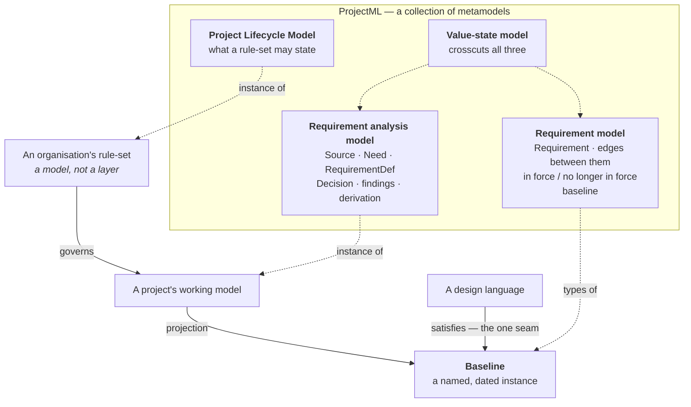

# The shape of the metamodel, and what a `RequirementDef` is — Design record

**Status: settled, and written into `spec/`.** This record carries decisions K19–K32, which continue the
series the founding record opened, and three new open questions, OQ9–OQ11. It answers OQ2 and OQ4 from the
founding record. `spec/` now exists, in the layout K31 called for: [`00-overview.md`](../../../spec/00-overview.md),
one document per member of the collection in [`01-requirement-model.md`](../../../spec/01-requirement-model.md),
[`02-requirement-analysis-model.md`](../../../spec/02-requirement-analysis-model.md),
[`03-project-lifecycle-model.md`](../../../spec/03-project-lifecycle-model.md) and
[`04-value-states.md`](../../../spec/04-value-states.md), the binding contract in
[`05-binding-contract.md`](../../../spec/05-binding-contract.md), and the normative record of K19–K32 and the
three open questions in [`06-decisions.md`](../../../spec/06-decisions.md).

**Date:** 2026-09-02
**Follows:** [`2026-08-26-kernel-brainstorm.md`](../../2026-08-26-kernel-brainstorm.md), this repository's
founding record
**Cites EventML decisions through:** [`docs/eventml-decisions.md`](../../eventml-decisions.md)

The session opened on OQ2 alone — *does `RequirementDef` split between the metamodel and the design
language?* It did not stay there. Answering it required knowing what the metamodel is a metamodel *of*,
and that question was open. The record below follows the order the session actually took, because the later
findings are what make the earlier ones correct.

---

## 1. The metamodel is a collection, not a monolith

The founding record treats ProjectML as one metamodel with separable pieces, and records the separability
as an open question:

> **OQ1** — "The kernel has two separable pieces: the evidence chain, which attaches at exactly one seam,
> and the value-state model, which attaches to every value or to none. **They cannot be adopted equally.**"

The same structure arrives from the other direction if the question is asked as *what models does a project
actually run?* rather than as *what can a binding take?* The answer is four things, three of them models
and one crosscutting.

| # | Decision | Rationale |
|---|---|---|
| K19 | **ProjectML metamodels a collection of connected models, not one model.** Four members: the requirement model, the requirement analysis model, the Project Lifecycle Model, and the value-state model, which crosscuts the other three | OQ1 already found the separability and could not place it. Naming the members makes it structural rather than a caveat. The dependency order between them is also the order in which they can be adopted, which is what OQ1's conformance-level option was reaching for |

**The test for membership is OQ1's own: independent adoptability.** A piece that cannot be adopted without
another is a chapter of that other, and splitting it is cosmetic. Applied to the four:

| Member | Adoptable without the others? |
|---|---|
| Requirement model | **Yes.** It is the register: requirements, the edges between them, whether each is in force. This is the core |
| Requirement analysis model | Yes, on the core. Without it a register can still be written into by hand — badly, and with no traceability, but written |
| Project Lifecycle Model | **No.** Its purpose is to say what may enter the requirement system, so it presupposes one |
| Value-state model | Separately, and all-or-nothing. It attaches to any value anywhere, including values on the far side of the seam |

The value-state model is the reason the collection is not simply a stack. It does not belong to any one
member, and K4's fourth declaration already treats it as separately adoptable by asking a binding to state
how far it takes it.

## 2. What each member is

### The requirement model and the requirement analysis model

The founding record's §2 already describes the relation between these two, using the verb that names it:

> "The requirement model then **projects to** a final, clean one by dropping the model above and the
> deprecated requirements."

K13 says what makes the projection a different kind of thing: it is "a simplification for a different
audience, **not a model that must pass the kernel's checks**", because it drops the need layer and
need-coverage rules cannot apply to it. K12 says who reads it: "A design language binds to a *named*
baseline, not to 'the requirements'."

| # | Decision | Rationale |
|---|---|---|
| K20 | **The product of the projection is the `requirement model`; its source is the `requirement analysis model`; a `baseline` is a named, dated instance of the requirement model** | The founding record uses *requirement model* for the working model and leaves the projection unnamed beyond *baseline*. The names are exchanged here deliberately, because the projection is what a design language sees and therefore what needs the name a design language recognises — see K21 |
| K21 | **A baseline has identity; the projection does not.** A design language binds to a baseline, never to the live projection | K10's argument, applied one model over: "A recomputed report has no identity across runs; a modelled element does." K4's third declaration requires an identifier space, and the SysML mapping's §3 records that a round trip without a stable map loses the identifiers everything depends on. The projection is recomputable; the baseline is the frozen instance that can be pointed at |

**On the naming.** SysML gives no name to the model that holds requirements. It names the *view* — a
Requirement diagram, "a static structural diagram that shows relationships among Requirement constructs,
model elements that Satisfy them, and Test Cases that Verify them" — and leaves the model behind the view
unnamed. The element names do correspond, and correspond directly: EventML's `Requirement` maps to a SysML
`requirement` usage and its `RequirementDef` to a `requirement def`, both recorded as direct in
`06-sysml-mapping.md` §1. Naming the product `requirement model` therefore adopts nothing that does not
exist and invents nothing: it is the model whose view SysML calls the Requirement diagram.

*Requirement analysis model* is a near-adoption rather than a citation, and is recorded as such. ISO/IEC/IEEE
29148:2018 names three processes — Business or Mission Analysis, Stakeholder Needs and Requirements
Definition, and System Requirements Definition — and *analysis* appears in its definition of requirements
engineering as an activity rather than as a process name. The nearest exact fit, Stakeholder Needs and
Requirements Definition, covers the derivation of requirements from needs but not the decisions and
findings that the model also holds, so it under-describes.

**Three consequences for the founding record**, all wording rather than substance. K10's "the model above
*the requirement model*" means above the requirement analysis model. K12's baseline is a named instance of
the requirement model. K13's "the baseline drops the need layer" is the definition of the projection.

### The Project Lifecycle Model

| # | Decision | Rationale |
|---|---|---|
| K22 | **A rule-set is a model, built with its own metamodel — not a layer.** Different teams working in the same domain load different rule-sets; they do not sit at different levels | K16's three levels survive intact. The alternative considered — a fourth level for organisation-specific rules — fixes a count that is already known to be wrong, since K15 puts "a base rule-set a project may vary as it runs" one step further down again |
| K23 | **The metamodel names the Project Lifecycle Model and says what a rule-set may state. It states no rules** | The same move K15 makes for requirement kinds and K7 makes for contradictions: the metamodel provides the slot and defines the shape, and something below fills it |

**What a rule-set may state** comes from the three gaps the EventML v0.5 record measured across 22 written
definitions, restated as kinds of statement rather than as rules:

| A rule-set states | The measured gap it closes |
|---|---|
| Whether an applied default may go silently, or must be owned by somebody | "nothing says which defaults may be applied silently and which are a choice somebody must own" |
| When a gap stops being waited on and becomes a decision | "nothing says when a gap stops being waited on" |
| How a conflict of a given kind is resolved | "nothing says how a conflict of a given kind is resolved" |

**What does not come across** is EventML's four origin clusters. Its own record calls them "a finding, not a
decision", and they are one domain's classification.

**This member is in the first draft, and the reason is worth recording, because the opposite was proposed
first.** The argument against including it was that nothing exercises it, which is the house rule that
refuses unexercised constructs. That mistook the mercy for the case. This material is EventML's roadmap
releases two through five, and the founding record's OQ6 reasons from exactly that list when it decides the
kernel needs a repository: *"Not one of those five is AV-specific. `eventml-core` is about to spend five
releases building kernel material inside EventML. Waiting for 1.0 does not avoid the work; it does the work
in the wrong repository and moves it afterwards."* Leaving it out would not be caution; it would undo the
extraction.

**This answers OQ4.** The founding record asked whether the kernel names the loop's steps normatively, and
put three options: entities only, entities plus a normative process, or entities plus lifecycle states with
no process prescribed. It recommended the third, on the ground that a prescribed process is the least
portable thing the kernel could carry. K22 and K23 are a fourth option, and better than all three: the
kernel neither prescribes the process nor stays silent about it, but supplies the metamodel with which an
organisation models its own. The portability objection becomes the reason for the shape rather than a
constraint on it.

## 3. Syntactic and semantic constraints

| # | Decision | Rationale |
|---|---|---|
| K24 | **Constraints over the model divide in two. A syntactic constraint refers only to elements the metamodel defines and is decidable without judgement; the metamodel states these and they are checkable. A semantic constraint judges content; the metamodel defines what it is, what a reviewer must cite and how a finding is recorded, and does not evaluate it** | This is K7 generalised. K7 already takes exactly this posture for contradictions — "The kernel defines what a contradiction is, what a reviewer must cite, and how a found one is recorded — it does not detect them". EventML's D50 organises its checks on the same line, in two columns: what a script decides and what a person or an agent decides |

*Every need anchors into a passage of exactly one source* is syntactic. *A requirement's text is the
professional restatement of its need's text* is semantic — and the metamodel still states it, because it is
the meaning of the refinement edge, not a check over it.

**A semantic constraint decomposes across all three levels**, and this is what makes the division useful
rather than merely tidy:

| Level | For the restatement rule |
|---|---|
| Metamodel | A requirement's text is the professional restatement of the need it refines. A finding must cite both texts |
| Implementation | The wording rules that produce the restatement for a given kind |
| Rule-set | Who reviews the restatement, and when, relative to a baseline |

## 4. What a `RequirementDef` is — the answer to OQ2

OQ2 proposed a split along a procedural/semantic line: `applies_when`, `params`, `default` and `asks` on
one side because they bottom out in the kernel's own value model, and `constraints` and `verification` on
the other because they bottom out in the design language's semantics.

**The line is in the wrong place, and the two attributes it groups do not belong together.**

`verification` does not bottom out in a design language. Its content refers to measurements and procedures
in the world — it names no model element of any design language — and ISO/IEC/IEEE 29148 makes
verifiability a required characteristic of a requirement, independently of any design language at all. The
SysML mapping's note that it corresponds to a `verification def` is a correspondence, not evidence of
ownership; a `verification def` is itself a requirement-side construct.

`constraints` does bottom out elsewhere, and worse than OQ2 says. It is a typed reference to a definition
whose own applicability attribute names a design language's entity kinds. That is a reference from the
kernel into elements the kernel does not define — a **second seam, running opposite to `satisfies`**, which
K3 permits exactly one of and requires to be carried by the outside element pointing in.

### The two tests

| # | Decision | Rationale |
|---|---|---|
| K25 | **The seam test.** An attribute belongs to the metamodel if the metamodel can interpret it without resolving a reference to an element it does not define. Prose that names design-language things is content, and content belongs to the implementation; a typed reference to a design-language element would be a second seam | K3 permits one seam and fixes its direction. The test is that decision applied attribute by attribute rather than only to the relation |
| K26 | **The record test.** An attribute belongs to the metamodel if a *stated* metamodel rule can fail on it — including on its absence — without reading its content | K7's posture, made into a criterion. The guard is *stated*: a rule that might one day be written does not qualify, which is the standard K7 itself meets |

The tests are independent and they agree on every attribute, which is the strongest evidence this record
carries. They disagree nowhere.

> **Superseded by K36.** They do disagree, and this record could not have seen it: the only attribute ever
> measured against both — the one K28 excludes — failed both on a single structural fact, so the agreement
> was a sample of one. Writing `spec/` found the second case. *When it applies* passes the seam test and
> fails the record test, because its absence is deliberately a gap rather than a claim, so nothing can fail
> on it. K36 settles what follows: the tests are not a conjunction, the seam test governs admissibility, and
> the record test measures whether an admitted attribute is load-bearing. See `spec/06-decisions.md`.

Two readings of the house rule that an unexercised construct waits were available for `verification`, and
the difference decides its fate. Under *a rule reads it*, `verification` is unexercised: it appears twice in
EventML's specification, in its own definition and in one example, and no rule, check or derivation reads
it. Under *it has to be written, and its absence is visible*, it is exercised: it is required, and all 22
definitions carry it. The first reading measures the metamodel's scope by what one implementation happened
to build, and `verification` is unread there not because it is unreadable but because the rule that would
read it was never written. Inheriting that gap as a decision would also lose a criterion ISO/IEC/IEEE 29148
supplies free, which house rule 10 forbids in its passive direction.

### The verdict

| # | Decision | Rationale |
|---|---|---|
| K27 | **`RequirementDef` does not split into two types.** It is one type with a core the metamodel interprets or can fail on, and declared points an implementation fills | The metamodel's job is element types and their extension points. A split would need a second type coordinated with the first, and coordination is what K4's four declarations would have to grow to carry |
| K28 | **`constraints` leaves the metamodel entirely.** The metamodel does not name the concept. An implementation may introduce one | It fails both tests, on the same structural fact. K16 gives an implementation the standing to introduce it, so nothing is lost that had anywhere else to go. K4's four declarations are untouched |
| K29 | **`verification` stays, on the definition rather than on the requirement** | Three sources point three ways — EventML puts it on the definition, 29148 on the requirement, SysML makes it an edge from a verification element — and the def/usage split resolves them without conflict. A verification *method* is generic to a kind of requirement, so it belongs on the definition. What verified one particular requirement is an instance-side fact, and is what a `verifies` edge would carry; see OQ10 |

Everything else in the core stays, and passes both tests: identity, a human-readable name, the text with its
placeholders, `applies_when`, `params`, `asks`.

**Two corrections to OQ2's own wording.** It lists `default` as an attribute of `RequirementDef`; it is not
one, and sits inside a parameter. This does not change the answer, but it moves a question: *may this
default be applied silently, or must somebody own it* is a Project Lifecycle Model question, not a
`RequirementDef` one. And if the metamodel says a parameter has a *type*, it must say what types exist,
which is a commitment it should not make — a parameter declares a **value domain**, and which domains exist
is the implementation's to declare, exactly as for kinds.

### Requirement kinds are specialisations

| # | Decision | Rationale |
|---|---|---|
| K30 | **A requirement kind is a specialisation of `RequirementDef`, not an attribute on it, and `RequirementDef` is abstract** | SysML v2's recommended mechanism for requirement hierarchies is specialisation of `requirement def` rather than a derivation dependency, and SysML v1's stereotypes are specialisations too. That is the only external evidence available, since neither form is exercised anywhere yet. It also dissolves a problem an attribute creates: a single kind attribute leaves the taxonomy free but fixes the *number of classification axes* at one, which is D55's argument one level down. Abstract, because a definition that belongs to no kind makes the declaration of kinds an aspiration rather than a rule |

This revises EventML's D53, which is permitted: the index records D51–D55 as **imported** rather than
inherited, because K15 moves their subject into the metamodel, and ProjectML takes its own decisions on
imported material. D52's concern survives — a set of subtypes is as enumerable and as questionable as a
list — and so does D53's, since a check reads the type instead of the attribute.

## 5. The structure of `spec/`

| # | Decision | Rationale |
|---|---|---|
| K31 | **`spec/` carries one document per member of the collection, plus an overview, a binding contract and a decision record** | The collection is the structure, so the layout follows it. EventML's eight-file layout is not copied: two of its files have no counterpart here, and two of its splits are wrong for a metamodel that carries no notation |

| Document | Contents |
|---|---|
| `00-overview.md` | The collection, the three levels, the metamodel/implementation boundary with its test, and the diagram conventions of K32 |
| `01-requirement-model.md` | `Requirement`, the edges between requirements, being no longer in force (K5), the baseline (K12, K13, K21) |
| `02-requirement-analysis-model.md` | `Source`, `Need`, `RequirementDef`, `Decision`, findings (K10), the derivation and the projection |
| `03-project-lifecycle-model.md` | What a rule-set may state (K23) |
| `04-value-states.md` | The five states, and their reach across the collection |
| `05-binding-contract.md` | The seam, and K4's four declarations |
| `06-decisions.md` | Decisions taken here, continuing the K series |

**The order is adoption order, not narrative order.** The product comes before the machinery that produces
it, so a reader adopting only the core can stop after the first document. That ordering is what gives OQ1's
levels their shape later without extra work.

**Two EventML splits deliberately not copied.** EventML separates its entities from its relationships into
two documents; here the edges are what make each member a model, so each document carries its own, and only
the edges *between* members — the projection and the seam — sit elsewhere. And EventML keeps its checks in
its uncertainty document; here a syntactic constraint travels with the model it constrains, and so does the
definition of a semantic one, because separating them would put a rule at a distance from the thing it is
about.

| # | Decision | Rationale |
|---|---|---|
| K32 | **The diagrams' vocabulary is a metalanguage, is descriptive only, and adopts existing conventions rather than coining any** | CLAUDE.md already distinguishes the two: "An abstract-syntax diagram is not notation; it is how a metamodel is drawn." The object language's notation is forbidden here; the metalanguage's is not, because a metamodel must be drawable. House rule 10 applies to it as well, so the abstraction and generalisation conventions already carried by the diagram language in use are adopted rather than replaced. Prose still wins over a diagram where they disagree, and the entity tables need no token at all — "a specialisation of `RequirementDef`" is ordinary English |

## 6. Open questions

| # | Question | When |
|---|---|---|
| OQ9 | **What does specialisation mean?** What a subtype of `RequirementDef` may add, narrow or override. K30 chooses the mechanism and does not define its semantics | When something exercises it — realistically phase 4, when the first kinds are declared |
| OQ10 | **Does `verifies` become a second edge kind on the one seam?** SysML puts verification as an edge from a verification element to a requirement, in the same direction and shape as `satisfies`. K4's first declaration would widen by one word to carry it. Nothing exercises it: no verification elements exist anywhere yet | Phase 2, where the SysML binding meets it, or later |
| OQ11 | **Does the metamodel need a subject?** SysML requires every requirement to have one. The metamodel does not have one, and the `satisfies` edge appears to determine it, since SysML's own `satisfy` binds the subject to the enclosing element. If that is not enough, a binding must synthesise one, which is the shape a false K2 would take | Phase 2. This is the binding's job to settle, and it is the reason phase 2 is early |

**Status of the founding record's open questions after this record.**

| | |
|---|---|
| OQ1 | Not answered. Its levels now have a shape: the collection's dependency order is the adoption order. Still phase 2, because what a binding cannot take is not knowable before a binding is written |
| OQ2 | **Answered** — K27, K28, K29, K30 |
| OQ3 | Untouched. Still phase 1 work, and the next task after `spec/` has a skeleton |
| OQ4 | **Answered** by a fourth option the founding record did not have — K22, K23 |

## 7. What was deliberately not decided

- **The classification axes.** Whether an implementation classifies by nature, by discipline, by origin, or
  by several at once. K30 removes the need to fix their number, which is what the metamodel would otherwise
  have done by accident.
- **Whether `constraints` reappears in an implementation, and in what form.** K28 puts it outside; what an
  implementation does with it is not this repository's business. One finding is worth carrying to phase 2:
  SysML makes a requirement a specialised constraint whose formal statement is evaluated over its own
  subject, and the subject is bound through `satisfy`. That routes a constraint through the one seam rather
  than opening a second, which is what the seam test predicts a design language must do — and it is the
  reason EventML's version failed the test where SysML's would not.
- **How the members of the collection compose when a project model is checked against more than one.** The
  question arose while the organisation rule-set was still being mistaken for a fourth level. K22 dissolves
  most of it. What remains is unexercised, and waits.
