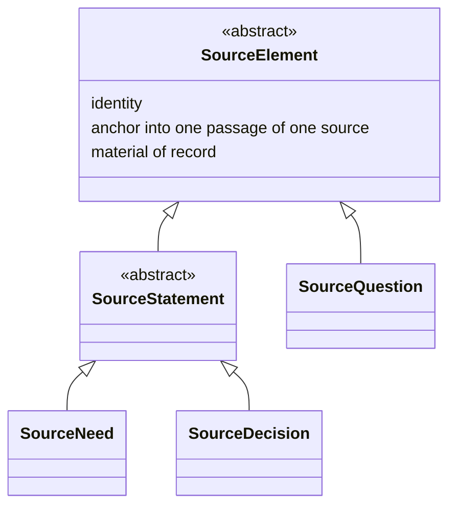

# What a source yields, and which side of the model it lands on — Design record

**Status: settled, and not yet written into `spec/`.** §§1–7 carry decisions K43–K50 and three open
questions, OQ14–OQ16, from this record's first pass. §§8–13 carry a second pass, K57–K65, closing OQ15 and
working out `SourceNeed`'s and `RequirementDecision`'s full shape; it leaves a new question, OQ17, that the
second pass could not close without `spec/03-project-lifecycle-model.md` being worked out first. `spec/` has
not been changed by either pass, because the change touches `Requirement` as well as the source side and
needs a plan of its own rather than an edit in passing.

**Date:** 2026-09-03
**Follows:** [`2026-09-02-spec-structure-and-oq2-design.md`](2026-09-02-spec-structure-and-oq2-design.md)
**Began as:** an attempt on OQ12, which is untouched and still blocks phase 2. The brainstorm walked into
this instead, and the walk is worth recording, because two house rules adopted along the way are what found
the defects.

---

## 1. How this record got to its subject

The session opened on OQ12 — the seam edge's cardinality, the check no document states, and whether the edge
pins a baseline. The third of those dissolved almost at once, and the reason it dissolved is the shape of
everything that follows.

**The third question rested on a false premise.** It assumed a requirement's content can change while its
identity stays, so that an edge naming a requirement is ambiguous between one baseline and the next. It
cannot: the prior art already settled that *retirement is a property of an element, replacement is an edge
between two*, so a change to what a requirement obliges produces a new requirement rather than an edit to
the old one. An identity never changes meaning, so the edge needs no baseline. Nothing had to be added.

**Two house rules were adopted while working out why.** Both are in `CLAUDE.md` §5, and both earned their
place by finding defects that reading for consistency had not:

- **Ask what every event derives from.** Check that the model *records* a cause rather than merely
  guaranteeing one exists.
- **Ask which actor an act belongs to.** The project manager and the modeller are different actors even
  when one person wears both hats; the modeller takes no decision about the project, so anything in the
  model that commits the project reached it as a source. This is not a rule beside K11 but the reason K11
  holds.

**Their first two applications found this record's subject.** Retirement's cause is guaranteed by K11 and
recorded by no edge. And `Decision`, as `spec/` defines it, has **no origin at all** — five attributes, none
of them a source. Every other element of the requirement analysis model names where it came from; a
decision does not, and nothing requires it to, so as written a modeller could invent one. That is exactly
what the actor rule calls a defect.

## 2. The axis

The correction that organises everything else was that the elements do not divide into *extracted* and
*produced*. They divide by which language they are in.

| # | Decision | Rationale |
|---|---|---|
| K43 | **One side of the model is somebody's words, anchored in a passage of a source. The other is the model's own bound terms.** Information travels inward, from words to bound terms; questions travel outward, from bound terms to words | It is the distinction that already governs the pair the metamodel has always had — a need is what a stakeholder said, a requirement is the bound professional restatement of it. Naming the axis makes the same move available to everything else a source contains, and it predicts the direction reversal K48 records. *Extracted against produced*, the reading tried first, puts `SourceQuestion` on the wrong side: we produce it, and it is still somebody's words addressed to a person |

## 3. The source side

The diagram draws what K44 states, and where the two disagree the prose wins. The abstraction and
generalisation conventions are the diagram language's own, adopted rather than coined (K32).

| # | Decision | Rationale |
|---|---|---|
| K44 | **A source yields `SourceElement`s. The type is abstract, and has two specialisations: `SourceQuestion` and `SourceStatement`, itself abstract, with `SourceNeed` and `SourceDecision` beneath it.** `SourceElement` carries identity, an anchor into exactly one passage of exactly one source, and the property of being material of record — never edited, and carrying no lifecycle state. The list of specialisations is not closed | Three properties shared across four types is a type rather than a coincidence. The material-of-record property is K6's reason generalised: a source is quoted whole and never decomposed, so anything anchored into one inherits that a quotation cannot cease to be true. The list is left open on the reasoning K42 already records one level over: a closed list would fix one way of reading a source into the metamodel, and a fifth kind arriving is evidence to account for rather than a violation |
| K45 | **The two specialisations are siblings because their discharge conditions differ, and differ in opposite directions.** A `SourceStatement` that produces nothing is a failed check with two resolutions (K38). A `SourceQuestion` that nothing has answered is **normal** — the ordinary condition of a project with something outstanding | This is what settles the shape rather than taste. Putting `SourceQuestion` beneath `SourceStatement` would put K38's failed check over every unanswered question and report each as a defect. The first attempt at this record did place it there, by arguing that a question obliges an answer and therefore obliges; that argument was wrong. A question asserts nothing. It opens something |
| K46 | **Provenance stops at the source.** The metamodel does not model what produced a stakeholder's words, because it cannot see the procedures behind them | A boundary, not a gap, and it must be stated as one. The rule that every event records its cause would otherwise lead a later reader to try to model a client's own decision process. It also explains why `Source` is the root of the chain: not because nothing precedes it, but because nothing before it is visible |

## 4. The naming

| # | Decision | Rationale |
|---|---|---|
| K47 | **A prefix names the side an element belongs to. `Source` and `Requirement` themselves carry no prefix, and that absence is the signal**: they are the model's two protagonists, and everything else is named for the one it concerns | The prefix does work rather than adding length: it marks which language an element is in, which is the distinction that produced two separate confusions in the session that took this decision — a question conflated with the derived question of a question rule, and a decision conflated between what was recorded and what it does. It also disambiguates `Statement`, which would otherwise read against ISO/IEC/IEEE 29148's *requirement statement*. House rule 10 is met rather than broken: 29148's own term is *stakeholder need* and ISO/IEC/IEEE 42010's is *Architecture Decision*, so both were already carrying a qualifier, and this exchanges one qualifier for another while recording the same lineage. **The absence of a prefix on the two protagonists is normative, and is not to be tidied away later** |

## 5. The model side, and the move between the sides

| # | Decision | Rationale |
|---|---|---|
| K48 | **Implementation is the move from one side to the other, and it runs in both directions.** A `SourceNeed` is implemented by a `Requirement` and a `SourceDecision` by a `RequirementDecision`, both inward. A `RequirementQuestion` is implemented by a `SourceQuestion`, outward | The reversal is not an irregularity but what the actor rule predicts. The modeller's only sanctioned output is a question, so questions are the only thing that originates on the model side and is realised in somebody's words. Everything else originates in somebody's words and is realised in the model's terms |
| K49 | **`RequirementDecision` and `RequirementQuestion` are elements of the model side.** A `RequirementDecision` is what a decision does to the requirement model — what it retires, what it supersedes, what finding it closes. A `RequirementQuestion` is what the modeller must find out | `RequirementDecision` resolves a deferral `spec/` records against itself: *"A decision here carries no edge to what it resolves, and that is a deferral, not an oversight… None of the five attributes above name it."* The edges were missing because one element was doing two jobs — holding a quotation and holding a change. Splitting them gives each its own. `RequirementQuestion` gives OQ13 its shape without answering it: the record of a question put is the model-side element, and its discharge is the machinery OQ13 still asks for |
| K50 | **Who authored a passage is a signal, not a dispatch.** A project manager may state a need and a client may take a decision; what an element is follows from what the passage does, never from who wrote it. What distinguishes a question of ours from a question of theirs is whether it implements a `RequirementQuestion`, not who asked | The founding record's §5 already reaches this conclusion for a source's origin attribute — it *"correlates with the origin clusters but is not a function… it survives at most as a smell test."* The session that took this decision violated the same rule one message after quoting it, which is the argument for stating it as a decision rather than a caution. It also disposes of two edge cases without new machinery: an experienced client whose question happens to be the next step gets an implementation edge added afterwards, and a project manager who asks what the model already holds has no such edge, because no `RequirementQuestion` stood behind it |

## 6. What this leaves open

| # | Question | When |
|---|---|---|
| OQ14 | **Is there a model-side abstract type**, as `SourceElement` is for the source side? The symmetry suggests one, and it would let the implementation edge be stated once between two abstract types rather than three times pairwise. Against it: the model-side elements resemble each other far less than the source-side ones do — a `Requirement` and a `RequirementQuestion` have little in common beyond being ours | When the model side is understood as well as the source side is. The owner's judgement at the time of this record is that one will probably be needed and that the side is not yet fully seen, which is a reason to wait rather than to guess |
| OQ15 | **Is implementation a new edge, or the generalisation of one that already exists?** The refinement edge already runs from a requirement to the needs it refines, which is the inward half of K48 under another name — and that name is adopted from SysML v2, so it cannot simply be replaced | With OQ14, and for the same reason: it is a question about the model side |
| OQ16 | **How does `SourceQuestion` subdivide, and does it name the party expected to answer?** The axis is *who can answer*, which the founding record's §5 identifies as what the prior art's origin clusters split on, and the discharge depends on it. Naming the party would unify three uses of one open vocabulary — a source's origin, a decision's party, and a question's expected answerer. Against it: nothing reads it today, and the discharge machinery belongs to OQ13 | With OQ13, realistically |

**Untouched, and still blocking, as this first pass left it.** OQ12 is where this session began and is
where it stood at the time: the seam edge's cardinality fixed nowhere, and the check
`05-binding-contract.md` §4.1 cites by name stated in no document. Its third part had already dissolved —
see §1 — and the remaining two looked small. *(Later, outside this record: OQ12 was closed by K51–K54, in
[`2026-09-03-seam-cardinality-and-check-design.md`](2026-09-03-seam-cardinality-and-check-design.md), and
phase 2 — the SysML v2 binding — is written. Neither touches what follows in this record; see §8.)*

## 7. What was deliberately not decided

- **How a question is answered, and what records that an answer is outstanding.** OQ13 already asks it, and
  K49 gives the answer a place to live without supplying it. An attempt to settle it in passing here was
  withdrawn: nothing reads such an edge today, and the house rule is that an unexercised construct waits.
- **Whether a fifth kind of `SourceElement` exists.** K44 leaves the list open precisely so that this need
  not be settled by enumeration. A systematic check against the classical division of what an utterance can
  do — assert, direct, commit, declare, ask — mapped every case onto the three that exist, but a heuristic
  that finds no counterexample is not a proof that none exists.
- **The supersession edge**, which the owner places in the Project Lifecycle Model, since a replacement is
  what a decision produces and the Project Lifecycle Model is where what produces a decision belongs. It is
  not yet written, along with other material there. One consequence should be taken before phase 2 rather
  than with it: `05-binding-contract.md` §2 tells a design language's owner that a requirement's absence
  from a later baseline is the notice to rework, which is true and incomplete, because the model cannot yet
  tell a requirement that was replaced from one that was dropped. The document should say so rather than
  leave the story reading complete.

---

## 8. A second pass, working out the shapes §§1–7 left to fill

This pass returned to the same subject once phase 2 (the SysML v2 binding) was done, on the ground the
owner stated plainly: this had been deliberately sorted behind OQ12 and phase 2 because both test K2, and
`spec/` had gone stale relative to it in the meantime — the two documents phase 2 touched,
`05-binding-contract.md` and `06-decisions.md`, name neither `Need` nor `Decision` nor `Source` by type, so
nothing phase 2 wrote conflicts with what follows.

Three things drove this pass, each surfaced by pushing on a shape §§1–7 left open rather than by starting
from a fresh brief: what a `SourceNeed` actually carries beyond the shared shape K44 gives every
`SourceElement`; what closes OQ15's two halves; and what `RequirementDecision` needs beyond existing as a
type, once a reader asked to examine it the way §5 examined `RequirementDecision`'s existence but not its
content.

## 9. `SourceElement`s segment; they do not interpret

### K57 — `SourceNeed` carries no value

`spec/02-requirement-analysis-model.md` §4, as it stands, gives `Need` a third attribute beyond identity and
anchor: an optional `value`, carrying a value state, adopted from D27. Examining `SourceNeed`'s shape against
K44's three shared attributes surfaced that this does not belong there any more, once K43's axis is read
strictly.

| # | Decision | Reason |
|---|---|---|
| K57 | **`SourceElement`s carry no attribute beyond K44's three — identity, anchor, and being material of record. `SourceNeed` carries no `value`.** A source-side element's job is to segment a source into its unit passages, never to interpret what they say. Interpretation happens only where K43 already puts it: on the crossing from a source-side element to its model-side counterpart, governed by whatever definition's rules apply. A need's value, once extracted, is not a fact about the passage — it is a reading of the passage, and a reading belongs on the `Requirement` side, in the `values` attribute `01-requirement-model.md` §2 already gives a `Requirement`, produced by `refine` (§10) on the same terms as the rest of a requirement's bound wording. This revises D27's reading as applied to `Need`: the value state model still governs every value wherever one occurs (`04-value-states.md` §4), but a `SourceNeed` is not a place a value occurs, because nothing on the source side is a value at all | Before this pass, `Need`'s value was the one place K43's axis was not followed strictly — it let a source-side element carry something already interpreted, which is exactly the seam K44's `SourceElement`/`SourceStatement` split exists to keep on one side. Nothing today reads `Need.value` through a stated syntactic constraint (`02-requirement-analysis-model.md` §10 has none over it), so removing it costs no check anything currently runs. What it buys is that `SourceElement`'s claim to carry nothing but identity, anchor, and record-status is no longer an approximation true of three of its four leaves and false of the fourth — it is true of all of them, `SourceQuestion` and `SourceDecision` included, which never had an attribute like it to begin with |

The consequence for `RequirementDef`-driven derivation (`02-requirement-analysis-model.md` §8: *"The
parameters the definition declares are filled from the need and from whatever else the model already
holds"*) is none: that sentence already names the need's **passage**, not a pre-extracted value, as what
derivation reads. K57 removes a field nothing downstream depended on reading directly.

## 10. Closing OQ15's inward half, and naming its outward half

### K58 — `refine` covers both inward moves

| # | Decision | Reason |
|---|---|---|
| K58 | **`refine` is the edge for both of K48's inward moves: `SourceNeed`→`Requirement`, unchanged, and `SourceDecision`→`RequirementDecision`, newly.** Both are the same mechanism under K43's axis — a passage anchored on the source side, restated in the model's own bound terms, governed by a definition's rules — so both take the one already-adopted name rather than each taking its own | OQ15 asked whether `refine` generalises or a new edge is needed for K48's moves. For the inward pair the answer is now: it generalises. Coining a second name for a mechanically identical relationship would violate house rule 10 twice over — once by inventing where `refine` already exists, and once by implying two mechanisms where K43 already established one. This closes OQ15's inward half; the outward half is K59 |

### K59 — `poses` names the outward move

| # | Decision | Reason |
|---|---|---|
| K59 | **`poses` is a new, coined edge: `RequirementQuestion`→`SourceQuestion`, K48's outward move.** No standard has a term for it, so house rule 10's coining clause applies rather than its adoption clause | This is the one direction with nothing to adopt from — K48 itself says why: *"the modeller's only sanctioned output is a question,"* so nothing upstream of this metamodel has ever had to name a model realising itself outward into somebody's words. Two candidates were rejected on naming collisions rather than on meaning: `asks` collides with `RequirementDef`'s existing *what to ask* attribute (`02-requirement-analysis-model.md` §5), and `raises` collides with the state name K60 gives the pre-edge condition — a state and the edge that ends it cannot share a word without the state reading as already having happened |

**OQ15 is answered by K58 and K59 together, and no longer open.** It asked whether implementation is a new
edge or the generalisation of one that exists; the answer is neither alone — the inward half generalises an
existing edge (K58), the outward half is a new one (K59), and no umbrella "implementation" edge sits above
both. Nothing reads such an umbrella today, and K48's own word for the pattern, *implemented by*, is
descriptive prose connecting three concrete edges rather than a fourth edge waiting to be named.

## 11. `RequirementQuestion`'s two states

### K60 — raised and posed

| # | Decision | Reason |
|---|---|---|
| K60 | **A `RequirementQuestion` carries one of two states: raised, or posed.** Raised is its condition on creation: the modeller has identified something to find out, and no `SourceQuestion` yet exists for it. Posed is the condition once a `poses` edge (K59) names an actual `SourceQuestion` — the edge's presence **is** the transition, not a separate marker beside it. What happens after posing — whether and how it is answered — carries no state here | This gives OQ13 the *opening* half of the interval it asks about, without answering the interval itself: raised names the moment a gap is identified rather than merely existing as an unrecorded fact, which is what OQ13's own motivating case needed. Stopping at two states rather than reaching for a third (answered, closed) keeps this pass inside what K48/K49 already committed to and out of OQ13's own territory, which this pass does not attempt |

A `RequirementQuestion`'s eventual discharge does not need a third state or a new edge to `RequirementDecision`
to be traceable — see K61's note below.

## 12. `RequirementDecision`'s full shape

Before this pass, `RequirementDecision` existed as a name and a purpose (K49) but not as a shape: nothing
said what it carries beyond what it does. Examining it against the same defect K43–K50 exists to fix — *"a
`Decision` here carries no edge to what it resolves"* — produced three decisions.

### K61 — a `RequirementDecision` never exists without a `SourceDecision`

| # | Decision | Reason |
|---|---|---|
| K61 | **A `RequirementDecision`'s origin — `refine` from at least one `SourceDecision` — is mandatory, never absent.** A `RequirementDecision` missing this origin is not a question and not a failed check in the sense a `SourceStatement` producing nothing is (K45); it is **not a well-formed element at all**, on the same footing as K9's rule that a `Requirement` names its origin. What represents "a decision the modeller knows must be taken, but has not been" is a `RequirementQuestion` in the raised state (K60), never a bare `RequirementDecision` | This was asked directly: could a `RequirementDecision` stand for an anticipated, not-yet-made decision? No — K49's own definition already answers it: a `RequirementDecision` is *"what a decision **does**"*, which presupposes the decision happened. A decision not yet made has nothing to do the model yet, so nothing in it can be a `RequirementDecision`; it is exactly the gap `RequirementQuestion` already exists to hold. This also settles a knock-on question about closing a `RequirementQuestion`: no new edge is needed between `RequirementQuestion` and `RequirementDecision`, because the connection is already traceable through existing machinery — `RequirementQuestion` --poses--> `SourceQuestion` ← *answered by* a later `Source`, which carries the `SourceDecision` that `refine`s into the `RequirementDecision` |

### K62 — `retires`

| # | Decision | Reason |
|---|---|---|
| K62 | **`RequirementDecision` carries `retires`, an edge to zero or more `Requirement`s.** List-valued and may be empty, on the same terms as `refine` and the derivation edge elsewhere in this collection | This is the edge §5's own citation of the defect names directly: *"None of the five attributes above name it."* `02-requirement-analysis-model.md` §8 today says only that retirement *"arrives through a source"*, with no traceable element behind the words — this closes that gap concretely. §8's own prose will need to name `RequirementDecision.retires` in place of the untraceable phrase once this pass is written into `spec/`, which is noted here so the edit is not missed later |

### K63 — open and closed, criterion deferred

| # | Decision | Reason |
|---|---|---|
| K63 | **`RequirementDecision` carries one of two states, open or closed, but this record does not state what closes one.** The criterion is left to the Project Lifecycle Model, not fixed here | Working out what closes a `RequirementDecision` turned out to depend on the same territory as `supersedes` and "what finding it closes" (§7, and OQ17 below) — none of the three could be settled without first working out what `spec/03-project-lifecycle-model.md` actually says, which this pass does not attempt. Stating the slot without the criterion is the same move `RequirementDef`'s *"when it applies"* already makes (`02-requirement-analysis-model.md` §5): an admitted gap, not a claim that closure is automatic or undefined |

`RequirementDecision`'s attributes are otherwise unchanged from `Decision` as `02-requirement-analysis-model.md`
§9 states them today: identity, the choice and its alternatives, `by`, `date`, and rationale. Nothing here
removes or renames them; K61–K63 add an origin requirement and two edges beside them.

## 13. Two things examined and settled without new machinery

### K64 — the `SourceStatement`/`Requirement`-side pair, confirmed rather than doubled

A question was raised whether an unrefined `SourceDecision` and a `RequirementDecision` without a
`SourceDecision` are two severities of one problem. They are not — they are different in kind, and the
model already has words for both.

| # | Decision | Reason |
|---|---|---|
| K64 | **An unrefined `SourceDecision` is a failed check, already covered by K45's general rule over `SourceStatement` and needing no restatement. A `RequirementDecision` without a `SourceDecision` is not a failed check at all — it is excluded by K61 as not well-formed.** These are K24's own two categories — a failed check that can occur and awaits resolution, and a syntactic constraint nothing conforming to the model can violate — not two grades of the same defect | The question surfaced something worth confirming rather than something to add: `SourceDecision` inherits K45's *"a `SourceStatement` that produces nothing is a failed check"* automatically, since it is one, so nothing new needed stating for that half. The other half was already decided as K61, before this question was asked in these terms — this decision records that the two readings are consistent with each other and with K24, not that either was revised |

### K65 — no `Task`, and why

| # | Decision | Reason |
|---|---|---|
| K65 | **The metamodel introduces no `Task`, or any output shaped like one, for a `RequirementQuestion` in the raised state.** The state itself, K60, is already the complete signal — querying for raised `RequirementQuestion`s is finding the worklist, on the same terms K53 already reads an unsatisfied requirement without a dedicated element for it | Two reasons, and either alone would settle it. First, nothing is bought: a `Task` element would duplicate information the raised state already carries, the same objection that keeps this collection from modelling a source-coverage report (K41). Second, and decisively, `00-overview.md` §1 excludes exactly this vocabulary by name: *"ProjectML does not do schedule, tasks, dependencies, resources, budget, or milestones, and nothing in it is heading toward any of them."* The refusal is recorded, on K41's own precedent, so a later reader proposing it again finds this rather than rediscovering the boundary from scratch |

## 14. What this pass leaves open

| # | Question | When |
|---|---|---|
| OQ17 | **What does the Project Lifecycle Model's fourth rule-set item look like, and how does a `RequirementQuestion` reference what it fires on?** The case that motivates it: when new `Requirement`s are derived, a rule keyed by kind should say which other kinds are expected alongside the one just derived, and a `RequirementQuestion` should name both the triggering `Requirement` and the expected, absent kind. `spec/03-project-lifecycle-model.md` §2 states three things a rule-set may state and, per K42, does not close the list at three — this would be documented evidence for the fourth, which K42 already anticipates rather than forbids. Also gathered here, because all three depend on the same unworked territory: `supersedes` (§7) and what a `RequirementDecision` closes (§7) and what closes a `RequirementDecision` (K63) | Needs `spec/03-project-lifecycle-model.md` worked out in its own right, which neither pass of this record attempts. A dedicated session on the Project Lifecycle Model, not a continuation of this one |
