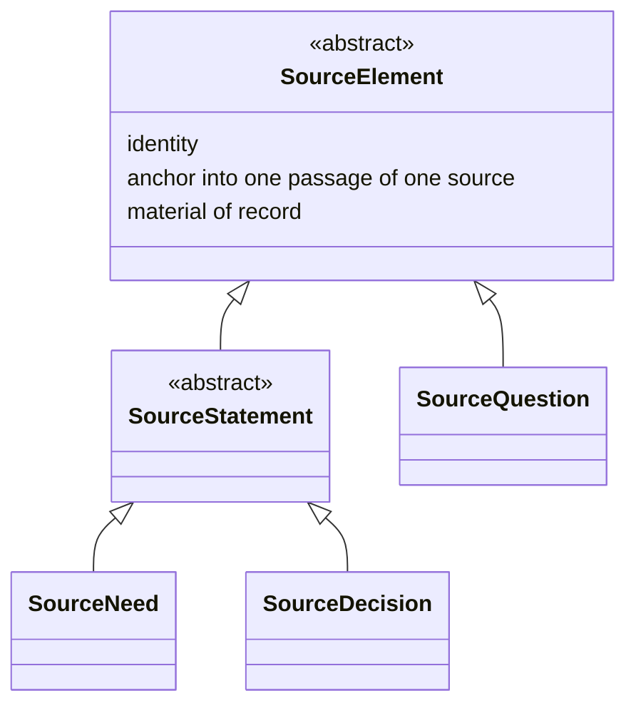

# What a source yields, and which side of the model it lands on — Design record

**Status: settled, and not yet written into `spec/`.** This record carries decisions K43–K50 and three new
open questions, OQ14–OQ16. It is a design record: `spec/` has not been changed, because the change touches
`Requirement` as well as the source side and needs a plan of its own rather than an edit in passing.

**Date:** 2026-09-03
**Follows:** [`2026-09-02-spec-structure-and-oq2-design.md`](2026-09-02-spec-structure-and-oq2-design.md)
**Began as:** an attempt on OQ12, which is untouched and still blocks phase 2. The brainstorm walked into
this instead, and the walk is worth recording, because two house rules adopted along the way are what found
the defects.

---

## 1. How this record got to its subject

The session opened on OQ12 — the seam edge's cardinality, the check no document states, and whether the edge
pins a baseline. The third of those dissolved almost at once, and the reason it dissolved is the shape of
everything that follows.

**The third question rested on a false premise.** It assumed a requirement's content can change while its
identity stays, so that an edge naming a requirement is ambiguous between one baseline and the next. It
cannot: the prior art already settled that *retirement is a property of an element, replacement is an edge
between two*, so a change to what a requirement obliges produces a new requirement rather than an edit to
the old one. An identity never changes meaning, so the edge needs no baseline. Nothing had to be added.

**Two house rules were adopted while working out why.** Both are in `CLAUDE.md` §5, and both earned their
place by finding defects that reading for consistency had not:

- **Ask what every event derives from.** Check that the model *records* a cause rather than merely
  guaranteeing one exists.
- **Ask which actor an act belongs to.** The project manager and the modeller are different actors even
  when one person wears both hats; the modeller takes no decision about the project, so anything in the
  model that commits the project reached it as a source. This is not a rule beside K11 but the reason K11
  holds.

**Their first two applications found this record's subject.** Retirement's cause is guaranteed by K11 and
recorded by no edge. And `Decision`, as `spec/` defines it, has **no origin at all** — five attributes, none
of them a source. Every other element of the requirement analysis model names where it came from; a
decision does not, and nothing requires it to, so as written a modeller could invent one. That is exactly
what the actor rule calls a defect.

## 2. The axis

The correction that organises everything else was that the elements do not divide into *extracted* and
*produced*. They divide by which language they are in.

| # | Decision | Rationale |
|---|---|---|
| K43 | **One side of the model is somebody's words, anchored in a passage of a source. The other is the model's own bound terms.** Information travels inward, from words to bound terms; questions travel outward, from bound terms to words | It is the distinction that already governs the pair the metamodel has always had — a need is what a stakeholder said, a requirement is the bound professional restatement of it. Naming the axis makes the same move available to everything else a source contains, and it predicts the direction reversal K48 records. *Extracted against produced*, the reading tried first, puts `SourceQuestion` on the wrong side: we produce it, and it is still somebody's words addressed to a person |

## 3. The source side

The diagram draws what K44 states, and where the two disagree the prose wins. The abstraction and
generalisation conventions are the diagram language's own, adopted rather than coined (K32).

| # | Decision | Rationale |
|---|---|---|
| K44 | **A source yields `SourceElement`s. The type is abstract, and has two specialisations: `SourceQuestion` and `SourceStatement`, itself abstract, with `SourceNeed` and `SourceDecision` beneath it.** `SourceElement` carries identity, an anchor into exactly one passage of exactly one source, and the property of being material of record — never edited, and carrying no lifecycle state. The list of specialisations is not closed | Three properties shared across four types is a type rather than a coincidence. The material-of-record property is K6's reason generalised: a source is quoted whole and never decomposed, so anything anchored into one inherits that a quotation cannot cease to be true. The list is left open on the reasoning K42 already records one level over: a closed list would fix one way of reading a source into the metamodel, and a fifth kind arriving is evidence to account for rather than a violation |
| K45 | **The two specialisations are siblings because their discharge conditions differ, and differ in opposite directions.** A `SourceStatement` that produces nothing is a failed check with two resolutions (K38). A `SourceQuestion` that nothing has answered is **normal** — the ordinary condition of a project with something outstanding | This is what settles the shape rather than taste. Putting `SourceQuestion` beneath `SourceStatement` would put K38's failed check over every unanswered question and report each as a defect. The first attempt at this record did place it there, by arguing that a question obliges an answer and therefore obliges; that argument was wrong. A question asserts nothing. It opens something |
| K46 | **Provenance stops at the source.** The metamodel does not model what produced a stakeholder's words, because it cannot see the procedures behind them | A boundary, not a gap, and it must be stated as one. The rule that every event records its cause would otherwise lead a later reader to try to model a client's own decision process. It also explains why `Source` is the root of the chain: not because nothing precedes it, but because nothing before it is visible |

## 4. The naming

| # | Decision | Rationale |
|---|---|---|
| K47 | **A prefix names the side an element belongs to. `Source` and `Requirement` themselves carry no prefix, and that absence is the signal**: they are the model's two protagonists, and everything else is named for the one it concerns | The prefix does work rather than adding length: it marks which language an element is in, which is the distinction that produced two separate confusions in the session that took this decision — a question conflated with the derived question of a question rule, and a decision conflated between what was recorded and what it does. It also disambiguates `Statement`, which would otherwise read against ISO/IEC/IEEE 29148's *requirement statement*. House rule 10 is met rather than broken: 29148's own term is *stakeholder need* and ISO/IEC/IEEE 42010's is *Architecture Decision*, so both were already carrying a qualifier, and this exchanges one qualifier for another while recording the same lineage. **The absence of a prefix on the two protagonists is normative, and is not to be tidied away later** |

## 5. The model side, and the move between the sides

| # | Decision | Rationale |
|---|---|---|
| K48 | **Implementation is the move from one side to the other, and it runs in both directions.** A `SourceNeed` is implemented by a `Requirement` and a `SourceDecision` by a `RequirementDecision`, both inward. A `RequirementQuestion` is implemented by a `SourceQuestion`, outward | The reversal is not an irregularity but what the actor rule predicts. The modeller's only sanctioned output is a question, so questions are the only thing that originates on the model side and is realised in somebody's words. Everything else originates in somebody's words and is realised in the model's terms |
| K49 | **`RequirementDecision` and `RequirementQuestion` are elements of the model side.** A `RequirementDecision` is what a decision does to the requirement model — what it retires, what it supersedes, what finding it closes. A `RequirementQuestion` is what the modeller must find out | `RequirementDecision` resolves a deferral `spec/` records against itself: *"A decision here carries no edge to what it resolves, and that is a deferral, not an oversight… None of the five attributes above name it."* The edges were missing because one element was doing two jobs — holding a quotation and holding a change. Splitting them gives each its own. `RequirementQuestion` gives OQ13 its shape without answering it: the record of a question put is the model-side element, and its discharge is the machinery OQ13 still asks for |
| K50 | **Who authored a passage is a signal, not a dispatch.** A project manager may state a need and a client may take a decision; what an element is follows from what the passage does, never from who wrote it. What distinguishes a question of ours from a question of theirs is whether it implements a `RequirementQuestion`, not who asked | The founding record's §5 already reaches this conclusion for a source's origin attribute — it *"correlates with the origin clusters but is not a function… it survives at most as a smell test."* The session that took this decision violated the same rule one message after quoting it, which is the argument for stating it as a decision rather than a caution. It also disposes of two edge cases without new machinery: an experienced client whose question happens to be the next step gets an implementation edge added afterwards, and a project manager who asks what the model already holds has no such edge, because no `RequirementQuestion` stood behind it |

## 6. What this leaves open

| # | Question | When |
|---|---|---|
| OQ14 | **Is there a model-side abstract type**, as `SourceElement` is for the source side? The symmetry suggests one, and it would let the implementation edge be stated once between two abstract types rather than three times pairwise. Against it: the model-side elements resemble each other far less than the source-side ones do — a `Requirement` and a `RequirementQuestion` have little in common beyond being ours | When the model side is understood as well as the source side is. The owner's judgement at the time of this record is that one will probably be needed and that the side is not yet fully seen, which is a reason to wait rather than to guess |
| OQ15 | **Is implementation a new edge, or the generalisation of one that already exists?** The refinement edge already runs from a requirement to the needs it refines, which is the inward half of K48 under another name — and that name is adopted from SysML v2, so it cannot simply be replaced | With OQ14, and for the same reason: it is a question about the model side |
| OQ16 | **How does `SourceQuestion` subdivide, and does it name the party expected to answer?** The axis is *who can answer*, which the founding record's §5 identifies as what the prior art's origin clusters split on, and the discharge depends on it. Naming the party would unify three uses of one open vocabulary — a source's origin, a decision's party, and a question's expected answerer. Against it: nothing reads it today, and the discharge machinery belongs to OQ13 | With OQ13, realistically |

**Untouched, and still blocking.** OQ12 is where this session began and is where it stands: the seam edge's
cardinality is fixed nowhere, and the check `05-binding-contract.md` §4.1 cites by name is stated in no
document. Its third part is dissolved — see §1 — and the remaining two are small. **It is the only open
question that blocks phase 2**, and the SysML v2 binding should not be written around it.

## 7. What was deliberately not decided

- **How a question is answered, and what records that an answer is outstanding.** OQ13 already asks it, and
  K49 gives the answer a place to live without supplying it. An attempt to settle it in passing here was
  withdrawn: nothing reads such an edge today, and the house rule is that an unexercised construct waits.
- **Whether a fifth kind of `SourceElement` exists.** K44 leaves the list open precisely so that this need
  not be settled by enumeration. A systematic check against the classical division of what an utterance can
  do — assert, direct, commit, declare, ask — mapped every case onto the three that exist, but a heuristic
  that finds no counterexample is not a proof that none exists.
- **The supersession edge**, which the owner places in the Project Lifecycle Model, since a replacement is
  what a decision produces and the Project Lifecycle Model is where what produces a decision belongs. It is
  not yet written, along with other material there. One consequence should be taken before phase 2 rather
  than with it: `05-binding-contract.md` §2 tells a design language's owner that a requirement's absence
  from a later baseline is the notice to rework, which is true and incomplete, because the model cannot yet
  tell a requirement that was replaced from one that was dropped. The document should say so rather than
  leave the story reading complete.
