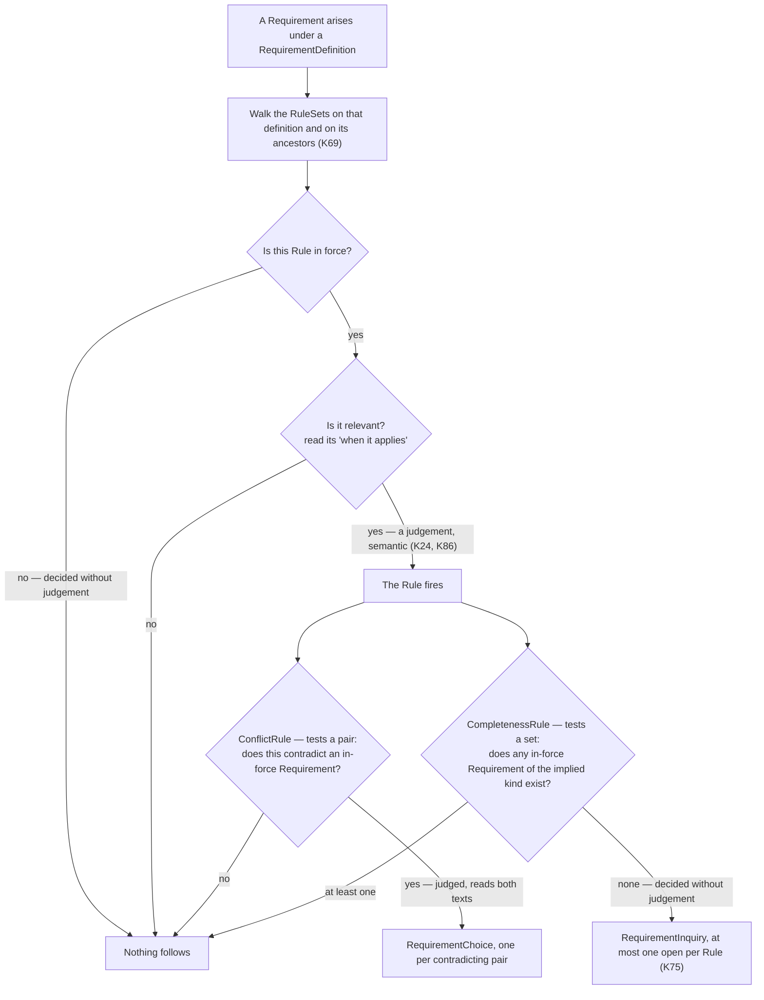
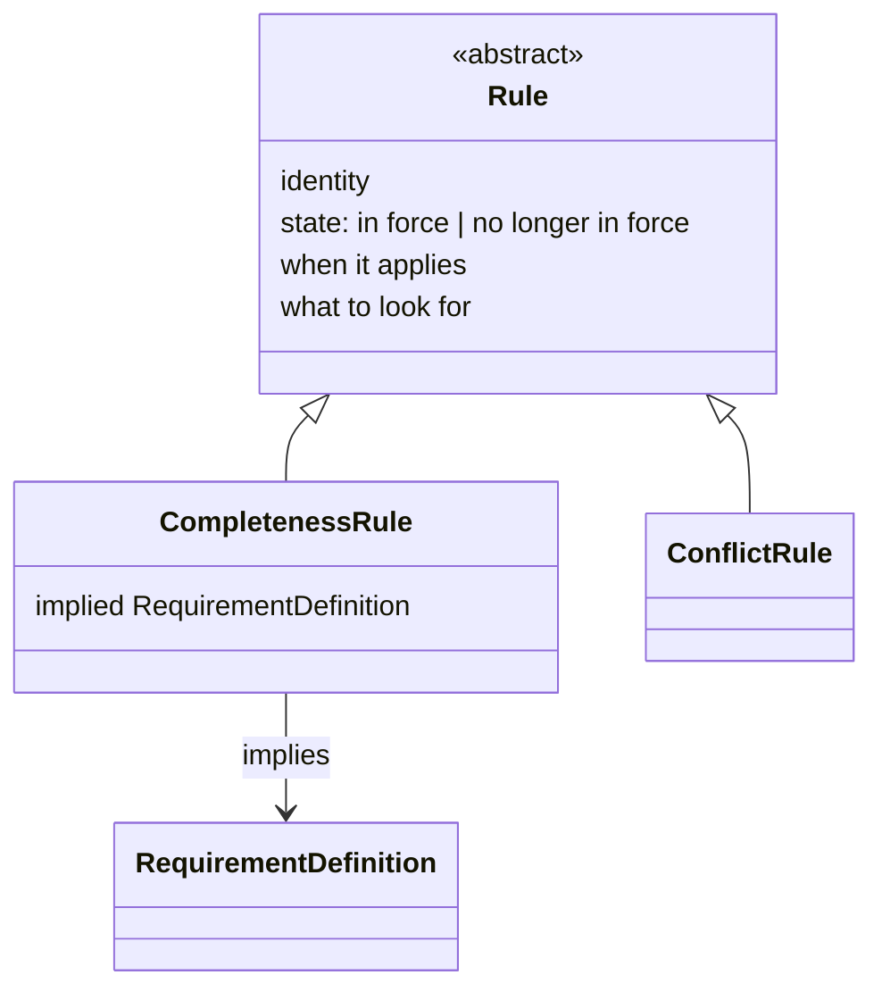
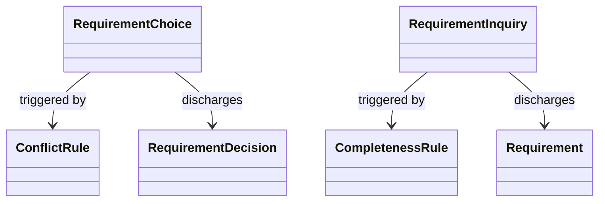

# The `Rule` specialisations, and what OQ18's two remaining mechanisms actually need — Design record

**Status: settled, and not yet written into `spec/`.** This record carries decisions K90–K98, narrows OQ18
into two halves with a named prerequisite each, and opens three successors, OQ24–OQ26. `spec/` has not been
changed: the change touches `spec/03-project-lifecycle-model.md` (§3 almost throughout) and
`spec/02-requirement-analysis-model.md` (§11's *"Two mechanisms are worked out"* paragraph and §12's
constraint list) — a change of this shape needs a plan of its own, on the same terms the integration passes
before it had.

**Date:** 2026-09-07
**Follows:** [`2026-09-04-rule-shape-design.md`](2026-09-04-rule-shape-design.md), whose K82–K89 gave `Rule`
its common shape while deliberately leaving the specialisations without one, and
[`2026-09-04-project-lifecycle-model-design.md`](2026-09-04-project-lifecycle-model-design.md), whose K71–K75
named `ConflictRule` and `CompletenessRule` and gave each a mechanism.
**Began as:** OQ18, together with the specialisation shapes the record before this one set aside as a session
of their own.

---

## 1. Where this record came from, and the question that reframed it

The session opened on the question the previous record left: what does each `Rule` specialisation carry beyond
the three attributes K84 puts on `Rule` itself. It was reframed within the first exchange by a question from
the owner — *where did these two specialisations come from, and is it certain there are only two* — which the
existing corpus answers badly.

The honest genealogy is that the two were **measured and exampled, never derived**. `spec/03` §2's first three
subject-matter rows were counted off EventML's 22 written definitions; the fourth surfaced while working out
something else. Of those four, the two that became types are the two somebody carried through a worked
example. There was no generator, and so no principled answer to *how many*.

Worse, the two sentences `spec/03` §3 uses to justify the split do not stand together. It states that
specialisations *"divide by **mechanism** — what happens when the rule fires"*, and three lines later that the
two specialisations *"share the same mechanism shape — detect a gap, then raise a `RequirementQuestion`
subtype"*. Read together: the types divide by mechanism, and both have the same mechanism. That is only
coherent if *mechanism shape* and *mechanism* name two different things, a distinction the corpus never draws.

Section 2 supplies what was missing. Everything after it follows from that one decision.

## 2. The axis: what a specialisation's firing test ranges over

| # | Decision | Reason |
|---|---|---|
| K90 | **A `Rule` specialisation is fixed by what its firing test ranges over, and every other difference between specialisations follows from that.** `ConflictRule` tests a **pair** — the requirement that arose against one already in force. `CompletenessRule` tests a **set** — the requirements the implied kind would have to appear among. This is what K71 was reaching for and could not state, having only one comparison to reason from | Each consequence is derivable rather than stipulated, which is what a type axis has to deliver. A pairwise test has two elements present at firing, so there is something to choose between: it yields alternatives, hence `RequirementChoice`, and each pair is its own case, hence as many open questions as there are pairs; and deciding *"does this contradict that"* reads both texts, hence a judgement. A set-level test finds something **absent**, so there is nothing to choose between: it yields a gap, hence `RequirementInquiry` with nothing beyond the shared shape (K80), and the gap is one property of the whole set, hence K75's *at most one open per `Rule`*; and deciding *"does any of this kind exist"* reads no text at all, hence no judgement. The axis also rescues K71's own claim at the point where it contradicted itself: the **pattern** really is shared — find something, raise a question — and the **range** is not, which is what varies structurally |

**The strongest consequence of the axis is an inversion, and the inversion is the evidence.** On the question
side, K80 makes `RequirementChoice` carry something extra and `RequirementInquiry` carry nothing. On the rule
side this reverses: `CompletenessRule` carries something extra (§5) and `ConflictRule` carries nothing (§4).
One sentence accounts for both:

> **An absence must be named in advance; a presence can be read at firing time.**

A pairwise rule needs to carry nothing, because at firing both elements stand in the model and the
alternatives are read off them. A set-level rule must name its target in advance, because the target is not
there to be read. This is a stronger argument than the seam test the previous session assembled for the same
conclusion: the seam test says a typed reference to a `RequirementDefinition` is *admissible*, and this says
it is *necessary*, and says where — and therefore also says where it is not.

**The axis generates rather than merely describing, which is what makes *how many* answerable.** Applied to
OQ18's two unworked mechanisms (§7), it produces two further ranges — a single value, and an open question
plus elapsed time — neither of which recombines the first two, and each of which fails on the current
machinery for a different and nameable reason.

## 3. The common shape

| # | Decision | Reason |
|---|---|---|
| K91 | **`Rule`'s third attribute is *what to look for*.** This renames K84's *what to consider* and restates what it holds | K84 describes it as *"the subject this rule raises: what has to be dealt with"*, which is exact for `CompletenessRule` and false for `ConflictRule`. In the completeness case the thing sought **is** an absence, so *what is being looked for* and *what has to be dealt with* are one sentence; that coincidence is what hid the conflation. In the conflict case the thing sought is a present clash: the rule states what counts as a contradiction here, while the subject anybody deals with is the particular pair found, which is instance-side and sits on the `RequirementChoice`'s alternatives. `spec/03` §3 already brushes against this in saying *"a conflict raises no subject to decline"*. The subject-reading is a special case of the looking-for-reading, not the other way round, so the common attribute must be named for the general one. K84's own appeal to house rule 10 survives: the *what to X* form is still this collection's own, and *what to ask* — which the parallel was built on — is itself about a **missing** parameter, which is precisely why that parallel carried the inquiry bias into the name |
| K92 | **A `Rule`'s attachment determines what *triggers* it, not what its test ranges over.** K69's inheritance says which requirements bring a rule into play; both specialisations' tests then range over the project model. This corrects K75's *"anywhere the rule's `RequirementDefinition` reaches"*, not K75's set-level verdict | The phrase cannot be satisfied as written. A rule on a *power* definition implying a *cooling* kind is looking for requirements produced under *cooling*, which is nowhere in the owner's subtree — searched there, the query would return nothing for every project and the rule would fire always. The same holds on the conflict side: a rule stated three levels down applies to requirements arising beneath that point, but what they may contradict is not confined to that subtree. Separating the two — attachment governs triggering, the model governs range — states once, at `Rule`, what neither specialisation states today, and repairs K75 in the same stroke. This is the same shape of correction K86 made to K76: the mechanism's description was wrong, its verdict was not |
| K97 | **A `Rule` is never deleted. It carries one of *in force* or *no longer in force*, and taking one out of force is the project manager's act.** The state is read mechanically, before anything is judged: a rule not in force never reaches the modeller at all, filtered out by the same walk that selects which `RuleSet`s reach a requirement | K87 makes a `RequirementQuestion`'s *triggered by* mandatory without exception, and calls its absence not a failed check but a malformed element. A deletable `Rule` withdraws the target of that reference and so takes back K87's strongest claim — that a question's cause is not merely guaranteed to exist but **named**. K5 already refuses deletion one model over for a comparable reason, and its vocabulary is adopted here rather than coining *active* beside it; house rule 10 asks for this collection's own established form, and `spec/03` §3's quoted *"active requirement"* is itself the stray. The actor follows from what `spec/03` §3 already states in the other direction: adopting a rule commits the project to checking it and is therefore the project manager's, never the modeller's — so retracting one is equally the project manager's, and the modeller does not *skip* a rule but never sees it. **K88 is untouched.** A state is not provenance: what caused the retraction stays outside this model and enters, like every commitment, as a source under K11. The *fact* is here because the walk cannot run without reading it and because K87 needs the rule to persist; the *cause* stays where K88 put it |

**What follows for an open question when its rule is retracted: nothing.** A rule leaving force is not an
answer to a question already raised, and the question stands. It closes the ordinary way, and K83 already
supplies the route — a negative answer is a full answer, and the `Requirement` recording it discharges the
inquiry. No machinery is added for this case, and none is needed. That route rests on premises OQ26 records.

**`Rule`, abstract, therefore carries four things**, read by the walk in this order:

| Attribute | Carries |
|---|---|
| identity | Local to the `RequirementDefinition` that owns it; the full identifier is the composition of the two (K85) |
| in force / no longer in force | Exactly one of the two at any time. Read mechanically, before anything is judged (K97) |
| when it applies | One sentence stating when this rule is relevant. Prose. What the relevance judgement reads (K84, K86) |
| what to look for | What the rule seeks in the model. Prose (K84, K91) |

and two statements that hold of every `Rule` without being attributes of one: its attachment governs
triggering and not range (K92), and it carries no provenance (K88).

## 4. `ConflictRule`

| # | Decision | Reason |
|---|---|---|
| K96 | **A `ConflictRule` carries nothing beyond the common shape, and the axis says why.** Both specialisations relate two requirement kinds, and only `CompletenessRule` names its partner in a typed reference. The difference is not a matter of taste: a `ConflictRule`'s partner is **present** at firing and the semantic judgement reads it anyway, so naming the partner in the prose of *what to look for* is sufficient | Stating the reason matters more than the verdict, because the verdict looks arbitrary without it — a reader reaching two types that both relate two kinds will ask why one is typed and the other is not. It is §2's inversion applied: the absent partner has to be named in advance because nothing can be read off it; the present one does not. A typed reference here would narrow *what must be examined* ahead of the judgement, mechanically — which is exactly the guard OQ21 describes, and belongs to OQ21 rather than being half-answered here |
| K98 | **The universal check — *"no requirement may contradict an in-force requirement"* — is not a `Rule`, and is removed from the model.** What it covered divides three ways, all of them existing machinery. Where two sources disagree about the same thing, the value-state model already carries it: `spec/04` §2's **conflicting** state holds the competing values, each with its source. Where two different kinds are incompatible on terms somebody had to state — a guest count against a catering headcount — that is a genuine `ConflictRule`. Whatever neither covers requires judgement and no procedure, which is a **review**, K89's third checking mode. This replaces K73's canonical case and K69's illustration; neither mechanism changes | Tested against the four attributes K97 settles, every one degenerates: *when it applies* is "always", *what to look for* restates the type's own name, *in force* could never be anything else, and the identity exists only so that *triggered by* has something to name. Four vacuous attributes is not a badly written rule but the sign of something that is not a rule: a rule-set states how **this project** works, and this is true of every project and carries no content. The first destination is decisive on its own — the check duplicated, one level up, a mechanism the value-state model already had, which is why it never sat comfortably. Nothing is lost and the specialisation improves: `ConflictRule` was being introduced through its degenerate case, and a cross-kind conflict shows what the type actually carries. **No fourth checking mode is needed**, and inventing one would be an unexercised construct where K89 already named the mode that fits |

**Both replaced examples have successors, and they come from the same worked case.** K69's illustration — why
a rule belongs high in the definition tree — is served by *every technical requirement implies a technician
requirement*, stated once at the technical node and inherited by every technical kind: one rule, one implied
kind, K69 at full strength, and now a `CompletenessRule` rather than the thing that turned out not to be a
rule at all. K73's canonical case is served by the catering conflict: *a catering requirement whose headcount
falls short of a guest-count requirement*, where the relation between the two kinds is precisely what somebody
had to state and no machinery could find on its own.

## 5. `CompletenessRule`

| # | Decision | Reason |
|---|---|---|
| K93 | **A `CompletenessRule` names the kind it implies by a typed reference to a `RequirementDefinition`, beside the prose of *what to look for*** | Necessary, not merely admissible: the implied kind is **absent** at firing, so nothing about it can be read from the model, and a rule that did not name it in advance could not run its own test. The seam test (K25) passes, `RequirementDefinition` being defined by the metamodel itself (`spec/02` §7) — which is the whole difference from K28's rejected candidate, whose reference ran outward into a design language's elements. The record test (K26) passes and is load-bearing: a `CompletenessRule` naming no implied definition fails a stated rule, on its absence, without anything reading its content. K15 and K23 are untouched, because the metamodel states only that such a reference exists and never which definition it names, exactly as `Requirement`'s own edge to its definition does (K8) |
| K94 | **Exactly one implied `RequirementDefinition` per `CompletenessRule`.** A kind implying five companions is five rules | Forced by machinery already settled, not chosen for tidiness. K75 allows at most one open `RequirementInquiry` per `Rule`; `discharges` names exactly one `Requirement` (`spec/02` §11, §12). A rule naming five implied kinds, three of them missing, would therefore have to open one inquiry covering three gaps — which no single `Requirement` can discharge, leaving it permanently uncloseable. Five rules give five independent firings, five separately dischargeable inquiries, and the behaviour anybody would want: where the power requirement exists and the internet requirement does not, one question opens rather than five. The worked case that produced this — a streaming requirement implying power, internet, video, audio and lighting requirements — is the one that would have broken the alternative |
| K95 | **The completeness query asks whether at least one *in-force* `Requirement` produced under the implied `RequirementDefinition`, *or under any specialisation of it*, exists *in the project model*.** All three qualifications are load-bearing | *In force*, because K5 keeps retired requirements in the model and a retired one does not fill a gap. *Or any specialisation*, because K30 makes the definition tree a kind hierarchy, so a more specific kind satisfies a more general implication — this is what lets granularity come from the definition tree rather than from the rule. *In the project model*, which is K92 applied: the owner's subtree is where the rule is triggered, never where its target is found |

**What K75's set-level reading can and cannot express, stated where a reader will need it.** One in-force
requirement of the implied kind anywhere satisfies the rule for every triggering requirement; the model has no
way to say *each of these needs its own*. That is K75's deliberate choice, taken against combinatorial
re-triggering, and this record does not reopen it. Where per-instance behaviour is actually wanted, it is
obtained by refining the implied kind rather than by changing the check: a technician rule stated on the audio
definition implies an *audio technician*, and the set-level question then asks the right thing. The same move
answers the neighbouring temptation, and marks K83's limit precisely — a rule may imply an
uninterruptible-power kind where an implementation declares one, and may never state that a general power
requirement's value be uninterruptible. **An implied kind, yes; an implied parameter value, never.** That is
the line which keeps a rule-set from becoming a second definition layer.

## 6. The diagrams

Three diagrams go in with this material, on the terms `CLAUDE.md` sets: an abstract-syntax diagram is how a
metamodel is drawn, and where a diagram and the prose disagree, the prose wins.

**A guard applies to the first one, because a process diagram is the one that can drift.** OQ4 is settled by
K22/K23 in a way that deliberately prescribes no procedure, and a flowchart is the form most likely to smuggle
one in. The line: **the metamodel may draw its own mechanism; it may not draw the project's way of working.**
How a rule becomes a question is already stated in `spec/03` §3, and drawing it adds nothing. Who walks a
`RuleSet`, when, how often, and where that sits beside review is deliberately unstated, and a diagram with a
start node, an end node and numbered steps would state it silently. K86 explicitly denies that the walk runs
exhaustively or automatically, so the relevance step must remain visibly a judgement rather than one branch
among branches.

**D1 — walking a `RuleSet`.** Belongs under `spec/03` §3's *Walking a `RuleSet`*. It draws the relation the
whole-branch review found missing: K86's *relevance* language and the specialisations' *fires* language today
sit side by side with nothing stated between them.

Two things the diagram states that the prose does not. **Judgement appears once, at the top, and then again on
one branch and not the other** — which is the axis made visible: the pairwise test reads text, the set-level
test does not. A reader asking why one branch carries a second diamond has found this record's central result
without reading a line of it. And **`Nothing follows` is reached three times, for three different reasons**:
not in force, in force but not relevant, relevant but no gap. Nobody assembles that from the prose today, and
it is what makes K75's cost argument legible.

**D2 — `Rule` and its specialisations.** Replaces the class diagram now in `spec/03` §3, which shows two empty
subclasses and would be false once `CompletenessRule` carries something.

**D3 — what each specialisation's firing produces.** Assembled today only by reading `spec/02` §11 and
`spec/03` §3 together. **The edge directions matter and are easy to get wrong: there is no `raises` edge in
this model.** A `RequirementQuestion` carries *triggered by* toward its `Rule`, so nothing leads from a rule
down to the questions it produced — they are found by querying, exactly as requirements are found from their
definition.

Whether D2 and D3 are drawn as one diagram or two is a question for the plan, not a decision here.

## 7. OQ18, narrowed into two halves

Neither remaining mechanism fits the shape the two worked specialisations share, and the axis says why in each
case. Placed on it, the four ranges are:

| Range | Firing a judgement? | Outputs per firing | Product |
|---|---|---|---|
| a pair — `ConflictRule` | yes, reads both texts | one per pair | `RequirementChoice` |
| a set — `CompletenessRule` | no | at most one | `RequirementInquiry` |
| a single value — OQ18's first | no | one per value | not a question at all |
| an open question and elapsed time — OQ18's second | only given a clock | one per timed-out question | choice-shaped, but unnameable |

The third row recombines nothing: structural firing as in the set case, per-instance output as in the pair
case. **This is the evidence K71 was asserting without it** — four ranges, four different shapes, and subject
matter predicting the mechanism in none of them.

### OQ18's first half — the silent-vs-owned default

**The mechanism is derivable, and it rests on a concept the metamodel does not have.** There is no `default`
anywhere in the collection. What `spec/03` §2's first row calls *an applied default* is, in this model's own
terms, a value in the **assumed** state (`spec/04` §2, *"It was supplied to keep moving"*), and what it calls
*owned by somebody* is `spec/04` §2's own second sentence: *"a value may be marked as one to ask about... an
assumed value can be exactly the kind of thing that marking exists for."*

So the shape is: a rule that fires on an assumed value and marks it as one to ask about. It raises no
`RequirementQuestion`, and `spec/02` §11 already says why — *"a `RequirementDefinition`'s own what to ask...
covers a single missing parameter through the definition's own machinery, which is why that case raises no
`RequirementQuestion` at all."* The marking says the value must actually be asked about; *what to ask* says
how; and the closure needs nothing new, because an answer makes the value **stated**, which `spec/04` already
requires to name its source.

**What stops it is that the marking has no cause of its own.** It occurs once in the whole of `spec/`, in the
sentence quoted above, and nothing anywhere says what produces it — the defect the provenance house rule
exists to find. It is not a small
question either: `spec/04` allows stated, derived and conflicting values to be marked too, so the marking has
at least two possible origins, a modeller's judgement and a rule, and until that is settled it cannot be said
whether the marking is modelled or recomputed. Building a rule's product on top of an ownerless construct
would put the new work on the weaker footing. **OQ25 records the prerequisite.**

### OQ18's second half — the gap timeout

**It is blocked on OQ13, structurally, and in two places.**

**There is no clock.** A `RequirementQuestion` carries no date. A posed one's date is recoverable indirectly,
through `poses` to a `SourceQuestion` and out to its source's date; a **raised** one has no date at all. A
timeout rule could therefore fire only on posed questions, and only by leaving the model side to do it.

**It could not name what it escalated.** *"When a gap stops being waited on and becomes a decision"* means the
project must choose in the absence of an answer, which is `RequirementChoice` discharged by a
`RequirementDecision`. But a `RequirementQuestion`'s triggering list holds `Requirement`s, and what triggers
this is a **question**. The escalation could not record that it came from a particular inquiry timing out —
the same loss of a cause that K97 was written to prevent for a retracted rule.

Both are OQ13's own subject in its own words: *"Nothing in the metamodel records the interval between a
question being put and an answer arriving, or how that interval closes... nothing distinguishes 'this failure
is being worked' from 'this failure is being ignored'."* **A rule cannot fire on an interval the model does
not record.** OQ13 is settled as realistically phase 4, and this half waits behind it. Nothing before this
record connected the two.

| # | Question | When |
|---|---|---|
| OQ18 | **What mechanism do a silent-vs-owned-default `Rule` and a gap-timeout `Rule` carry?** Narrowed rather than answered: neither shares the *detect, then raise a `RequirementQuestion`* shape, and each is now held by a named prerequisite rather than by not having been thought about. The first has a derivable shape — fire on an assumed value, mark it as one to ask about, raise no question — and waits on OQ25. The second is choice-shaped and waits on OQ13, for a clock and for an edge naming what it escalated | The first, with OQ25, which is close and small. The second, with OQ13, realistically phase 4 |

## 8. What this record opens

| # | Question | When |
|---|---|---|
| OQ24 | **When do two disagreeing sources produce one `Requirement` carrying a conflicting value, and when two `Requirement`s?** K98's first destination assumes the former — the value-state model's **conflicting** state holding both competing values with their sources — and the model permits it without requiring it: `refine` is list-valued precisely so one requirement may be assembled from several statements (`spec/02` §10), but nothing forbids two in-force requirements of the same kind carrying incompatible values. That would be a refinement error, and no stated rule catches it. It cannot become a syntactic constraint, because deciding whether two requirements are about the same thing is a judgement | Raised deliberately rather than settled inside K98, because it is a question about the derivation rather than about rules. It is the residue K98's third destination — review — would otherwise absorb silently |
| OQ25 | **What produces `spec/04` §2's marking of a value as one to ask about?** The marking appears once in the corpus and nothing states its origin, which the provenance house rule makes a defect however sensible it reads. Two origins are available — a modeller's judgement, and a `Rule` — and whether the marking is modelled or recomputed cannot be settled until it is known which applies when. `spec/04` permits stated, derived and conflicting values to be marked as well as assumed ones, so the question is not confined to defaults | Before OQ18's first half, which it blocks. Small, and close |
| OQ26 | **Does K83's negative-answer path hold?** K83 says a subject a rule raises may be answered negatively, and that the answer *"appears as a `Requirement` like any other"*, which the `RequirementInquiry` then `discharges` to. This rests on two premises the corpus never states: that *"this project needs nothing here"* obliges something, as K37 requires of every `SourceNeed`; and that some declared `RequirementDefinition` covers a negative statement, as K8 requires of every requirement. The second premise has a plausible answer — the implied kind's own definition — and the first may be false in a way that matters: a decision to need nothing reads more naturally as a `SourceDecision`, refining into a `RequirementDecision`, and K79 fixes `RequirementInquiry`'s `discharges` on a `Requirement`, which would not admit it | Flagged in this session's handoff and used by it — K97's *"a retracted rule leaves its open questions to close the ordinary way"* relies on this path — but never worked, so it is recorded rather than settled |

## 9. Notes for the plan

**`spec/03` has no syntactic-constraints section, and this record adds constraints over `Rule`.** At least
three: a `Rule` carries exactly one of *in force* or *no longer in force*; a `CompletenessRule` names exactly
one implied `RequirementDefinition`, and one naming none fails; no element is a `Rule` and nothing more.
`spec/02` §12 states the constraints over *that* document's elements, in the shape `spec/01` §5 uses, and
`Rule` belongs to neither. Whether `spec/03` gains a section of the same shape, or these are stated beside the
elements they govern, is a structural question the plan must settle before writing.

**`spec/02` §11 needs two edits beyond the renaming.** Its *"Two mechanisms are worked out"* paragraph
describes the conflict case as *"a conflict between a new `Requirement` and an existing in-force one"*, which
is the universal check K98 removes rather than the cross-kind rule that remains; and its closing sentence on
OQ18 needs replacing with the narrowed form in §7.

**Nothing in `spec/04` changes.** OQ25 names a gap there and deliberately does not fill it.
