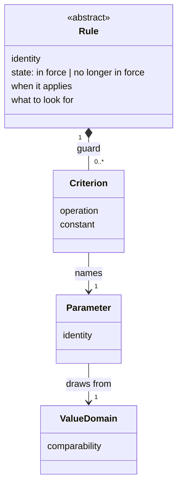

# Value domain comparability, and the guard on a `Rule` — Design record

**Status: settled, and not yet written into `spec/`.** This record carries decisions K101–K108, closes OQ21
and OQ27, answers part of OQ9, and opens OQ29. `spec/` has not been changed: the change touches
`spec/04-value-states.md` §5, `spec/03-project-lifecycle-model.md` (the common shape of a `Rule`, the walk,
and the `Rule` class diagram), `spec/02-requirement-analysis-model.md` §7, §9 and §12, and
`spec/06-decisions.md` — a change of this shape needs a plan of its own, on the same terms the integration
passes before it had.

**Date:** 2026-09-28
**Follows:** [`2026-09-04-rule-shape-design.md`](2026-09-04-rule-shape-design.md), which opened OQ21, and
[`2026-09-07-rule-specialisations-design.md`](2026-09-07-rule-specialisations-design.md), which placed the
guard outside `ConflictRule`'s type.
**Began as:** OQ27, raised by the first implementation package written with a working editor.

K99 and K100 are reserved by the integration plan of 2026-09-07 and are not yet in `spec/06-decisions.md`;
OQ24–OQ26 are reserved by the record of that date. The next numbers free were therefore K101 and OQ29.

---

## 1. Where this record came from, and the question that reframed it

OQ27 asked whether a value domain fixes a unit, and what makes two values comparable. It named two
constructs that already assume comparability: the **conflicting** value state, whose competing values
presuppose that they compete, and `ConflictRule`, whose canonical case is one headcount falling short of
another.

**Neither turns out to need a comparison made by an algorithm.** `ConflictRule`'s own section already says
that deciding whether one requirement contradicts another "reads both texts, hence a judgement" (K90): a
reviewer reading *2 m* against *200 cm* needs no unit fixed by a domain. The **conflicting** state records
that two sources disagree, and says nothing about what establishes the disagreement.

The session was reframed by asking where anything that is **not** a judgement would first compare two values.
The owner's answer was the guard OQ21 describes. That joins the two questions: a guard is the first construct
that must compare mechanically, so what a domain has to declare is exactly what a guard needs, and no more.

## 2. The walk, and where the guard sits in it

The owner stated the procedure the guard belongs to. Each step is already in `spec/` except the fourth:

1. A `Requirement` arises, carrying values for its definition's parameters.
2. The `Rule`s attached to its definition and to that definition's ancestors are collected (K92).
3. Only rules in force remain (the walk's two steps happen to a rule in force).
4. **The guard excludes every rule whose guard the new requirement decidably fails** (K105).
5. What remains goes to the relevance judgement (K86).

**One principle governs step 4, and the owner stated it: a guard is algorithmic, so it excludes exactly what
can be decided without judgement, and nothing else.** Every decision in section 4 applies that sentence.

## 3. The value domain declares comparability, not a unit

| # | Decision | Reason |
|---|---|---|
| K101 | **A value domain fixes no unit. It declares one of three levels of comparability: not comparable; comparable for equality; ordered.** Ordered includes equality. How an implementation achieves the level it declares — a fixed unit, a dimension with conversion, an enumeration, anything else — is the implementation's business, exactly as the set of domains is (`04-value-states.md` §5, K27). This closes OQ27 | A guard compares one parameter's value with a constant written against that same parameter (K102), so it never compares values of two domains. What a guard needs from a domain is therefore not a unit but the knowledge of which operations are defined on its values. Three levels cover the two guards real material offers — *only outdoors*, an equality over an enumerated domain, and *only above 2 m*, an ordering — at the cost of one declaration. The attribute passes both tests of §8: it is stated without referring to anything the metamodel does not define, and a stated rule fails on it (§6, constraint 3) |

**What this says about the package that raised OQ27.** It declared one domain for a length in metres and one for a height in centimetres, two
lengths differing only in unit, and used each for a height. Under K101 that is correct: two ordered domains,
each in its own unit. No guard ever has to convert between them, because no guard ever compares across
domains. Whether two domains for one measure is *good modelling* is a judgement, and stays one.

## 4. The guard

| # | Decision | Reason |
|---|---|---|
| K102 | **A `Rule` may carry a guard: a list of criteria, empty when it has none. A criterion names a parameter of the `RequirementDefinition` that owns the rule — its own or inherited (K107) — an operation, and a constant.** The operations are *equals*, *is one of*, and the four orderings. The constant is a value, or for *is one of* a set of values, of the parameter's domain; how it is written is notation (K15). The guard is part of the shape every `Rule` has, so it adds to the shape K84, K91 and K97 give and applies to both specialisations. This closes OQ21 | OQ21 named the missing half: *"the `Rule`-side criterion and the join between them"*. The criterion is that half, and the parameter it names is the join — a definition declares the parameter, a requirement carries the value. A guard only excludes, so a `CompletenessRule` it admits still runs its set-level test exactly as before; the guard decides whether the arising requirement brings the rule into play, never what the test ranges over (K92) |
| K103 | **A criterion is decided only on a value in the stated or derived state.** On a value that is assumed, unknown or conflicting, or on a parameter the requirement does not have, the criterion is undecided | An unknown value has nothing to compare, and a conflicting one has several. An assumed value is one value, and the comparison itself could be computed; but what the guard concludes is that *the rule does not concern this requirement*, and that conclusion is only as firm as the value. An assumption is exactly the value `04-value-states.md` §3 says somebody with standing may need to correct. A guard excluding on it would let a wrong assumption silence a rule without anyone reading it, which is the one outcome a filter placed before a judgement must never produce |
| K104 | **The criteria of one guard are conjunctive. A rule is excluded when at least one criterion is decided false; otherwise it is kept.** There is no disjunction across parameters; a disjunction is written as two rules | Under conjunction a single criterion decided false decides the whole guard, whatever the others are, so exclusion stays decidable where some criteria are not. *Is one of* already expresses a disjunction over one parameter. A disjunction across parameters would need three-valued logic over an arbitrary expression, turning a filter into a language; where more is needed, two rules or the judgement are the right place |
| K105 | **The guard is applied after the rules not in force are set aside, and before the relevance judgement.** An excluded rule raises nothing | The order within steps 3 and 4 changes no outcome, since both only remove. The guard narrows what reaches judgement and adds no third category beside K24's two, which is what OQ21 required of it |

**Evaluating one criterion:**

| The value | The comparison | The criterion |
|---|---|---|
| stated or derived | holds | holds |
| stated or derived | fails | **decided false** |
| assumed, unknown or conflicting — or the parameter is absent | — | undecided |

**What the exclusion derives from, and whose act it is.** An exclusion is not an event in the model: it
creates no element and closes nothing, so it leaves no record to trace. It is reproducible from the guard and
the values it read, and each of those already carries its own provenance — the guard is part of a rule-set,
which is a model with an author (K22), and each value carries its state and, when stated, its source. Nobody
decides anything about the project by it: a rule-set author writes a guard, and the walk applies it.

## 5. Parameters, and what a descendant has of them

A guard names a parameter, and a rule may be inherited by the definition's descendants (K92). Both need
something the metamodel does not yet state.

| # | Decision | Reason |
|---|---|---|
| K106 | **A parameter carries an identity local to the definition declaring it.** How that identity is written is not fixed | A criterion has to name a parameter, and *what to ask* is already written per parameter (§7). Locality follows the precedent K85 set for a `Rule`'s identity: a parameter exists only on its definition, so an identity unique beneath that definition is enough |
| K107 | **A descendant definition has every parameter its ancestors declare, in addition to its own.** This answers the part of OQ9 that concerns adding parameters, and nothing else | Without it an inherited rule's guard would name a parameter the arising requirement's definition might not have, and would be undecided on every descendant — a guard that filters only at the definition it is written on. The owner decided the question directly rather than leaving the guard that weak; it is recorded here as a decision, not as a side effect of the guard |
| K108 | **A descendant declares no parameter carrying the identity of a parameter one of its ancestors declares.** Doing so is a failed check | K107 is only safe if the parameter a guard names is the *same* parameter on every descendant — the same domain, so the same comparability. Forbidding the redeclaration guarantees that. Whether a descendant may ever override or narrow an inherited parameter stays in OQ9; forbidding it now is the reversible choice, since lifting a prohibition later breaks nothing, while withdrawing a permission breaks every package that used it |

**What OQ9 still holds.** Whether an inherited parameter may be overridden or narrowed; what specialisation
means for the other seven attributes of the core; and whether an inherited parameter must appear as a
placeholder in a descendant's template. The last is left open deliberately: what a template means under
specialisation is the centre of OQ9, and the guard does not need it answered.

## 6. The syntactic constraints this adds

Each is decidable without judgement, and each failing is a failed check. They join
`02-requirement-analysis-model.md` §12.

1. A definition declares no parameter whose identity a parameter of one of its ancestors carries (K108).
2. Every criterion of a guard names a parameter the rule's owning definition has, declared or inherited
   (K102, K107).
3. Every criterion's operation is defined at the comparability level of its parameter's domain. No criterion
   is written on a parameter whose domain is not comparable (K101, K102).

**Not stated here: that a criterion's constant is a value of the parameter's domain.** What a domain's values
are is the implementation's to declare, so this is a check an implementation states over its own domains —
the core being a floor rather than a ceiling (K27).

## 7. The diagram

The `Rule` class diagram in `spec/03` gains the guard. As a sketch of what it must show:

Where it and the prose disagree, the prose wins.

## 8. What this record opens

| # | Question | When answerable |
|---|---|---|
| OQ29 | Does the walk run again when a value's state changes — an unknown value becoming stated, an assumed one being confirmed or corrected? The walk begins when a requirement arises, so a rule a guard left undecided at that point was judged then, and a rule a guard *would* now exclude, or would no longer exclude, is not revisited. K103 keeps the guard safe without an answer, since it never excludes on a value that is not yet firm; the question is whether the walk is complete without one | When an implementation runs the walk over a project whose values change after its requirements arise, which is every real project |

## 9. Notes for the plan

- `04-value-states.md` §5: replace the paragraph ending in OQ27 with K101, keeping its cross-reference to
  `03-project-lifecycle-model.md`.
- `03-project-lifecycle-model.md`: the guard in the common shape (K102), its evaluation (K103, K104), its place
  in the walk (K105), and the diagram of section 7. The sentence at the end of `ConflictRule`'s section that
  sends the guard to OQ21 becomes a reference to K102.
- `02-requirement-analysis-model.md`: K106 in §7, beside *parameters*; K107 and K108 in §9, narrowing the OQ9
  paragraph; the three constraints of section 6 in §12.
- `06-decisions.md`: K101–K108; OQ21 and OQ27 closed; OQ9 narrowed; OQ29 opened.
- The editor that raised OQ27 follows in its own repository: a new schema version carrying a domain's
  comparability, a rule's guard, and the parameters a kind inherits, and the contract's issue codes for the
  three constraints. That is implementation, and gets its own design there.
