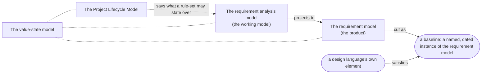

# Overview

Read first, in the numbered order below, and written last: a map is drawn after the ground it maps has been
surveyed. This document says what ProjectML is, how the documents after it fit together, and where the edges
of the model itself sit — in two senses, because there are two boundaries and neither is the other: what
belongs to this metamodel rather than to an implementation (§4), and what the model guarantees rather than
leaving to the modeller (§5). It defines nothing on its own — every claim it makes is made in full, with its
own reasoning, in the document it points at.

## 1. What ProjectML is, and what it is not

### What it is

ProjectML is a metamodel for the chain from what somebody said to the requirements it obliges: the decisions
taken while assembling that chain, and what is still open at any point along it. It says what a `Source` is,
what a `SourceNeed` anchored into one is, what a `Requirement` drawn from one is, what a `RequirementDecision`
resolving a `SourceDecision` is, what a `RequirementQuestion` still to be found out is, what state an
incomplete value can be in wherever a value occurs, and what a design language attaching underneath all of it
must declare in order to do so. It says all of this in prose,
in tables, and in diagrams — §6 states what a diagram here is, and is not.

### What it is not

It is not general project management, and the obvious reading of its name overclaims. ProjectML does not do
schedule, tasks, dependencies, resources, budget, or milestones, and nothing in it is heading toward any of
them. What it covers is the evidence-and-decision half of a project: a decision log, an issue log and a
requirements register, held together by traceability — what was said, what it obliges, what is still open,
and what was decided about it and why. Nor does it describe what satisfies a requirement. A design language's
own elements, and what they look like beneath the point where one of them names a requirement, are that
language's business, reached through exactly one seam (§2) — not something this collection narrates.

## 2. The collection

ProjectML metamodels a collection of connected models, not a single model (K19). Four members make it up.

| Member | Covers | Stands alone? |
|---|---|---|
| The requirement model | The product: a requirement, the edge by which one requirement is derived from another, and the baseline that names a dated cut of the requirements in force | Yes — a reader who wants a requirements register with traceability between requirements, and nothing else, reads it and stops |
| The requirement analysis model | The working model: where a requirement is actually built and justified, from a stated source, through a `SourceNeed` and the definition chosen for it, to the decisions and findings that stand behind it | No — it projects to the requirement model (K20), and is read for what produced the product, not instead of it |
| The Project Lifecycle Model | What a rule-set — an organisation's own way of resolving a gap, ending a wait, settling a conflict, or stating what kinds a kind implies — may state about the requirement analysis model's own elements, and what it may not | No — a rule-set written under it states rules over elements the requirement analysis model already defines in full |
| The value-state model | What is known about a value, wherever a value occurs in any of the other three: stated, derived, assumed, unknown, or conflicting | No, by nature — it crosscuts the other three rather than standing beside them, and it is not a step in the adoption order below: every member carries it |

The four connect three ways, and the value-state model crosscuts all three connections rather than joining
them as a fourth.

The requirement analysis model projects to the requirement model (K20): the product is reached by dropping
everything the working model adds beyond a requirement's identity, its text, its values, and the edge by
which it derives from another requirement — and by dropping the requirements no longer in force with it,
retirement being a property of the working model rather than of the product (K35). The Project Lifecycle
Model provides the means to model a rule-set, and a rule-set — never the metamodel itself — is what states
rules over the requirement analysis model's own elements: how a gap in one of them is resolved, when waiting
on it ends, how a conflict among them is settled, or what kinds a kind implies should also exist, without
adding to what those elements already define in full (K22, K23). A design language attaches
to the requirement model, and only there, through exactly one edge: an element the metamodel does not
define, carrying `satisfies`, and naming a requirement in a baseline — a named, dated instance of the
requirement model a design language can depend on, where the live projection itself cannot be depended on
(K3, K21). The value-state model has no box of its own on the same footing as the other three because it
does not connect to them the way they connect to each other: a value state applies to any value in any
member of the collection, on the same terms in every case, rather than attaching at one point where two of
the boxes above happen to meet. That reach does not stop at the collection's edge: it holds just as fully
past the seam, in a design language's own elements beyond it.

The numbered order of the documents after this one is not incidental: it is adoption order. One member is not
in that order, and a reader should learn so before meeting the order rather than after. **The value-state
model is a prerequisite every member of the collection carries, not a member adopted in sequence after the
others.** That is what K19 already means by saying it crosscuts: a value state applies to any value in any
member, so whoever adopts one of the other three has adopted the value-state model along with it, having met
that member's values on the way. `04-value-states.md` carries the last number because it is stated last, on
its own terms, once the members that lean on it have been written; the number does not place it fourth in the
order in which the collection is taken up.

The order therefore runs over the other three. A reader who wants a requirements register with traceability,
and nothing else, reads `01-requirement-model.md` and stops there — with the value-state model that
document's values already depend on. Reading `02-requirement-analysis-model.md` next adds the working model
behind it — the source a requirement was refined from, the definition it was produced under, and the
decisions and findings that justify it. `03-project-lifecycle-model.md` after that adds the slot an
organisation's own way of working fills. This ordering is what gives OQ1's conformance levels their shape
once phase 2 reaches them: what a binding can take from this collection without the rest, and what it cannot,
is answered by naming how far down this order it reaches, rather than by inventing a separate scale to
measure it against. The value-state model is not a step on that scale, being carried at the first step
whatever the answer turns out to be. How far a design language takes it past the seam is a separate question
from how far down this order a binding reaches, and `05-binding-contract.md` §4.4 is where a binding answers
that one.

Two further documents round out `spec/`, beyond the collection itself: `05-binding-contract.md`, which states
what attaching underneath the collection requires, and `06-decisions.md`, the normative record of every
decision the collection rests on (K31).

## 3. The three levels

There are three levels, not two, and the boundary §4 states is a boundary at the top of them (K16). A
metamodel says what a `RequirementDef` is; an implementation is a filled set of them, together with the
notation that writes them down and the rule-set a project may vary as it runs; a project model is what an
adopting team builds with that implementation, checked against it the way the implementation is checked
against the metamodel. An implementation is therefore itself a metamodel, for the project models built
beneath it (K16).

A rule-set looks, at first, like a natural fourth level, one step further down than a project model, closing
a gap the metamodel deliberately leaves open. It is not one: a rule-set is a model in its own right, built
with its own metamodel, stating how a gap in an element that is already fully defined gets resolved, rather
than adding content beneath a slot an implementation declared. It says nothing about what a value's domain
contains or what a requirement's wording should be — the things an implementation fills — and everything
about how a gap is resolved, when a wait ends, how a conflict is settled, and what kinds a kind implies
should also exist, once the elements it speaks about already exist in full (K22). Two teams sharing one implementation may load rule-sets that disagree on
all of that without either one having climbed down a level the other stayed on. The metamodel names this
model and says what a rule-set may state; it states no rules itself (K23). `03-project-lifecycle-model.md` is
where both halves of that are stated in full.

## 4. The boundary between metamodel and implementation, and its test

This is the boundary that matters most in this collection, because drifting across it unnoticed is the
failure most likely to happen here. It is not the only one, and §5 states the second: this section separates
the metamodel from an implementation, where §5 separates what the model guarantees from what the modeller
must do.

From the metamodel's side: ProjectML says what a stated piece of material is, what a requirement drawn from
one is, what edges connect these things to each other, what state an incomplete value can be in, and what a
design language attaching underneath must declare in order to do so (§2, §3). It says all of that in prose,
in tables, and in diagrams that are themselves a form of prose (§6). Nothing in it says how any of these
things is written down.

From an implementation's side: an implementation is a self-contained package that supplies exactly the three
things the metamodel deliberately withholds — a notation, a filled set of definitions, and a rule-set a
project may vary as it runs (K15, §3). Building one is a separate undertaking, later than anything this
collection does, and it is not asked for by any document here, including this one.

The line between the two is a test, not a list, because a list is exhausted the moment somebody proposes
something not on it. Put a candidate sentence to it:

> Could this sentence be true of a project modelled in YAML, in SysML v2 textual notation, and in a
> spreadsheet, without change? If yes, it is metamodel. If it assumes one of them, it is implementation.

A sentence that survives unchanged across all three names something about the shape of a requirement system
that holds regardless of how the system is written down. A sentence that has to change to keep meaning the
same thing, or that only one of the three could even express, has let a notation's own vocabulary into a
place that is supposed to be neutral among notations — which is what the symmetry this collection promises
every design language actually depends on (K2).

The test is why the following never appears here, whatever else about this collection changes (K15):

- a notation — YAML, JSON, XML, or any other file format — because a design language attaching underneath
  brings its own, and any one fixed here would be imposed on all the others;
- a schema or a grammar, for the reason a notation does not appear: there is no concrete syntax here to give
  one to;
- a filled definition — an actual kind of requirement, with its own name, its own wording, its own
  parameters — because the metamodel says what a `RequirementDef` is and holds none itself; the moment one
  element goes into a definition, the sentence that names it is no longer true of a project modelled any
  other way, and the test above has failed it;
- a worked example in a notation, because a worked example is written in one, and there is none to write it
  in here;
- anything executable — a validator, a script, a parser, an exporter — because nothing an implementation
  supplies exists yet for any of them to run against;
- a domain vocabulary, because a vocabulary belongs to whoever owns the implementation that needs one, and
  fixing one here would carry a single domain's assumptions into every other domain that adopts this
  metamodel.

## 5. The boundary between what the model guarantees and what the modeller must do

The boundary §4 states runs between this metamodel and an implementation. A second one runs somewhere else
entirely, and it belongs beside the first, because a reader who does not meet it will expect this collection
to guarantee something it cannot.

> **This metamodel's job is that no extracted information or decision is lost during the project-management
> process.**

That is the whole of the guarantee, and it is not a modest one. Everything that entered — a source quoted
whole and never edited, a `SourceNeed` anchored into a passage of it, the definition a requirement was
produced under, the decision that settled a choice and the reasoning behind it — stays in the model, stays reachable
from whatever it produced, and stays recoverable after the projection has dropped it (K5, K11, K13). Nothing
taken up on the way to a baseline goes missing between one end of the chain and the other. The corollary is
the half a reader is likelier to assume than to read:

> **Whether every piece of information has been extracted, and whether every mapping is accurate, is not the
> model's responsibility but the modeller's.** It can only be found by self-review or cross-review after the
> modelling is done.

Nothing in this collection reads the words nobody extracted. Nothing in it judges whether a `SourceNeed` says
what the passage it anchors into said, or whether a requirement says what the `SourceNeed` it refines obliged. Those are
judgements over content, made by whoever knows the material, and a review is the only instrument that finds
them. What follows for a reader is one sentence, and it is the one to carry away:

> A model on which no check fails is not thereby a correct model. It is a model with no *detectable* error.

**This is honesty rather than weakness.** A metamodel that claimed to guarantee completeness would be
claiming what it cannot deliver: completeness is measured against material the model does not hold — namely
everything a source says that nobody took up — so the claim could never be tested, and a guarantee that
cannot be tested devalues the ones that can. The line is not new here either. K24 already draws it between a
syntactic constraint, which the metamodel states and can decide, and a semantic one, which it defines and
leaves to review; K7 draws the same line for contradiction, defining what one is and what a reviewer must
cite while declining to detect one. This section draws it once more, over the metamodel's own promise, and
the three are one posture held at three scales.

Two decisions record it. K40 states the boundary. K41 refuses the instrument somebody will otherwise propose
for closing it — a coverage report over which passages of a source no `SourceNeed` cites, and any metric of
extraction built on one — and `02-requirement-analysis-model.md` §11 carries that refusal beside the rule
that checks extraction from the side a model can check.

## 6. The diagram conventions

Every diagram in this collection is Mermaid, rendered in place and diffable in the repository, and three
things are true of all of them (K32).

A diagram here is a metalanguage. CLAUDE.md already draws the line every diagram in this collection stays
inside of: "an abstract-syntax diagram is not notation; it is how a metamodel is drawn." Drawing
`RequirementDef` as an abstract type with placeholder subtypes named after no real kind is not giving a
requirement kind a concrete syntax; it is saying, in a second medium, exactly what the prose beside it
already says in the first.

A diagram here is descriptive, not prescriptive. Nothing in one is a recommended spelling for an
implementation to follow. A box standing in for a design language's own element is a placeholder for whatever
that element is actually called wherever it attaches, never a suggestion that an implementation should call
something by the name the box happens to carry.

And a diagram here adopts the abstraction and generalisation conventions its own diagram language already
carries, rather than coining any of its own — a subtype relation is drawn the way that kind of diagram
already draws one, a flow the way that kind already draws one. House rule 10, adopt rather than invent,
binds the metalanguage exactly as it binds every term in the prose written beside it.

Where a diagram and the prose beside it disagree, the prose wins. Every diagram in this collection is drawn
on the understanding that it could be deleted without losing anything the prose does not already say on its
own.

## 7. Status

ProjectML, as this collection stands, is a complete draft, not a release. Bringing it to a complete draft —
types, edges, states, rules, the binding contract — is the first of four phases, and it is the one this
repository is carrying out now. The second, also this repository's own work, is the SysML v2 binding, on
paper, against `05-binding-contract.md` alone (K17, K18) — deliberately early in this collection's life,
because it is the earliest point at which a false claim of symmetry among design languages (K2) would show
itself. The third and fourth phases — taking the ProjectML elements out of EventML, and building EventML's
own ProjectML implementation on top of them — happen in the EventML repository and are not this repository's
work.

The metamodel is not finished at the end of the first phase, even once every document in this collection
says everything it needs to say. It is not finished until an implementation has been built on it and has
carried a project end to end, and until the SysML v2 binding named above exists: one implementation proves
the metamodel can be built on, and the binding is the earliest point at which its claim to attach on the same
terms to every design language is tested rather than merely asserted (OQ7). Until both hold, what this
collection contains is a draft — complete, in the sense that every document it needs has been written, and
nothing more.
