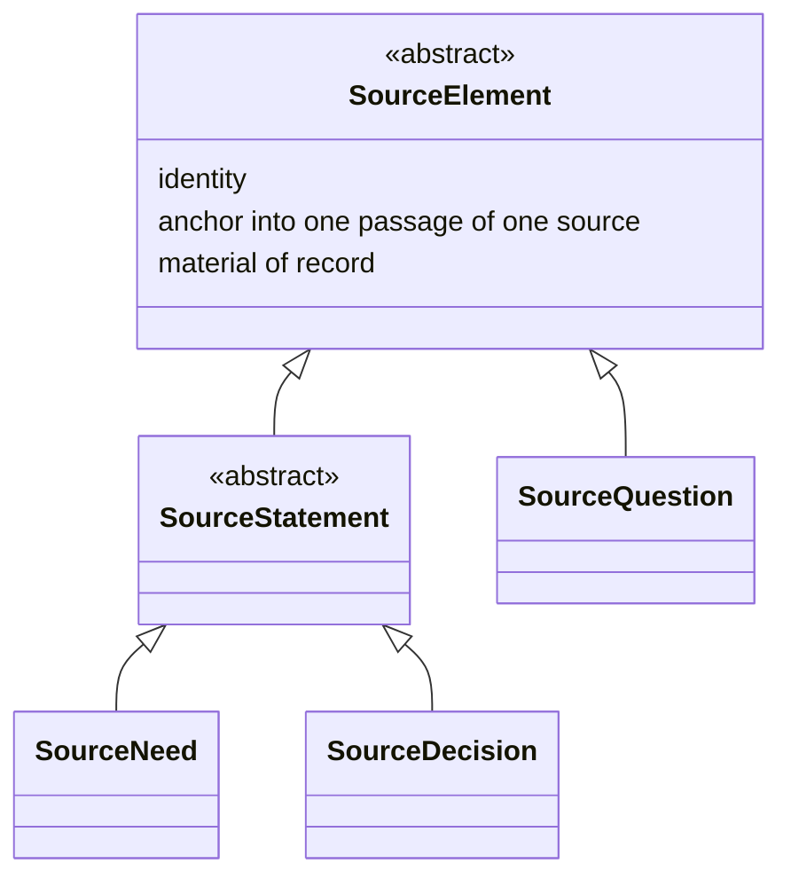
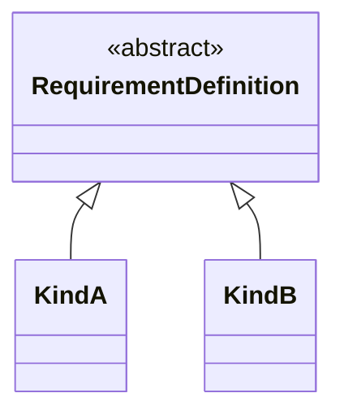
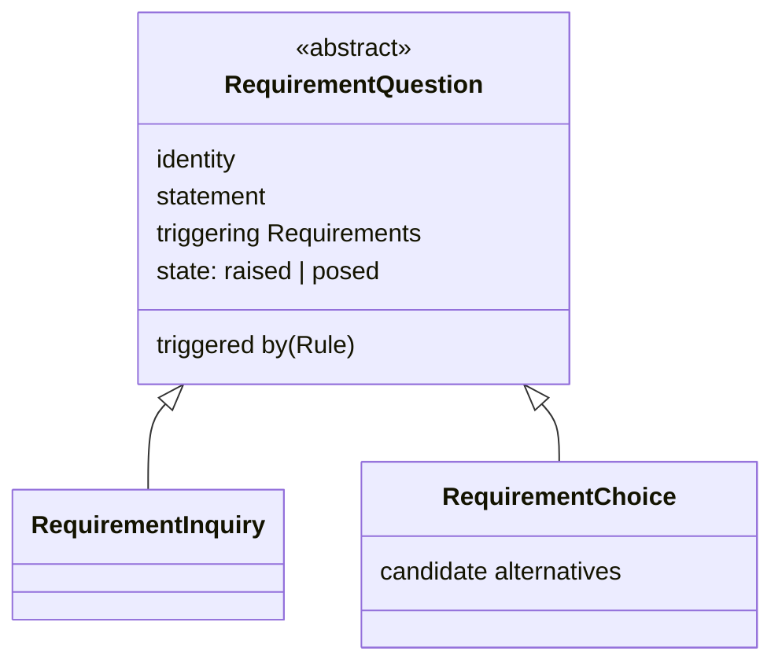

# The requirement analysis model

## 1. What this model is

This is the requirement analysis model, one member of the collection ProjectML metamodels (K19). It is the
**working model**: the model in which a requirement system is actually built, rather than the model handed
to somebody who was not in the room while it was assembled.

Its elements divide by which language they are in (K43): one side is somebody's words, anchored in a passage
of a source; the other is the model's own bound terms. A `Source` yields `SourceElement`s — `SourceQuestion`,
and `SourceStatement`, itself specialised into `SourceNeed` and `SourceDecision` (K44, K45) — and each has a
counterpart on the model's own side. `SourceNeed` and `SourceDecision` cross inward, by `refine`, into
`Requirement` and `RequirementDecision`; `RequirementQuestion` crosses outward, by `poses`, into
`SourceQuestion` (K47, K48, K58, K59). `RequirementDefinition` is the definition a `Requirement` is produced under,
and findings are what a review produces over all of it.

This document defines the source side first — `Source`, the edge between sources, and the `SourceElement`
family — then the model side: `RequirementDefinition`, the derivation it governs, `RequirementDecision`,
`RequirementQuestion`, and findings.

This model **projects** to the requirement model: the product model defined in `01-requirement-model.md`,
which a reader can adopt on its own, without ever having read this document (K20). The projection itself —
what it keeps, what it drops, and on what condition it may drop anything — is defined in section 10 of this
document, once everything the projection draws from has been introduced.

One rule governs everything that follows, and it is stated here because every section after this one assumes
it: **the requirement model changes only through sources** (K11). A review does not update a `SourceNeed`, a
definition, or a requirement directly; whatever a review decided — in a meeting, on a call, or by the team's
own judgement, with no other party involved — is itself entered as a source first, and the change follows
from it. This is what keeps the chain total rather than merely well-intentioned: there is no path from
"something changed" back to "nothing said so."

## 2. `Source`

A source carries five things.

| Attribute | Carries |
|---|---|
| identity | A stable identifier, distinct from every other source's |
| text | The material itself, in the words it was given in |
| from | Who or what it came from |
| kind | What kind of material it is |
| date | When it was made |

Three rules govern a source, and each rests on a decision already taken.

1. **A source is material of record.** It is quoted whole and never edited (D45). Everything anchored to a
   source — a `SourceNeed`'s passage, a citation in a review — points at words that stay exactly as given; if the
   source could change after the fact, an anchor into it would drift from what was actually said, and a
   later reader could no longer tell whether a quotation still means what it meant when it was captured.
2. **A source is never decomposed.** The raw material stays raw rather than being broken into parts and
   classified as it is captured, which would impose a classification taxonomy on it before anyone has asked
   what the material is for (D25).
3. **The kind and from attributes are open.** The metamodel names them and leaves their vocabularies to an
   implementation. The founding record's section 5 records why: EventML's own enumerations for these two
   attributes carry a domain leak — a kind of material and two things it can come from that exist only in
   that domain — and a vocabulary fixed here would carry the same leak into every project that adopts this
   metamodel. K30 makes the same move for a requirement's kind, though through a different mechanism: there
   the vocabulary is carried by specialisation of `RequirementDefinition` rather than by an attribute. What the two
   share is the metamodel naming a slot and leaving an implementation to fill it.

## 3. The edge between sources

Sources connect to each other through exactly one edge: a later source **`answers`** an earlier one. Four
properties hold of it, each already settled:

- It sits on the later source and names the earlier one it responds to, not the reverse (D35).
- It points backward in time: a source can only answer something that came before it (D38).
- It changes no value on its own. Both the earlier statement and the later one stand as made; which of them
  prevails, if they disagree, is not decided by the edge but by a decision recorded separately (D37).
- One edge relates exactly one source to exactly one source, but a source may carry any number of them —
  answering several earlier sources, or being answered by several later ones (D29).

The founding record's section 5 makes a further finding about this edge worth carrying forward here: `answers`
is the natural closing edge for a review finding. A finding is opened by a source and closed by a later one
that answers it, so closing a finding is not a tick somebody applies to a record — it is itself evidence,
carrying the same source that closes it as everything else in this model does. Section 11 uses the edge on
exactly these terms.

## 4. `SourceElement`, `SourceQuestion`, and `SourceStatement`

A source is never read directly by the rest of this model. What a source yields — what a `Source`'s text is
segmented into, one unit at a time — is a `SourceElement`.

The diagram draws what this section and the next state; where the two disagree, the prose wins. The
abstraction and generalisation conventions are the diagram language's own, adopted rather than coined (K32).

### `SourceElement`

`SourceElement` is **abstract**. Every element a source yields is some specialisation of it, and it carries
three things, shared by every specialisation and nothing beyond them.

| Attribute | Carries |
|---|---|
| identity | A stable identifier, distinct from every other `SourceElement`'s |
| anchor | A passage of exactly one source, on the same terms `01-requirement-model.md`'s predecessor
  attribute did — adopting the W3C Web Annotation Data Model |
| material of record | Never edited, and carrying no lifecycle state. Inherited from the source it anchors
  into: a source is quoted whole and never decomposed (§2), so nothing anchored into one can cease to be
  true while the source behind it stays what it was |

**A `SourceElement` segments; it does not interpret.** Nothing a `SourceElement` carries is a reading of
what its passage says — no extracted value, no restated content, nothing beyond the fact that this passage
exists and is anchored. Interpretation happens only on the crossing to the model's own side, governed by
whatever definition's rules apply there (K43, K57). This is a syntactic constraint over every
`SourceElement`: none of them carries an attribute beyond the three above, and a candidate attribute naming a
reading of the passage's content does not belong here, on K43's own axis — it would let something already
interpreted sit on the side of the model that K43 keeps to segmentation alone.

**Provenance stops at the source.** This model does not say what produced a stakeholder's own words, because
it cannot see the procedures behind them. `Source` is the root of this model's traceability not because
nothing precedes it, but because nothing before it is visible to a model built from what a project was told.

**The list of specialisations is not closed.** Two exist today, on the terms the next two subsections state:
`SourceQuestion`, and `SourceStatement`. K42's reasoning, stated for the Project Lifecycle Model, applies
here without change: a closed list would fix one way of reading a source into this model, and a fifth kind
arriving is evidence to account for, not a violation of what stands today.

### `SourceQuestion`

A `SourceQuestion` is a `SourceElement` — nothing more. It carries the three shared attributes and no
others: an unanswered `SourceQuestion` names no state of its own beyond what `SourceElement` already gives
it.

**An unanswered `SourceQuestion` is normal.** It is the ordinary condition of a project with something
outstanding, not a defect. This is the reason `SourceQuestion` sits beside `SourceStatement` rather than
beneath it: were it a `SourceStatement`, every unanswered question would report as a failed check under the
rule the next section states, which would be wrong — a question asserts nothing, so nothing about it can go
unfulfilled the way an unrefined statement can. It opens something instead, and what closes it is the
`answers` edge (§3): a later source `answers` the source the question's passage sits in.

**How `SourceQuestion` subdivides, and whether it names the party expected to answer it, is not settled
here.** Nothing today reads such a subdivision. This is recorded as OQ16 in `06-decisions.md`.

### `SourceStatement`

`SourceStatement` is **abstract**, a specialisation of `SourceElement` carrying nothing beyond what
`SourceElement` already gives it. It has two specialisations of its own, `SourceNeed` (§5) and
`SourceDecision` (§6).

**A `SourceStatement` that produces nothing is a failed check, not a question.** Unlike `SourceQuestion`'s
silence, a `SourceStatement` asserts something — it is the source-side counterpart of a passage that
obliges an outcome on the model's own side — so one that never crosses over is a record in which something
asserted went unaccounted for. §11 states this rule for `SourceNeed` in full, on terms `SourceDecision`
inherits without needing its own restatement of the same rule, because both are `SourceStatement`s.

## 5. `SourceNeed`

A `SourceNeed` is a `SourceStatement` (§4) whose passage **obliges something**. That narrowing is the whole
of it, and what follows in this section and in §11 follows from it: a passage of a source that obliges
nothing is not a `SourceNeed` which happened to produce nothing, it is not a `SourceNeed` at all, and
anchoring it as one was a mistake (K37).

**Extraction is already selective, and always was.** Nobody anchors a greeting or a signature as a
`SourceNeed`, and nothing in this model ever asked anybody to. A source permanently contains text no
`SourceNeed` cites, and that text is not a defect in the model. The prior art reached the same conclusion
from the other end and declined to make uncited text a rule, on the ground that a condition which never
clears is not a question (D33); this metamodel goes one step further and states nothing over uncited text at
all, for reasons §11 gives and K41 records. *Not need-bearing* is therefore an existing and ordinary
category, and it needs no record of its own. A passage nobody anchored leaves no element behind for a record
to sit on.

**A passage of a source is either a `SourceNeed`, another `SourceStatement`, a `SourceQuestion`, or it is
uncited.** This model defines no context element — no element for a statement worth keeping that obliges
nothing — and it is not to acquire one, because the case that would motivate one does not survive
examination. A statement about the environment the work happens in, about where it happens or when a place
is available, is a constraint on the environment the system must work within, and a constraint on the
environment obliges something exactly as a statement of what somebody wants does. The prior art already held
this without drawing the conclusion out of it: the record indexed at D51–D55 in
[`docs/eventml-decisions.md`](../docs/eventml-decisions.md) groups its definitions by origin and carries a
class brought in by where the work happens, whose missing information is resolved by measuring rather than
by asking anybody's opinion — a fact to be established, not a remark to be filed. The same record's
comparison with SysML v2 finds SysML's nearest category a poor fit on the same ground: SysML's constrains
the *system's* physical properties where this class describes the *environment* constraining the system.
Both readings treat such a passage as bearing a requirement. Neither treats it as inert.

A `SourceNeed` carries nothing beyond `SourceElement`'s three shared attributes — identity, its anchor, and
being material of record (§4, K57). It does not carry a value: what a `SourceNeed`'s passage expresses,
once interpreted, is a reading of the passage rather than a fact about it, and a reading belongs on the
model's own side, in the `values` a `Requirement` carries once `refine` (§10) has run
(`01-requirement-model.md` §2, K57). This revises how D27 was previously read as applying directly to this
element: the value-state model still governs every value wherever one occurs (`04-value-states.md` §4), but
a `SourceNeed` is not a place a value occurs, because nothing on the source side is a value at all.

The name is adopted rather than coined: *stakeholder need* is ISO/IEC/IEEE 29148's term (D23), carried by
`SourceNeed` on the same terms K47 states for every prefixed element — the prefix marks which side of the
model the element is on, exchanging one qualifier (*stakeholder*) for another that also disambiguates it
from `RequirementDefinition`'s and `01-requirement-model.md`'s independent use of *statement*-adjacent language.

Two rules govern a `SourceNeed`, beyond what `SourceElement` already governs for every `SourceElement`.

1. **A `SourceNeed` anchors into exactly one passage of exactly one source.** A `SourceNeed` with no anchor
   fails a syntactic check: there is nothing in it to ask a stakeholder about, and nothing for a reviewer to
   weigh — only an omission to fix (D34, D26). This is `SourceElement`'s own anchor requirement, restated
   here because it is the constraint a `SourceNeed`'s own syntactic-constraints entry (§12) cites.
2. **A `SourceNeed` that produces no `Requirement` is a failed check, not a question** (K38, D31, and §4's
   general statement of this rule for every `SourceStatement`). A `SourceNeed` obliges something by
   definition, so one nothing refines is a record in which something obliged is unaccounted for. EventML
   shipped this as a question rule (D31); K38 overturns that, and
   [`docs/eventml-decisions.md`](../docs/eventml-decisions.md) records the overturn.

Passage anchoring adopts the W3C Web Annotation Data Model (D26), stated once for every `SourceElement` in
§4 rather than repeated per specialisation. No requirements standard was adopted for it instead, because
none serves here: a `SourceNeed` anchors into a source before any requirement exists, at a stage SysML v2
places outside itself and has nothing to say about.

## 6. `SourceDecision`

A `SourceDecision` is a `SourceStatement` (§4) whose passage records a decision as somebody stated it — a
project manager's note that the client decided X, a client's own email settling a choice, a meeting record
of an agreed outcome. Like `SourceNeed`, it carries nothing beyond `SourceElement`'s three shared attributes:
identity, its anchor, and being material of record. What the decision means for the requirement model —
what it retires, and, once the Project Lifecycle Model states the criterion, what it supersedes and what
finding it closes — is not read off the `SourceDecision` itself; it is produced on the model's own side, by
`refine`, as `RequirementDecision` (§10, §11).

The name and its shape are adopted from the same source `SourceNeed`'s is: ISO/IEC/IEEE 42010's *Architecture
Decision*, carried here as the record of a decision **as stated**, prefixed on K47's terms to mark it as
belonging to this side of the model. The interpreted decision — the choice among alternatives, and the
rationale for it — is not this element's to carry; §11 states where that interpretation lands and why.

**A `SourceDecision` that produces no `RequirementDecision` is a failed check, not a question.** This is not
a new rule: `SourceDecision` is a `SourceStatement`, and §4 already states that a `SourceStatement` producing
nothing is a failed check (K38's rule, generalised by K45). Nothing about `SourceDecision` needs its own
version of this rule; it inherits it.

**A `RequirementDecision` never exists without a `SourceDecision` behind it, and this is the sharper,
asymmetric half of the same pair.** Where an unrefined `SourceDecision` is a failed check — a record that
can exist, awaiting resolution — a `RequirementDecision` with no `SourceDecision` origin is not a lesser
version of the same problem; it is excluded outright, as not a well-formed element of this model at all (K61,
K64, and §11 states the rule in full where `RequirementDecision` is defined). What stands for "a decision the
modeller knows must be taken, but has not been" is a `RequirementQuestion` in the raised state (§11), never a
bare `RequirementDecision`.

## 7. `RequirementDefinition`

`RequirementDefinition` is **abstract**. No element in a model is a `RequirementDefinition` and nothing more: a definition
exists only as a specialisation of it, and which specialisations exist is declared by an implementation
rather than here (K30). Section 9 gives the reasoning and says what the specialisation relation carries;
this section says what every definition carries, whatever it specialises.

The name is adopted rather than coined. SysML v2 splits an element into a definition and a usage of it, and
`RequirementDefinition` is the definition half of that split on the same terms: the thing a requirement is produced
under, not the requirement itself.

A definition carries eight things. This is the **core** — what the metamodel can interpret, or can fail on,
without reading anything an implementation supplies (K27).

| Attribute | What it is |
|---|---|
| identity | The definition's identifier |
| name | Human-readable |
| text | The template the requirement's wording is produced from, with places for its parameters |
| when it applies | One sentence stating when this definition comes into play. It is prose, not an evaluable expression (D20). Its absence means applicability has not been written down, which is a gap, not a claim that the definition applies unconditionally |
| parameters | Each parameter declares a value domain. Which domains exist is an implementation's business, exactly as the set of kinds is (K30, and `04-value-states.md` §5) |
| what to ask | For each parameter, how a non-expert is asked for what is missing |
| how it would be verified | The method by which a requirement produced under this definition would be shown to hold. Prose |
| wording rule | A well-formedness rule for the wording a requirement produced under this definition must satisfy. Prose, on the same terms *how it would be verified* is prose (K66) |

Two of the eight bottom out in the value-state model rather than in anything a design language supplies. A
parameter with no value is a value in the unknown state like any other, and the ask is how that value is
obtained from somebody who holds it — which is why *what to ask* sits beside *parameters* and is written per
parameter rather than per definition.

**Why *how it would be verified* sits on the definition rather than on the requirement.** A verification method is generic
to a kind of requirement: how a thing of this kind would be shown to hold is a property of the kind, and the
definition-and-usage split puts a generic property on the definition. ISO/IEC/IEEE 29148 makes verifiability
a required characteristic of a *requirement* rather than of a definition, and the two statements do not
conflict — a requirement inherits its definition's method, so a requirement produced under a definition that
carries one is verifiable in 29148's sense without carrying the method itself. What is genuinely
instance-side is not the method but what actually verified one particular requirement, and nothing in this
model carries that today; OQ10 records the edge that would (K29).

**Why a definition also states a wording rule, beside its template.** *text* gives the structural template a
requirement's wording is produced from; it says nothing about the qualities that wording must have once
produced. `03-project-lifecycle-model.md` §1 already states, of a rule-set, that it *"says nothing about...
what a requirement's wording should be"* — which settles where such a rule does **not** belong, without saying
where it does. ISO/IEC/IEEE 29148's own *characteristics of a good requirement* (unambiguous, singular, and so
on) is exactly this second, missing thing, generic to a kind rather than to one requirement, which is what
places it on the definition rather than the instance (K66). The seam test and the record test both admit it
on exactly the argument that seated *how it would be verified* (K29): the rule can be stated without resolving
a reference to an element the metamodel does not define, and a stated rule can fail on its absence.

**What the metamodel does not say about any of the eight is how it is written down.** Two definitions
carrying the same eight things are the same definition to this metamodel however differently they are set
out. Beyond the core, a definition holds whatever an implementation's own notation and rule-set need: the
core is a floor the metamodel can reason over, not a ceiling (K27).

## 8. What is not on a `RequirementDefinition`, and the two tests

The list in section 7 needs a criterion that outlives it, because the next attribute somebody proposes will
not be one of the eight. Two tests decide the question, and they are stated here in full, because they are
the part of this section a later reader actually reuses.

> **The seam test.** An attribute belongs to the metamodel if the metamodel can interpret it without
> resolving a reference to an element it does not define. Prose that names a design language's things is
> content, and content belongs to an implementation; a typed reference to a design language's element would
> be a second seam.
>
> **The record test.** An attribute belongs to the metamodel if a *stated* metamodel rule can fail on it,
> including on its absence, without reading its content.

The first is K25 and the second is K26. The seam test is the one-seam rule (K3) applied attribute by
attribute rather than only to the relation between the kernel and a design language: an attribute that has to
be resolved into elements the metamodel does not define is a second seam whatever it is called, and it runs
in the direction K3 forbids. The record test is K7's posture made into a criterion, and its load-bearing word
is *stated* — a rule that might one day be written does not qualify, or everything qualifies. Note what the
record test does not require: it is satisfied by a rule that fails on an attribute's **absence**, which is
how *how it would be verified* passes without anything ever reading its prose. Section 12 states the rule
that does it.

The two tests are independent of each other. How they relate, and what that relation costs one of the eight,
is stated at the end of this section, after the one candidate both of them reject.

**The one candidate that fails both.** A rule attached to a definition, stating what must hold of the design
elements a requirement produced under it constrains, names a design language's element kinds. It fails the
seam test, because the metamodel cannot interpret it without resolving those names into elements it does not
define. It fails the record test on the same fact: no stated rule can fail on it without that same
resolution. One structural fact, not two, which is why the verdict is not close. **The metamodel therefore
defines no such concept.** K28 records the candidate under the name it was considered by. An implementation
may introduce one, and nothing is lost that had anywhere else to go, because an implementation is itself a
metamodel for the project models built with it (K16), and the elements such a rule would name are exactly the
ones an implementation and its design language define.

**One finding belongs to phase 2 and is recorded here, beside the test that produces it.** SysML makes a
requirement a specialised constraint whose formal statement is evaluated over its own subject, and the subject
is bound through the satisfy edge. That routes a constraint through the one seam rather than opening a second
— which is what the seam test predicts a design language must do, and it is the difference between a rule that
fails the test and a mechanism that passes it. Whether the seam determines the subject on its own is OQ11, and
settling it is the binding's job.

### How the two tests relate

**They are not a conjunction, and on the core they do not agree everywhere.** An earlier reading of this
section said they did. It had one candidate to reason from, and that candidate fails both tests on a single
structural fact, so it could not have separated them however they related. Applied to the eight, they
separate. Section 12 states the syntactic constraints this model genuinely carries, and no rule among them
fails on *when it applies*: its absence is deliberately a gap rather than a claim, so the rule that is
available over it reports rather than fails, and the record test's word is *fail*. Nor does any of them fail
on *name*, which the metamodel reads for no purpose of its own.

**The seam test decides admissibility. The record test measures whether an admitted attribute is
load-bearing, and is not a second gate.** The reason is that a presence rule can be written over any
attribute at will: *a definition states its name* is a rule, it takes one line, and it fails on an absence
without reading a word of content. Were the record test the admissibility criterion, it would therefore be
vacuous — every attribute passes, because the rule that admits it is always available — or else arbitrary,
with nothing to say which presence rules are worth writing and which were written to admit a favoured
attribute. The word *stated* excludes the rule nobody has written; it does not exclude the rule anybody could
write in an afternoon, and an attribute's place in a metamodel cannot turn on whether somebody got round to
it. The seam test has no such weakness. Whether an attribute can be interpreted without resolving a reference
to an element the metamodel does not define is a fact about the attribute, unchanged by which rules happen to
exist over it.

Section 7's own definition of the core already reads this way, in one word: the core is what the metamodel
**can interpret, or can fail on**, without reading anything an implementation supplies. The two clauses are
the two tests, and the connective between them is *or*. An attribute the metamodel can carry without opening
a second seam is in the core; an attribute a stated rule can fail on is in the core and is checkable as well.

**Where this leaves *when it applies*: it stays.** It is admitted by the seam test, being one sentence of
prose that resolves nothing the metamodel does not define. It is not load-bearing under the record test, and
it cannot be made so without reversing the position that its absence is a gap and not a claim — a position
taken deliberately, because a definition whose applicability nobody wrote down is not thereby one that
applies unconditionally, and a rule failing on the absence would report a defective record where what is
actually there is a question for whoever knows. Admitting this costs nothing the collection needs: the record
test's verdict on an attribute is a report on how much work that attribute does, not a verdict on whether it
belongs. Recorded as K36 in `spec/06-decisions.md`.

## 9. Requirement kinds are specialisations

A requirement kind is a **specialisation of `RequirementDefinition`**, never an attribute on it (K30). Three reasons
carry this, and they are independent of each other.

1. **It is the mechanism the neighbouring language already recommends.** SysML v2's own way of building a
   hierarchy of requirement definitions is specialisation rather than a dependency between them, and SysML
   v1's stereotypes are specialisations too. That is the only external evidence available, since neither form
   is exercised anywhere yet, and house rule 10 says to adopt where a neighbour has already chosen.
2. **It does not fix the number of classification axes; an attribute would fix it at one.** A single kind
   attribute leaves the vocabulary free but silently decides that a definition is classified in exactly one
   respect. An implementation classifying in two respects at once would then have to encode the second inside
   the first. This is D55's argument one level down: a taxonomy the language fixes excludes every design
   language that classifies on another axis, and would make the metamodel unattachable.
3. **It is the same relation the three levels already use.** K16 makes an implementation a metamodel for the
   project models built with it, and what an implementation supplies at that boundary is filled specialisation
   of the types this metamodel defines. Using specialisation for the level boundary and something else for
   kinds would describe one relation twice, in two mechanisms that could then disagree.

**`Requirement` itself never specialises, however deep or wide the `RequirementDefinition` tree grows.** The kind
hierarchy lives entirely on the definition side, and `Requirement` and `RequirementDefinition` connect only by the
*produced under* relation (§10), never by inheritance: a requirement produced under a leaf kind is a plain
`Requirement` naming which `RequirementDefinition` it was produced under, not a member of some `Requirement`-subtype
(K67). This is SysML v2's own `def`/`usage` split, checked directly against the primary specification rather
than assumed: its kind hierarchy — `FunctionalRequirementCheck`, `PhysicalRequirementCheck`, and the rest —
specialises `RequirementCheck`, stated as *the base type of all `RequirementDefinition`s*, entirely on the
definition side; `RequirementUsage` stays one uniform type throughout, typed by whichever definition it names,
never itself specialised. This confirms rather than revises what `01-requirement-model.md` §2's K33 already
reads as though true — a `Requirement` naming no kind of its own presupposes it has none to name — stated
explicitly here because the question turned out not to be obvious without it.

**This revises prior art, and does so by permission.** D51–D55 are *imported* rather than inherited — K15
moves their subject into the metamodel, so this repository takes its own decision on it. The one revised is
D53, which has each definition name the kind it belongs to. What the others protect survives: a set of
subtypes is as enumerable and as questionable on its own as the standalone list D52 asked for, a check reads
the type where D53's check read an attribute, and D55 is not revised at all — K30 is how D55 is kept.

The diagram says what the paragraphs above it say: `RequirementDefinition` is abstract, and a kind is a subtype of
it. `KindA` and `KindB` are placeholders named after no real kind, because the metamodel declares no kinds
(K15) and naming one here would be a filled definition. The diagram uses the abstraction and
generalisation conventions the diagram language already carries and coins nothing (K32); where it and the
prose disagree, the prose wins.

**What an implementation must do:** declare its kinds, as subtypes of `RequirementDefinition`. **What the metamodel
does not do:** name any of them, say how many there are, or say on what axis they divide.

**What specialisation means is open.** What a subtype may add to the core of section 7, what it may narrow,
and what if anything it may override is not defined here. That is OQ9, and it waits for something to exercise
it — realistically the first implementation that declares kinds. K30 chooses the mechanism; it does not define
its semantics.

## 10. The derivation, retirement, and the projection

### The derivation

A requirement is not written; it is **derived**. The founding record's procedure states the step: a
`SourceNeed`'s passage selects the definition, and the rules on that definition turn the stater's free words
into the requirement's bound professional wording. The parameters the definition declares are filled from the
`SourceNeed`'s passage and from whatever else the model already holds, and each filled value carries a value
state on the same terms as any other value in the collection. The same crossing — a passage anchored on the
source side, restated on the model's own, under a definition's rules — is `refine`, and it is not particular
to `SourceNeed`: a `SourceDecision` crosses the same way, into a `RequirementDecision`, on the terms K58
states and this document's §11 uses (K43, K58).

**The kind rides along with the definition, and `SourceNeed`s are not classified** (K8). This is what keeps
the two axes from colliding: a `SourceNeed` is selected against by its passage, and the classification of the
requirement that results is fixed by which definition produced it — by what that definition specialises — so
it arrives with the definition rather than being decided separately. A `SourceNeed` carries no kind for the
same reason it carries no lifecycle state — it belongs to its source, and nothing about a quotation is the
modeller's to classify.

The edge that records the derivation is the **refinement** edge. It sits on the requirement and names the
`SourceNeed`s the requirement was assembled from, by their identifiers (D28). It is list-valued rather than
singular, because a requirement is routinely assembled from more than one statement, and an edge that could
name only a single `SourceNeed` would force an arbitrary choice among equally contributing ones (D48). This is the
half of a requirement's origin that `01-requirement-model.md` describes as projected away: it is defined
here, where `SourceNeed` is defined, and the invariant that every requirement names its origin is only
decidable with this edge in view.

**A requirement also names the definition it was produced under.** Beside the refinement edge, and unlike it,
a requirement carries an edge naming exactly one `RequirementDefinition` — the definition a `SourceNeed`'s passage
selected, whose rules turned the stater's free words into the requirement's bound wording. Exactly one, because the
kind rides along with the definition (K8): a requirement's kind is read off what that one definition
specialises (K30), and a requirement produced under two definitions would have two kinds or none. This edge
is what makes K13's recoverability condition true of what K33 drops. K33 decides that the product
`Requirement` names neither its definition nor its kind, and that decision is legitimate only
because the binding is not thereby lost: it is recorded here, in the working model, recoverable rather than
deleted, exactly as K13 asks of anything the projection drops. The projection drops this edge along with the
definitions it points at.

**The relation between a `SourceNeed`'s words and a requirement's wording is a semantic constraint** (K24).
The metamodel states what the relation is — a requirement's text is the professional restatement of the
`SourceNeed`s it refines — and states what a reviewer must cite when it is found broken: both texts, the
`SourceNeed`'s and the requirement's. It does not evaluate the relation. This is K7's posture applied to a
second subject: the metamodel defines what the finding is, what must be cited and how it is recorded, and
leaves the judgement to a human or an AI review, because a rule-based test would catch only the restatements
somebody anticipated by writing a rule, which is the case that least needs catching. The wording rules that
produce a restatement for a given kind belong to an implementation, and who reviews it and when belongs to a
rule-set.

### No longer in force

**A requirement is never deleted.** When it is retired, superseded, or found wrong, it carries the property
of being no longer in force rather than being removed from the model (K5). This model is where that property
lives, because this model is where the record of everything lives: `01-requirement-model.md` carries the
requirements in force and nothing else, and what a requirement used to be has nowhere to sit in a model that
holds only what stands now.

The reason is not traceability for its own sake. The checks over this model are pairwise: a finding fires
between two requirements, or between a requirement and something naming it. Deleting a requirement silences
exactly the one check that fired on it, and nothing else — the finding disappears along with the element it
was about, and nothing in the model any longer shows that a check ever ran there, let alone that removing
the requirement was a considered choice rather than an oversight. Marking a requirement no longer in force
keeps the requirement, the finding, and the fact that somebody acted on it all present at once, so a later
reader can tell "this was resolved" apart from "this was made to disappear."

Retirement arrives the way everything else here arrives: through a source (K11), and now with a traceable
element behind it rather than a bare phrase. A `RequirementDecision` carries `retires`, an edge to zero or
more `Requirement`s (K62), and a `Requirement`'s becoming no longer in force is that edge taking effect: a
`RequirementDecision`, which never exists without a `SourceDecision` origin (K61), names it.

**One syntactic constraint follows** (K24), and it is argued here, beside the property it refers to: a
requirement in this model carries exactly one of "in force" or "no longer in force" at any time — never
both, and never neither. Section 12 gathers it with the rest of this model's syntactic constraints.

### The projection

The requirement analysis model **projects** to the requirement model (K20). The projection is a mapping
between two members of the collection rather than an element of either: it has no identity, it is recomputed
whenever it is read, and a design language never binds to it. What a design language binds to is a baseline,
which does have identity (K21).

**What the projection carries** is the requirement model as `01-requirement-model.md` defines it: the
requirements in force, with their identity, text and values, and the derivation edges between them.

**What it drops** is everything this model adds, and every requirement no longer in force. Sources and the
`answers` edge between them; `SourceNeed`s, `SourceDecision`s and the `refine` edge that names them;
`SourceQuestion`s and `RequirementQuestion`s — new elements of this model, and no more able to cross into the
product than anything else this list names; definitions, the edge by which a requirement names the one it was
produced under, their specialisation hierarchy and therefore the kind of any requirement (K33);
`RequirementDecision`s; and findings. A requirement no longer in force is dropped with them, and so is
the property that says it is: being no longer in force is a property of this model, not of the product (K35).
A reader of the requirement model alone sees a register of what is in force, with traceability between its
requirements and nothing else, which is exactly what makes that document independently adoptable (K19).

**Why retirement does not cross.** One argument says it should, and it does not hold. That argument is a
seam argument: a design language binds to the product, so a requirement retiring between baselines would not
change state in the product at all — it would vanish, and the `satisfies` edge pointing at it would dangle,
with nothing recording that a choice was made. It conflates the live projection with a baseline. By K21 a
design language binds to a **named baseline**, never to the live projection, and a baseline is frozen: it
stays internally consistent forever, so an element satisfying a requirement in baseline B goes on satisfying
a requirement B still contains. No edge ever dangles.

What that argument called *vanishing* is in fact the intended signal. A baseline is a dated, closed picture,
treated as final at the moment it is taken and built upon; when the requirements change, a new baseline is
issued, and what depends on the old one is reworked. A design language that rebases onto a later baseline and
does not find a requirement it was built against is being told precisely that — rework what was built on it.
Absence is how the product says so, and saying it needs no state in the product to say it with.

**Traceability is not harmed, on two legs.** The first is this model: it contains everything, including the
requirements no longer in force, which is what K5 and K11 already guarantee — nothing about a retired
requirement is lost, because nothing about it was ever held anywhere but here. The second is the second
condition on the projection below: every element the projection carries resolves back to its origin here, so
backward traceability holds for everything the product contains.

With retirement out of the product, **K12 stands exactly as written** — *a dated, identified cut of the
requirements in force*. It needs no narrow reading and gets none. The founding record's section 2 procedure
narrative agrees with it rather than having to be overridden: it describes a cycle ending in a clean model
reached by dropping the model above and the deprecated requirements. Recorded as K35 in
`spec/06-decisions.md`, superseding K34.

**The two conditions on the projection.** The first is K13's, unchanged: everything in force at the moment of
the cut is present, nothing in force is dropped, and everything dropped stays here, in the working model,
recoverable. Nothing the projection drops is deleted by dropping it.

The second is stated here because the argument above rests on it: **every element the projection carries
resolves back to its origin in this model.** A requirement in the product is the same requirement here, under
the same identity, and everything this model holds about it — its source, its `SourceNeed`, its definition,
the `RequirementDecision`s and the findings around it — is reachable from that identity. This is the leg
that lets a baseline carry only what is in force without losing anything: the product is a narrower view of
this model, never a separate register that could drift from it, so no element of the product is a dead end
and nothing about one
has to be reconstructed.

Together the two conditions are what makes the drop legitimate, and they are why this model, and not the
product, is where a project is worked.

## 11. `RequirementDecision`, `RequirementQuestion`, and findings

### `RequirementDecision`

A `RequirementDecision` is what a decision **does** to the requirement model: what it retires, and — once
the Project Lifecycle Model states the criterion for each — what it supersedes and what finding it closes
(K49). It is produced from a `SourceDecision` (§6) by `refine` (K58), on the same terms a `Requirement` is
produced from a `SourceNeed`.

**A `RequirementDecision` never exists without at least one `SourceDecision` origin.** This is not a
question and not a failed check in the sense an unrefined `SourceStatement` is one (§4, K45); a
`RequirementDecision` missing this origin is **not a well-formed element of this model at all**, on the same
footing as a `Requirement` naming no origin (K9, K61). What represents "a decision the modeller knows must
be taken, but has not been" is a `RequirementQuestion` in the raised state, defined below — never a bare
`RequirementDecision`, because `RequirementDecision`'s own definition already presupposes the decision it
records has happened.

A `RequirementDecision` carries five things beyond its origin, adopted from ISO/IEC/IEEE 42010's
*Architecture Decision* and the *Architecture Rationale* that stands behind it, held together in one
element — this pairing, and these five attributes, carry over unchanged from what this model called
`Decision` before this section's revision.

| Attribute | Carries |
|---|---|
| identity | A stable identifier, distinct from every other `RequirementDecision`'s |
| the choice | What was decided, and the genuine alternatives it was chosen among |
| by | The party that took it |
| date | When it was taken |
| rationale | The reasoning that justifies the choice over the alternatives |

The vocabulary of the *by* attribute is open, on exactly the terms §2 sets out for a source's *kind* and
*from*: the metamodel names the attribute and leaves the list of parties to an implementation, because any
list fixed here would carry one domain's parties into every project that adopted the metamodel.

**`RequirementDecision` carries `retires`: an edge to zero or more `Requirement`s.** List-valued, and may be
empty, on the same terms `refine` and the derivation edge are elsewhere in this collection (K62). This is the
edge this model previously lacked entirely — `Decision`, as this document defined it before this revision,
named nothing it resolved, which is the defect this whole restructuring exists to fix. §10 states how
`retires` now carries the weight `01-requirement-model.md` §3's *"no longer in force"* property depends on.

**`RequirementDecision` carries one of two states, open or closed — but this document does not state what
closes one.** Working out the criterion depends on the same territory as `supersedes` and what finding a
`RequirementDecision` closes: none of the three is settled without the Project Lifecycle Model being worked
out further than it is today (K63). This is an admitted gap, on the same terms `RequirementDefinition`'s *"when it
applies"* is one (§7): a slot this document states without a claim about what fills it.

**A `RequirementDecision` is not an assumed value, and the difference is how each is resolved.** An
assumption is a value supplied in the absence of information; it may be wrong, and what resolves it is
learning — somebody with standing to know confirms or corrects it, and the value changes state. A
`RequirementDecision` is a choice made in the presence of alternatives, and it is not wrong in that sense;
what resolves it differently is deciding again, which under K11 means a new source, and a new
`RequirementDecision` recorded beside the old one rather than an edit to it. Recording a decision as an
assumed value loses the alternatives and the rationale, which are the two things a later reader needs most;
recording an assumption as a decision puts it on a question list where the honest answer is to check the
reasoning rather than to ask anybody. `04-value-states.md` §3 draws the neighbouring distinction, between
assumed and derived, for the same reason.

### `RequirementQuestion`

`RequirementQuestion` is **abstract**. What the modeller must find out (K49) — the model-side record of a gap
the modeller has identified, before anybody has been asked to close it — is common to every specialisation,
and it is abstract because K79 gives it two.

The diagram draws what this subsection states; where the two disagree, the prose wins.

A `RequirementQuestion` carries, beyond its identity, three things shared by every specialisation (K78).

| Attribute | Carries |
|---|---|
| statement | A free, professional-register text statement of the question |
| triggered by | A reference to the `Rule` (`03-project-lifecycle-model.md` §3) that fired and produced it |
| triggering `Requirement`s | Every `Requirement` that triggered it. List-valued, and may grow while the question stays open (`03-project-lifecycle-model.md` §3, K75) |

It also carries one of two states (K60).

| State | Meaning |
|---|---|
| raised | Identified; no `SourceQuestion` yet names it |
| posed | A `poses` edge names an actual `SourceQuestion` — the edge's presence is the transition itself, not
  a marker recorded beside it |

It is not itself a `SourceQuestion`: it crosses outward, by `poses` (K59), into one once the modeller actually
puts the question to somebody. **What happens after posing — whether and how the question is answered —
carries no further state here.** That discharge is OQ13's own territory, which this document does not attempt
to close; `RequirementQuestion` gives OQ13 the *opening* half of the interval it asks about, and no more.

**`RequirementQuestion` specialises into `RequirementInquiry` and `RequirementChoice`, one per mechanism
`03-project-lifecycle-model.md` §3 names** (K79). Both carry `discharges`: an edge to whatever closes them,
optional because it is absent for as long as the question stands open. `RequirementInquiry` discharges to a
`Requirement`; `RequirementChoice` discharges to a `RequirementDecision`.

`discharges` is a coined edge rather than a reuse of `answers`: `answers` is a `Source`↔`Source`, evidentiary
edge — one passage of material responding to another — where `discharges` names, on the model's own side,
what closed a question, a different kind of relationship entirely. Reusing `answers` here would blur exactly
the distinction K47 draws between the two sides of this model. The word itself is not new to this collection:
OQ13 already speaks of *"its discharge"* as the machinery it still asks for, and `discharges` names the
phenomenon the corpus was already calling by this word.

**`RequirementInquiry` carries nothing beyond the shared shape above and its `discharges` edge** (K80). A
completeness gap (`03-project-lifecycle-model.md` §3) names a missing kind, and the shared *triggering
`Requirement`s* list plus the `Rule` itself already identify it in full — nothing further is needed before
discharge.

**`RequirementChoice` additionally carries the candidate alternatives being decided among** (K80). A conflict
needs the options named before anyone can decide among them, and these alternatives deliberately prefigure
what `RequirementDecision`'s own *the choice* attribute (above) will record once discharged — the same
alternatives, read once as open and once as settled.

**Closing a `RequirementInquiry` or `RequirementChoice` needs no dedicated edge to reach a
`RequirementDecision`, and `discharges` does not change that.** The connection was already traceable through
machinery this document has independently of `discharges`: `RequirementQuestion` --poses--> `SourceQuestion`,
whose source a later source `answers` (§3); if that answering source carries a `SourceDecision`, it `refine`s
into the `RequirementDecision` that answers the question (K61). `discharges` sits *beside* that traceable
chain as a direct, optional convenience reference, not in place of it: the chain is what guarantees the
connection always exists and is consistent; `discharges` is what lets a reader, or a checker, find the answer
without walking three hops to get there. Both readings are true at once, deliberately.

**Where a `RequirementQuestion` comes from is now settled for two mechanisms and open for the rest.** A
`RequirementDefinition`'s own *what to ask* (§7) already covers a single missing parameter. A conflict between a new
`Requirement` and an existing in-force one is `03-project-lifecycle-model.md` §3's `ConflictRule`, raising a
`RequirementChoice`. A `Requirement` whose kind implies that another kind should also exist is that section's
`CompletenessRule`, raising a `RequirementInquiry` — this was OQ17's own original case, now answered. Two
further rule-set statements — whether a silent default must be owned, and when a gap's wait becomes a decision
— do not yet have a worked mechanism, and whether either raises a `RequirementQuestion` the same way, or needs
something structurally different, is recorded as OQ18 in `06-decisions.md`.

**`RequirementQuestion` — both specialisations — belongs to the *review finding* family in the findings table
below, not to the *failed check* or *question* rows** (K77). It is judged by whether a `Rule`'s condition
holds (`03-project-lifecycle-model.md` §3, K76), it is modelled, and it carries state (K60) — the three
properties that table already uses to seat *review finding* apart from the other two. Nothing about
`RequirementQuestion` changes because of this: it is a naming of what it already is, for a reader who reaches
the table below looking for where it fits.

This metamodel introduces no `Task`, or any output shaped like one, for a `RequirementQuestion` in the raised
state. The state itself is already the complete signal: querying for raised `RequirementQuestion`s is finding
the worklist, on the same terms K53 already reads an unsatisfied requirement without a dedicated element for
it (see `05-binding-contract.md` §2), and `00-overview.md` §1 excludes task-shaped vocabulary from this
metamodel by name (K65).

### Findings

What a review produces over the requirement analysis model is a **model, not a derived view** (K10). A
finding links at least two elements and must keep its identity between reviews: a recomputed report has no
identity across readings, so a reviewer opening it twice cannot tell whether the thing in front of them is
the thing somebody already adjudicated. K11 is what makes this tractable rather than a maintenance burden —
no finding can go stale unnoticed, because nothing moves beneath it without a source accounting for the move.

Findings come in three kinds, and they do not behave alike.

| Kind | How it is decided | Modelled? |
|---|---|---|
| A failed check | Without judgement | No — recomputed rather than modelled |
| A question | Without judgement | No — recomputed rather than modelled |
| A review finding | By judgement | Yes, and it alone can carry a state |

This follows the two-column organisation D50 already uses — what a script decides on one side, what a person
or an agent decides on the other — which is K24's division seen from the reporting end. The first two kinds
are decidable without judgement, so modelling them buys nothing and risks staleness: a modelled failed check
can outlive the fact that produced it. A review finding cannot be recomputed at all, is lost unless it is
modelled, and is therefore the only one of the three with a state to carry — it is open until it is closed.

**Closure is evidence, not a tick.** A review finding is opened by a source and closed by a later source that
`answers` it, on exactly the terms section 3 sets out for that edge. Nothing marks a finding closed directly;
what closes it is a source entering the model, which is K11 holding at the top of the chain as it holds
everywhere else. A finding closed this way carries the material that closed it, so a later reader can read
what was said rather than only that somebody was satisfied.

**Two rules already exist over `SourceNeed`s and `Requirement`s, and they are each other's mirror.** Both are
failed checks; neither is a question.

1. **A `SourceNeed` that no `Requirement` refines is a failed check, not a question** (K38, D31). A
   `SourceNeed` obliges something (§5, K37), so a `SourceNeed` nothing refines is a record in which something
   obliged is unaccounted for. EventML shipped this as a question rule (D31); K38 overturns that, and
   [`docs/eventml-decisions.md`](../docs/eventml-decisions.md) records the overturn.
2. **A requirement carrying no origin edge at all — neither refinement nor derivation — is a failed check, not
   a question** (K9, D32). The invariant behind it is that every requirement names its origin (D49), and a
   requirement naming none is an incomplete record rather than a root. EventML shipped this as a question
   (D46); K9 overturns that, and [`docs/eventml-decisions.md`](../docs/eventml-decisions.md) records the
   overturn and the consequence that goes with it.

The two are one break in the chain, read from opposite ends: a `SourceNeed` with no `Requirement` beneath it,
and a `Requirement` with nothing above it. They were treated asymmetrically — one a question, one a failed
check — and nothing about either justified the difference.

**A `SourceNeed` that no `Requirement` refines has exactly two honest resolutions.** Write the requirement
the `SourceNeed` obliges, or delete the `SourceNeed`, because extracting it was a mistake. There is no third,
and in particular there is no record that the `SourceNeed` was examined and deliberately produced nothing: a
passage obliging nothing is not a `SourceNeed` (§5, K37), so the state of affairs such a record would attest
to does not arise.

**Deleting a `SourceNeed` loses nothing of record, which is why deletion is safe here and forbidden one
element over** (K39). A source is material of record — quoted whole, never decomposed, never edited (§2,
D45, D25) — and a `SourceNeed` is a pointer into a passage of it. Delete the pointer and the passage remains,
unchanged, in the source, available to be pointed at again by whoever extracts better. A requirement is not
like that. It is this model's own construct, with no other home, so deleting one destroys the only record of
it and silences the check that fired on it, which is what K5 exists to prevent (§10). The asymmetry between K5
and this is not an inconsistency; it is the difference between a construct and a pointer into material held
elsewhere. Nor is a deletion here retirement, and nor does it give a `SourceNeed` a state: what is removed is
a wrong pointer (§4, K6).

**The criterion that decides between the two resolutions is whether a declared definition covers the
statement** (K38). A requirement is produced under a `RequirementDefinition`, and it names the definition it was
produced under (§10); definitions exist only for the kinds an implementation has declared (§9, K30). Where
some declared definition covers the statement, the resolution is to write the requirement under it. Where
none does, there was nothing for a requirement to be produced from, and the extraction was wrong.

**That criterion is also the guard against silencing the rule.** The objection to permitting deletion at all
is that the other resolution invites the same abuse from the other side: clear the check by writing a
tautological requirement over anything at all. It does not. No requirement can be produced except under a
declared definition, nothing an implementation declares covers a passage that obliges nothing, and the
failure to find a definition is itself the signal that the extraction was wrong rather than an obstacle to
be worked around. The rule is unsilenceable at both resolutions: the first needs a definition it cannot
invent, and the second removes a pointer while leaving the source it pointed into intact and inspectable.

**What is genuinely open in such a case is not whether the `SourceNeed` is a `SourceNeed`, but what follows
from it.** That is a **dilemma**, and it needs no new element, because it already has a home. It is a review
finding — the
one of the three kinds above decided by judgement, and the only one carrying a state. It is opened by a
source and closed by a later source that `answers` it, on the terms this section has already set out, and
its answer therefore arrives as a source like every other change (K11). The requirement that finally issues
may carry both origins at once, refining a stater's own words and derived from another requirement in the
same breath, which is the case D49's invariant is written to admit. One consequence of the edge's direction
is worth stating where it will be read: the derivation edge sits on the consequence and names the
requirement it came from, so a chain of justification read forward — this holds, therefore that does — runs
against the edge rather than along it.

**This rule checks the extraction from the only side a model can check it, and that is why it belongs with
extraction rather than only with refinement.** What it catches is over-extraction: something was extracted
that obliges nothing, and a passage obliging nothing is not a `SourceNeed` (§5, K37). That is not a complaint
that the refinement step was lazy; it is the record saying the boundary was drawn in the wrong place at
extraction, which is why one of its two resolutions is to delete the `SourceNeed`.

**The other direction is not the model's to check, and this document does not claim it is.** Whether
everything a source obliged was extracted at all, and whether each `SourceNeed` says what the passage behind
it said, are judgements over material the model does not hold and content it does not read. They belong to
the modeller, and self-review or cross-review after the modelling is done is what finds them —
`00-overview.md` §5 states that boundary in full (K40). The metamodel therefore defines no report over which
passages of a source no `SourceNeed` cites, and no metric of extraction built on one, and none is to be
added: a source's
information density varies too much for any denominator to mean anything, and K10's own criterion finds
nothing to model, because a missed extraction is fixed by the same act that notices it (K41).

## 12. The syntactic constraints of this model

K24 divides constraints over the collection in two: a syntactic constraint refers only to elements the
metamodel defines and is decidable without judgement, where a semantic one judges content and is a matter for
review. This section states the syntactic constraints over the elements this document defines, in the shape
`01-requirement-model.md` §5 uses for the product model's own.

Several of them were argued above, beside the element they refer to, and are given here in one line so that
the set is visible at once rather than assembled by a reader out of ten sections; where that is so, the
section carrying the argument is named. None of them reads the content of anything: every one is decidable
from what is present and what is absent, which is what K24 means by *without judgement* and what the record
test (§8) means by *without reading its content*.

**Over `Source`, and the edge between sources.**

- A source's identity is unique among every source in the model (§2).
- The `answers` edge points backward in time: the source carrying it is dated later than the source it names
  (§3, D38).
- One `answers` edge names exactly one earlier source; a source may carry any number of them (§3, D29).

**Over `SourceElement`, and every specialisation of it.**

- A `SourceElement`'s identity is unique among every `SourceElement` in the model (§4).
- A `SourceElement` anchors into exactly one passage of exactly one source. One with no anchor is a failed
  check and not a question: there is nothing in it to ask a stakeholder about and nothing for a reviewer to
  weigh, only an omission to fix (§4, D34, D26).
- A `SourceElement` carries no attribute beyond identity, anchor, and being material of record. A candidate
  attribute reading the content of the passage fails this constraint regardless of which specialisation
  proposes it (§4, K57).

**Over `SourceStatement`, `SourceNeed`, and `SourceDecision`.**

- A `SourceStatement` that produces no counterpart on the model's own side — no `Requirement` for a
  `SourceNeed`, no `RequirementDecision` for a `SourceDecision` — is a failed check, not a question (§4, §5,
  §6, K38, K45).

**`SourceQuestion` and `poses` carry no constraint beyond what `SourceElement` already states above.** This
is deliberate, not an omission: an unanswered `SourceQuestion` is the normal case, so no failed-check rule is
stated over the absence of an answer, which is K45's own reasoning (§4, K45).

**Over `RequirementDefinition`.**

- A definition's identity is unique among every definition in the model (§7).
- No element is a `RequirementDefinition` and nothing more: every definition in a model is an instance of some
  specialisation of it (§7, §9, K30).
- A definition states the template its requirements' wording is produced from (§7). A definition without one
  produces nothing, and the derivation §10 describes cannot be run against it.
- Every parameter a definition declares names the value domain it draws from. Which domains exist is an
  implementation's business; that a parameter names one is not (§7, `04-value-states.md` §5).
- Every parameter a definition declares carries its own ask. A parameter with no ask is a failed check on the
  definition: *what to ask* exists so that a value in the unknown state has a stated route out of it, and a
  parameter missing its ask is exactly the case where that route is absent (§7).
- **Every definition states how a requirement produced under it would be verified.** Absence of the statement
  is a failed check on the definition itself, independent of anything any requirement produced under it says.
  A definition whose requirements cannot be verified independently meets this constraint by saying so, in
  that same attribute: the check reads whether the statement is there, never which of the two things it says.
  This is ISO/IEC/IEEE 29148's verifiability characteristic held one level up, where §7 places the method —
  29148 requires verifiability of a requirement, and a requirement inherits its definition's method — and it
  is the stated rule K29 rests on.
- **Every definition states a well-formedness rule for the wording a requirement produced under it must
  satisfy.** Absence of the statement is a failed check on the definition itself, independent of anything any
  requirement produced under it says. This is ISO/IEC/IEEE 29148's *characteristics of a good requirement*
  held one level up, on the same footing §7 already places *how it would be verified* — it is the stated rule
  K66 rests on.

**Over the derivation, and over being no longer in force.**

- A requirement in this model names exactly one `RequirementDefinition`: never none, and never two (§10, K8).
- A requirement in this model carries exactly one of "in force" or "no longer in force" at any time — never
  both, and never neither (§10).
- A `RequirementDecision`'s `retires` edge names only `Requirement`s that were in force at the moment the
  `RequirementDecision` was produced. `retires` may be empty (§10, §11, K62).
- A `SourceNeed` that no `Requirement` refines is a failed check (§11, K38, D31).
- A requirement carrying no origin edge at all — neither refinement nor derivation — is a failed check (§11,
  K9, D49, D32). This constraint and the one above it are the same break read from opposite ends, which is
  why they are stated together.

**Over `RequirementDecision`.**

- A `RequirementDecision`'s identity is unique among every `RequirementDecision` in the model (§11).
- **A `RequirementDecision` names at least one `SourceDecision` it was produced from. A `RequirementDecision`
  with no such origin is not a well-formed element of this model — this is stronger than a failed check, on
  the same terms K9's rule over `Requirement`'s origin already is (§11, K9, K61).**
- A `RequirementDecision` names the party that took it, the date it was taken, the choice, the alternatives
  the choice was made among, and the rationale. Absence of any of the five is a failed check on the
  `RequirementDecision`. Whether the alternatives recorded were genuine ones is a judgement and therefore a
  semantic matter under K24, outside this check.

**Over `RequirementQuestion`, `RequirementInquiry`, and `RequirementChoice`.**

- A `RequirementQuestion`'s identity is unique among every `RequirementQuestion` in the model (§11).
- No element is a `RequirementQuestion` and nothing more: every `RequirementQuestion` in a model is an
  instance of `RequirementInquiry` or `RequirementChoice` (§11, K79).
- A `RequirementQuestion` carries exactly one of "raised" or "posed" at any time. A `RequirementQuestion` in
  the posed state names, by its `poses` edge, exactly the `SourceQuestion` that made it so (§11, K60).
- A `RequirementInquiry`'s `discharges` edge, where present, names a `Requirement`. A `RequirementChoice`'s
  `discharges` edge, where present, names a `RequirementDecision`. Both are optional (§11, K79).
- At most one `RequirementInquiry` per `Rule` is open at a time; a `Requirement` that triggers a
  `CompletenessRule` while one is already open extends its triggering-`Requirement`s list rather than raising
  a second `RequirementInquiry` (§11, `03-project-lifecycle-model.md` §3, K75).

**Over findings.**

- A review finding names at least two elements (§11, K10).
- A review finding recorded as closed names the later source that closed it, and that source `answers` the
  source the finding was opened by. Nothing marks a finding closed directly (§11, K11).

**One rule over these elements reports rather than fails.** §11's table separates a failed check from a
question: both are decided without judgement and neither is modelled, but a failed check says the record is
wrong where a question says something was left open and somebody has to look at it. **A definition that does
not say when it applies is reported as a question.** It is not a failed check, and making it one would
contradict the row of §7 that defines the attribute: an unwritten applicability is a gap, not a claim that
the definition applies unconditionally, and the honest report is that nobody has written it down rather than
that the record is defective. It is the only rule in this document that reports rather than fails. The two
origin rules §11 states were once read this way and are not: in each of those the record is wrong rather than
merely incomplete, which is what makes both of them failed checks (K9, K38). This is also why *when it
applies* does not pass the record test, which §8 settles.

**What is not stated here, and why the omission is deliberate.** No rule requires a definition to carry a
*name*. One could be written in a line, and it would fail on an absence without reading any content — which
is exactly §8's point about what a presence rule proves. The metamodel reads a name for no purpose of its
own, so requiring one is record hygiene an implementation is better placed to state over its own definitions,
the core being a floor rather than a ceiling (K27). Nothing here is stated in order to make an attribute pass
a test: a rule nothing would ever fire on is worse than an admitted gap.
