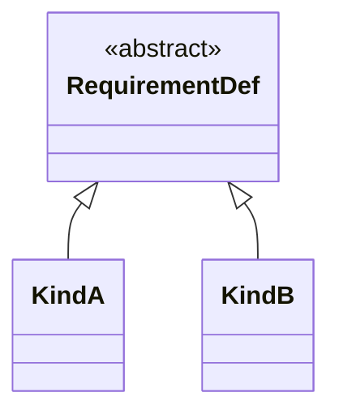

# The requirement analysis model

## 1. What this model is

This is the requirement analysis model, one member of the collection ProjectML metamodels (K19). It is the
**working model**: the model in which a requirement system is actually built, rather than the model handed
to somebody who was not in the room while it was assembled. Six things make it up, and naming all six here
lets a reader see the shape before meeting the parts: `Source`, the material a project starts from; `Need`,
a passage of a source anchored so it can be worked with; `RequirementDef`, the definition a requirement is
produced under; `Requirement`, the bound statement that definition yields; `Decision`, the record of why one
outcome was chosen over another; and the findings a review produces over all of it. This document defines
the first three — `Source`, the edge between sources, and `Need` — in the sections that follow.
`RequirementDef`, the derivation it governs, `Decision` and the findings follow after.

This model **projects** to the requirement model: the product model defined in `01-requirement-model.md`,
which a reader can adopt on its own, without ever having read this document (K20). The projection itself —
what it keeps, what it drops, and on what condition it may drop anything — is defined in section 8 of this
document, once everything the projection draws from has been introduced.

One rule governs everything that follows, and it is stated here because every section after this one assumes
it: **the requirement model changes only through sources** (K11). A review does not update a need, a
definition, or a requirement directly; whatever a review decided — in a meeting, on a call, or by the team's
own judgement, with no other party involved — is itself entered as a source first, and the change follows
from it. This is what keeps the chain total rather than merely well-intentioned: there is no path from
"something changed" back to "nothing said so."

## 2. `Source`

A source carries five things.

| Attribute | Carries |
|---|---|
| identity | A stable identifier, distinct from every other source's |
| text | The material itself, in the words it was given in |
| from | Who or what it came from |
| kind | What kind of material it is |
| date | When it was made |

Three rules govern a source, and each rests on a decision already taken.

1. **A source is material of record.** It is quoted whole and never edited (D45). Everything anchored to a
   source — a need's passage, a citation in a review — points at words that stay exactly as given; if the
   source could change after the fact, an anchor into it would drift from what was actually said, and a
   later reader could no longer tell whether a quotation still means what it meant when it was captured.
2. **A source is never decomposed.** The raw material stays raw rather than being broken into parts and
   classified as it is captured, which would impose a classification taxonomy on it before anyone has asked
   what the material is for (D25).
3. **The kind and from attributes are open.** The metamodel names them and leaves their vocabularies to an
   implementation. The founding record's section 5 records why: EventML's own enumerations for these two
   attributes carry a domain leak — a kind of material and two things it can come from that exist only in
   that domain — and a vocabulary fixed here would carry the same leak into every project that adopts this
   metamodel. K30 makes the same move for a requirement's kind, though through a different mechanism: there
   the vocabulary is carried by specialisation of `RequirementDef` rather than by an attribute. What the two
   share is the metamodel naming a slot and leaving an implementation to fill it.

## 3. The edge between sources

Sources connect to each other through exactly one edge: a later source **`answers`** an earlier one. Four
properties hold of it, each already settled:

- It sits on the later source and names the earlier one it responds to, not the reverse (D35).
- It points backward in time: a source can only answer something that came before it (D38).
- It changes no value on its own. Both the earlier statement and the later one stand as made; which of them
  prevails, if they disagree, is not decided by the edge but by a decision recorded separately (D37).
- One edge relates exactly one source to exactly one source, but a source may carry any number of them —
  answering several earlier sources, or being answered by several later ones (D29).

The founding record's section 5 makes a further finding about this edge worth carrying forward here: `answers`
is the natural closing edge for a review finding. A finding is opened by a source and closed by a later one
that answers it, so closing a finding is not a tick somebody applies to a record — it is itself evidence,
carrying the same source that closes it as everything else in this model does. Section 9 uses the edge on
exactly these terms.

## 4. `Need`

A need carries three things.

| Attribute | Carries |
|---|---|
| identity | A stable identifier, distinct from every other need's |
| passage | The passage of the source the need anchors into |
| value | An optional value, carrying a value state on the same terms as any other value in the collection (see `04-value-states.md`) |

The name is adopted rather than coined: *stakeholder need* is ISO/IEC/IEEE 29148's term (D23).

Three rules govern a need.

1. **A need anchors into exactly one passage of exactly one source.** A need with no anchor fails a
   syntactic check: there is nothing in it to ask a stakeholder about, and nothing for a reviewer to weigh —
   only an omission to fix (D34, D26).
2. **A need carries no lifecycle state.** It belongs to its source, a source is material of record, and a
   quotation cannot cease to be true — there is no state for a need to hold that would ever change while the
   source behind it stays what it was (K6).
3. **A need's value is optional**, and where present it carries a value state like any other value in the
   collection: stated, derived, assumed, unknown, or conflicting (D27).

Passage anchoring adopts the W3C Web Annotation Data Model (D26). No requirements standard was adopted for
it instead, because none serves here: a need anchors into a source before any requirement exists, at a stage
SysML v2 places outside itself and has nothing to say about.

## 5. `RequirementDef`

`RequirementDef` is **abstract**. No element in a model is a `RequirementDef` and nothing more: a definition
exists only as a specialisation of it, and which specialisations exist is declared by an implementation
rather than here (K30). Section 7 gives the reasoning and says what the specialisation relation carries;
this section says what every definition carries, whatever it specialises.

The name is adopted rather than coined. SysML v2 splits an element into a definition and a usage of it, and
`RequirementDef` is the definition half of that split on the same terms: the thing a requirement is produced
under, not the requirement itself.

A definition carries seven things. This is the **core** — what the metamodel can interpret, or can fail on,
without reading anything an implementation supplies (K27).

| Attribute | What it is |
|---|---|
| identity | The definition's identifier |
| name | Human-readable |
| text | The template the requirement's wording is produced from, with places for its parameters |
| when it applies | One sentence stating when this definition comes into play. It is prose, not an evaluable expression (D20). Its absence means applicability has not been written down, which is a gap, not a claim that the definition applies unconditionally |
| parameters | Each parameter declares a value domain. Which domains exist is an implementation's business, exactly as the set of kinds is (K30, and `04-value-states.md` §5) |
| what to ask | For each parameter, how a non-expert is asked for what is missing |
| how it would be verified | The method by which a requirement produced under this definition would be shown to hold. Prose |

Two of the seven bottom out in the value-state model rather than in anything a design language supplies. A
parameter with no value is a value in the unknown state like any other, and the ask is how that value is
obtained from somebody who holds it — which is why *what to ask* sits beside *parameters* and is written per
parameter rather than per definition.

**Why the last row sits on the definition rather than on the requirement.** A verification method is generic
to a kind of requirement: how a thing of this kind would be shown to hold is a property of the kind, and the
definition-and-usage split puts a generic property on the definition. ISO/IEC/IEEE 29148 makes verifiability
a required characteristic of a *requirement* rather than of a definition, and the two statements do not
conflict — a requirement inherits its definition's method, so a requirement produced under a definition that
carries one is verifiable in 29148's sense without carrying the method itself. What is genuinely
instance-side is not the method but what actually verified one particular requirement, and nothing in this
model carries that today; OQ10 records the edge that would (K29).

**What the metamodel does not say about any of the seven is how it is written down.** Two definitions
carrying the same seven things are the same definition to this metamodel however differently they are set
out. Beyond the core, a definition holds whatever an implementation's own notation and rule-set need: the
core is a floor the metamodel can reason over, not a ceiling (K27).

## 6. What is not on a `RequirementDef`, and the two tests

The list in section 5 needs a criterion that outlives it, because the next attribute somebody proposes will
not be one of the seven. Two tests decide the question, and they are stated here in full, because they are
the part of this section a later reader actually reuses.

> **The seam test.** An attribute belongs to the metamodel if the metamodel can interpret it without
> resolving a reference to an element it does not define. Prose that names a design language's things is
> content, and content belongs to an implementation; a typed reference to a design language's element would
> be a second seam.
>
> **The record test.** An attribute belongs to the metamodel if a *stated* metamodel rule can fail on it,
> including on its absence, without reading its content.

The first is K25 and the second is K26. The seam test is the one-seam rule (K3) applied attribute by
attribute rather than only to the relation between the kernel and a design language: an attribute that has to
be resolved into elements the metamodel does not define is a second seam whatever it is called, and it runs
in the direction K3 forbids. The record test is K7's posture made into a criterion, and its load-bearing word
is *stated* — a rule that might one day be written does not qualify, or everything qualifies. Note what the
record test does not require: it is satisfied by a rule that fails on an attribute's **absence**, which is
how *when it applies* and *how it would be verified* pass without anything ever reading their prose.

The two tests are independent, and on the core they agree everywhere.

**The one candidate that fails both.** A rule attached to a definition, stating what must hold of the design
elements a requirement produced under it constrains, names a design language's element kinds. It fails the
seam test, because the metamodel cannot interpret it without resolving those names into elements it does not
define. It fails the record test on the same fact: no stated rule can fail on it without that same
resolution. One structural fact, not two, which is why the verdict is not close. **The metamodel therefore
defines no such concept.** K28 records the candidate under the name it was considered by. An implementation
may introduce one, and nothing is lost that had anywhere else to go, because an implementation is itself a
metamodel for the project models built with it (K16), and the elements such a rule would name are exactly the
ones an implementation and its design language define.

**One finding belongs to phase 2 and is recorded here, beside the test that produces it.** SysML makes a
requirement a specialised constraint whose formal statement is evaluated over its own subject, and the subject
is bound through the satisfy edge. That routes a constraint through the one seam rather than opening a second
— which is what the seam test predicts a design language must do, and it is the difference between a rule that
fails the test and a mechanism that passes it. Whether the seam determines the subject on its own is OQ11, and
settling it is the binding's job.

## 7. Requirement kinds are specialisations

A requirement kind is a **specialisation of `RequirementDef`**, never an attribute on it (K30). Three reasons
carry this, and they are independent of each other.

1. **It is the mechanism the neighbouring language already recommends.** SysML v2's own way of building a
   hierarchy of requirement definitions is specialisation rather than a dependency between them, and SysML
   v1's stereotypes are specialisations too. That is the only external evidence available, since neither form
   is exercised anywhere yet, and house rule 10 says to adopt where a neighbour has already chosen.
2. **It does not fix the number of classification axes; an attribute would fix it at one.** A single kind
   attribute leaves the vocabulary free but silently decides that a definition is classified in exactly one
   respect. An implementation classifying in two respects at once would then have to encode the second inside
   the first. This is D55's argument one level down: a taxonomy the language fixes excludes every design
   language that classifies on another axis, and would make the metamodel unattachable.
3. **It is the same relation the three levels already use.** K16 makes an implementation a metamodel for the
   project models built with it, and what an implementation supplies at that boundary is filled specialisation
   of the types this metamodel defines. Using specialisation for the level boundary and something else for
   kinds would describe one relation twice, in two mechanisms that could then disagree.

**This revises prior art, and does so by permission.** D51–D55 are *imported* rather than inherited — K15
moves their subject into the metamodel, so this repository takes its own decision on it. The one revised is
D53, which has each definition name the kind it belongs to. What the others protect survives: a set of
subtypes is as enumerable and as questionable on its own as the standalone list D52 asked for, a check reads
the type where D53's check read an attribute, and D55 is not revised at all — K30 is how D55 is kept.

The diagram says what the paragraphs above it say: `RequirementDef` is abstract, and a kind is a subtype of
it. `KindA` and `KindB` are placeholders, and they are deliberately not named, because the metamodel declares
no kinds (K15) and naming one here would be a filled definition. The diagram uses the abstraction and
generalisation conventions the diagram language already carries and coins nothing (K32); where it and the
prose disagree, the prose wins.

**What an implementation must do:** declare its kinds, as subtypes of `RequirementDef`. **What the metamodel
does not do:** name any of them, say how many there are, or say on what axis they divide.

**What specialisation means is open.** What a subtype may add to the core of section 5, what it may narrow,
and what if anything it may override is not defined here. That is OQ9, and it waits for something to exercise
it — realistically the first implementation that declares kinds. K30 chooses the mechanism; it does not define
its semantics.

## 8. The derivation, and the projection

### The derivation

A requirement is not written; it is **derived**. The founding record's procedure states the step: a need's
subject selects the definition, and the rules on that definition turn the stater's free words into the
requirement's bound professional wording. The parameters the definition declares are filled from the need and
from whatever else the model already holds, and each filled value carries a value state on the same terms as
any other value in the collection.

**The kind rides along with the definition, and needs are not classified** (K8). This is what keeps the two
axes from colliding: a need is selected against by its subject, and the classification of the requirement that
results is fixed by which definition produced it — by what that definition specialises — so it arrives with
the definition rather than being decided separately. A need carries no kind for the same reason it carries no
lifecycle state — it belongs to its source, and nothing about a quotation is the modeller's to classify.

The edge that records the derivation is the **refinement** edge. It sits on the requirement and names the
needs the requirement was assembled from, by their identifiers (D28). It is list-valued rather than singular,
because a requirement is routinely assembled from more than one statement, and an edge that could name only a
single need would force an arbitrary choice among equally contributing ones (D48). This is the half of a
requirement's origin that `01-requirement-model.md` describes as projected away: it is defined here, where
`Need` is defined, and the invariant that every requirement names its origin is only decidable with this edge
in view.

**The relation between a need's words and a requirement's wording is a semantic constraint** (K24). The
metamodel states what the relation is — a requirement's text is the professional restatement of the needs it
refines — and states what a reviewer must cite when it is found broken: both texts, the need's and the
requirement's. It does not evaluate the relation. This is K7's posture applied to a second subject: the
metamodel defines what the finding is, what must be cited and how it is recorded, and leaves the judgement to
a human or an AI review, because a rule-based test would catch only the restatements somebody anticipated by
writing a rule, which is the case that least needs catching. The wording rules that produce a restatement for
a given kind belong to an implementation, and who reviews it and when belongs to a rule-set.

### The projection

The requirement analysis model **projects** to the requirement model (K20). The projection is a mapping
between two members of the collection rather than an element of either: it has no identity, it is recomputed
whenever it is read, and a design language never binds to it. What a design language binds to is a baseline,
which does have identity (K21).

**What the projection carries** is the requirement model as `01-requirement-model.md` defines it: requirements
with their identity, text and values, the derivation edges between requirements, and the property of being no
longer in force.

**What it drops** is everything this model adds. Sources and the `answers` edge between them; needs and the
refinement edge that names them; definitions, their specialisation hierarchy and therefore the kind of any
requirement (K33); decisions; and findings. A reader of the requirement model alone sees a requirements
register with traceability between requirements and nothing else, which is exactly what makes that document
independently adoptable (K19).

**What it does not drop, against a first reading.** A requirement no longer in force is carried, not dropped.

The strongest reason does not depend on `01-requirement-model.md`'s authority: it is the seam. A design
language binds to the product, and if retirement were dropped at the projection, a requirement that retires
between baselines would not change state in the product at all — it would vanish, and the edge pointing at it
would dangle with nothing recording that a choice was made. That is precisely the failure K5 exists to
prevent, reintroduced at the seam.

K20 closes the escape hatch a second filter would open. A baseline is a named, dated instance of the
requirement model, so a baseline is an instance of what the projection already produced, not a further filter
applied on top of it. There is therefore no second place, downstream of the projection, where retirement could
still be dropped.

`01-requirement-model.md` corroborates this rather than deciding it: it defines the property of being no
longer in force in the product model and argues for it there — the checks are pairwise, so removing a
requirement silences exactly the one check that fired on it and leaves nothing recording that a choice was
made — and its own constraints already assume retired requirements arrive, speaking of every requirement a
baseline contains "in force or not". And K13's condition governs what may be dropped, not what must be: it
asks that everything in force be present and that anything dropped stay recoverable here, and it says nothing
that requires discarding what is no longer in force.

The founding record's section 2 is procedure narrative, not one of the settled decisions K1–K18, so it can be
overridden: it describes a cycle ending in a clean model reached by dropping the model above and the
deprecated requirements. K12 is settled, and is not overridden here — it is read narrowly: its phrase *a cut
of the requirements in force* names what a baseline is for, not an exclusion rule. Recorded as K34 in
`spec/06-decisions.md`.

**The condition on the projection** is K13's, unchanged: everything in force at the moment of the cut is
present, nothing in force is dropped, and everything dropped stays here, in the working model, recoverable.
Nothing the projection drops is deleted by dropping it. That is the whole of what makes the drop legitimate,
and it is why this model, and not the product, is where a project is worked.

## 9. `Decision` and findings

### `Decision`

A **decision** is an act: taken by a named party, on a named date, resolving a choice among genuine
alternatives, and carrying the reasoning that justifies it. The term and its two halves are adopted rather
than coined — ISO/IEC/IEEE 42010 defines an *Architecture Decision* and the *Architecture Rationale* that
stands behind it, and this is that pair, held together in one element.

| Attribute | Carries |
|---|---|
| identity | A stable identifier, distinct from every other decision's |
| the choice | What was decided, and the genuine alternatives it was chosen among |
| by | The party that took it |
| date | When it was taken |
| rationale | The reasoning that justifies the choice over the alternatives |

The vocabulary of the *by* attribute is open, on exactly the terms section 2 sets out for a source's *kind*
and *from*: the metamodel names the attribute and leaves the list of parties to an implementation, because any
list fixed here would carry one domain's parties into every project that adopted the metamodel.

**A decision here carries no edge to what it resolves, and that is a deferral, not an oversight.** Section 3
already relies on a decision to settle a disagreement between two sources — which of two conflicting
statements prevails — and a decision doing that work points at something: the conflicting values, the sources
behind them, or the question it closes. None of the five attributes above name it. Under the house rule that
an unexercised construct waits rather than being defined ahead of the case that would exercise it, leaving the
edge out may well be right — nothing in this collection today reads such an edge to produce a check or a
report — but the gap is recorded here as a gap, so that a later reader who needs the edge finds a deliberate
omission rather than one they have to notice for themselves.

**A decision is not an assumed value, and the difference is how each is resolved.** An assumption is a value
supplied in the absence of information; it may be wrong, and what resolves it is learning — somebody with
standing to know confirms or corrects it, and the value changes state. A decision is a choice made in the
presence of alternatives, and it is not wrong in that sense; what resolves it differently is deciding again,
which under K11 means a new source, and a new decision recorded beside the old one rather than an edit to it.
Recording a decision as an assumed value loses the alternatives and the rationale, which are the two things a
later reader needs most; recording an assumption as a decision puts it on a question list where the honest
answer is to check the reasoning rather than to ask anybody. `04-value-states.md` §3 draws the neighbouring
distinction, between assumed and derived, for the same reason.

### Findings

The model above the requirement model is a **model, not a derived view** (K10). A finding links at least two
elements and must keep its identity between reviews: a recomputed report has no identity across runs, so a
reviewer opening it twice cannot tell whether the thing in front of them is the thing somebody already
adjudicated. K11 is what makes this tractable rather than a maintenance burden — no finding can go stale
unnoticed, because nothing moves beneath it without a source accounting for the move.

Findings come in three kinds, and they do not behave alike.

| Kind | Produced by | Stored? |
|---|---|---|
| A failed check | A script | No — recomputed every run |
| A question | A script | No — recomputed every run |
| A review finding | Judgement | Yes, and it alone can carry a state |

This follows the two-column organisation D50 already uses — what a script decides on one side, what a person
or an agent decides on the other — which is K24's division seen from the reporting end. The first two kinds
are decidable without judgement, so storing them buys nothing and risks staleness: a stored failed check can
outlive the fact that produced it. A review finding cannot be recomputed at all, is lost unless it is stored,
and is therefore the only one of the three with a state to carry — it is open until it is closed.

**Closure is evidence, not a tick.** A review finding is opened by a source and closed by a later source that
`answers` it, on exactly the terms section 3 sets out for that edge. Nothing marks a finding closed directly;
what closes it is a source entering the model, which is K11 holding at the top of the chain as it holds
everywhere else. A finding closed this way carries the material that closed it, so a later reader can read
what was said rather than only that somebody was satisfied.

**Two rules already exist over needs and requirements**, and they sit on opposite sides of the table above.

1. **A need that no requirement refines is reported** (D31). The need was stated and produced nothing, and the
   rule fires wherever that is true. It has two readings — the need may be context rather than something to be
   achieved, or it may be a requirement nobody has written yet — and which reading is right is a judgement,
   not a computation.
2. **A requirement carrying no origin edge at all — neither refinement nor derivation — is a failed check, not
   a question** (K9, D32). The invariant behind it is that every requirement names its origin (D49), and a
   requirement naming none is an incomplete record rather than a root. EventML shipped this as a question
   (D46); K9 overturns that, and [`docs/eventml-decisions.md`](../docs/eventml-decisions.md) records the
   overturn and the consequence that goes with it.

**What to record once somebody adjudicates the first of these is not decided here.** The rule reports the
need; it does not say what a reviewer writes down having examined it and concluded that it deliberately
produced nothing. That question is OQ3, it is open, and it is the next piece of work in this repository after
the current plan. It is left open on purpose: a record that costs nothing to write becomes a way to silence
the rule, which is the same failure deletion would be one model over, and designing against that needs the
argument OQ3 is for rather than a convenient answer taken in passing here.
