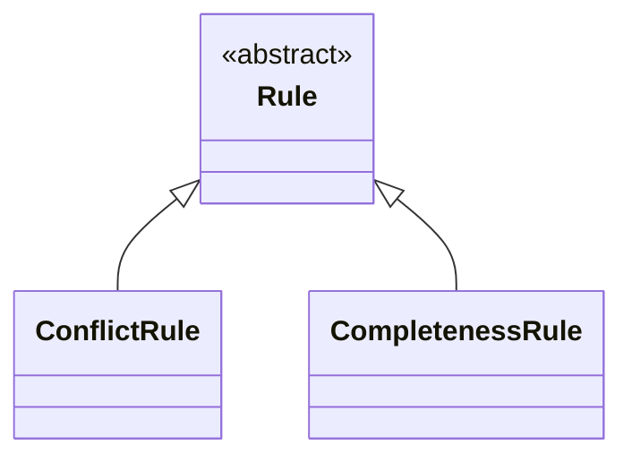

# The Project Lifecycle Model

This is the Project Lifecycle Model, one member of the collection ProjectML metamodels (K19). Neither of its
two central terms is adopted. No standard names the thing meant here by **rule-set**, and none names this
document's own subject either — *Project Lifecycle Model* is coined for the same reason. House rule 10 coins
a term only where no standard has one, and this is that case for both.

## 1. What this is, and what it is not

A **rule-set** is a model: what a project loads to state its own way of working, built with its own metamodel
rather than being a layer of this one (K22). How an organisation manages rule-sets across more than one
project — export, import, version comparison between projects — is out of this model's scope; this document's
own scope is one project, the same scope every other member of the collection keeps (K70). Different teams working in the same domain, on the
same requirement analysis model, load different rule-sets, and they do not thereby stand at different
levels. K16's three levels — metamodel, implementation, project model — are untouched.

The distinction is worth stating plainly, because a reader arrives at the same place a design record already
did before settling K22: a rule-set looks at first like a natural fourth level, one step further down than a
project model, since K15 already speaks of "a base rule-set a project may vary as it runs" in roughly that
position. What makes the three levels a ladder is a relation of *filling*: an implementation fills the
declared points a `RequirementDef` leaves open (K27) and supplies the specialisations of it that give a
requirement its kind (K16, K30); a project model is built out of what the implementation declared. Each level
down adds content at a point the level above deliberately left as a slot for it.

A rule-set does not fill any such point. It does not specialise `RequirementDef`, and it declares no kind. It
says nothing about what a value's domain contains, what a parameter asks for, or what a requirement's wording
should be. What it states instead concerns elements that already exist in full, wherever they occur: how a
gap in one of them is resolved, when waiting on it ends, how a conflict is settled. It governs behaviour over
the requirement analysis model's own elements — the elements `02-requirement-analysis-model.md` already
defines in full — rather than adding content beneath a domain implementation's declarations. That is why a
rule-set sits *beside* a domain implementation, as a separate model referring to the same elements, and not
*beneath* it as one further step of specialisation. Two teams sharing an implementation can disagree about
how a gap is resolved without either of them having climbed down a level the other stayed on.

## 2. What a rule-set may state

A rule-set states four kinds of thing. That count is what the evidence found so far supports, not a ceiling
the metamodel places on it: the list is not closed at four either, and an implementation needing to state a
fifth kind of thing is evidence the metamodel must then account for, not a violation of it.

**The same argument applies here as one level over.** A requirement kind is deliberately not fixed by the
metamodel, and the reason is structural rather than a courtesy: a fixed taxonomy would fix a single
classification axis, and would make the metamodel unattachable to a design language that classifies on
another axis (K30). A closed list of statement kinds a rule-set may make would fix the same mistake one level
up — it would bake one way of thinking about how a rule-set governs behaviour into the metamodel itself,
which is exactly what K22 and K23 exist to refuse: a rule-set is a model of its own, built with its own
metamodel, precisely so that an adopting organisation's way of working is not fixed into this one.

Each of the three found so far closes a gap `02-requirement-analysis-model.md` leaves open on purpose,
because closing it there would fix an organisation's way of working into the metamodel itself. Recorded as
K42 in [`06-decisions.md`](06-decisions.md).

| A rule-set states | The gap it fills |
|---|---|
| Whether an applied default may be silent, or must be owned by somebody | Nothing today says which defaults are a choice somebody must answer for |
| When a gap stops being waited on and becomes a decision | Nothing today says at what point waiting ends |
| How a conflict of a given kind is resolved | Nothing today says who resolves what, or how |
| Which other requirement kinds a given kind implies should also be present | Nothing today says whether one requirement's kind, on its own, calls for other kinds to co-exist |

The first three are not proposed here; they are measured. EventML's v0.5 record counted what its 22 written
requirement definitions already carried — when a definition applies, what it needs, how a missing value is
asked for, how it would be verified — and found exactly these three missing, each sitting at the moment
somebody has to act rather than merely read. The founding record's OQ6 reasons from that same list when it
argues the kernel needs a repository of its own, on the ground that not one item on it is specific to any one
domain: the three statements above are kernel material for the same reason the rest of that list was.

**The fourth was not found the same way, and is kernel material on a different ground.** It was not among
EventML's own v0.5 gaps; it surfaced instead while working out how a `RequirementQuestion` references what
fires on it (`02-requirement-analysis-model.md` §11), and section 3's `CompletenessRule` states its mechanism.
It passes the same test the other three do — nothing about which requirement kinds imply which companions is
specific to any one domain — which is what earns it a place in this table on K42's own terms rather than as an
exception to them.

**They are stated per kind, not per definition.** A rule-set says how a default belonging to a kind of
requirement is treated, how long a gap of that kind is waited on, how a conflict between requirements of that
kind is resolved — not how one particular definition's default is treated. This is why K30's kinds have to
exist before a rule-set is useful at all: a rule-set speaks about a classification the metamodel provides the
mechanism for and an implementation fills, and it has nothing to attach a statement to until that
specialisation hierarchy exists.

## 3. `RuleSet` and `Rule`

The diagram draws what this section states; where the two disagree, the prose wins. Two more `Rule`
specialisations are named but not yet shaped — see the end of this section — and are left off the diagram for
the same reason a design record leaves an open question out of a decision table: nothing here defines them
yet.

### `RuleSet`

A **`RuleSet`** belongs to a `RequirementDef` — zero or one per `RequirementDef` — not to a project as a whole
(K68). It gathers the `Rule`s stated over that `RequirementDef` specifically. There is no reification of
"everything a project has loaded" as an element of its own.

This is the natural unit, on two grounds. Section 2 already states that a rule-set's statements are *"stated
per kind, not per definition"* — and a kind is exactly a `RequirementDef` (`02-requirement-analysis-model.md`
§9, K30) — so attaching a `RuleSet` at the `RequirementDef` is following that sentence rather than adding to
it. And it narrows the search a check needs to run: finding every `Rule` that could apply to a `Requirement`
is walking that `Requirement`'s own `RequirementDef` ancestry and reading each node's own `RuleSet`, not
filtering a project-wide collection by a separate reference naming which `RequirementDef` a `Rule` applies to.
A design carrying a `Rule.appliesTo` reference, pointing at an arbitrary `RequirementDef` node, does the same
job at the cost of a second mechanism where the attachment itself already suffices — it is not adopted.

**A `Rule` attached to a `RequirementDef` applies to every specialisation of it, not only to that node**
(K69). This needs no mechanism of its own beyond the specialisation tree K30 already builds: a rule stated at
the root applies everywhere beneath it; a rule stated three levels down applies only beneath that point. A
project's most consequential rules — *"no requirement may contradict an active one,"* below — belong at the
root precisely because they should reach every kind a project declares, without being restated once per leaf
kind.

### `Rule`

`Rule` is **abstract**. Its specialisations divide by **mechanism** — what happens when the rule fires — not
by section 2's four descriptive rows, which remain a description of *subject matter*, closer to an open,
`Source.kind`-shaped label than to a type boundary (K71). The two axes are independent and do not correlate
one-to-one: two different subject-matter rows below share the same mechanism shape — *detect a gap, then
raise a `RequirementQuestion` subtype* — while the other two have no worked-out mechanism at all, and may turn
out to need something structurally different, from each other as much as from these two.

Two mechanisms are worked out here: `ConflictRule` and `CompletenessRule`, below. Two more — a
silent-vs-owned-default rule and a gap-timeout rule, section 2's first and second rows — are not, and this
document does not claim they share this shape merely because they would sit in the same abstract type's
specialisation list; whether either does is recorded as OQ18 in `06-decisions.md` (K72).

### `ConflictRule`

A `ConflictRule` fires when a new `Requirement` contradicts an existing in-force one, and raises a
`RequirementChoice` (`02-requirement-analysis-model.md` §11) naming the alternatives a reviewer must choose
among (K73). *"No requirement may contradict an active requirement,"* stated once at the `RequirementDef`
root and inherited everywhere by the rule above, is this mechanism's canonical case. This sharpens section 2's
third row — *how a conflict of a given kind is resolved* — which describes only the resolution half;
detection is the other half a `Rule` must also carry, and resolution is exactly what a `RequirementChoice`,
discharged by a `RequirementDecision`, records.

### `CompletenessRule`

A `CompletenessRule` fires when a `RequirementDef` kind is present without an implied companion kind, and
raises a `RequirementInquiry` (`02-requirement-analysis-model.md` §11) (K74). This is the case section 2's
fourth row now states directly: *"which other requirement kinds a given kind implies should also be
present."*

**The check is set-level, not per-instance.** It asks whether at least one `Requirement` of the implied kind
exists anywhere the rule's `RequirementDef` reaches, never whether every triggering `Requirement` has its own
(K75). Consequently, while a given `CompletenessRule`'s gap stays open, a newly triggering `Requirement`
extends the existing open `RequirementInquiry`'s list of triggering requirements rather than raising a second
one: **at most one open `RequirementInquiry` per `Rule` at a time.** Reading the check as a query over current
state, rather than a per-instance obligation, is what keeps a growing model from re-triggering the same rule
combinatorially — once the implied kind exists once, the query returns no gap for every requirement
thereafter, without anything needing to be closed by hand.

### Matching a `Rule`'s condition

**Whether a `Rule`'s free-text condition holds of a free-text `Requirement` is a semantic constraint (K24),
not a syntactic one** (K76). The metamodel does not guarantee this runs exhaustively or automatically; it is
carried out by judgement, human or AI, on the same terms `00-overview.md` §5 and
`02-requirement-analysis-model.md` §11 already hold extraction completeness to (K40, K41). Both a `Rule`'s
condition and a `Requirement`'s wording are prose; nothing decides whether one matches the other without
reading content.

## 4. What the metamodel does not do

**The metamodel states no rules.** It names this model and says what a rule-set may state; the rule itself —
which defaults are silent, how long a given kind waits, how a given conflict resolves — belongs to whoever
adopts the metamodel and writes a rule-set to run under it. This is the same move K15 makes for requirement
kinds: the metamodel provides the slot and the shape of what may go into it, and something below fills it
(K23).

One further thing is deliberately left out, not merely unfilled. EventML's own record does not stop at the
three gaps above: it groups its 22 definitions by where each one came from, and finds that what resolves a
missing value differs by which group a definition falls into, because who could be asked differs. That
grouping is **a finding about one domain, not a metamodel construct** — EventML's own record calls it a
finding rather than a decision, offered once as a fixed classification and set aside in favour of leaving a
definition's classification to an implementation (K23; D54, through
[`docs/eventml-decisions.md`](../docs/eventml-decisions.md)). D54 keeps that domain's own project-management
reasoning off a definition entirely; this document is where the corresponding metamodel material lives
instead, and it says only that the resolution of a gap differs by kind and that a rule-set is what states
how. It does not say what the kinds are, how many origins split them, or which one answers which gap — an
implementation classifies its kinds however it needs to, and a rule-set speaks to whatever classification
results, on terms this document does not fix.

## 5. How this answers OQ4

The founding record's OQ4 asked whether the metamodel names the loop's steps normatively, and put three
options: entities only; entities plus the procedure's steps as a normative process; or entities plus
lifecycle states with no process prescribed. The third was recommended, on the ground that a prescribed
process is the part most likely to collide with an adopting organisation's own way of working, and so the
least portable thing the metamodel could fix.

K22 and K23 are a fourth option the founding record did not have, and it does better than any of the three:
the metamodel neither prescribes a process nor stays silent about one, but provides the means to model one.
The concern that made the third option attractive — that a process is the least portable thing a metamodel
could make normative — is exactly what makes this option work rather than counting against it, because a
rule-set is built to differ per organisation by design. Two organisations running the same procedure over the
same requirement analysis model can load rule-sets that disagree on all three of section 2's questions
without either one being wrong, and without the metamodel having taken a position on which is right.
