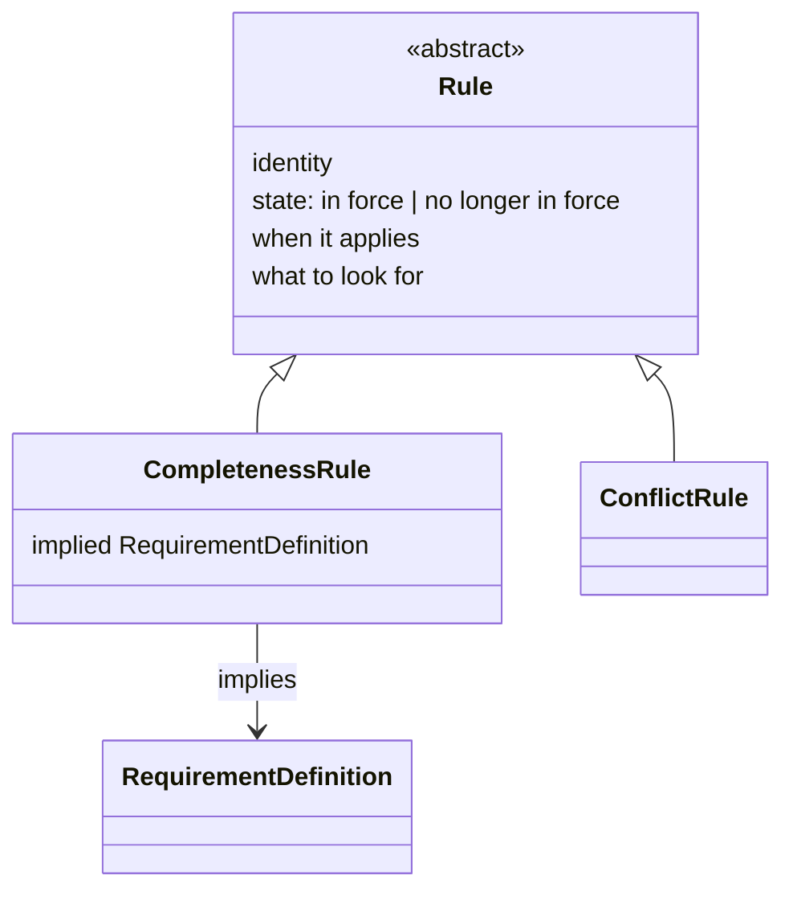
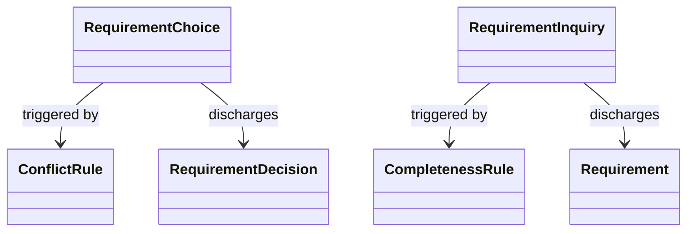
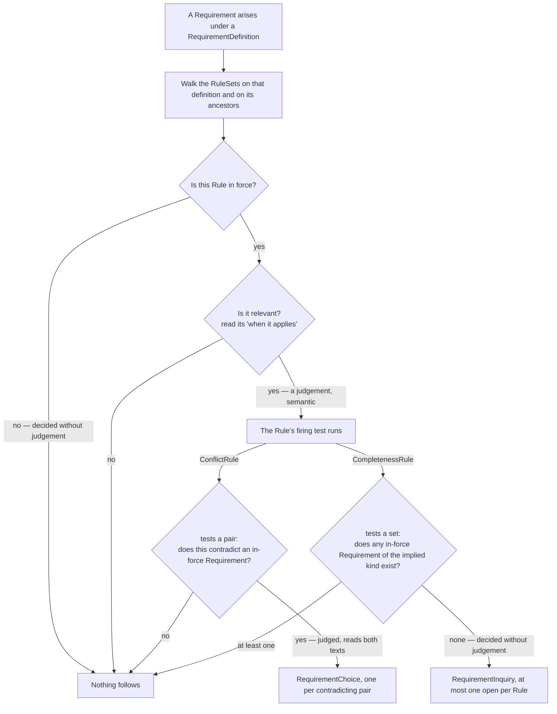

# The Project Lifecycle Model

This is the Project Lifecycle Model, one member of the collection ProjectML metamodels (K19). Neither of its
two central terms is adopted. No standard names the thing meant here by **rule-set**, and none names this
document's own subject either — *Project Lifecycle Model* is coined for the same reason. House rule 10 coins
a term only where no standard has one, and this is that case for both.

## 1. What this is, and what it is not

A **rule-set** is a model: what a project loads to state its own way of working, built with its own metamodel
rather than being a layer of this one (K22). How an organisation manages rule-sets across more than one
project — export, import, version comparison between projects — is out of this model's scope; this document's
own scope is one project, the same scope every other member of the collection keeps (K70). Different teams working in the same domain, on the
same requirement analysis model, load different rule-sets, and they do not thereby stand at different
levels. K16's three levels — metamodel, implementation, project model — are untouched.

The distinction is worth stating plainly, because a reader arrives at the same place a design record already
did before settling K22: a rule-set looks at first like a natural fourth level, one step further down than a
project model, since K15 already speaks of "a base rule-set a project may vary as it runs" in roughly that
position. What makes the three levels a ladder is a relation of *filling*: an implementation fills the
declared points a `RequirementDefinition` leaves open (K27) and supplies the specialisations of it that give a
requirement its kind (K16, K30); a project model is built out of what the implementation declared. Each level
down adds content at a point the level above deliberately left as a slot for it.

A rule-set does not fill any such point. It does not specialise `RequirementDefinition`, and it declares no kind. It
says nothing about what a value's domain contains, what a parameter asks for, or what a requirement's wording
should be. What it states instead concerns elements that already exist in full, wherever they occur: how a
gap in one of them is resolved, when waiting on it ends, how a conflict is settled. It governs behaviour over
the requirement analysis model's own elements — the elements `02-requirement-analysis-model.md` already
defines in full — rather than adding content beneath a domain implementation's declarations. That is why a
rule-set sits *beside* a domain implementation, as a separate model referring to the same elements, and not
*beneath* it as one further step of specialisation. Two teams sharing an implementation can disagree about
how a gap is resolved without either of them having climbed down a level the other stayed on.

## 2. What a rule-set may state

A rule-set states four kinds of thing. That count is what the evidence found so far supports, not a ceiling
the metamodel places on it: the list is not closed at four either, and an implementation needing to state a
fifth kind of thing is evidence the metamodel must then account for, not a violation of it.

**The same argument applies here as one level over.** A requirement kind is deliberately not fixed by the
metamodel, and the reason is structural rather than a courtesy: a fixed taxonomy would fix a single
classification axis, and would make the metamodel unattachable to a design language that classifies on
another axis (K30). A closed list of statement kinds a rule-set may make would fix the same mistake one level
up — it would bake one way of thinking about how a rule-set governs behaviour into the metamodel itself,
which is exactly what K22 and K23 exist to refuse: a rule-set is a model of its own, built with its own
metamodel, precisely so that an adopting organisation's way of working is not fixed into this one.

Each of the four found so far closes a gap `02-requirement-analysis-model.md` leaves open on purpose,
because closing it there would fix an organisation's way of working into the metamodel itself. Recorded as
K42 in [`06-decisions.md`](06-decisions.md).

| A rule-set states | The gap it fills |
|---|---|
| Whether an applied default may be silent, or must be owned by somebody | Nothing today says which defaults are a choice somebody must answer for |
| When a gap stops being waited on and becomes a decision | Nothing today says at what point waiting ends |
| How a conflict of a given kind is resolved | Nothing today says who resolves what, or how |
| Which other requirement kinds a given kind implies should also be present | Nothing today says whether one requirement's kind, on its own, calls for other kinds to co-exist |

The first three are not proposed here; they are measured. EventML's v0.5 record counted what its 22 written
requirement definitions already carried — when a definition applies, what it needs, how a missing value is
asked for, how it would be verified — and found exactly these three missing, each sitting at the moment
somebody has to act rather than merely read. The founding record's OQ6 reasons from that same list when it
argues the kernel needs a repository of its own, on the ground that not one item on it is specific to any one
domain: the three statements above are kernel material for the same reason the rest of that list was.

**The fourth was not found the same way, and is kernel material on a different ground.** It was not among
EventML's own v0.5 gaps; it surfaced instead while working out how a `RequirementQuestion` references what
fires on it (`02-requirement-analysis-model.md` §11), and section 3's `CompletenessRule` states its mechanism.
It passes the same test the other three do — nothing about which requirement kinds imply which companions is
specific to any one domain — which is what earns it a place in this table on K42's own terms rather than as an
exception to them.

**They are stated per kind, not per definition.** A rule-set says how a default belonging to a kind of
requirement is treated, how long a gap of that kind is waited on, how a conflict between requirements of that
kind is resolved — not how one particular definition's default is treated. This is why K30's kinds have to
exist before a rule-set is useful at all: a rule-set speaks about a classification the metamodel provides the
mechanism for and an implementation fills, and it has nothing to attach a statement to until that
specialisation hierarchy exists.

## 3. `RuleSet` and `Rule`

```mermaid
classDiagram
    class Rule {
        <<abstract>>
        identity
        state: in force | no longer in force
        when it applies
        what to look for
    }
    class CompletenessRule {
        implied RequirementDefinition
    }
    Rule <|-- ConflictRule
    Rule <|-- CompletenessRule
    CompletenessRule --> RequirementDefinition : implies
```

The diagram draws what this section states; where the two disagree, the prose wins. `ConflictRule` carries
nothing of its own, which is a decision rather than an omission and is argued in its own subsection below.
Two further `Rule` specialisations are named but not shaped — see the `Rule` subsection — and are left off the
diagram for the same reason a design record leaves an open question out of a decision table: nothing here
defines them yet.

### `RuleSet`

**Exactly one `RuleSet` belongs to each `RequirementDefinition`, and it may be empty** (K82) — not one per
project as a whole (K68). It gathers the `Rule`s stated over that `RequirementDefinition` specifically.
There is no reification of "everything a project has loaded" as an element of its own.

Making it exactly one rather than zero-or-one removes a distinction that carries no meaning: a
`RequirementDefinition` with no rules stated over it and one holding an empty `RuleSet` are the same state
of affairs, and modelling them apart would add a null case to every reading of the structure without
buying anything. What is left is a `RuleSet` that is in effect a property of the `RequirementDefinition`,
modelled separately because K22 makes a rule-set a model in its own right.

This is the natural unit, on two grounds. Section 2 already states that a rule-set's statements are
*"stated per kind, not per definition"* — and a kind is exactly a `RequirementDefinition`
(`02-requirement-analysis-model.md` §9, K30) — so attaching a `RuleSet` at the `RequirementDefinition`
is following that sentence rather than adding to it. And it narrows the search a check needs to run:
finding every `Rule` that could apply to a `Requirement` is walking that `Requirement`'s own
`RequirementDefinition` ancestry and reading each node's own `RuleSet`, not filtering a project-wide
collection by a separate reference naming which `RequirementDefinition` a `Rule` applies to. A design
carrying a `Rule.appliesTo` reference, pointing at an arbitrary `RequirementDefinition` node, does the
same job at the cost of a second mechanism where the attachment itself already suffices — it is not
adopted.

**A `Rule` attached to a `RequirementDefinition` applies to every specialisation of it, not only to that node**
(K69). This needs no mechanism of its own beyond the specialisation tree K30 already builds: a rule stated at
the root applies everywhere beneath it; a rule stated three levels down applies only beneath that point. A
rule that should reach every kind beneath some point belongs at that point rather than being restated once
per leaf kind: a project holding that every technical requirement implies a requirement for somebody to
operate what it describes states that once, high in the tree, and every technical kind inherits it.

### `Rule`

**A `Rule` directs attention; it does not prescribe an outcome** (K83). It states which subjects must be
dealt with when a requirement arises under the `RequirementDefinition` it hangs on — never what the
resulting requirement should say. This is what keeps a rule-set from quietly becoming a second definition
layer: a `RequirementDefinition` says what a requirement of some kind looks like, and section 1 already
places what a requirement's wording should be outside a rule-set's territory entirely.

**A negative answer to a subject a rule raises is a full answer.** Where a project decides it needs nothing in
the subject raised, that decision appears as a `Requirement` like any other, and the `RequirementInquiry` raised
for that subject `discharges` to it; while no such `Requirement` exists, the question stands open, which is
`02-requirement-analysis-model.md` §11's existing rule rather than a new one (K79). That closing `Requirement`
is produced the ordinary way — a source, a `SourceNeed`, `refine` — never by the question itself, so the
commitment still enters through a source (K11) and the modeller's own instrument does not commit the project. A
subject raised and declined therefore leaves a record, and a later reader asking why some subject carries no
requirement finds an answer rather than silence. This is the inquiry case specifically: a conflict raises no
subject to decline, but alternatives to choose among, which `RequirementChoice` carries instead (K79).

`Rule` is **abstract**, and carries four things, read by the walk below in this order.

| Attribute | Carries |
|---|---|
| identity | Local to the `RequirementDefinition` that owns it; the full identifier is the composition of the two (K85) |
| state | One of "in force" or "no longer in force". Read mechanically, before anything is judged (K97) |
| when it applies | One sentence stating when this rule is relevant. Prose, not an evaluable expression, on the same terms `02-requirement-analysis-model.md` §7's own *when it applies* is prose (D20) |
| what to look for | What this rule seeks in the model: what has to be found, never what the answer should be (K83, K91) |

**The two prose attributes are split so that the judgement below reads one of them rather than the whole
rule.** Neither form is coined: a `RequirementDefinition` already carries a *when it applies* on exactly
these terms, and a *what to ask* one level up. House rule 10 is met by adopting this collection's own
established forms rather than inventing a third.

**The second is named for what it seeks, not for what it raises** (K91). Where a rule looks for something
**absent**, what it is looking for and what somebody must then deal with are one sentence — which is why an
earlier reading described this attribute as the subject a rule raises. Where a rule looks for a **present**
clash, the two come apart: the rule states what counts as a contradiction, while the subject anybody deals
with is the particular pair found, which is instance-side and sits on the `RequirementChoice` the firing
raises. The subject-reading is a special case of the seeking-reading, so the attribute common to every rule
is named for the general one.

**The identity is local because the attachment already is.** A `Rule` is reachable only through the
`RuleSet` of the `RequirementDefinition` that owns it, so an identifier unique beneath that owner is unique
in the model. **How the composition is written down is not fixed here**: spelling out a composed identifier
would be notation, which K15 excludes, and an implementation's identifier space is exactly what
`05-binding-contract.md`'s third declaration already leaves to it (K4).

**A `Rule` is never deleted; it is taken out of force** (K97). It carries one of "in force" or "no longer in
force", on exactly the terms `01-requirement-model.md` §3 and `02-requirement-analysis-model.md` §10 already
hold a requirement to (K5) — the vocabulary is that one rather than a synonym coined beside it. The reason is
`02-requirement-analysis-model.md` §11's own: every `RequirementQuestion` names the `Rule` that produced it,
without exception, and one naming none is not a well-formed element at all (K87). A deletable `Rule`
withdraws the target of that reference, taking back the strongest thing this collection says about a
question's cause — that it is not merely guaranteed to exist but named.

**Taking a rule out of force is the project manager's act, never the modeller's.** This is the mirror of what
this subsection already states in the other direction: adopting a rule commits the project to checking it,
and what commits the project is the project manager's to do. The modeller does not *skip* a rule that is no
longer in force — it never reaches them, filtered out by the same walk that selects which `RuleSet`s reach a
requirement at all.

**A state is not provenance, and K88 below is untouched.** What caused a rule to be adopted or retracted
stays outside this model and enters, like every commitment, as a source (K11). The *fact* is recorded here
because the walk cannot run without reading it and because K87 needs the rule to persist; the *cause* stays
where K88 puts it.

**A rule leaving force does not close the questions it raised.** Retraction is not an answer, and an open
question stands until something closes it the ordinary way. Where the answer is that the project needs
nothing in the subject, that is a full answer and appears as a `Requirement` like any other (K83) — a path
resting on premises `06-decisions.md` records as OQ26.

**A `Rule` specialisation is fixed by what its firing test ranges over, and every other difference between
specialisations follows from it** (K90). `ConflictRule` tests a **pair** — the requirement that arose against
one already in force. `CompletenessRule` tests a **set** — the requirements the implied kind would have to
appear among. Section 2's four descriptive rows are not this axis and never were: they remain a description
of *subject matter*, closer to an open, `Source.kind`-shaped label than to a type boundary (K71), and they
predict a mechanism in neither direction.

Each consequence below is derived rather than stipulated. A pairwise test has both elements present when it
fires, so there is something to choose between: it yields alternatives, hence a `RequirementChoice`; each
pair is its own case, hence as many open questions as there are pairs; and deciding whether one requirement
contradicts another reads both texts, hence a judgement. A set-level test finds something **absent**, so
there is nothing to choose between: it yields a gap, hence a `RequirementInquiry` carrying nothing beyond the
shared shape; the gap is one property of the whole set, hence at most one open at a time; and deciding
whether any requirement of a kind exists reads no text at all, hence no judgement.

**One sentence accounts for what each specialisation carries, and for the inversion between the two sides.**
On the question side, `RequirementChoice` carries something extra and `RequirementInquiry` carries nothing
(`02-requirement-analysis-model.md` §11, K80); on the rule side this reverses. The reason is that **an
absence must be named in advance, where a presence can be read at firing time**: a pairwise rule needs to
carry nothing, because at firing both elements stand in the model, while a set-level rule must name its
target in advance, because the target is not there to be read.

**A `Rule`'s attachment determines what *triggers* it, not what its test ranges over** (K92). The inheritance
above says which requirements bring a rule into play; the test then ranges over the project model. The two
cannot be the same thing: a rule stated on one `RequirementDefinition` may look for requirements produced
under another, anywhere in the specialisation tree, and searching only the owner's own subtree would find
nothing in any project. This corrects the reach the `CompletenessRule` subsection below once stated for its
own check (K75), not that check's set-level verdict.

Two specialisations are worked out here: `ConflictRule` and `CompletenessRule`, below. Two more — a
silent-vs-owned-default rule and a gap-timeout rule, section 2's first and second rows — are not. Placed on
this axis, each ranges over something neither of the worked two does — a single value, and an open question
together with elapsed time — and each is held by a prerequisite the collection does not yet meet; both are
recorded as OQ18 in `06-decisions.md` (K72, K90).

### `ConflictRule`

A `ConflictRule` fires when a `Requirement` that has arisen contradicts one already in force, and raises a
`RequirementChoice` (`02-requirement-analysis-model.md` §11) naming the alternatives a reviewer must choose
among (K73). Its canonical case is a conflict **between two kinds**, on terms somebody had to state because
nothing in the model could find them: a requirement for catering whose headcount falls short of a requirement
stating how many people are expected. Neither requirement is wrong on its own, no parameter they share is in
dispute, and the relation between the two kinds is exactly what the rule carries. This sharpens section 2's
third row — *how a conflict of a given kind is resolved* — which describes only the resolution half;
detection is the other half a `Rule` must also carry, and resolution is exactly what a `RequirementChoice`,
discharged by a `RequirementDecision`, records.

**A `ConflictRule` carries nothing beyond the shape every `Rule` has** (K96). This asks to be justified rather
than merely stated, because both specialisations relate two requirement kinds and only the other one names
its partner in a typed reference. The difference is the one the axis above draws: a `ConflictRule`'s partner
is **present** when the rule fires, and the judgement reads it anyway, so naming that partner in the prose of
*what to look for* is sufficient. Narrowing mechanically what must be examined before the judgement runs is a
guard, and belongs to the question `06-decisions.md` records as OQ21 rather than to this type.

**There is no universal contradiction rule, and this model states none** (K98). A rule holding that no
requirement may contradict an in-force one — stated once at the root and inherited everywhere — reads as this
mechanism's most obvious case and is not a `Rule` at all. Every one of the four attributes above degenerates
on it: *when it applies* is "always"; *what to look for* restates the type's own name; its state could never
be anything but in force; and its identity exists only so that a question has something to name. Four vacuous
attributes is not a badly written rule but the mark of something that is not one, because a rule-set states
how **this project** works, and this is true of every project and carries no content.

**What such a rule would have covered is already covered, three ways.** Where two sources disagree about the
same thing, the value-state model carries it and needs no rule: `04-value-states.md` §2's **conflicting**
state holds the competing values, each with its source. Where two different kinds are incompatible on terms
somebody had to state, that is a `ConflictRule` — the case above. Whatever neither covers requires judgement
and follows no procedure, which makes it a review, the third of the checking modes
`02-requirement-analysis-model.md` §11 names. **No fourth checking mode is needed**, and introducing one here
would add a construct nothing exercises.

### `CompletenessRule`

A `CompletenessRule` fires when a `RequirementDefinition` kind is present without an implied companion kind, and
raises a `RequirementInquiry` (`02-requirement-analysis-model.md` §11) (K74). This is the case section 2's
fourth row now states directly: *"which other requirement kinds a given kind implies should also be
present."*

**A `CompletenessRule` names the kind it implies, by a reference to a `RequirementDefinition`, beside the
prose of *what to look for*** (K93). This is the one place a `Rule` carries a typed reference, and it is
necessary rather than merely permitted: the implied kind is **absent** when the rule fires, so nothing about
it can be read from the model, and a rule that had not named it in advance could not run its own test. It
opens no second seam, `RequirementDefinition` being an element this metamodel defines
(`02-requirement-analysis-model.md` §7) rather than one a design language supplies — which is the whole
difference between this reference and the candidate §8 of that document rejects. What the metamodel states is
that the reference exists; **which** definition any rule names is a project's business, on the same terms as
everything else a rule-set holds.

**Exactly one implied `RequirementDefinition` per `CompletenessRule`** (K94). A kind implying several
companions is several rules, not one rule naming several kinds. The reason is machinery already in place
rather than tidiness: at most one `RequirementInquiry` per rule is open at a time, and `discharges` names
exactly one `Requirement` (`02-requirement-analysis-model.md` §11, §12). A rule naming five implied kinds,
three of them missing, would open one inquiry covering three gaps, which no single `Requirement` could
discharge and nothing could therefore close. Separate rules also give the behaviour anybody would want: where
one implied kind is present and another is not, one question opens rather than several.

**The check is set-level, not per-instance.** It asks whether at least one **in-force** `Requirement`
produced under the implied `RequirementDefinition`, **or under any specialisation of it**, exists **in the
project model** — never whether every triggering `Requirement` has its own (K75, K95). All three
qualifications carry weight. *In force*, because a retired requirement stays in the model
(`02-requirement-analysis-model.md` §10, K5) and does not fill a gap. *Or any specialisation*, because the
definition tree is a kind hierarchy, so a more specific kind satisfies a more general implication. *In the
project model*, which is the separation stated above: the owner's subtree is where a rule is triggered,
never where its target is found. Consequently, while a given `CompletenessRule`'s gap stays open, a newly
triggering `Requirement` extends the existing open `RequirementInquiry`'s list of triggering requirements
rather than raising a second one: **at most one open `RequirementInquiry` per `Rule` at a time.** Reading
the check as a query over current state, rather than a per-instance obligation, is what keeps a growing
model from re-triggering the same rule combinatorially — once the implied kind exists once, the query
returns no gap for every requirement thereafter, without anything needing to be closed by hand.

**What the set-level reading cannot express, said where a reader will need it.** One in-force requirement of
the implied kind anywhere satisfies the rule for every triggering requirement, and this model has no way to
say that each of them needs its own. That is deliberate, taken against a growing model re-triggering the same
rule combinatorially. Where per-instance behaviour is actually wanted, it is obtained by refining the implied
kind rather than by changing the check: a rule stated further down the tree implies a more specific companion
kind, and the set-level question then asks the narrower thing.

**The same move marks the limit on what a rule may imply at all.** A rule may imply a more specific kind
wherever an implementation declares one; it may never state what a requirement of the implied kind should
say. **An implied kind, yes; an implied parameter value, never.** That line is what keeps a rule-set from
becoming a second definition layer, and it is the same one the `Rule` subsection above draws in saying a rule
never states what the resulting requirement should say (K83).

### What each firing produces

```mermaid
classDiagram
    RequirementChoice --> ConflictRule : triggered by
    RequirementInquiry --> CompletenessRule : triggered by
    RequirementChoice --> RequirementDecision : discharges
    RequirementInquiry --> Requirement : discharges
```

The diagram draws what this section and `02-requirement-analysis-model.md` §11 state between them; where a
diagram and the prose disagree, the prose wins. **The edge directions are the point.** There is no *raises*
edge in this model: a `RequirementQuestion` carries *triggered by* toward its `Rule`, so nothing leads from a
rule down to the questions it produced. They are found by querying, exactly as the requirements produced under
a definition are.

### Walking a `RuleSet`

**A `RuleSet` is a written procedure, and matching is a relevance judgement made while walking it** (K86).
When a new requirement arises in a subject, the `RuleSet`s that reach it are walked. A rule no longer in
force is passed over without anything being read (K97); of the rest, a reader — human or AI — judges which
are relevant by reading each rule's *when it applies*. This is not the evaluation
of a condition for its truth value against a requirement, which is how K76 first described it; that
description is corrected here, its verdict is not.

**The verdict stands: this is a semantic constraint (K24), not a syntactic one.** The meaning of free text is
matched against the meaning of free text, which no conventional algorithm decides. The metamodel does not
guarantee the walk runs exhaustively or automatically; it is carried out by judgement, on the same terms
`00-overview.md` §5 and `02-requirement-analysis-model.md` §11 already hold extraction completeness to (K40,
K41).

**Which `RuleSet`s reach a requirement needs no new concept.** A `RuleSet` hangs on a
`RequirementDefinition`, and the `RequirementDefinition` hierarchy is the subject hierarchy — so the rules
relevant in a subject are exactly those on that `RequirementDefinition` and its ancestors, which is the walk
the rule above already defines (K69). Nothing here adds a notion of *subject* beside the one the
specialisation tree already carries.

**Two steps happen to a rule in force, and only the first is common to every rule.** Judging relevance reads
*when it applies* and is the same act whatever the rule is. What follows when a rule is found relevant — the
firing test — differs by specialisation, and is not uniformly a judgement: a `ConflictRule`'s test reads two
requirements' texts and cannot be decided without doing so, where a `CompletenessRule`'s asks whether a
requirement of some kind exists and reads no text at all. The semantic classification above holds because of
the first step, which every walk runs; it does not follow that everything after it is judged.

```mermaid
flowchart TD
    A["A Requirement arises under a RequirementDefinition"]
    A --> B["Walk the RuleSets on that definition and on its ancestors"]
    B --> S{"Is this Rule in force?"}
    S -->|"no — decided without judgement"| Z["Nothing follows"]
    S -->|"yes"| C{"Is it relevant?<br/>read its 'when it applies'"}
    C -->|"no"| Z
    C -->|"yes — a judgement, semantic"| D["The Rule's firing test runs"]
    D -->|"ConflictRule"| E{"tests a pair:<br/>does this contradict an in-force Requirement?"}
    D -->|"CompletenessRule"| F{"tests a set:<br/>does any in-force Requirement of the implied kind exist?"}
    E -->|"no"| Z
    E -->|"yes — judged, reads both texts"| G["RequirementChoice, one per contradicting pair"]
    F -->|"at least one"| Z
    F -->|"none — decided without judgement"| H["RequirementInquiry, at most one open per Rule"]
```

The diagram draws what this section states; where the two disagree, the prose wins. **It draws this model's
own mechanism and not a project's way of working**: who walks a `RuleSet`, when, how often, and how that sits
beside a review are deliberately unstated here, and section 5 says why. Nothing in it promises the walk runs
exhaustively or automatically — this subsection already refuses that guarantee, and the diagram is read
under it.

### What a `Rule` does not carry

**A `Rule` carries no provenance: this model does not record what produced a rule or who approved it**
(K88). This is K46's boundary seen from the other side. K46 stops provenance at the source because the
metamodel cannot see the procedures behind a stakeholder's words; a rule-set is one of those procedures —
an organisation's or a project manager's own way of working — and its own origin is outside what this model
can see. Recording a rule's authorship would model the organisation rather than the project.

**The chain does not break where it matters.** A `Rule` commits nothing and decides nothing; it raises a
question. When the project manager answers that question, the answer enters as a source and runs through
K11 like every other commitment, so everything that changes the requirement model still names its origin.

**Amending the procedure is the project manager's act.** A modeller who finds that no rule covers something
proposes a rule rather than working around the gap. A rule's content commits nothing; *adopting* one commits
the project to checking it, and what commits the project is the project manager's to do, never the
modeller's. Whether that amendment leaves a record of its own is the rule-set's business as a model in its
own right (K22), not this model's (K88). The rule-set can be amended — it cannot be departed from, which is
why
`02-requirement-analysis-model.md` §11 makes a `RequirementQuestion`'s *triggered by* mandatory (K87).

## 4. What the metamodel does not do

**The metamodel states no rules.** It names this model and says what a rule-set may state; the rule itself —
which defaults are silent, how long a given kind waits, how a given conflict resolves — belongs to whoever
adopts the metamodel and writes a rule-set to run under it. This is the same move K15 makes for requirement
kinds: the metamodel provides the slot and the shape of what may go into it, and something below fills it
(K23).

One further thing is deliberately left out, not merely unfilled. EventML's own record does not stop at the
three gaps above: it groups its 22 definitions by where each one came from, and finds that what resolves a
missing value differs by which group a definition falls into, because who could be asked differs. That
grouping is **a finding about one domain, not a metamodel construct** — EventML's own record calls it a
finding rather than a decision, offered once as a fixed classification and set aside in favour of leaving a
definition's classification to an implementation (K23; D54, through
[`docs/eventml-decisions.md`](../docs/eventml-decisions.md)). D54 keeps that domain's own project-management
reasoning off a definition entirely; this document is where the corresponding metamodel material lives
instead, and it says only that the resolution of a gap differs by kind and that a rule-set is what states
how. It does not say what the kinds are, how many origins split them, or which one answers which gap — an
implementation classifies its kinds however it needs to, and a rule-set speaks to whatever classification
results, on terms this document does not fix.

## 5. How this answers OQ4

The founding record's OQ4 asked whether the metamodel names the loop's steps normatively, and put three
options: entities only; entities plus the procedure's steps as a normative process; or entities plus
lifecycle states with no process prescribed. The third was recommended, on the ground that a prescribed
process is the part most likely to collide with an adopting organisation's own way of working, and so the
least portable thing the metamodel could fix.

K22 and K23 are a fourth option the founding record did not have, and it does better than any of the three:
the metamodel neither prescribes a process nor stays silent about one, but provides the means to model one.
The concern that made the third option attractive — that a process is the least portable thing a metamodel
could make normative — is exactly what makes this option work rather than counting against it, because a
rule-set is built to differ per organisation by design. Two organisations running the same procedure over the
same requirement analysis model can load rule-sets that disagree on all four of section 2's questions
without either one being wrong, and without the metamodel having taken a position on which is right.

## 6. The syntactic constraints of this model

K24 divides constraints over the collection in two: a syntactic constraint refers only to elements the
metamodel defines and is decidable without judgement, where a semantic one judges content and is a matter for
review. This section states the syntactic constraints over the elements this document defines, in the shape
`01-requirement-model.md` §5 and `02-requirement-analysis-model.md` §12 use for their own. Each was argued in
section 3 beside the element it refers to, and is given here in one line so that the set is visible at once.
None of them reads the content of anything.

**Over `RuleSet`.**

- Exactly one `RuleSet` belongs to each `RequirementDefinition`. It may be empty, and an empty one is not a
  defect (§3, K82).

**Over `Rule`, and every specialisation of it.**

- A `Rule`'s identity is unique among the `Rule`s of the `RuleSet` that owns it. Its full identifier is the
  composition of that identity with its owner's, and how that composition is written down is an
  implementation's business (§3, K85).
- No element is a `Rule` and nothing more: every `Rule` in a model is an instance of `ConflictRule` or
  `CompletenessRule` (§3, K90).
- A `Rule` carries exactly one of "in force" or "no longer in force" at any time — never both, and never
  neither. This mirrors the constraint `02-requirement-analysis-model.md` §12 states over a requirement, and
  for the same reason: neither element is ever deleted (§3, K5, K97).
- A `Rule` states what to look for. A `Rule` without one seeks nothing and cannot fire, so its absence is a
  failed check on the `Rule` itself (§3, K84, K91).

**Over `CompletenessRule`.**

- A `CompletenessRule` names exactly one implied `RequirementDefinition`. Naming none, or naming more than
  one, is a failed check: with none the rule cannot run its own test, and with more than one the
  `RequirementInquiry` it raises could not be discharged (§3, K93, K94).

**One rule over these elements reports rather than fails.** **A `Rule` that does not say when it applies is
reported as a question, not a failed check.** This is exactly the position
`02-requirement-analysis-model.md` §12 takes over a `RequirementDefinition`'s own *when it applies*, held for
the same reason (K36): an unwritten applicability is a gap rather than a claim that the rule is always
relevant, and the honest report is that nobody has written it down. It is the only rule in this document that
reports rather than fails, and the contrast with the constraint over *what to look for* is the point — a rule
seeking nothing is a defective record, where a rule whose relevance nobody stated is an incomplete one.

**What is not stated here, and why the omission is deliberate.** No constraint requires a `ConflictRule` to
carry anything of its own, because it carries nothing (§3, K96) — and no constraint is written over a `Rule`'s
provenance, because it has none to check (§3, K88).
