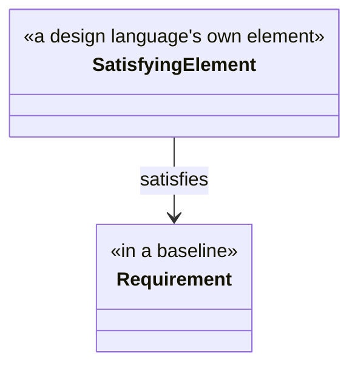

# The binding contract

## 1. Who this document is for

This is the document a design language's owner reads, and it is written so that nothing else is required —
not the founding record, not the other members of the collection beyond the two this document draws on,
`01-requirement-model.md` for the requirement and the baseline, and `04-value-states.md` for the value-state
model — and no acquaintance with any design language that has already attached. It states what attaching
underneath ProjectML requires, and nothing more. What it does not ask for is an implementation. K18 draws that line
precisely: a binding carries K4's four declarations and none of an implementation's three burdens — no
notation, no filled set of `RequirementDef`s, and no rule-set a project may vary as it runs. Writing a
binding against this document is one undertaking; building an implementation on top of it is a separate,
later one, and this document does not ask for it.

## 2. The seam

The metamodel does not see anything below the point where a design language attaches. It sees exactly one
edge, crossing that boundary in exactly one direction: an element the metamodel does not define carries the
edge, and names a requirement. The edge itself is not coined here — its name, `satisfies`, is SysML v2's own,
adopted rather than invented (house rule 10), and so is its direction (K3).

The edge is carried by the satisfying element, and points from it up toward the requirement it names, never
the other way round. This is not a choice this document makes: SysML v2's own `satisfy` relationship fixes
the same direction, from the satisfying element to the requirement it satisfies, which is why the direction
is not arbitrary here either.

The edge lands on a requirement in a **baseline**, never on the requirement model's live projection. A
baseline has identity; the projection does not, because it is recomputed on every reading and gives no
guarantee that two readings name the same thing (K21). A binding depends on identifiers that hold still
between the two ends of the edge — the satisfying element does not move once it is written, and neither may
the requirement it names — and only a baseline offers that; the term itself is adopted from ISO/IEC/IEEE
29148 rather than coined (K12).

This has a consequence for traceability that a design language's owner should expect rather than go looking
for a workaround to. A baseline is an instance of the requirement model, the product member of the
collection: it carries a requirement's identity, its bound wording, its values, and the edge by which one
requirement derives from another — and nothing else. It does not carry the need a requirement was assembled
from, because that edge belongs to the requirement analysis model, the working member of the collection the
product is projected from. Getting from a requirement a satisfying element names back to the need behind it
is therefore not a step within the baseline; it runs through the requirement analysis model, one document
over. That model is where the step is possible at all, because its recoverability condition keeps everything
the projection drops available rather than discarded (K13).

Nor does a baseline carry retirement. Every requirement it contains is one in force at the moment the cut
was taken, and being no longer in force is a property of the requirement analysis model rather than of the
product (K35). A design language's owner should read the consequence as the guarantee it is: a baseline
already bound to never changes underneath the elements bound to it, so a `satisfies` edge into one cannot
come to point at nothing. A requirement retired after that cut is absent from the next baseline instead, and
that absence is the notice — when the design rebases onto the later baseline and the requirement it was
built against is not there, what was built on it needs rework.

## 3. Symmetry

One rule governs every design language that attaches: the terms are the same for all of them. SysML v2,
UML, EventML, and a design language not yet written each declare the same four things, through the same one
seam, and none of them is owed a shortcut past any of the four or a second point of attachment the others do
not get (K2).

This is not an incidental property of the seam; it is the claim this whole metamodel exists to make good on.
A kernel of concepts that in fact only a subset of design languages could attach to would not be neutral in
the sense K2 states, whatever its own documents claimed. Phase 2 — writing a binding for SysML v2 against
this document alone — is the first place that claim is tested rather than merely asserted, and it is
deliberately early in this project's life for exactly that reason.

## 4. The four declarations

A binding states four things about the design language it attaches. Each is stated here for the reason it
exists, not only for what it says, and the four reasons are not all the same reason. Three of the four exist
so that a check the metamodel could not otherwise run becomes one it can. The second exists for a different
reason: the metamodel has no view of that structure at all, and by K3 must not define it even if it could. A
design language's owner reading this once should be able to tell, section by section, why leaving any one of
the four out costs something the metamodel cannot supply for itself (K4).

### 4.1 Which of its elements may carry the seam edge

A binding names which of the design language's own kinds of element are permitted to carry the seam edge —
to name a requirement at all. Without this declaration, a question such as "is every requirement in this
baseline satisfied by something" has no computable answer: the metamodel would have to search every element
of every kind the design language has, rather than the kinds this declaration names, to find where a
satisfying edge could even appear. The declaration is what turns a check over the seam from a search into a
lookup.

### 4.2 Its own internal refinement chain

The metamodel sees a design language's elements only at the one point where the seam edge lands; it has no
view of how those elements relate to one another beneath that point. A design language almost always has its
own way of decomposing one element into others, or relating one to another below the level at which a
requirement is satisfied, and none of that structure is visible from here. A binding states what that
structure is, in the design language's own terms, because the metamodel cannot supply it: this is exactly the
part of a design language the metamodel does not, and by K3, must not, define.

### 4.3 Its identifier space, and the map between it and a requirement's identity

A binding states how the design language names its own elements, and states the map between that naming and
a requirement's identity: which name in the design language's space corresponds to which requirement
identifier in this metamodel's, in a form that resolves in both directions. The naming scheme alone does not
meet this declaration; describing it without the map leaves the failure below in place. A design language's
own naming scheme is not, in general, the scheme this metamodel uses for a requirement's identity, and two
identifier spaces with no declared map between them lose the very thing a stable identifier is for: read a
model, export it, and read the export back, and an element that once named a requirement may no longer
resolve to anything, or may resolve to the wrong thing, because nothing recorded which name in one space
corresponds to which name in the other. This is the founding record's own finding behind K4: a round trip
through two unmapped identifier spaces loses the stable identifiers everything else here depends on.

### 4.4 How far it takes the value model

A binding states how far it carries the value-state model — whether a value belonging to the design
language's own elements beyond the seam can carry one of the five states at all, and, if so, whether it can
carry all five. `04-value-states.md` states that a value's state applies to a value wherever it occurs,
without exception for one member of the collection over another; it does not, and cannot, guarantee that
every notation a design language brings is able to represent five states next to a value rather than the
value alone (K4). A binding that cannot carry the value model at all must say so as plainly as one that
carries it in full: this is the declaration OQ1 grows from, because what a binding says here is exactly the
information a future resolution of OQ1 would need to work from.

## 5. What is open

Two questions bear directly on this seam, and this document answers neither of them. Both are recorded as
open, in `spec/06-decisions.md`, and both are phase 2's to settle — a binding is where each first has to be
answered concretely, which is why phase 2 comes early rather than after the metamodel is otherwise finished.

- **OQ10 — does a second edge kind join the seam, for verification?** A requirement's origin is one thing an
  element outside the kernel can name; whether the requirement was shown to hold is another. SysML v2 already
  has an edge for it, from a verification element to a requirement, in the same direction and shape as
  satisfies. Widening the first declaration by one word would carry it, but nothing exercises the question
  today, and this document does not answer it.
- **OQ11 — does the metamodel need a subject?** A design language may require every requirement to name the
  element it is a requirement of, and the seam edge, by naming both a satisfying element and the requirement
  it satisfies, may already supply that on its own. Whether it does, or whether a binding must synthesise a
  subject where the seam does not supply one, is not decided here. Getting this wrong is the shape a false K2
  would take — a subject synthesised one way for one design language and another way for another would
  quietly reopen the privileged path K2 rules out — which is exactly why it is left to the phase built to
  test K2, rather than guessed at here.
