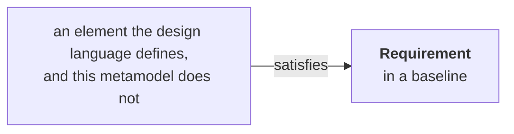

# The binding contract

## 1. Who this document is for

This is the document a design language's owner reads, and it is written so that nothing else is required —
not the founding record, not the other members of the collection beyond the two this document draws on,
`01-requirement-model.md` for the requirement and the baseline, and `04-value-states.md` for the value-state
model — and no acquaintance with any design language that has already attached. It states what attaching
underneath ProjectML requires, and nothing more. What it does not ask for is an implementation. K18 draws that line
precisely: a binding carries K4's four declarations and none of an implementation's three burdens — no
notation, no filled set of `RequirementDefinition`s, and no rule-set a project may vary as it runs. Writing a
binding against this document is one undertaking; building an implementation on top of it is a separate,
later one, and this document does not ask for it.

## 2. The seam

The metamodel does not see anything below the point where a design language attaches. It sees exactly one
edge, crossing that boundary in exactly one direction: an element the metamodel does not define carries the
edge, and names a requirement. The edge itself is not coined here — its name, `satisfies`, is SysML v2's own,
adopted rather than invented (house rule 10), and so is its direction (K3).

The edge is carried by the satisfying element, and points from it up toward the requirement it names, never
the other way round. This is not a choice this document makes: SysML v2's own `satisfy` relationship fixes
the same direction, from the satisfying element to the requirement it satisfies, which is why the direction
is not arbitrary here either.

**The far end of the edge is described rather than named, and the diagram says so too.** The metamodel does
not define what lies below the seam (K3), and giving that end a type in a diagram would half-define it. This
is not caution on our part: SysML does not name that side either, referring to whatever element carries the
edge rather than to a kind of its own. Naming it would also make the first of the four declarations below
partly redundant, since that declaration exists precisely so a design language can say which of *its* kinds
may carry the edge (K54).

**Whether the requirement itself gains a standing element inside the design language is not fixed here, and
does not need to be.** A binding may give it one, native to the design language and something its other
constructs can point to like anything else the design language defines — the SysML v2 binding does exactly
this, by way of §4.3's identifier map, so that a `satisfy` relationship, once written, relates two elements
that are both natively SysML's own. Or a binding may do without any such element, and let the satisfying
element carry a bare reference that resolves through the map alone, with nothing requirement-shaped standing
anywhere in the design language's own model. Either is symmetric under K2. What the metamodel needs is only
that the edge, however it is carried, can be read back through the map; the mechanics of carrying it —
standing element or bare reference — belong entirely to the design language, on the same terms §4.2 already
grants everything else beneath the seam.

**The edge is many-to-many, with no bound in either direction.** A satisfying element may name any number of
requirements, and a requirement may be named by any number of satisfying elements. This is adopted rather
than decided here: it is what SysML does in both of its versions, where more than one element may help
satisfy a single requirement and a satisfying element may carry as many of the edges as it has requirements
to name. A bound in either direction would also exclude design languages that organise differently, which
K2 forbids. No lower bound is meaningful: an element naming no requirement is not a satisfying element, and
the metamodel does not see it — beyond the seam it sees only what carries the edge (K51).

**How a design language writes the edge is its own business.** Whether it spells the relationship as one
edge carrying several names or as several edges each carrying one is notation, and beyond the seam the
notation is not this metamodel's (K52). The point is not abstract: SysML settles it two ways within one
standard family, spelling the relationship as a stereotyped dependency standing between the two ends in one
version and as a requirement usage nested inside the satisfying element in the next. A metamodel that fixed
the shape could bind one of those and not the other.

The edge lands on a requirement in a **baseline**, never on the requirement model's live projection. A
baseline has identity; the projection does not, because it is recomputed on every reading and gives no
guarantee that two readings name the same thing (K21). A binding depends on identifiers that hold still
between the two ends of the edge — the satisfying element does not move once it is written, and neither may
the requirement it names — and only a baseline offers that; the term itself is adopted from ISO/IEC/IEEE
29148 rather than coined (K12).

**One check runs over the seam, and it is a question rather than a failure.** It asks which requirements in
a baseline no satisfying element names. A requirement in that condition is not a modelling error: it is the
normal state of one that has been captured but not yet designed for, and a model is expected to hold
requirements in it, sometimes for weeks. The check is stated here rather than with the requirement model,
because it reads the seam, and because the requirement model has to remain adoptable on its own by a reader
who has attached no design language at all (K19, K53). A check whose failing state is the ordinary condition
of ongoing work is a question; one whose failing state means somebody erred is a failed check, and this is
the first kind.

**The check is unaffected by a limit SysML leaves open, and a binding's owner should know the limit is
theirs too.** Where two satisfying elements name one requirement, nothing says whether both are needed or
either suffices; SysML records this as something asked for and not supplied, and this metamodel does not
supply it either. *Is any element naming this requirement* has the same answer under both readings, because
both need at least one. Only the stronger question — *is the requirement actually met* — divides on it, and
that is verification, which this metamodel does not undertake (K7, K40).

This has a consequence for traceability that a design language's owner should expect rather than go looking
for a workaround to. A baseline is an instance of the requirement model, the product member of the
collection: it carries a requirement's identity, its bound wording, its values, and the edge by which one
requirement derives from another — and nothing else. It does not carry the `SourceNeed` a requirement was
assembled from, because that edge belongs to the requirement analysis model, the working member of the
collection the product is projected from. Getting from a requirement a satisfying element names back to the
`SourceNeed` behind it is therefore not a step within the baseline; it runs through the requirement analysis model, one document
over. That model is where the step is possible at all, because its recoverability condition keeps everything
the projection drops available rather than discarded (K13).

Nor does a baseline carry retirement. Every requirement it contains is one in force at the moment the cut
was taken, and being no longer in force is a property of the requirement analysis model rather than of the
product (K35). A design language's owner should read the consequence as the guarantee it is: a baseline
already bound to never changes underneath the elements bound to it, so a `satisfies` edge into one cannot
come to point at nothing. A requirement retired after that cut is absent from the next baseline instead, and
that absence is the notice — when the design rebases onto the later baseline and the requirement it was
built against is not there, what was built on it needs rework.

**What that notice does not yet say is which kind of rework.** A requirement can be absent because it was
replaced, in which case there is a successor to read and follow, or because it was dropped, in which case
there is nothing to design for and the work comes out. The two demand different responses, and the metamodel
cannot presently tell them apart: it records that a requirement is no longer in force without recording what
took its place. That gap is named here rather than left for a binding's owner to discover, and it belongs to
the Project Lifecycle Model, where what produces a decision is still being worked out. Until it closes, the
answer is reachable but not by the model: every retirement arrives through a source (K11), so the source
that caused it can be read.

## 3. Symmetry

One rule governs every design language that attaches: the terms are the same for all of them. SysML v2,
UML, EventML, and a design language not yet written each declare the same four things, through the same one
seam, and none of them is owed a shortcut past any of the four or a second point of attachment the others do
not get (K2).

This is not an incidental property of the seam; it is the claim this whole metamodel exists to make good on.
A kernel of concepts that in fact only a subset of design languages could attach to would not be neutral in
the sense K2 states, whatever its own documents claimed. Phase 2 — writing a binding for SysML v2 against
this document alone — is the first place that claim is tested rather than merely asserted, and it is
deliberately early in this project's life for exactly that reason.

## 4. The four declarations

A binding states four things about the design language it attaches. Each is stated here for the reason it
exists, not only for what it says, and the four reasons are not all the same reason. Three of the four exist
so that a check the metamodel could not otherwise run becomes one it can. The second exists for a different
reason: the metamodel has no view of that structure at all, and by K3 must not define it even if it could. A
design language's owner reading this once should be able to tell, section by section, why leaving any one of
the four out costs something the metamodel cannot supply for itself (K4).

### 4.1 Which of its elements may carry the seam edge

A binding names which of the design language's own kinds of element are permitted to carry the seam edge —
to name a requirement at all. Without this declaration, a question such as "is every requirement in this
baseline satisfied by something" has no computable answer: the metamodel would have to search every element
of every kind the design language has, rather than the kinds this declaration names, to find where a
satisfying edge could even appear. The declaration is what turns a check over the seam from a search into a
lookup.

### 4.2 Its own internal refinement chain

The metamodel sees a design language's elements only at the one point where the seam edge lands; it has no
view of how those elements relate to one another beneath that point. A design language almost always has its
own way of decomposing one element into others, or relating one to another below the level at which a
requirement is satisfied, and none of that structure is visible from here. A binding states what that
structure is, in the design language's own terms, because the metamodel cannot supply it: this is exactly the
part of a design language the metamodel does not, and by K3, must not, define.

### 4.3 Its identifier space, and the map between it and a requirement's identity

A binding states how the design language names its own elements, and states the map between that naming and
a requirement's identity: which name in the design language's space corresponds to which requirement
identifier in this metamodel's, in a form that resolves in both directions. The naming scheme alone does not
meet this declaration; describing it without the map leaves the failure below in place. A design language's
own naming scheme is not, in general, the scheme this metamodel uses for a requirement's identity, and two
identifier spaces with no declared map between them lose the very thing a stable identifier is for: read a
model, export it, and read the export back, and an element that once named a requirement may no longer
resolve to anything, or may resolve to the wrong thing, because nothing recorded which name in one space
corresponds to which name in the other. This is the founding record's own finding behind K4: a round trip
through two unmapped identifier spaces loses the stable identifiers everything else here depends on.

### 4.4 How far it takes the value model

A binding states how far it carries the value-state model — whether a value belonging to the design
language's own elements beyond the seam can carry one of the five states at all, and, if so, whether it can
carry all five. `04-value-states.md` states that a value's state applies to a value wherever it occurs,
without exception for one member of the collection over another; it does not, and cannot, guarantee that
every notation a design language brings is able to represent five states next to a value rather than the
value alone (K4). A binding that cannot carry the value model at all must say so as plainly as one that
carries it in full: this is the declaration OQ1 grows from, because what a binding says here is exactly the
information a future resolution of OQ1 would need to work from.

## 5. What is open

One question bears directly on this seam and remains open here.

- **OQ10 — does a second edge kind join the seam, for verification?** A requirement's origin is one thing an
  element outside the kernel can name; whether the requirement was shown to hold is another. SysML v2 has a
  construct for this, `verify`, in the same direction as `satisfies` but not the same shape: it is carried by
  a whole verification case rather than by an arbitrary element, so finding it asks a different question of a
  design language than finding `satisfy` does. Adding it would not widen the first declaration by a word; it
  would ask for a declaration of its own, on the terms the first declaration already sets, and only once the
  kernel decides it wants a check over verification the way it already has one, above, over satisfaction.
  Nothing exercises the question today, and this document does not answer it. It is recorded, in
  `spec/06-decisions.md`, as phase 2's to settle — a binding is where it first has to be answered concretely,
  if it is answered at all.

Two further questions were raised alongside OQ10 and are both closed. **OQ11** asked whether the metamodel
needs a subject of its own, since a design language may require every requirement to name the element it is
a requirement of. K56 answers no: where a design language carries the concept, as SysML v2 does, richly and
independently of `satisfy`, it is that language's own affair, covered by §4.2 above; where
a design language carries no such concept, as EventML's requirement model does not, nothing depending on the
kernel notices the absence. **OQ12** named what this document itself left under-specified about the seam
above — the edge's cardinality, the check over it that section 4 cites by name, and whether the edge pins a
baseline — and was answered before this document reached its current form, by K51–K54, which section 2
already carries.
